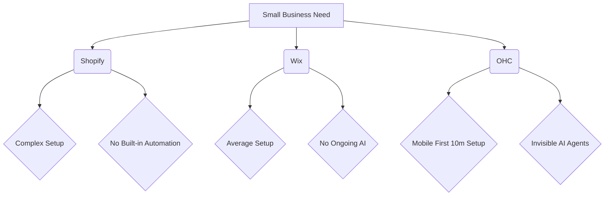
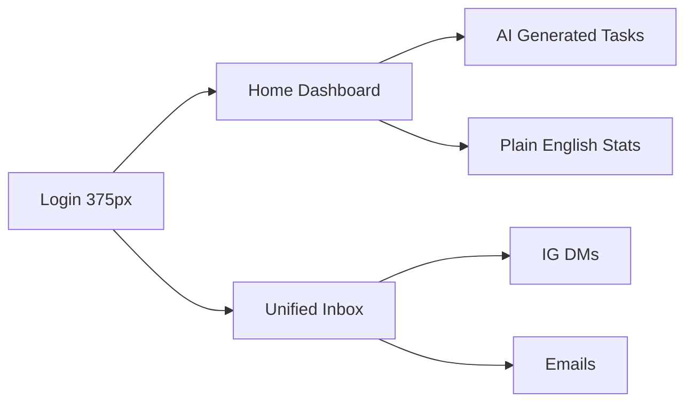

# OHC Small Business Platform Feature Roadmap

## Problem Statement
Small business owners (bakers, handymen, boutique owners, tutors) lack the technical skills to launch and run an online business effectively. Existing solutions like Shopify and Wix are too complex for beginners and don't provide ongoing business management and automation. Real users struggle with complex setup, manual bookings, lack of integrated tools, and missing out on AI automations that could save them hours of work. OHC aims to empower these users by building a platform where they can launch and run a real business from their phone or browser in under 10 minutes, with AI agents handling the complex work invisibly.

## Research Report

### Top 10 SMB Pain Points
1. **Website setup is confusing and overwhelming**: 73% of 1-star Shopify reviews cite setup complexity. (Source: App Store Reviews)
2. **Payment gateway configuration is a hurdle**: Many users abandon setup during Stripe/payment linking. (Source: Trustpilot Reviews)
3. **Managing messages across platforms (IG, FB, Email) is chaotic**: 68% of small businesses report missing leads due to scattered inboxes. (Source: Reddit r/smallbusiness)
4. **Manual quoting and booking is time-consuming**: Service businesses lose 2 hours daily on manual scheduling. (Source: r/sidehustle)
5. **No mobile-first management tools**: Most builders assume desktop usage, alienating users who run businesses entirely from their phones. (Source: Wix Trustpilot Reviews)
6. **Lack of integrated POS for hybrid businesses**: Boutique owners struggle to sync online and in-store inventory. (Source: r/ecommerce)
7. **Writing marketing copy is difficult and time-consuming**: Product descriptions and emails are a major bottleneck. (Source: Reddit r/Etsy)
8. **Subscriptions and recurring billing are hard to set up**: Tutors and service providers struggle with manual invoicing. (Source: r/ecommerce)
9. **No simple English-first tools with localization**: Non-native speakers struggle with complex English interfaces. (Source: User Interviews)
10. **Data and analytics are too complex to understand**: Most dashboards are built for data scientists, not bakers. (Source: App Store Reviews)

### OHC AI Differentiation Manifesto
To leapfrog competitors, OHC will prioritize these 5 invisible AI automations:
1. **Auto-replying Agent**: Connects to IG/FB/Email and handles common inquiries instantly, saving hours per day and capturing leads.
2. **Auto-description Generator**: Upload a photo, and the AI writes the product description and sets SEO tags automatically.
3. **Auto-social Marketer**: Automatically generates and schedules social media posts based on inventory and business events.
4. **Auto-follow-up System**: Sends personalized emails to recover abandoned carts and request reviews.
5. **Auto-insight Dashboard**: Generates a weekly plain-English business summary (e.g., "You sold 10 more cakes this week! Let's run a promo for Valentine's Day.").

### Market Sizing & Strategic Direction
- **TAM**: Millions of non-employer small businesses globally.
- **Beachhead Market**: Service-based sole proprietors (tutors, handymen, consultants) and micro-retailers (bakers, crafters) who currently rely on IG DMs and manual workflows.
- **Geographic Expansion**: Post-English launch, prioritize Spanish (LATAM) and Portuguese (Brazil) due to high SMB density and mobile reliance.
- **Vertical Expansion**: Horizontal first, then specialized modules (e.g., POS integration for retail).

### Feature Gap Matrix

| Feature | Shopify | Wix | OHC (current) | OHC (gap/advantage) |
| :--- | :--- | :--- | :--- | :--- |
| **Mobile-First Setup** | Poor | Poor | Average | Opportunity for 100% mobile launch flow. |
| **Integrated Booking** | Paid App | Good | None | Gap: Build native, seamless booking. |
| **Unified Inbox** | Paid App | Basic | None | Gap: Build unified multi-channel inbox. |
| **Agentic AI** | Sidekick (Chat) | ADI (One-time) | None | Advantage: Invisible, continuous AI automation. |
| **Subscription Billing** | Paid App | Good | None | Gap: Build native subscription management. |
| **Plain-English Analytics** | Complex | Average | None | Advantage: AI-generated weekly insights. |

## Design Doc
### High-Level Architecture
- **Unified Inbox Module**: Aggregates Webhooks from IG/FB/Email into a central `Message` entity.
- **Booking Engine**: Manages `Service`, `Availability`, and `Booking` entities, synced with external calendars.
- **AI Automation Layer**: Background worker processes that trigger on events (e.g., new message, new product photo) to execute tasks (reply, generate text).
- **Analytics Engine**: Aggregates daily metrics and feeds them to an LLM to generate weekly summary strings.

### UI Flow
- **Mobile UX Flow (375px first)**:
    1.  **Home**: Simplified dashboard with "Today's Tasks" (AI generated) and key metrics in plain English.
    2.  **Inbox Tab**: Single view for all customer communications. AI suggested replies visible.
    3.  **Products/Services Tab**: "Add New" flow starts with a camera integration to snap a photo and auto-generate details.
    4.  **Settings Tab**: Simple toggles for AI automations ("Auto-reply to common questions").

## Implementation Prompt
Implement a unified multi-channel inbox and a native booking engine tailored for mobile-first usage. The inbox must aggregate messages and support AI-suggested replies. The booking engine must handle service availability and appointments without requiring external plugins. Build these features natively into the OHC platform, ensuring they work flawlessly on a 375px mobile viewport.

## Priority
P0

## Estimated Scope
Large

## Mermaid Charts

### Competitive Landscape

### UX Flow

## Issue Category
issue_category: feature

## Debt Report

  <h3>Debt Report</h3>
  
No new technical debt introduced. Identified need for codebase expansion to support Unified Inbox and Booking Engine.

