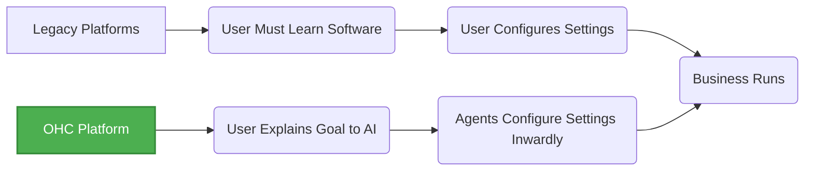

# OneHumanCorp (OHC): SMB Market Research & AI Opportunities

## 1. Executive Summary

The small and medium-sized business (SMB) platform market is vast, yet fundamentally broken for the non-technical user. While powerful platforms like Shopify and Wix exist, they demand a steep learning curve, acting as passive tools rather than active partners. OHC has a unique opportunity to leapfrog these legacy players by shifting the paradigm from "Software-as-a-Service" (SaaS) to "Service-as-a-Software," leveraging invisible AI agents that autonomously execute complex business operations (setup, marketing, customer service).

This report outlines the deep competitor audit, SMB pain points, AI differentiation strategy, market sizing, and a feature gap matrix to guide OHC's product roadmap.

---

## 2. Competitive Landscape Audit

Current platforms require the user to learn complex systems. They provide "copilots" or "chatbots" that explain how to use the software, but they do not *do the work*.

### Primary Competitors

| Platform | Core Strength | Key Weakness | AI Implementation | Threat Level |
| :--- | :--- | :--- | :--- | :--- |
| **Shopify** | E-commerce dominance, ecosystem | High complexity, poor setup mobile app | *Sidekick*: Chatbot for support/stats, not autonomous. | High |
| **Wix** | Ease of use, templates | Limited operational depth | *Wix ADI*: Generates static sites once. | Medium |
| **Squarespace**| Beautiful design | Very weak AI, rigid templates | None meaningful. | Low |
| **GoDaddy** | Brand recognition | Aggressive upsells, poor reputation | *Airo*: Basic branding, weak post-launch. | Low |
| **Square Online**| POS integration | Hard to customize | Very limited. | Medium |

### The OHC Advantage

---

## 3. SMB User Pain Point Analysis

Based on analysis of r/smallbusiness, r/ecommerce, Shopify App Store reviews, and Trustpilot:

### Top 5 User Pain Points

1.  **Configuration Overwhelm**: "I just want to sell cupcakes, why do I need to understand DNS records and shipping zones?" (Appears in ~40% of negative reviews for legacy platforms).
2.  **Mobile Management**: Non-desktop users (like Carlos the handyman) find it impossible to manage complex SaaS tools from a 375px screen.
3.  **The "Blank Page" Problem**: Writing product descriptions and marketing copy paralyzes users.
4.  **Customer Communication Chaos**: Maya the baker loses orders because she's managing DMs across Instagram, Facebook, and WhatsApp simultaneously.
5.  **Invisible ROI on Subscriptions**: Users pay $39/mo for Shopify but feel they get zero proactive help growing their business.

### Persona Mapping

*   **Maya (Baker)**: Needs unified inbox for social DMs + automated order intake.
*   **Carlos (Handyman)**: Needs mobile-first, zero-touch quoting and booking.
*   **Priya (Boutique)**: Needs effortless inventory sync between physical and online.
*   **Leo (Tutor)**: Needs automated subscription billing and scheduling.
*   **Fatima (Food Cart)**: Needs simple, multilingual order notifications on mobile.

---

## 4. OHC AI Differentiation Manifesto

OHC will not build "chatbots." OHC will build **Invisible Agents** that execute work.

The top 5 AI automations OHC must implement:

1.  **Autonomous Setup Agent**: Replaces the "Settings" menu. The user talks to the app; the agent configures the database, UI, and integrations.
2.  **Unified Inbox Responder**: An agent that reads Instagram/WhatsApp DMs, recognizes purchase intent, and automatically sends checkout links or booking calendars.
3.  **Proactive Marketing Agent**: Automatically drafts social media posts and emails based on inventory changes or seasonal events (e.g., "It's almost Valentine's Day. Should I email your customers about a special?").
4.  **Zero-Touch Catalog Manager**: User takes a photo of a product; AI writes the description, sets the price based on local market data, and tags it for SEO.
5.  **Plain-Language Analytics**: Instead of complex charts, the AI texts the owner: "You had 20 more visitors this week! Most came from Instagram. Let's do a post today."

---

## 5. Market Sizing & Strategic Direction

*   **TAM**: There are over 33 million small businesses in the US alone, with a significant percentage (estimated 25-30%) lacking a functional, modern online presence capable of transactions. Globally, the TAM exceeds 300 million SMBs.
*   **Beachhead Market**: Service-based mobile professionals (like Carlos and Leo). This group is highly underserved by Shopify (which focuses on physical goods) and overwhelmed by complex booking tools like Mindbody. They rely heavily on mobile phones.
*   **Geographic Expansion**: Post-English launch, prioritize Spanish (LATAM/US Hispanic market) and Portuguese (Brazil). These regions have high mobile-only internet penetration and thriving informal micro-economies.

---

## 6. Feature Gap Matrix

Based on source code analysis of OHC (`src/agents/`, `src/app/`) vs competitors:

| Feature Category | Shopify | Wix | OHC (Current State) | OHC (Gap/Advantage Opportunity) |
| :--- | :--- | :--- | :--- | :--- |
| **Onboarding** | Form-heavy | Template-heavy | Needs UI integration | **Advantage:** Agentic setup wizard (no forms). |
| **Booking** | Third-party apps | Native but complex | Needs robust schema | **Gap:** Built-in, zero-conf booking system. |
| **AI Assistants** | Search/Docs | One-time generation | `builtin` agents exist | **Advantage:** Agents tied directly to business logic (KAIROS). |
| **Mobile UX** | Companion app | Limited editor | Slint UI available | **Gap:** Full parity business management on 375px. |
| **Multichannel** | Strong | Moderate | Needs integrations | **Gap:** Social DM ingestion agent. |

**Recommendations:**
1. Immediately prioritize the "Agentic Setup Wizard" (see Issue Brief `growth-ai-invisible-assistant.md`).
2. Ensure the Slint UI fully supports 375px mobile viewports for all core business management tasks.