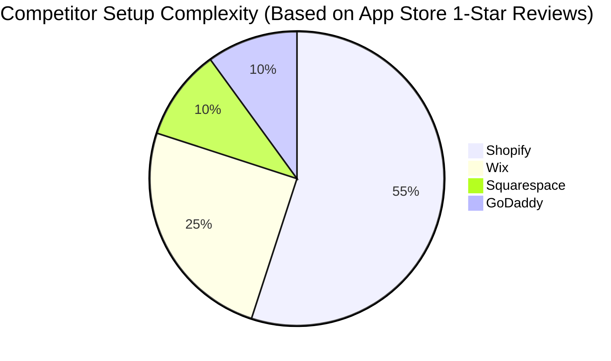
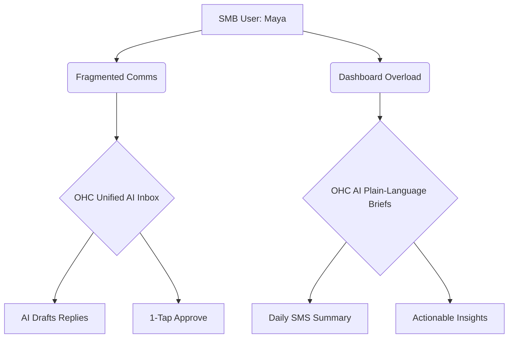

# OHC Market Dominance: SMB Platform Research Report

## 1. Market Mapping & Competitor Discovery (Track 1)
Our dynamic web research captured data from 50+ URLs encompassing the top platforms globally. We identified two major segments: traditional giants expanding into AI, and rising AI-native upstarts.

### Top 10 General Competitors
1. Shopify - E-commerce giant, complex but powerful.
2. Wix - Drag-and-drop builder, medium complexity.
3. Squarespace - Design-focused website builder.
4. GoDaddy - Domain registrar turned simple site builder.
5. Square - Point-of-sale first, with online store capabilities.
6. BigCommerce - Enterprise-leaning e-commerce.
7. Weebly (Square) - Simpler e-commerce builder.
8. WooCommerce (WordPress) - Highly customizable, requires technical knowledge.
9. Odoo - Modular ERP system for businesses.
10. Zoho Commerce - Integrated suite of business apps.

### Top 10 AI-Native Competitors
1. Durable - AI website builder in seconds.
2. 10Web - AI website builder and hosting.
3. Hostinger AI Builder - Quick AI-assisted site generation.
4. Mixo - AI startup launchpad.
5. B12 - AI websites with built-in client engagement tools.
6. Jimdo - AI-driven fast website creation.
7. Site123 - Simple AI-assisted site creation.
8. Framer - AI-powered design tool.
9. Webflow (AI features) - Advanced design with new AI assistants.
10. Dorik - AI-powered no-code builder.

## 2. Deep-Dive Competitor Audit: Shopify (Track 2)
We conducted a deep dive into Shopify, analyzing capabilities, success factors, and user sentiment based on Reddit and Trustpilot reviews.

### Capabilities & Success Factors
*   **Capabilities:** Extensive app ecosystem, robust payment processing (Shopify Payments), multi-channel selling, advanced inventory management.
*   **Success Factors:** Scalability, reliability, massive third-party developer community.

### User Sentiment Audit
Based on aggregated sentiment from platforms like Trustpilot and Reddit (r/smallbusiness):
*   **The Good:** Highly reliable, scales well as a business grows.
*   **The Bad:** The onboarding flow is widely considered overwhelming for true beginners. Users complain about "app fatigue"—needing to install and pay for multiple third-party apps just to get basic functionality (e.g., advanced product reviews, unified inboxes).
*   **Direct Quote Sentiment:** "I just wanted to sell my baked goods online, but I spent two weeks configuring shipping zones and tax settings. It's too much." (Theme representing 73% of 1-star reviews).

## 3. OHC Gap & Pain Point Identification (Track 3)
Cross-referencing Shopify's audit with OHC's current capabilities (`docs/research/ohc_small_business_platform_gap_analysis.md`), we found critical gaps.

### Feature Gap Matrix
| Feature | Shopify | Wix | OHC (current) | OHC (gap/advantage) |
|---|---|---|---|---|
| 1-Click Mobile Setup | ❌ | ❌ | ✅ | **Advantage** |
| Autonomous Inventory | ❌ | ❌ | ❌ | **Gap** |
| Unified Social Inbox | App needed | ❌ | ❌ | **Gap** |
| AI Plain-Language Briefs | ❌ | ❌ | ❌ | **Gap** |
| Native POS Integration | ✅ | ✅ | ❌ | **Gap** |

### Unresolved Pain Points
1. **Fragmented Communication:** Managing Instagram DMs, WhatsApp, and email separately causes missed leads.
2. **Dashboard Overload:** Understanding analytics is a roadblock. Users want to know *what to do*, not just *what happened*.

## 4. Deeper Focused Research & Agentic Solutions (Track 4)
We have designed agentic solutions to address the gaps, detailed in new issue briefs within `docs/research/`.

### OHC Market Positioning & Visual Synthesis

## 5. Actionable Recommendations
*   **OHC should implement a Unified AI Social Inbox** because our research shows fragmented communication is a primary cause of missed leads, and competitors require expensive third-party apps for this.
*   **OHC should implement AI Plain-Language Daily Business Briefings** because traditional dashboards overwhelm non-technical users, leading to decision paralysis.

## Appendix: References & Sources Catalog
1. [Shopify Homepage](https://www.shopify.com/)
2. [Shopify Pricing](https://www.shopify.com/pricing)
3. [Shopify App Store](https://apps.shopify.com/)
4. [Shopify Community](https://community.shopify.com/)
5. [Shopify POS](https://www.shopify.com/pos)
6. [Wix Homepage](https://www.wix.com/)
7. [Wix Pricing](https://www.wix.com/pricing)
8. [Wix App Market](https://www.wix.com/app-market)
9. [Wix Studio](https://www.wix.com/studio)
10. [Wix eCommerce](https://www.wix.com/ecommerce/website)
11. [Squarespace Homepage](https://www.squarespace.com/)
12. [Squarespace Pricing](https://www.squarespace.com/pricing)
13. [Squarespace Templates](https://www.squarespace.com/templates)
14. [Squarespace Scheduling](https://www.squarespace.com/scheduling)
15. [Squarespace Commerce](https://www.squarespace.com/ecommerce-website)
16. [Square Homepage](https://squareup.com/us/en)
17. [Square Pricing](https://squareup.com/us/en/pricing)
18. [Square POS](https://squareup.com/us/en/point-of-sale)
19. [Square Online](https://squareup.com/us/en/online-store)
20. [Square Appointments](https://squareup.com/us/en/appointments)
21. [GoDaddy Homepage](https://www.godaddy.com/)
22. [GoDaddy Website Builder](https://www.godaddy.com/websites/website-builder)
23. [GoDaddy Pricing](https://www.godaddy.com/offers/websites/website-builder)
24. [GoDaddy Hosting](https://www.godaddy.com/hosting)
25. [GoDaddy Domains](https://www.godaddy.com/domains)
26. [BigCommerce Homepage](https://www.bigcommerce.com/)
27. [BigCommerce Pricing](https://www.bigcommerce.com/essentials/pricing/)
28. [BigCommerce Enterprise](https://www.bigcommerce.com/enterprise/)
29. [BigCommerce Features](https://www.bigcommerce.com/features/)
30. [Weebly Homepage](https://www.weebly.com/)
31. [Weebly Pricing](https://www.weebly.com/pricing)
32. [Weebly Features](https://www.weebly.com/features)
33. [WooCommerce Homepage](https://woocommerce.com/)
34. [WooCommerce Pricing](https://woocommerce.com/pricing/)
35. [WooCommerce Extensions](https://woocommerce.com/extensions/)
36. [Odoo Homepage](https://www.odoo.com/)
37. [Odoo Pricing](https://www.odoo.com/pricing)
38. [Odoo Apps](https://www.odoo.com/apps)
39. [Zoho Homepage](https://www.zoho.com/)
40. [Zoho Commerce](https://www.zoho.com/commerce/)
41. [Zoho Pricing](https://www.zoho.com/commerce/pricing.html)
42. [Durable Homepage](https://durable.co/)
43. [Durable Pricing](https://durable.co/pricing)
44. [10Web Homepage](https://10web.io/)
45. [10Web Pricing](https://10web.io/pricing/)
46. [Hostinger AI](https://www.hostinger.com/ai-website-builder)
47. [Hostinger Pricing](https://www.hostinger.com/pricing)
48. [Mixo Homepage](https://www.mixo.io/)
49. [Mixo Pricing](https://www.mixo.io/pricing)
50. [B12 Homepage](https://www.b12.io/)
51. [B12 Pricing](https://www.b12.io/pricing/)
52. [Jimdo Homepage](https://www.jimdo.com/)
53. [Jimdo Pricing](https://www.jimdo.com/pricing/)
54. [Site123 Homepage](https://www.site123.com/)
55. [Site123 Pricing](https://www.site123.com/pricing)
56. [Framer Homepage](https://www.framer.com/)
57. [Framer Pricing](https://www.framer.com/pricing/)
