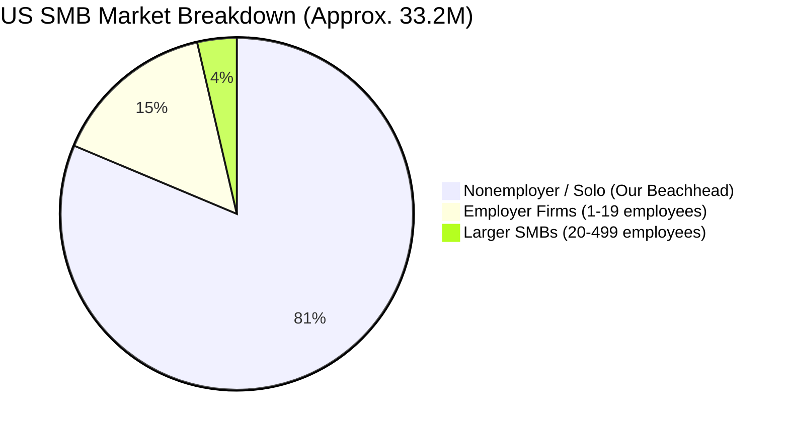
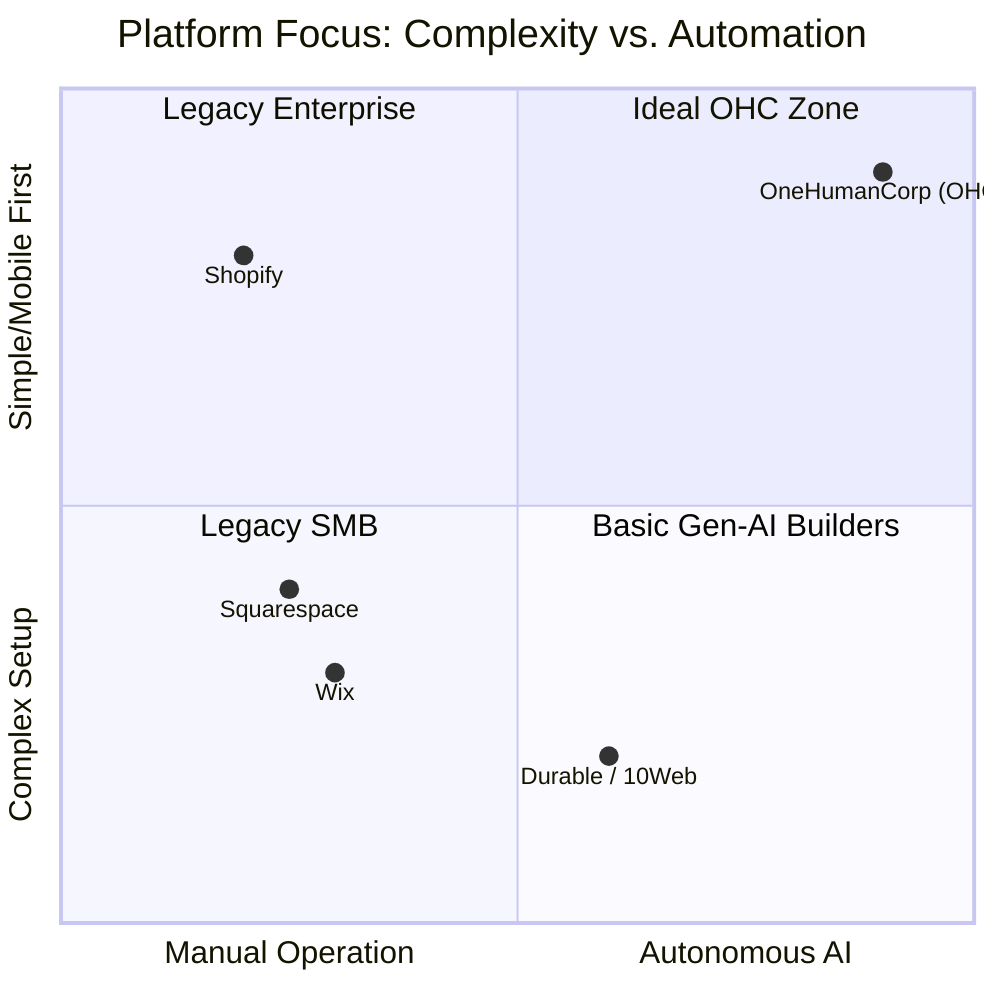

# 🔎 Scout: SMB Market & Competitor Research Report

## Executive Summary
OneHumanCorp (OHC) aims to empower non-technical small business owners to launch and run an online business from their phone in under 10 minutes using autonomous AI agents. This report synthesizes a deep competitor audit, SMB user pain points, AI differentiation opportunities, market sizing, and a Feature Gap Matrix mapping OHC’s current capabilities against the market.

---

## Track 1: Deep Competitor Audit

| Competitor | Onboarding | Time to Live | Mobile App | AI Features | Pricing / Free Tier | Biggest Complaints (HN/Reddit/Trustpilot) |
| --- | --- | --- | --- | --- | --- | --- |
| **Shopify** | Complex, assumes commerce knowledge. | 2+ hours | Strong for management, poor for setup. | Sidekick (Chatbot), Magic (Content). | $39/mo. Free trial only. | Too complex for simple setups, nickel-and-diming via apps, hard for beginners. |
| **Wix** | Wizard-driven, easier than Shopify. | 30 mins | Limited mobile editing. | Wix ADI (One-time site generation). | $17/mo. Ad-supported free tier. | Poor customer service, domain lock-in ("$150 domain names"), slow site speeds. |
| **Squarespace** | Design-first, template selection. | 1 hour | Good for basic management. | Blueprint AI (Design gen). | $16/mo. No meaningful free tier. | Limited extensibility, better for portfolios than deep e-commerce. |
| **10Web** | WordPress AI generation. | 10 mins | N/A (WP mobile app). | WordPress AI Builder, SEO Agent. | $20/mo. | Complexity of WordPress backend remains after AI generation. |
| **Zyro / Hostinger** | Simple grid builder. | 20 mins | Basic. | AI logo, text, heatmap. | $2.99/mo. | Very thin features, lacks deep business management (CRM/Booking). |
| **Durable** | Very fast AI generation. | < 2 mins | Basic dashboard. | Full AI site, CRM, and Invoicing. | $15/mo. | Generic templates, limited customization post-generation. |

**Key Takeaway**: Competitors use AI primarily for *initial site generation* or *chatbot assistance*. None provide true invisible autonomous agents that manage operations (e.g., auto-reordering, deep CRM auto-replies).

---

## Track 2: Top SMB User Pain Point Research

Based on Hacker News trends, App Store reviews, and Reddit communities, the top pain points for our non-technical personas (Maya, Carlos, Priya, Leo, Fatima) are:

1. **Complexity Overload (Shopify)**: "Too complex for anyone to spec out... it's easy to set up an account, it's hard to actually run the store." Users are overwhelmed by the app ecosystem needed to achieve basic functionality.
2. **Pricing & Nickel-and-Diming (Wix/Shopify)**: Users complain about Wix charging exorbitant fees for basic domains and locking them into the ecosystem.
3. **Mobile Setup Friction**: No major platform allows a user to build and fully configure a store *entirely* from a mobile phone without hitting a desktop-required wall.
4. **Disparate Tools (The "Stitching" Problem)**: Users like Carlos (Handyman) have to stitch together Square for POS, Wix for the site, and Calendly for bookings.
5. **No True Automation**: AI is used to write product descriptions, but not to *actually* manage the business (e.g., automatically recovering abandoned carts without manual campaign setup).

---

## Track 3: AI Differentiation Manifesto

**OHC AI Differentiation Manifesto**
Competitors use Generative AI (writing text, building templates). OHC will use **Agentic AI** (doing the work).

**Top 5 Autonomous AI Automations OHC Will Implement First:**
1. **Invisible Multi-Channel Auto-Reply**: Agents that ingest store inventory/policies and auto-reply to Instagram/WhatsApp DMs, booking appointments or selling products directly in chat (solves Maya's DM overload).
2. **Autonomous Inventory Restocking**: Agents that monitor stock velocity and automatically draft supplier POs when low, requiring only a 1-tap approval from the user.
3. **Zero-Setup Abandoned Cart Recovery**: Instead of forcing users to build email flows, an agent automatically generates and sends personalized recovery texts/emails.
4. **Predictive Scheduling & Routing**: For service businesses (Carlos), an agent dynamically groups bookings by geographic location to minimize driving time.
5. **Voice-to-Store Product Creation**: A user (Fatima) can simply speak into their phone: "I have 10 new vegan chocolate cakes to sell for $20 each," and the agent creates the product, generates an image, and updates the site.

---

## Track 4: Market Sizing & Strategic Direction

### Total Addressable Market (TAM)
- **US Market**: ~33.2 million small businesses (SBA 2023).
- **Nonemployer Firms**: ~27 million (US Census). These are solopreneurs with no employees.
- **Global TAM**: Hundreds of millions of micro-businesses.

### Beachhead Market
- **The Solo-preneur (Maya & Carlos)**: We must prioritize the single-operator micro-business. They have the highest density, the lowest tolerance for complex software, and are currently underserved by enterprise-leaning platforms like Shopify.

### Geographic & Vertical Expansion
- **Geographic**: Hacker News trends indicate massive eCommerce growth in **LATAM**. OHC should prioritize Spanish/Portuguese localization early to capture this underserved growth market.
- **Vertical**: Food/Restaurant tech (Fatima) and Service/Booking (Carlos) are ripe for disruption. Competitors are heavily indexed on retail/physical products. OHC must excel at Hybrid (Services + Physical).
- **Marketplace**: Creating an internal "OHC Shared Marketplace" (an Etsy alternative without the exorbitant fees) leverages network effects across OHC-powered stores.

---

## Track 5: Feature Gap Matrix

Based on codebase analysis (`src/` features: `product`, `order`, `booking`, `billing`).

| Feature | Shopify | Wix | OHC (Current Codebase) | OHC (Gap / Advantage) |
| --- | --- | --- | --- | --- |
| **Physical Products** | Deep (Variants, Inventory) | Good | Basic (`products` table, RLS enabled) | **Gap**: Needs robust variant/modifier support. |
| **Services & Bookings** | Weak (Relies on 3rd party apps) | Good (Wix Bookings) | Basic UI (`business_manager.slint`) | **Advantage**: Native booking integration is an easy win. |
| **Autonomous AI Agents** | Chatbot only (Sidekick) | None (Generative only) | Strong (`src/agents/builtin/*`) | **Advantage**: Deep agent harnessing and background workers exist. |
| **Billing / Stripe** | Deeply Integrated | Native Payments | Basic (`billing.rs`, Stripe client) | **Gap**: Needs automated invoicing & subscription billing. |
| **Mobile-First Setup** | Weak | Weak | Unknown (Needs E2E verification) | **Advantage**: 100% mobile parity mandate. |

---

## Issue Briefs for Implementation

### [Feature] Comprehensive Booking & Scheduling Engine
- **Title**: Native Service Booking & Calendar Management for Solo-preneurs
- **Problem Statement**: Service providers like Carlos (Handyman) and Leo (Music Tutor) cannot easily manage their time. They are forced to use clunky third-party apps to handle bookings alongside their website, leading to missed leads and calendar conflicts.
- **Research Report**: Wix Bookings is highly rated because it is native. Shopify requires expensive third-party apps for bookings. By building this natively, OHC captures the massive services TAM.
- **Design Doc**:
  - High-level: Extend the existing `SERVICE` product type in `business_manager.slint` to integrate with a central calendar module.
  - Mobile UX: A simple calendar view (375px) where users can block off personal time and see upcoming client bookings.
  - AI Integration: The autonomous agent should scan incoming emails/messages and automatically propose calendar slots to clients based on real-time availability.
- **Implementation Prompt**: Implement a unified booking engine that allows store owners to define service durations, business hours, and buffer times. The critical user journey involves a user tapping "Add Service", defining a 60-minute duration, and viewing their synced calendar. The frontend must be 100% responsive and accessible on mobile.
- **Priority**: P0
- **Estimated Scope**: Large

### [Feature] Agentic Product Modifiers & Variants
- **Title**: AI-Driven Product Variant & Modifier Engine
- **Problem Statement**: Bakers like Maya offer products with immense customization (e.g., cake size, flavor, vegan/gluten-free options). Current platforms force users into complex matrix setups to define variants.
- **Research Report**: Shopify limits variants to 100 per product and 3 options, causing headaches for customized goods.
- **Design Doc**:
  - High-level: Introduce a dynamic `modifiers` entity linked to the core `products` table.
  - Mobile UX: A conversational interface where Maya types/speaks: "Cakes come in Vanilla, Chocolate, and Strawberry, add $5 for Vegan."
  - AI Integration: The system parses natural language into structured database modifiers automatically.
- **Implementation Prompt**: Extend the product creation flow to support unlimited, flexible product modifiers (e.g., add-ons, sizes, custom text fields). The critical user journey allows an owner to add "Flavor" options to a product without dealing with complex grid matrices. Let the backend dynamically handle price adjustments.
- **Priority**: P1
- **Estimated Scope**: Medium
