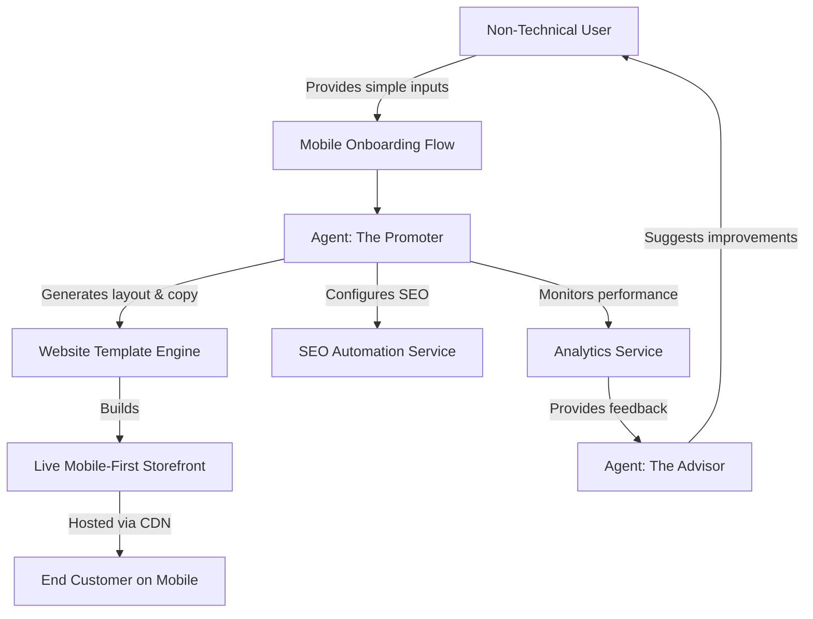

# Website & Storefront Builder Architecture

## Problem Statement
Non-technical small business owners (like Maya the Baker or Carlos the Handyman) struggle with complex website builders like Shopify or Wix. They are overwhelmed by theme settings, complex CMS tools, and DNS configuration. They need an invisible, AI-powered system that generates a beautiful, functional storefront automatically based on a few simple inputs. The result must perform flawlessly on a mobile device and integrate deeply with OHC’s AI departments (Marketing, Operations, etc.), without requiring the user to edit a single line of code or touch any technical settings.

## Research Report
**Competitive Landscape:**
- **Shopify:** Complex and targeted at semi-technical or tech-savvy SMBs. Requires understanding of themes, plugins, and separate payment gateways. Time to live is 30-60+ minutes.
- **Wix/Squarespace:** Flexible but overwhelming. The sheer number of options leads to decision fatigue. Still requires significant manual layout adjustments for mobile. Time to live is 20-60 minutes.
- **GoDaddy (Airo):** Simpler, but lacks deep functionality like native bookings, robust inventory sync, and intelligent AI agents.

**OHC Differentiation:**
- **Zero Configuration:** The user provides their business name and type, and the AI agent automatically crafts a fully functional, mobile-first website in minutes.
- **AI-Driven Personalization:** The "Promoter" department dynamically updates SEO, customizes content, and suggests design changes based on user interactions and business goals.
- **Mobile-First Foundation:** Starting from 375px width, the builder ensures all elements are touch-friendly (≥ 44x44px) and performant on lower-end devices.

## Design Doc

### Architecture Diagram

### UI Wireframes & Screen Flow (375px First)
1. **Onboarding Screen:**
   - Large, clear input fields: "What is your business name?" and "What do you sell?"
   - Next button (minimum 44px height).
2. **AI Generation Screen:**
   - Loading animation with friendly text: "The Promoter is designing your storefront..."
3. **Storefront Preview Screen:**
   - A fully rendered 375px-wide preview of the storefront.
   - Blocks visible: Hero section (auto-generated image/text), Product Grid (or Service List), Contact/Booking section.
   - Sticky bottom bar: "Publish Now" button.
4. **Edit Mode (Optional but simple):**
   - Tap any text to edit directly.
   - Tap any image to upload a replacement from the phone gallery.
   - No complex sidebar menus; contextual actions only.

### Mobile UX Flow
- The entire process from onboarding to publishing is linear and swipeable.
- Forms use native mobile keyboards (e.g., numeric keypad for phone numbers).
- Navigation is thumb-friendly, relying on sticky bottom navigation bars instead of hamburger menus.

### AI Agent Integration Points
- **The Promoter (Marketing & Advertising):** Automatically designs the initial layout, writes the copy, and sets up SEO meta tags based on the business category.
- **The Advisor (Business Advisory):** Monitors traffic and suggests changes (e.g., "Move your best-selling vegan cake to the top of the page").
- **The Manager (Operations):** Connects the storefront's "Buy/Book" buttons directly to the inventory and booking backend.

### Key Design Decisions
- **AI-First Generation:** Users do not start with a blank canvas or a massive template gallery. The AI generates a customized, high-quality starting point.
- **Constrained Customization:** To prevent users from breaking the "Aesthetic Excellence" mandate, customization is limited to content (text, images) and high-level themes (color palettes, font pairings), rather than pixel-perfect positioning.
- **Mobile-First Rendering:** The underlying engine outputs semantic HTML/CSS optimized primarily for 375px screens, scaling up gracefully to desktop via defined breakpoints (414, 768, 1024, 1440).
- **Custom Domains & SSL:** When users upgrade to a tier supporting custom domains, the system prompts them to update their DNS records (or handles it via a partner integration). OHC auto-provisions and renews Let's Encrypt SSL certificates transparently through its edge proxy (e.g., Traefik or Caddy integration), ensuring that end-user traffic is always secure. The backend continuously monitors SSL validity.

## Implementation Prompt
**Task:** Implement the Website & Storefront Builder engine.
**User Journey (CUJ):**
A user signs up, enters their business name and type, and clicks "Build My Store". The system should use the AI integration to generate a complete, mobile-first (375px) storefront layout with placeholder text, images, and functional "Buy/Book" buttons. The user should be able to view a live preview and click "Publish" to make the site live on an OHC subdomain.
**Acceptance Criteria:**
- The engine must be able to generate a site layout based on structured AI output.
- The resulting site must be responsive, starting at 375px width.
- The site must achieve a Lighthouse mobile performance score of 90+.
- All touch targets must be at least 44x44px.
- Provide full E2E test coverage for the site generation and publishing flow, mocking the AI responses.

## Priority
P0

## Estimated Scope
Large

