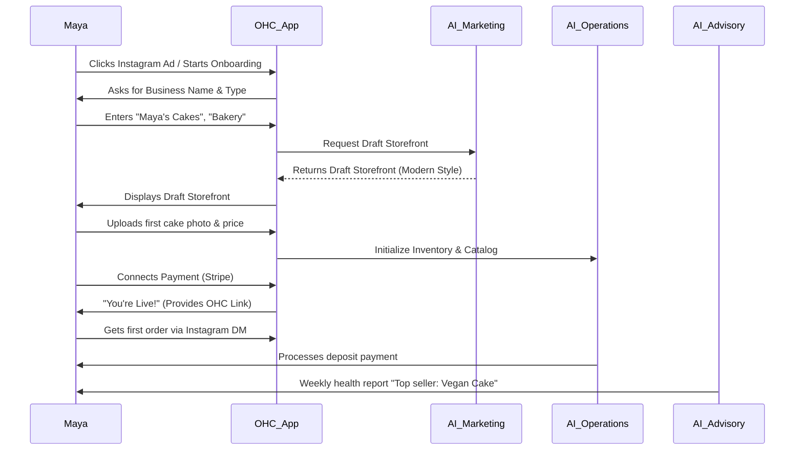
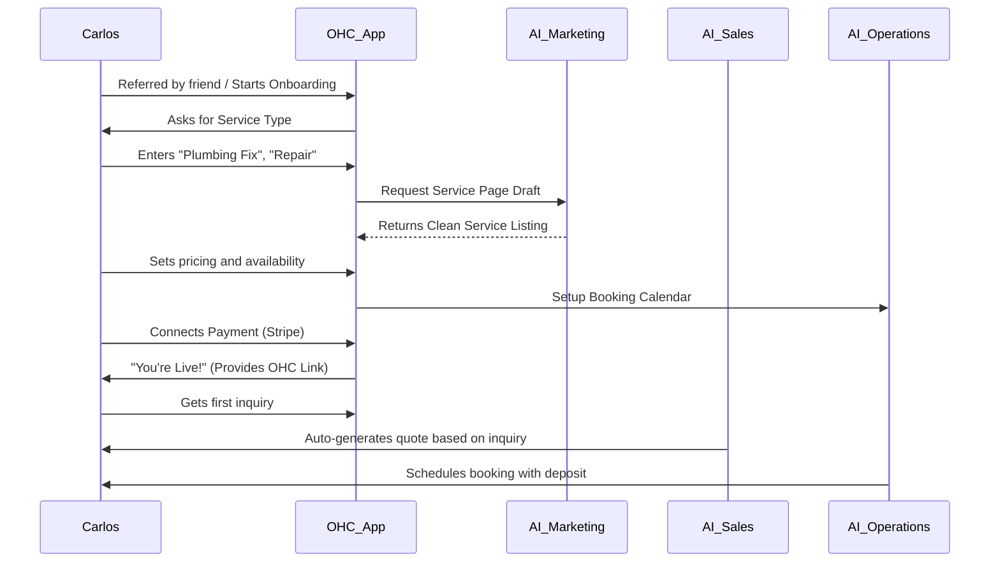
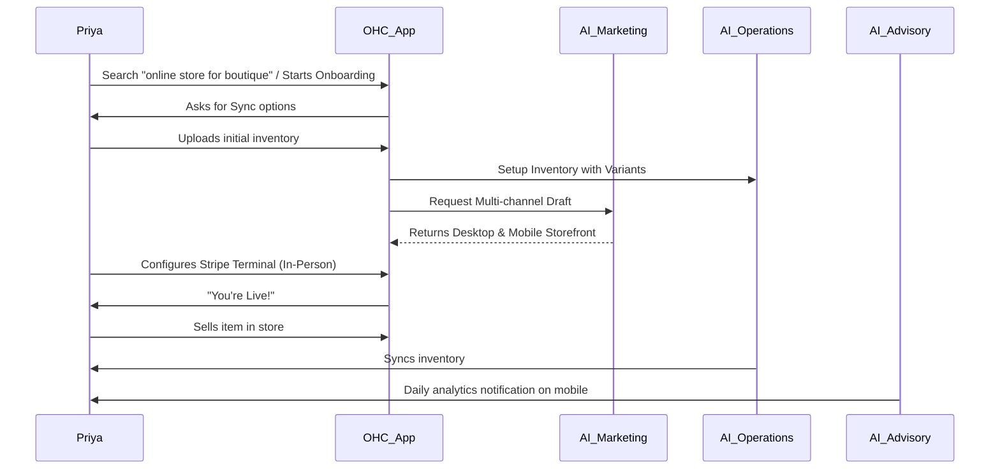
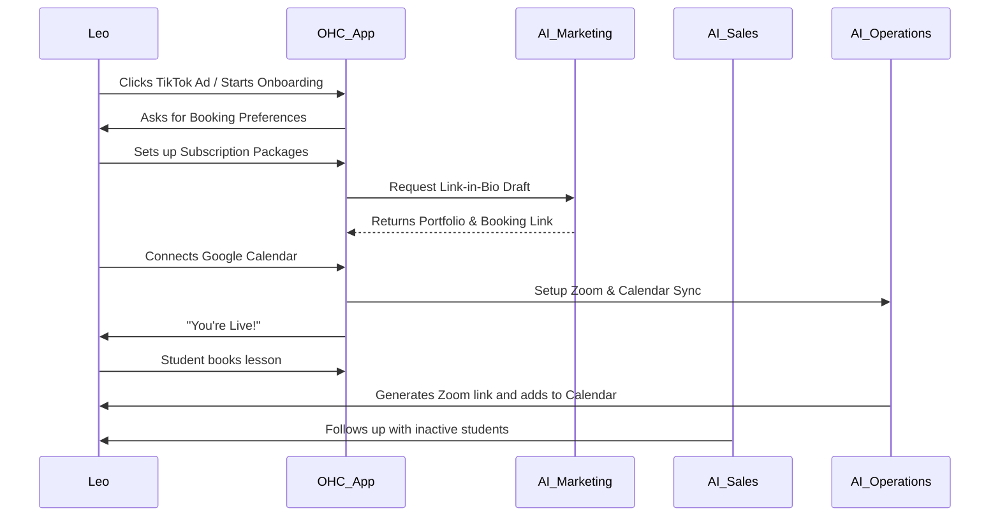
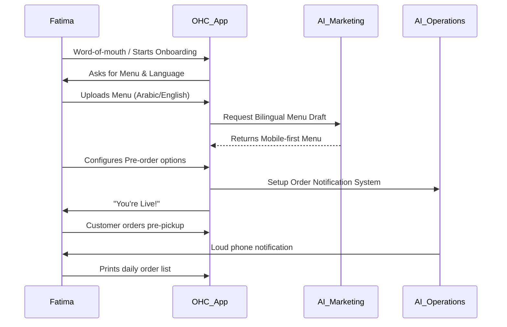

# [architecture]_business_journey_architecture.md

## Title
Business Journey Architecture

## Problem Statement
Small business owners (especially non-technical users like Maya, Carlos, Priya, Leo, and Fatima) need an intuitive, friction-free journey from discovering OHC to fully running their business on the platform. The current lack of a defined, persona-specific end-to-end journey risks high abandonment rates during onboarding and limits the long-term engagement and revenue potential of the platform.

## Research Report
### Findings & Competitive Analysis
- **Shopify:** Complex onboarding (30-60 min) requiring a high degree of technical or e-commerce knowledge. The setup process is overwhelming for users like Fatima or Maya who just need a simple storefront or pre-order system.
- **Wix / Squarespace:** Takes 20-40 min to set up. Requires significant design effort and manual configuration. While visually appealing, the UI is too complex for true mobile-first management.
- **GoDaddy:** Simpler setup (20-40 min) but lacks the depth of features needed for complex business types (e.g., booking + store + portfolio).
- **OHC's Opportunity:** A strictly <10 minute setup driven entirely by AI agents that handle the heavy lifting invisibly. A truly mobile-first management experience that allows a user to run their entire business from a 375px phone screen.

### Key Pain Points
- High abandonment during account creation and initial configuration.
- Difficulty in setting up payments, custom domains, and initial inventory.
- Lack of proactive guidance on next steps post-launch.

## Design Doc

### 1. Acquisition
- **Maya (Baker):** Discovers OHC via an Instagram ad showing a beautiful custom cake storefront. The CTA is "Build your cake shop in 10 minutes."
- **Carlos (Handyman):** Referred by a friend. The CTA is "Get booked and paid online today."
- **Priya (Boutique):** Organic search for "easy online store for boutique." CTA is "Sync your store and sell online instantly."
- **Leo (Music Tutor):** Discovers OHC via TikTok ad showing a simple booking link-in-bio. CTA is "Start booking students online."
- **Fatima (Food Cart):** Word-of-mouth from another food vendor. Needs simple pre-order pickup.

### 2. Onboarding (Zero to Live in <10 Minutes)
- **Step 1: The Basics (AI-Assisted):** Name of business, type of business, and preferred style (e.g., "Modern", "Playful"). AI immediately generates a draft storefront.
- **Step 2: Core Offering:** Add the first product/service (e.g., a photo of a cake, a "Plumbing Fix" service).
- **Step 3: Get Paid:** Connect Stripe or set up basic bank transfer details.
- **Step 4: Go Live:** Publish the store with an OHC subdomain. Custom domain setup is deferred to avoid friction.

### 3. Activation
- **Day 1 Success:** The user receives their first order or booking. The AI "Operations" agent sends a push notification and a simple next-step guide.
- **Week 1 Success:** The user has added more products/services and customized their storefront. The AI "Marketing" agent suggests creating an Instagram post.
- **Month 1 Success:** Consistent orders. The AI "Business Advisory" agent provides a weekly summary: "You made $500 this week! Your best seller was the Vegan Chocolate Cake."

### 4. Retention
- **Daily Engagement:** Push notifications for new orders, messages, and AI agent summaries.
- **Proactive Insights:** The AI "Advisor" identifies trends (e.g., "Tuesdays are slow, try a promotion") and suggests actions.
- **Seamless Management:** Managing inventory, updating prices, and replying to customers is as easy as sending a text message.

### 5. Revenue
- **Trigger for Upgrade:** When a user hits the limit of the Free tier (e.g., 10 products, 100 AI actions), the AI "Advisor" gently suggests upgrading to the Starter tier ($9/mo) to unlock more capacity and a custom domain.
- **Value Proposition:** The upgrade is framed as an investment in growth, not just a feature unlock.

### 6. Referral
- **Viral Loop:** Priya shares her beautiful OHC storefront link with another boutique owner. The footer says "Powered by OHC - Build yours in 10 mins."
- **Incentive:** Both Priya and the new user get a month of the Starter tier for free.

### Architecture Diagrams (Mermaid.js)

#### 1. Maya (Baker) Journey

#### 2. Carlos (Handyman) Journey

#### 3. Priya (Boutique) Journey

#### 4. Leo (Music Tutor) Journey

#### 5. Fatima (Food Cart) Journey

## Implementation Prompt
**For Implementer Agent:**
Implement the core onboarding flow UI based on the Business Journey Architecture.
- **CUJ:** A new user opens the app, enters their business name and type, and receives an AI-generated draft storefront within 10 seconds.
- **Acceptance Criteria:**
  - The UI must be fully responsive, starting from a 375px mobile baseline.
  - The flow must include exactly three steps: Basics (Name/Type), Core Offering (First Product), and Get Paid (Mock payment setup for now).
  - Use the OHC Premium Token library for styling (Glassmorphism, Outfit/Inter fonts).
  - The flow must conclude with a "Success" screen displaying a mock live link.

## Priority
P0 (Critical)

## Estimated Scope
Medium
