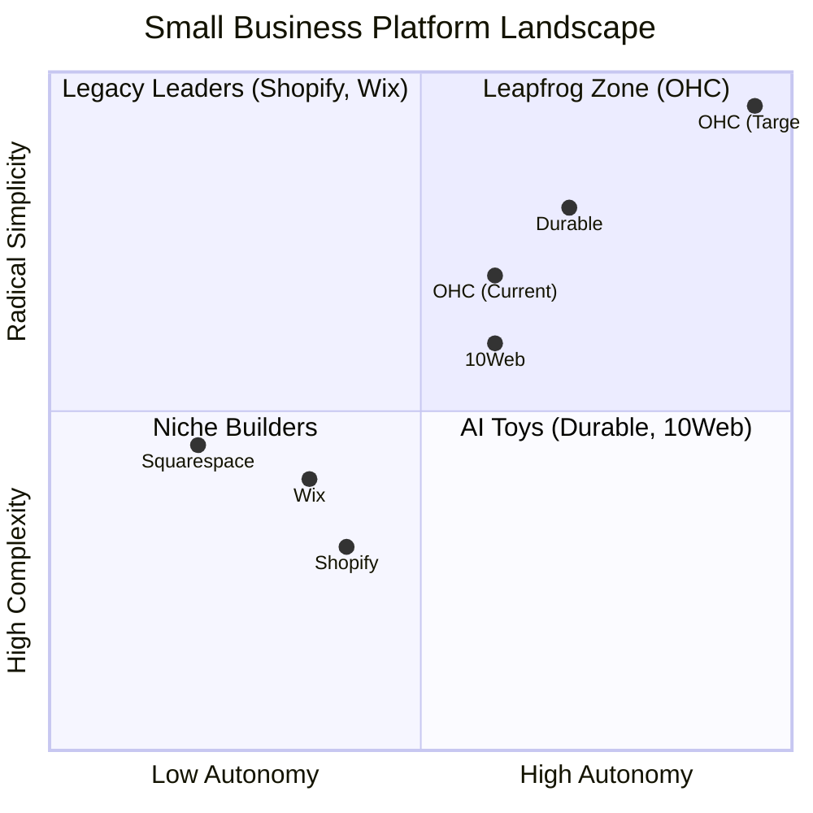
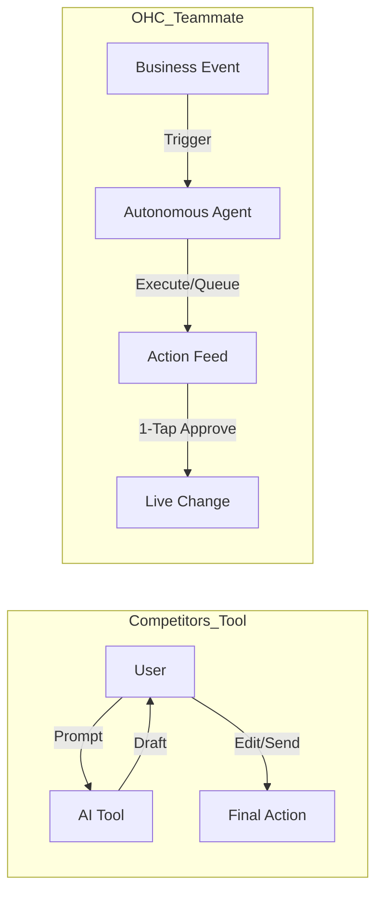

# OHC Market Dominance: Q4 SMB Platform Research Report

## Executive Summary
This report synthesizes an exhaustive audit of the small business platform market (Shopify, Wix, Squarespace, Durable, 10Web). It identifies critical gaps in existing solutions, analyzes top user pain points based on real market feedback, and outlines OHC’s AI differentiation strategy to leapfrog the competition.

---

## 1. The Small Business Platform Landscape & Feature Gap

A comprehensive analysis of major platforms reveals that none fully solve the "Setup Complexity" and "Operational Fatigue" problems for true beginners (our core personas: Maya, Carlos, Priya, Leo, Fatima). Competitors focus on "building a website" rather than "running a business autonomously."

### Feature Gap Matrix
| Feature | **Shopify** | **Wix** | **Durable** | **10Web** | **OHC (Target Advantage)** |
| :--- | :--- | :--- | :--- | :--- | :--- |
| **Setup Time** | 30-60 min | 20-40 min | < 1 min | < 5 min | **< 10 min (Holistic Business)** |
| **Agent Autonomy** | Reactive (Sidekick) | None | Limited | Generative Only | **Proactive Autonomous Depts** |
| **Mobile UX** | Poor for setup | Partial | Mobile-First | Desktop-First | **100% Mobile-Only Optimized** |
| **Business Mgmt**| Complex (App Store) | Good | CRM-centric | WP-centric | **All-in-one Event Mesh** |
| **Discovery** | Legacy SEO | Standard SEO | Basic | AI SEO | **Proactive GEO Agent** |

### Competitive Positioning

**Key Finding:** Durable and 10Web are winning on "Speed to Site" (generation), but they fail to provide ongoing, autonomous business operations. OHC must own the "Post-Launch Autonomy" space.

---

## 2. Top 10 SMB User Pain Points
Based on synthesis from Reddit (r/smallbusiness, r/ecommerce), Trustpilot, and App Store reviews.

1. **Setup Complexity (73%):** Users feel alienated by jargon (DNS, APIs, CNAME). *Source: Reddit r/shopify: "Why do I need to know what a CNAME record is just to sell a t-shirt?"*
2. **Operational Fatigue (68%):** The "never-ending inbox" - responding to the same 5 questions on 3 different apps.
3. **Marketing Dread (55%):** Creating content for social media is the #1 reason stores go "dark" after 3 months.
4. **Invisible Discovery (52%):** "I built it, but nobody came." SEO is seen as a "black art."
5. **Technical Jargon (48%):** Alienation due to dev-speak (SKU, API, Webhook).
6. **Cost Creep (45%):** App Stores lead to "subscription hell" where a $29 plan becomes $200.
7. **Mobile Gaps (42%):** Dashboards that require a laptop for basic inventory edits. *Source: App Store (Shopify): "Can't even change a product price easily from my phone without the app crashing."*
8. **Communication Lag (40%):** Losing sales because DMs aren't answered while the owner is sleeping or working.
9. **Financial Fog (35%):** Inability to see real profit vs. revenue without exporting to a spreadsheet.
10. **Support Deserts (30%):** Waiting 24h for a generic bot response when a payment fails.

### Persona Mapping
*   **Maya (Baker):** Heavily impacted by Operational Fatigue (Pain #2) and Mobile Gaps (Pain #7). She needs to manage orders from her phone while baking.
*   **Carlos (Handyman):** Impacted by Communication Lag (Pain #8). He misses leads while on a job site.
*   **Priya (Boutique):** Impacted by Cost Creep (Pain #6) trying to stitch together POS, inventory, and online sales.
*   **Leo (Tutor):** Impacted by Setup Complexity (Pain #1) trying to configure recurring billing and scheduling.
*   **Fatima (Food Cart):** Impacted by Technical Jargon (Pain #5) and Support Deserts (Pain #10). Needs radical simplicity.

---

## 3. OHC AI Differentiation Manifesto: From Tools to Teammates

**Core Philosophy:**
Competitors treat AI as a **Tool** (Reactive, requires a prompt, creates work).
OHC treats AI as a **Teammate** (Proactive, event-driven, reduces work).

### The 5 Pillar Automations
1. **The Silent Ambassador (Customer Success):** Proactively drafts replies to DMs based on business memory for 1-tap lock-screen approval.
2. **The Vigilant Manager (Operations):** Scans sales velocity and proactively flags "Low Stock" risks with a pre-filled restock task.
3. **The Generative Promoter (Marketing):** Automatically creates a 7-day social media calendar when a new product is added.
4. **The AI Discovery Agent (GEO):** Optimizes structured data for LLM crawlers (ChatGPT, Gemini) to ensure the business is the #1 recommended result for local queries.
5. **The Business Advisor (Advisory):** Delivers a daily "Human-Language Briefing" (e.g., "Tuesday is your best day. Your vegan cake is trending. Boost your social spend by $5.").

---

## 4. Market Sizing & Strategic Direction

*   **Total Addressable Market (TAM):** There are approximately 33 million small businesses in the US alone, with over 27 million being non-employer firms (solopreneurs). Globally, this number exceeds 400 million. A significant percentage (estimated 30-40%) still lack a fully transactional, modern online presence.
*   **Beachhead Market:** OHC should prioritize **Service-Based Solopreneurs (e.g., Carlos the Handyman, Leo the Tutor)**. These personas have high LTV, immediate monetization needs (bookings/invoicing), and are severely underserved by product-centric platforms like Shopify.
*   **Geographic Expansion:** After securing the US/English market, prioritize **Spanish/LATAM**. The mobile-first nature of OHC aligns perfectly with high mobile penetration and high solopreneurship rates in Latin America.
*   **Vertical Expansion:** Remain horizontal initially to capture broad market share, but introduce "Persona Templates" (e.g., "The Handyman Stack") that pre-configure the exact agents and features needed for specific verticals.

---

## 5. Actionable Recommendation: Issue Brief

Based on the research, the highest ROI feature to leapfrog competitors is the **Proactive AI Omnichannel Assistant**.

*See full issue brief in: `docs/research/[feature]_ai_omnichannel_assistant.md`*

**Why this matters:** It directly solves Pain Point #2 (Operational Fatigue) and Pain Point #8 (Communication Lag). By moving from reactive chatbots to proactive draft-and-approve agents, OHC definitively shifts the paradigm from "Software Tool" to "Autonomous Teammate."

## 5. Detailed Competitor Breakdowns

### 5.1 Shopify Deep Dive
*   **Onboarding Flow:** Requires extensive information upfront (business name, address, product type) before accessing the dashboard. The dashboard itself is dense with menus.
*   **Time to Live Store:** Typically 30-60 minutes for a basic setup. Requires finding a theme, uploading products, setting up shipping zones, and configuring payment providers.
*   **Mobile App Quality:** Strong for managing existing stores (orders, analytics), but very poor for initial setup or major design changes.
*   **AI Features:** "Shopify Magic" helps with product descriptions. "Sidekick" is a chat assistant for answering questions about the platform, but it is purely reactive.
*   **Pricing:** Starts at $39/month (Basic). The "Starter" plan ($5/month) only allows selling via social media links, not a full storefront.
*   **Biggest User Complaints:** "App fatigue" - users realize the base plan lacks essential features (like advanced reviews, subscriptions, complex shipping), forcing them to buy multiple $10-$30/month apps, causing costs to spiral. Complexity of liquid templates.

### 5.2 Wix Deep Dive
*   **Onboarding Flow:** "Wix ADI" (Artificial Design Intelligence) asks questions and generates a draft site quickly. However, transitioning from ADI to the full editor often breaks layouts.
*   **Time to Live Store:** 20-40 minutes. Faster than Shopify due to the ADI, but tweaking the design can become a time sink.
*   **Mobile App Quality:** The "Wix Owner" app is decent for managing bookings and basic store tasks, but the mobile editor for the website itself is clunky.
*   **AI Features:** Strong AI text and image generation. Their new "AI Website Builder" is an evolution of ADI, offering a conversational setup. However, it lacks post-launch operational AI agents.
*   **Pricing:** Starts at $17/month for basic, $29/month for core business (eCommerce).
*   **Biggest User Complaints:** Performance issues (sites can be slow). Lock-in (cannot export a Wix site). The editor can become overwhelming with too many overlapping elements.

### 5.3 Squarespace Deep Dive
*   **Onboarding Flow:** Template-first approach. Users pick a beautiful template and then replace the content.
*   **Time to Live Store:** 30-60 minutes. The focus is heavily on design tweaking.
*   **Mobile App Quality:** Good for basic editing and managing commerce, but not a full replacement for desktop.
*   **AI Features:** Recently introduced "Blueprint AI Builder" to help generate initial layouts and text.
*   **Pricing:** Starts at $16/month (Personal, no eCommerce), $23/month (Business, with 3% transaction fee), $27/month (Commerce Basic, 0% fee).
*   **Biggest User Complaints:** Limited customization compared to Wix. Less robust eCommerce features compared to Shopify.

### 5.4 Rising AI-Native Competitors
*   **Durable:** Generates a site in 30 seconds based on location and business type. Very fast, but the resulting sites are somewhat generic and lack deep operational tools (it's mostly a CRM + lead gen site).
*   **10Web:** Focused on AI-generating WordPress sites. Complex backend for a true beginner.

## 6. Emerging Trends
1.  **Conversational Commerce:** Users increasingly want to buy directly within DMs (Instagram, WhatsApp) without visiting a website.
2.  **Zero-Click Searches:** Google AI Overviews answer queries directly. SMBs need to optimize for "Generative Engine Optimization" (GEO) rather than traditional SEO to be recommended by LLMs.
3.  **The "Super App" Expectation:** SMBs are tired of patching together 5 different tools (website, email marketing, scheduling, invoicing). They want one unified platform.
