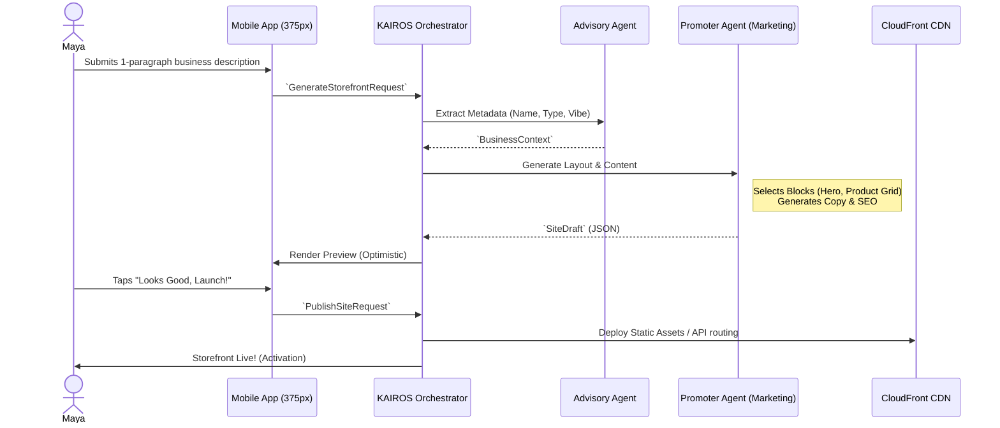

# Issue Brief: Website & Storefront Builder Architecture

## Title
Website & Storefront Builder Architecture: A "30-Second" Instant Mobile-First Generation Engine

## Problem Statement
Traditional website builders (like Shopify, Wix, and Squarespace) force users into a "blank canvas" or complex template-selection workflow. For a non-technical small business owner (e.g., Maya the Baker, Carlos the Handyman), the sheer volume of choices—themes, layout structures, typography, and color schemes—causes cognitive overload and friction during onboarding. They need a beautiful, premium, mobile-first storefront to launch their business, but they lack the design skills or the time to manually construct it. A 10-minute setup is still too long; the system must generate a complete, functional storefront in under 60 seconds from minimal input.

## Research Report
### Context
The OHC platform must support diverse personas across various business categories:
- **Maya (Baker)**: Needs a photo-centric product grid, an "Order Custom Cake" form (with deposit).
- **Carlos (Handyman)**: Needs clear service lists, pricing, and a booking calendar block.
- **Leo (Music Tutor)**: Needs a single-page portfolio, testimonials, and subscription tiers.

### Findings & Competitive Analysis
- **Shopify & Wix**: Rely on manual drag-and-drop customization. "Wix AI" requires significant user prompting to refine layouts.
- **GoDaddy Airo**: Attempting faster generation, but output is often generic and not optimized for specific mobile interaction patterns.
- **OHC Advantage**: By treating AI as a proactive teammate, "The Promoter" (Marketing & Advertising Agent) can instantly generate a highly opinionated, premium mobile-first design using the OHC Design System tokens. The user isn't building a site; the AI is building it *for* them.

## Design Doc

### Key Architectural Decisions
1. **Opinionated Content Blocks over Freeform Grids**: The builder will compose pages using strict, pre-defined semantic blocks (e.g., `HeroBlock`, `ProductGridBlock`, `ServiceBookingBlock`, `TestimonialBlock`). Users cannot arbitrarily place elements; they can only toggle or reorder blocks.
2. **Instant Generation (The Advisor + The Promoter)**: During onboarding, "The Advisor" extrapolates business metadata from a single input (e.g., "I'm Maya, I sell vegan cakes in Austin"). "The Promoter" then maps this data to the optimal blocks and generates copy/images in parallel.
3. **Draft -> Live Publishing Model**: The AI generates a `SiteDraft`. The user reviews it (optimistic UI update) and taps "Publish" to convert it to a `LiveSite`.
4. **Automated SEO**: The Promotor agent automatically generates structured JSON-LD data, meta titles, and descriptions based on the block content. No manual SEO input is required.
5. **Mobile-First Constraint**: All block designs originate at the 375px breakpoint and use OHC Premium Tokens (Glassmorphism, Outfit/Inter typography).

### Block Inventory
- `HeroBlock`: Main CTA, background image/video, tagline.
- `ProductGridBlock`: Horizontal scroll or 2-column grid for physical/digital goods.
- `ServiceBookingBlock`: Integrated with the Operations Agent calendar.
- `TestimonialBlock`: Auto-populated from Customer Success interactions.
- `ContactFormBlock`: Routes messages directly to the unified Inbox.

### Architecture Diagram (Mermaid.js)

### Mobile UX Flow
1. **Input Screen**: A clean, single text field with a microphone option: "Tell us about your business."
2. **Loading State**: Premium micro-animations while the AI generates the site ("Crafting your brand...", "Writing your copy...").
3. **Preview Screen**: A full-screen preview of the generated mobile layout. The user can scroll through the blocks.
4. **Edit Mode (Optional)**: If the user wants to change something, they tap a block, which opens a simple modal to edit text or swap an image. No complex layout tools are shown.
5. **Publish Action**: A prominent sticky button at the bottom: "Publish Now."

## Implementation Prompt
**To Implementer Agent:**
Implement the "Instant Builder" service for the backend, focusing on the API endpoints and the structured JSON output for storefront generation. Create the orchestration logic that accepts a user's business description, passes it to the AI agents ("The Advisor" for context extraction, "The Promoter" for content/layout generation), and returns a structured `SiteDraft` composed of predefined blocks (`HeroBlock`, `ProductGridBlock`, etc.). Implement the `PublishSiteRequest` endpoint to transition the draft to a live state. Ensure the generated JSON includes automated SEO metadata. Do not build the complex frontend rendering engine yet; focus on establishing the robust API contract and the AI coordination logic. Write comprehensive unit tests for the block composition and generation logic.

## Priority
P0

## Estimated Scope
Large
