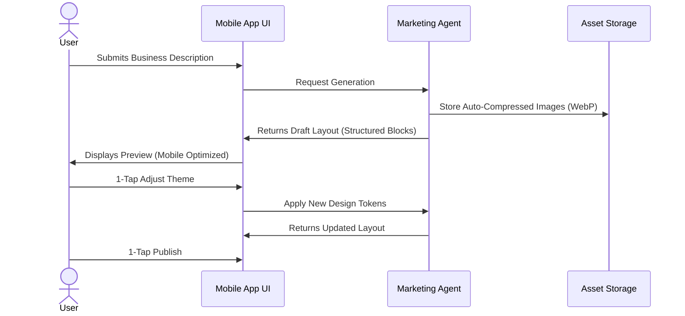
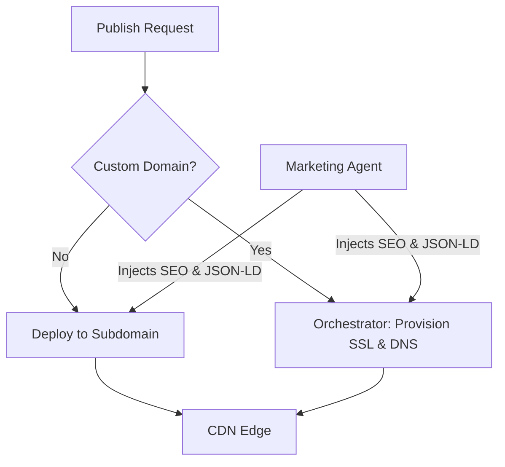

# Issue Brief: Website & Storefront Builder Architecture

## Title
Website & Storefront Builder Architecture

## Problem Statement
Small business owners often lack the technical expertise or time required to build, optimize, and launch a professional-grade website or storefront. Competitors like Shopify and Wix present users with a blank canvas or complex configurations that lead to cognitive overload and abandonment. For personas like Maya (the baker) and Carlos (the handyman), building a web presence must be instant, foolproof, and entirely mobile-driven, demanding zero knowledge of DNS, layouts, SEO, or SSL setup.

## Research Report
- **Goal**: Architect a seamless, AI-driven website and storefront builder that transitions users from zero to a live, functional, SEO-optimized business presence in under 10 minutes, entirely from a mobile device (375px viewport first).
- **Competitor Analysis**:
    - **Shopify / Wix / Squarespace**: Rely heavily on desktop-centric drag-and-drop editors, requiring users to manually manage layouts, mobile responsiveness, and SEO tags. Custom domains and SSL require complex manual configuration steps.
    - **OHC Advantage**: Adopts a generative, content-first approach where the UI adapts dynamically to user intent rather than forcing manual layout adjustments. AI acts as a designer, copywriter, and technical operator invisibly.
- **Key Findings**:
    - Users want a "done-for-you" experience.
    - Setup friction (e.g., DNS setup, image formatting) is the primary cause of platform abandonment.
    - Real-world business requirements dictate specific content modules (e.g., booking calendars for services, product grids for commerce).

## Design Doc

### Core Philosophy
The OHC Website & Storefront Builder is not a traditional drag-and-drop page editor. It is a generative layout engine managed by the **Marketing & Advertising Agent ("The Promoter")**. Users provide business intent, and the agent configures structured content blocks.

### Content Blocks & Template System
- **Structured Content Blocks**: The builder operates on a predefined set of semantic blocks:
    - **Hero Section**: Business name, tagline, primary call-to-action (CTA).
    - **Product/Service Grid**: Dynamic listings fetched from the underlying inventory/service catalog.
    - **Booking Calendar**: Native scheduling widget.
    - **Testimonials**: Social proof aggregation.
    - **Contact/Location**: Integrated maps and inquiry forms.
- **Templates**: Templates are not static HTML layouts but sets of design tokens (typography, color palettes, spacing) conforming to the OHC Premium Token library (Glassmorphism, Outfit/Inter typography). The UI dynamically assembles blocks based on these tokens.
- **Customization**: Users can toggle blocks on/off, reorder them via simple mobile up/down arrows, and select overarching "Themes" (e.g., "Modern Playful", "Elegant Minimalist") which the AI applies globally.

### Publishing & Automatic SEO
- **Draft to Live**: A one-tap "Publish" action pushes the state to a CDN.
- **Generative Engine Optimization (GEO) & SEO**:
    - The Marketing Agent automatically generates meta titles, descriptions, and alt-text for uploaded images based on business context.
    - Structured Data (JSON-LD) is injected automatically to ensure rich results in Google and visibility to LLM crawlers.
    - Performance optimizations (WebP compression, lazy loading) are handled invisibly at the build/serve layer.

### Custom Domains and SSL Provisioning
- **Free Tier**: Deploys to a predictable `[business-name].onehumancorp.com` subdomain instantly.
- **Upgraded Tiers**:
    - A domain search and purchase flow is integrated directly into the OHC app.
    - DNS records (A/CNAME) and SSL certificates (e.g., Let's Encrypt) are provisioned entirely automatically in the background by the KAIROS Orchestrator upon domain purchase or connection. No manual DNS dashboard navigation is required.

### AI Integration Points
- **The Marketing & Advertising Agent ("The Promoter")**:
    - Guides the user through initial onboarding to capture brand identity.
    - Auto-generates initial hero copy and product descriptions.
    - Suggests layout improvements based on business type (e.g., prioritizing the Booking Calendar block for Carlos).
    - Proactively reviews site performance and drafts SEO updates for user 1-tap approval.

### Architecture Diagrams

#### Mobile UX Flow (375px)

#### Orchestration and Provisioning Flow

## Implementation Prompt
Implement the generative website builder engine. Create the mobile-first UI for users to input basic business details and receive a structured layout composed of content blocks. Develop the `Marketing & Advertising` agent logic to populate these blocks with initial copy and design tokens. Implement a seamless 1-tap publish flow that generates a live page on an OHC subdomain, including automatic injection of SEO metadata and WebP compressed images. Do not prescribe the specific JSON schema for blocks, CDN providers, or SSL issuance mechanisms; focus on realizing the user journey from intent to published site.

## Priority
P0

## Estimated Scope
Large