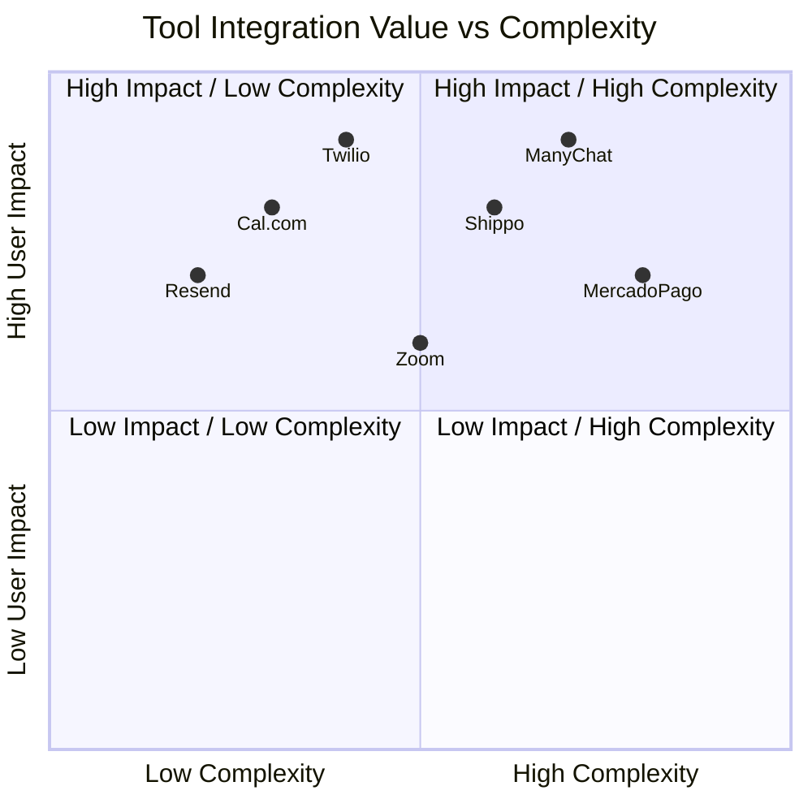

# OHC Scout: External Tool Integrations Research Report

## Problem Statement
The OneHumanCorp (OHC) mission is to empower non-technical users to launch and run businesses. Currently, the Hybrid Agentic OS lacks specialized agents and standardized integrations for essential external tools across 7 categories: Social Media, Calendars, Email, LATAM Payments, Shipping, SMS, and Video Conferencing. Without these integrations, business owners like Maya the Baker or Carlos the Handyman have to manually patch tools together, directly conflicting with the "No code. No jargon." promise.

## Research Findings
A comprehensive evaluation was performed to identify the best tools for OHC integration that solve real pain points for non-technical small business owners, support both Cloud and Standalone modes, and provide developer-friendly APIs.

| Category | Recommended Tool | Key Benefit for OHC Personas |
|----------|------------------|------------------------------|
| Social Media | **ManyChat** | Unified inbox for IG/FB DMs with AI auto-responders. |
| Calendar/Booking | **Cal.com** | API-first booking with automatic timezone sync. |
| Email Marketing | **Resend** | Developer-friendly, high deliverability for AI drafts. |
| Payments (LATAM) | **MercadoPago**| Support for local methods like PIX and Boletos. |
| Shipping | **Shippo** | Live rate calculation and one-click label generation. |
| SMS/Notifications| **Twilio** | Immediate SMS alerts and WhatsApp integration. |
| Video Conferencing| **Zoom** | Automated dynamic meeting links for virtual services.|

## Business Lifecycle Stages & Friction Points
- **Stage: Acquisition (Marketing)**
  - *Friction*: Customers ask repetitive questions via Instagram DMs, and owners lose leads if they reply too late.
  - *Solution*: **ManyChat** allows the AI Customer Success agent to reply instantly 24/7.
- **Stage: Conversion (Booking & Checkout)**
  - *Friction*: Complex scheduling loops and lack of local payment options in LATAM.
  - *Solution*: **Cal.com** unified scheduling combined with **MercadoPago** for regional checkout.
- **Stage: Fulfillment (Operations)**
  - *Friction*: Manual calculation of shipping rates and slow delivery of virtual meeting links.
  - *Solution*: **Shippo** for live shipping rates and labels; **Zoom** for auto-generated video links.
- **Stage: Retention (Customer Success)**
  - *Friction*: Customers ignore emails, and standard marketing platforms are too complex to set up.
  - *Solution*: **Resend** for simplified, automated email blasts; **Twilio** for critical high-open-rate SMS notifications.

## Proposed Next Steps
1. Review and approve the 7 generated Issue Briefs located in `docs/research/`.
2. Schedule implementation sprints for the `SocialMediaIntegrationService` (ManyChat) and `SchedulingService` (Cal.com) as P0 priorities.
3. Validate Hybrid WebSockets MCP tunneling specifically for MercadoPago and Shippo webhooks to ensure Standalone desktop users receive updates.

## Visual Excellence: Implementation Complexity vs User Impact

