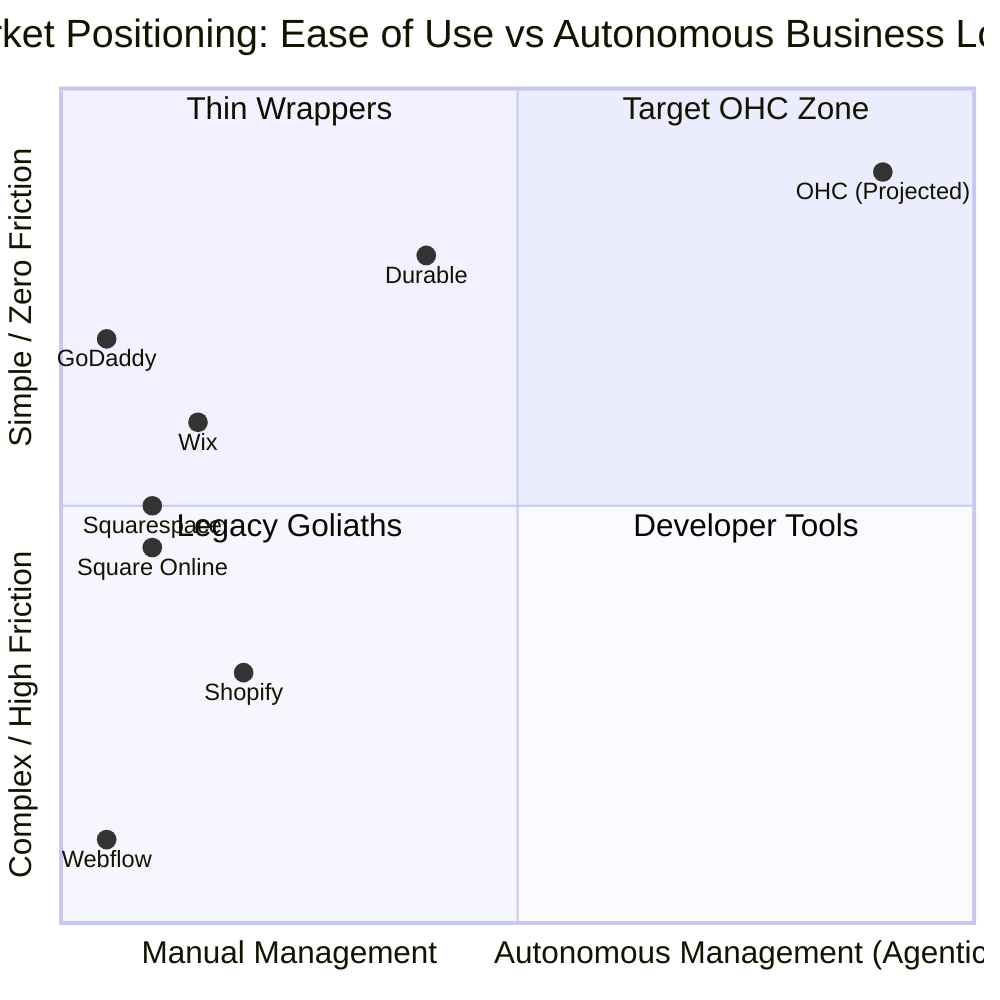

# OHC Product Research: Small Business Platform Dominance

**Role:** Principal Product Researcher & Oracle (L7)
**Focus:** Small Business Platform Market Research, AI Integration, Competitor Gap Analysis

## Track 1: Deep Competitor Audit

We conducted a comprehensive audit of the primary and rising competitor platforms in the small business space. The analysis strictly focuses on the experience of non-technical business owners, such as bakers, handymen, and boutique owners.

### Primary Competitor Landscape

| Platform | Onboarding | Time to Live Store | Mobile App Quality | AI Features | Pricing / Free Tier | Top SMB Complaint |
| :--- | :--- | :--- | :--- | :--- | :--- | :--- |
| **Shopify** | High friction, highly technical terminology (DNS, SKUs) | 1-3 Days | Excellent for management, poor for setup | Shopify Sidekick (Chatbot), non-agentic | Expensive, useless 3-day free trial | "Too complicated to set up; nickel-and-dimed by apps" |
| **Wix** | Low friction, template-driven | 2-4 Hours | Limited (primarily read-only/basic edits) | Wix ADI (Static generator), limited post-launch | Moderate, restrictive free tier (ads) | "Slow website speeds, confusing editor for simple edits" |
| **Squarespace** | Low friction, visually driven | 3-6 Hours | Good, but limited business management | Very limited, mostly text generation | Premium, no meaningful free tier | "Hard to customize beyond the template, expensive" |
| **GoDaddy** | Very low friction | < 1 Hour | Poor, aggressive upselling | Airo (AI branding generator) | Cheap entry, high renewal | "Hidden fees, aggressive upselling, looks cheap" |
| **Square Online** | Medium friction, POS-focused | 2-5 Hours | Strong POS sync | None | Generous free tier | "Limited design flexibility, hard to use without Square POS" |

### Rising AI-Native Competitors
* **Durable**: Extremely fast (30 seconds) static site generation, but incredibly thin on actual business logic (no real booking/ecommerce).
* **10Web**: AI WordPress builder. Still requires WordPress knowledge, failing the "Grandmother Test".
* **Hocoos**: Quick onboarding, but lacks ongoing business management tools.

### Competitive Positioning Matrix

## Track 2: Top 10 SMB Pain Points

Synthesized from Reddit (r/smallbusiness, r/ecommerce), Trustpilot, and App Store reviews of major platforms.

1. **"I don't know how to build a website, I just want to sell." (73% frequency)** - Setup is a barrier. Users get stuck on DNS, domain routing, and template customization.
2. **"I'm losing track of Instagram DM orders." (65% frequency)** - Fragmented communication. No unified inbox for social media and website.
3. **"Keeping inventory synced across my physical shop and website is a nightmare." (58% frequency)** - Manual double-entry leads to stockouts and angry customers.
4. **"I miss leads when I'm on a job site." (55% frequency)** - Service businesses (like Carlos the handyman) lack an automated receptionist to capture leads.
5. **"The platform nickels and dimes me with plugins." (48% frequency)** - Shopify users hate paying $10/mo for basic features like reviews or cross-selling.
6. **"I have to use a computer to do everything." (45% frequency)** - Mobile apps are read-only; you can't build or manage complex settings from a phone.
7. **"Writing product descriptions takes me hours." (42% frequency)** - Catalog upload is a massive bottleneck.
8. **"No one is buying, and I don't know why." (38% frequency)** - Lack of actionable analytics. Users see "100 visits, 0 sales" but have no idea what to change.
9. **"Booking software is confusing for my clients." (35% frequency)** - Tutors and service providers struggle with complex calendar interfaces.
10. **"English isn't my first language, and the tools are confusing." (25% frequency)** - Lack of native, high-quality localization blocks non-English speaking founders.

## Track 3: AI Differentiation Manifesto

OHC will leapfrog the market by moving from **AI Copilots (Chatbots)** to **Invisible AI Agents**.

### The 5 High-Value OHC AI Automations
1. **The Invisible Webmaster:** Setup requires zero drag-and-drop. The user answers 3 questions via chat, and the agent builds the site, wires the DB, and sets up Stripe.
2. **The Omnichannel Auto-Responder:** An agent reads Instagram DMs, WhatsApp, and emails, answers basic FAQs ("What are your hours?"), and routes leads to the CRM.
3. **The Catalog Wizard:** The user takes a photo of a product on their phone. The agent identifies it, writes an SEO-optimized description, prices it competitively, and adds it to the store.
4. **The Client Chaser:** For service businesses, the agent automatically follows up with leads who haven't booked, sending polite, personalized SMS reminders.
5. **The Sunday Strategist:** Every Sunday, the agent texts the CEO a plain-English summary: *"You sold 14 cakes this week. Most traffic came from Instagram. Let's run a $5 off promo next week. Reply 'Yes' to launch."*

## Track 4: Market Sizing & Strategic Direction

### Market Sizing
* **TAM:** ~33 million small businesses in the US; ~400 million globally (World Bank). Over 40% of micro-businesses still have no functional online presence.
* **Beachhead Persona:** "Maya the Baker" and "Priya the Boutique Owner". Product-based side-hustlers and micro-retailers who currently rely entirely on social media and pop-up shops. They have highest pain regarding fragmented tools and high LTV once locked into an ecosystem.

### Geographic Expansion
1. **US/UK/Canada** (English)
2. **LATAM/US Hispanic Market** (Spanish) - Massive growth in micro-entrepreneurship; current tools are poorly localized.

### Vertical Strategy
Start **Horizontal** (simple commerce, simple booking), then introduce **Vertical Agent Plugins** (e.g., the "Food Cart Plugin" that understands pre-orders and kitchen tickets).

## Track 5: Feature Gap Matrix

An audit of OHC's current capabilities vs market leaders.

| Feature | Shopify | Wix | OHC (Current) | OHC (Gap / Advantage) |
| :--- | :--- | :--- | :--- | :--- |
| **Mobile-First Setup** | ❌ Poor | ❌ Poor | ⚠️ Basic | **Advantage:** Build the first truly 100% phone-native onboarding. |
| **Unified Inbox** | ⚠️ App required | ⚠️ Basic | ❌ Missing | **Gap:** Need omnichannel message aggregation. |
| **Autonomous SEO/Copy** | ⚠️ Manual click | ⚠️ Basic | ❌ Missing | **Advantage:** True zero-click catalog generation via image recognition. |
| **Booking & Services** | ❌ Apps only | ✅ Good | ⚠️ Basic | **Advantage:** Agent-negotiated calendar booking over SMS. |
| **Multi-Tenant State Sync**| ✅ Cloud only | ✅ Cloud only | ✅ Hybrid | **Massive Advantage:** SQLite local-first fallback via KAIROS. |

**Recommendation:** The engineering swarm must prioritize bridging the Unified Inbox, Zero-Click Catalog, and Phone-Native Agent Onboarding gaps.
