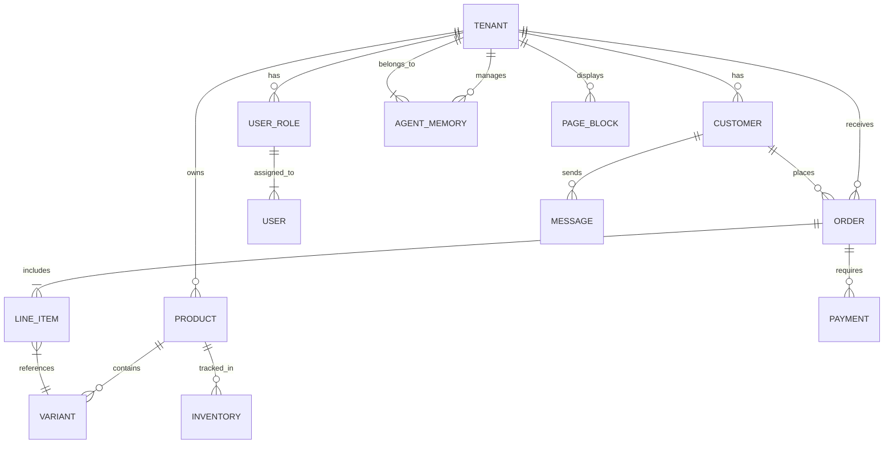

### Title
Research Report: Data Model Architecture Evolution

## Problem Statement
The OHC platform must support a diverse range of business types (physical products, services, food & beverage, subscriptions) under a unified multi-tenant architecture. The current data model needs to be mapped comprehensively to ensure hard multi-tenant isolation, efficient access patterns for both AI agents and the mobile app, and a robust strategy for schema evolution. This is critical to guarantee data privacy and system performance as businesses scale from a Free tier to a Business tier. The model must be easily extensible to support future agent departments without requiring major rewrites.

## Research Report
### Context and Personas
The data model must support the following key personas and their corresponding business entities:
1.  **Maya (Baker)**: Needs `Products`, `Variants`, `Orders` (with custom fields for deposits), and `Customer` history for her Instagram-driven business.
2.  **Carlos (Handyman)**: Needs `Services`, `Bookings`, `TimeSlots`, `Quotes`, and `Deposits`.
3.  **Priya (Boutique)**: Needs robust `Inventory` tracking, `Locations` (in-store vs. online), `Products`, and complex `Variants`.
4.  **Leo (Tutor)**: Needs `Subscriptions`, `Memberships`, `Bookings`, and `Integrations` (e.g., Zoom links).
5.  **Fatima (Food Cart)**: Needs `Menu Items` (with sold-out toggles), `Pre-orders`, and simple `Customer` tracking.

### Core Entity Types
-   **Tenant (Business)**: The foundational boundary. Everything belongs to a Tenant.
-   **User**: The identity (business owner or staff) tied to one or more Tenants.
-   **Customer**: The end-user purchasing from a Tenant.
-   **Product/Service/Menu Item**: The core catalog offerings.
-   **Order/Booking**: The transaction record.
-   **Agent Configuration**: Settings and memory for AI agents per Tenant.
-   **Storefront/Page**: The UI layout and content blocks.

### Key Invariants
1.  **Hard Isolation**: A user or agent process operating on behalf of Tenant A must NEVER be able to query or modify data belonging to Tenant B. This must be enforced at the lowest possible layer (e.g., Row-Level Security in PostgreSQL).
2.  **Immutability of Financial Records**: Once an Order or Payment is completed, the core financial record must be immutable. Refunds or adjustments must be append-only transactions.
3.  **Agent Context Scoping**: When an AI agent wakes up, its memory and context window must be strictly scoped to the specific Tenant and the specific task (e.g., an order ID).

### Access Patterns
-   **Mobile App (Business Owner)**: High-frequency reads for dashboard metrics (Orders today, unread messages). Needs aggregated data quickly.
-   **Storefront (Customer)**: Extremely high-frequency reads for catalog and availability. Requires aggressive caching.
-   **AI Agents (Background)**: Event-driven reads/writes (e.g., new order triggers Operations agent to read inventory and write a fulfillment record). Needs efficient querying by event type and tenant.

### Migration Strategy
-   All schema changes must be backward-compatible (e.g., adding columns, never renaming or dropping without a multi-phase deprecation).
-   Migrations are executed automatically during the CI/CD pipeline.
-   A dual-write strategy should be used when transitioning core tables to avoid downtime.

## Design Doc

### Entity-Relationship Architecture (Mermaid.js)

### AI Integration Points
The data model directly supports the AI departments:
-   **Operations ("The Manager")**: Listens to `ORDER` inserts; updates `INVENTORY` and triggers `PAYMENT` captures.
-   **Marketing ("The Promoter")**: Reads `PRODUCT` data; updates `PAGE_BLOCK` configurations.
-   **Customer Success ("The Ambassador")**: Reads `CUSTOMER` history and `MESSAGE` events to generate context-aware replies.
-   **Business Advisory ("The Advisor")**: Runs scheduled analytical queries across `ORDER` and `CUSTOMER` tables to generate weekly insights.

## Implementation Prompt
**To Implementer Agent:**
Implement the core data model schema as outlined in the Entity-Relationship architecture. You must implement hard multi-tenant isolation, preferably using Row-Level Security (RLS) in PostgreSQL, to guarantee that queries default to the current tenant context. Define the base repositories or data access layers for `Tenant`, `Product`, `Order`, and `Customer`. Ensure that the API layer enforces tenant scoping before querying the database. Do not prescribe specific API frameworks or ORM configurations; focus on the data integrity, the relationship definitions, and the isolation guarantees. Write unit tests that explicitly verify cross-tenant data access is blocked.

## Priority
P0

## Estimated Scope
Large