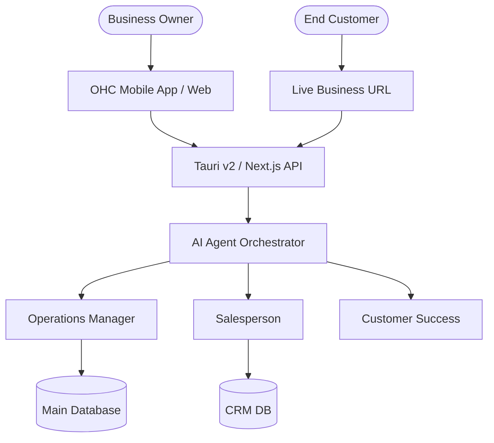
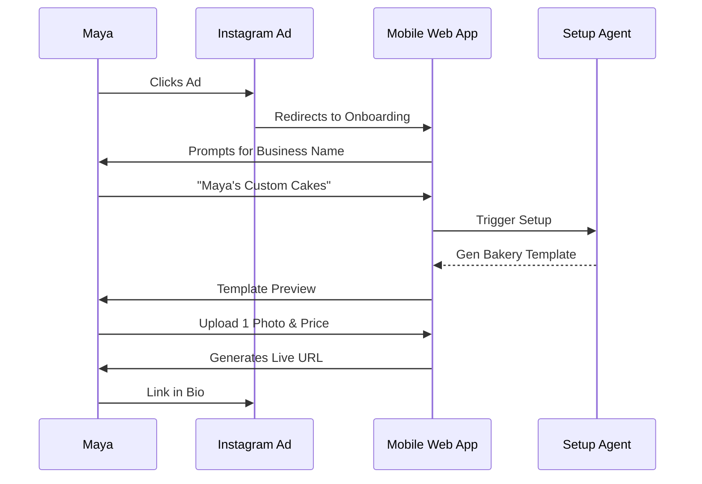
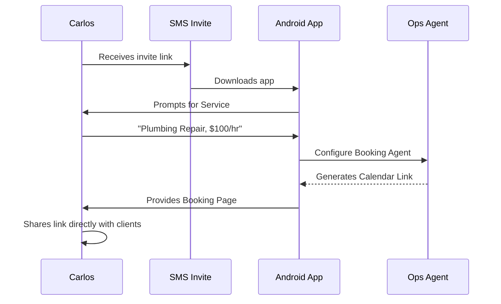
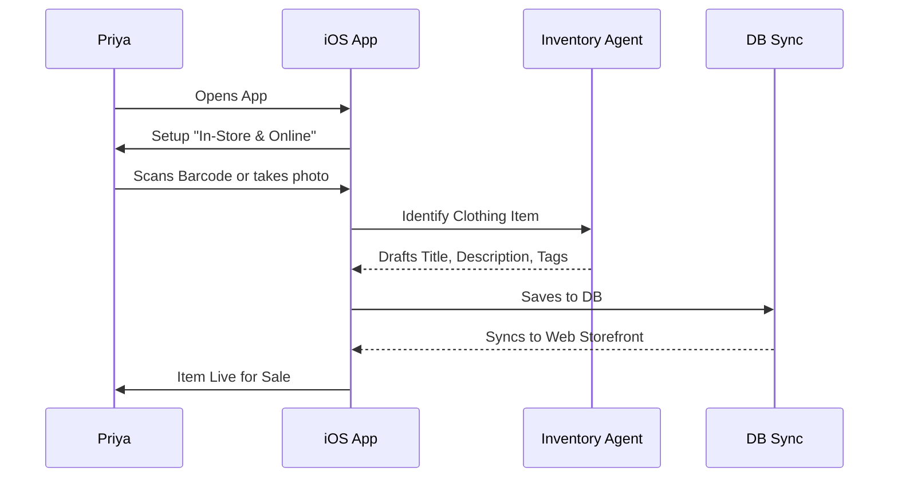
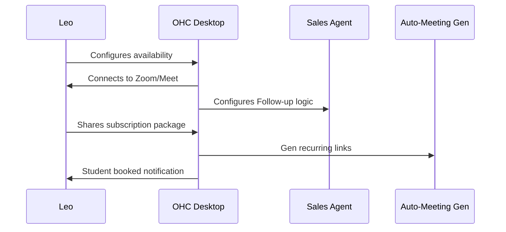
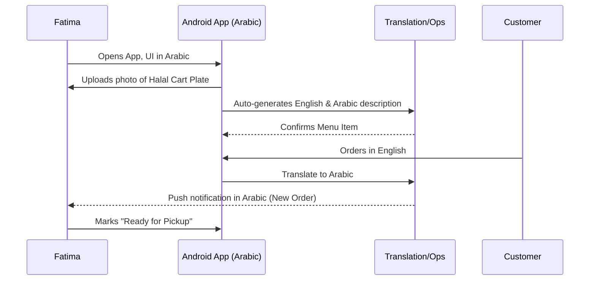

# 🔎 Scout: Tool Integration Research [quarter]

## Title
Business Journey Architecture Review & UX Blueprint

## Problem Statement
Small business owners (bakers, handymen, boutique owners, tutors) find traditional website builders and business management tools overwhelming. They need a zero-to-live solution in under 10 minutes that handles complex tasks (inventory, bookings, CRM) invisibly, relying heavily on AI agents to manage operations while they focus on their craft. The current fragmented approach causes drop-offs during onboarding and failure to reach full activation.

## Research Report
- **Competitive Landscape**:
  - Shopify: Powerful, but requires extensive setup and add-on apps. Too complex for simple service businesses (like Carlos).
  - Wix/Squarespace: Great for basic brochure sites, but lack deep, out-of-the-box operational features (like Maya's custom cake deposit workflow or Fatima's sold-out toggles).
  - Link-in-bio (Linktree): Too simple; cannot handle real transactions or inventory natively.
- **Pain Points Identified**:
  - Non-technical users struggle with API keys, DNS settings, and payment gateways.
  - Managing multiple inboxes (Instagram, SMS, Email) leads to missed leads.
  - "Blank canvas" syndrome when designing storefronts.
- **Opportunity**: A conversational, AI-driven setup process combined with a unified inbox and "Agent Departments" mapping to real-world roles.

## Design Doc

### Real User Personas Addressed
- **Maya (Baker, 28)**: Needs deposit-based custom orders and automated IG DM replies.
- **Carlos (Handyman, 42)**: Needs service listings, booking calendar, and AI quotes.
- **Priya (Boutique Owner, 35)**: Needs storefront + POS inventory sync and variant management.
- **Leo (Music Tutor, 22)**: Needs lesson booking, auto-meeting links, and follow-ups.
- **Fatima (Food Cart, 50)**: Needs photo menu, pre-orders, and multi-lingual UI (Arabic/English).

### Architecture Map (Mermaid)

### Mobile UX Flow (375px First)
- **Home Dashboard**: Unified inbox merging IG, Web, and SMS.
- **Visual Mandate**: Glassmorphism (`backdrop-filter: blur(20px) saturate(200%)`), Touch targets >= 44x44px.
- **Typography**: Outfit for headings, Inter for body text.
- **Motion**: Entrance <= 300 ms, exit <= 200 ms.

### Key Design Decisions
- **Unified Inbox Architecture**: Centralized event bus for all inbound messages to simplify user workflow.
- **Agent Roles**: Represented as "Departments" (The Manager, The Promoter) to abstract complex automation logic into relatable concepts.
- **Deferred KYC**: Delay banking setup until after the first sale to optimize for the 10-minute go-live metric.

## End-to-End User Journey Maps

### 1. Maya (Baker) Journey Sequence

### 2. Carlos (Handyman) Journey Sequence

### 3. Priya (Boutique) Journey Sequence

### 4. Leo (Music Tutor) Journey Sequence

### 5. Fatima (Food Cart) Journey Sequence

## Implementation Prompt
**To Implementer Agents:**
Implement the "Unified Inbox" core UI and data model.
- **Outcome**: A mobile-first dashboard where a business owner can view and reply to a message from Instagram and a message from their website contact form in the same thread view.
- **CUJ**: Carlos receives an SMS lead and an email inquiry. He opens the OHC app, sees both in the "Inbox" tab, and can reply to both using the same UI interface.
- **Acceptance Criteria**:
  - UI strictly follows the Visual Excellence Mandate (Glassmorphism, 44px touch targets).
  - Must render perfectly on a 375px viewport.
  - Includes a "Drafted by Agent" indicator if the Customer Success agent has prepared a response.
- **Note**: Do not build the actual IG/SMS API integrations yet; mock the inbound data streams. Focus on the UI and internal data models.

## Priority
P0 (Critical Path for Onboarding & Activation)

## Estimated Scope
Large
