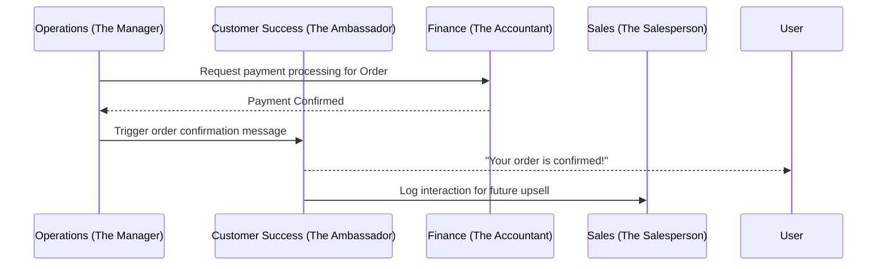

# AI Agent Department Architecture

## Title
AI Agent Department Architecture and Coordination

## Problem Statement
Small business owners like Maya and Carlos are overwhelmed by the day-to-day tasks of running their business. They need an invisible, reliable "staff" to handle operations, marketing, sales, customer success, finance, legal, and business advisory tasks without needing to learn how these work behind the scenes. They need these agents to coordinate seamlessly, just like a real business team.

## Research Report
Current solutions like Shopify and Wix require the user to configure automated workflows or use disjointed third-party apps to handle specific tasks (e.g., Klaviyo for marketing, Gorgias for customer support). Squarespace and GoDaddy offer some built-in automation but lack true AI agents that can adapt and coordinate.
- **Shopify**: App ecosystem is fragmented. Business owner acts as the integrator.
- **Wix**: Basic automations (e.g., "if X then Y") but no intelligent decision-making.
- **Squarespace**: Templates are nice, but back-office requires manual effort.
- **GoDaddy**: Focuses on quick setup, lacks depth in ongoing automated operations.

OHC needs a unified "Agent Department" model where agents mirror real human roles and coordinate invisibly.

## Design Doc
### Architecture Diagram

### UI Wireframes / Screen Flow (375px first)
1. **Agent Dashboard**: A simple list of "Departments" (Operations, Marketing, etc.) with a toggle to turn them on/off.
2. **Activity Feed**: A unified feed showing what agents are doing (e.g., "The Ambassador replied to an Instagram DM").
3. **Approval Queue**: Items requiring human review (e.g., "The Manager drafted a refund for Order #456. Approve?").

### Mobile UX Flow
- User opens the app and sees the Activity Feed.
- User taps on an item in the Approval Queue.
- User reviews the agent's proposed action and taps "Approve" or "Edit".

### AI Agent Integration Points
- **Triggers**: Schedule-based (e.g., weekly reports), event-based (e.g., new order), or demand-based (e.g., user asks for a quote).
- **Coordination**: Agents communicate via an internal event bus.
- **Memory**: Agents store context in a unified tenant memory store.
- **Approvals**: High-risk actions (e.g., refunds, large ad spend) require human approval.
- **Throttling**: AI usage is tied to the user's SaaS tier.

### Key Design Decisions
1. **Department Model**: Organize agents by real-world roles (Operations, Marketing, etc.) so users understand what they do.
2. **Unified Activity Feed**: Surface agent actions in a single feed to build trust and visibility.
3. **Approval Queues**: Give users control over high-risk actions.
4. **Event-Driven Coordination**: Agents use an event bus to communicate, decoupling them from each other.

## Implementation Prompt
**User-Facing Outcome**: The user can see a list of AI "Departments" in their app. They can view what each department is doing in a unified Activity Feed and approve high-risk actions in an Approval Queue.

**CUJ**: Maya (baker) opens the app, sees that "The Ambassador" replied to 3 Instagram DMs overnight, and approves a refund drafted by "The Manager".

**Acceptance Criteria**:
- The UI displays a list of AI Departments.
- The UI displays a unified Activity Feed of agent actions.
- The UI displays an Approval Queue for high-risk actions.
- The UI allows the user to approve or edit actions in the queue.
- The UI is mobile-first and responsive (375px).
- The design feels premium (Glassmorphism, Outfit + Inter typography).

## Priority
P0

## Estimated Scope
Large
