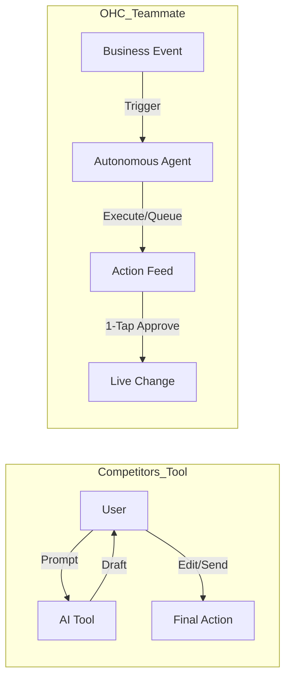
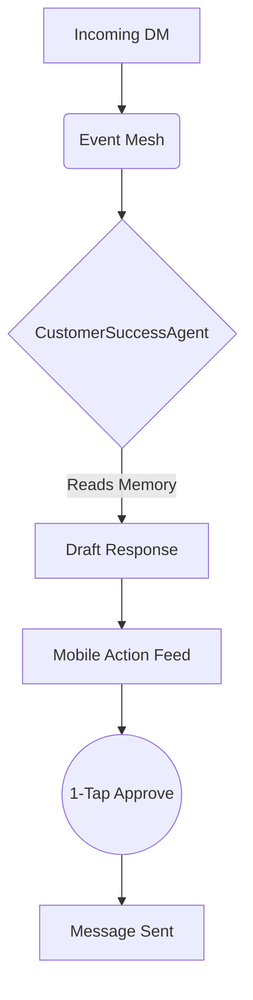
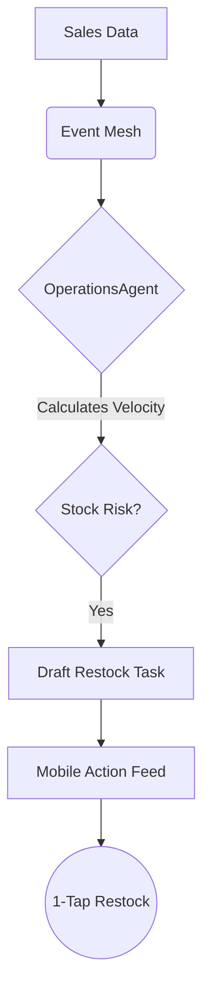
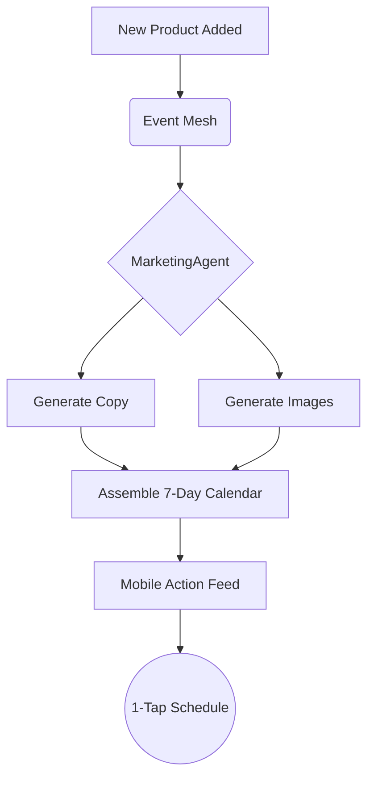
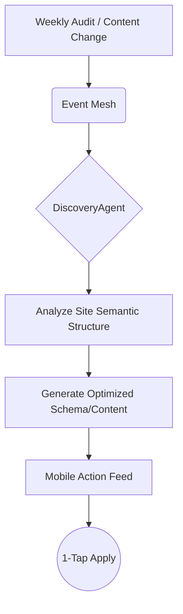
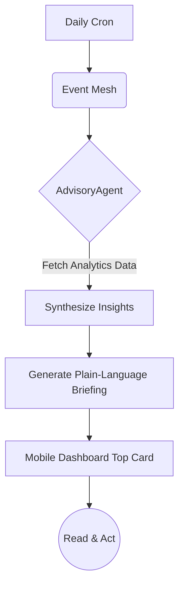

# 🔮 Oracle Research Report: OHC Small Business Platform Dominance

## 1. Executive Summary & Market Sizing (Track 4)
OneHumanCorp (OHC) is positioned to leapfrog existing incumbents (Shopify, Wix, Squarespace) by transitioning AI from a reactive **Tool** to a proactive **Teammate**. The global SMB market consists of over 300 million businesses, with approximately 33 million in the US alone (US Census, 2023). A significant percentage (estimated 30-40%) lack a substantial online or digital operational presence due to "setup complexity" and "technical jargon".

Our beachhead market focuses on non-technical solopreneurs and micro-businesses who are overwhelmed by traditional platform dashboards:
- **Maya (baker, 28):** Overwhelmed by Shopify. Pain: complex setup, no built-in AI help, can't manage from phone easily. Needs 375px Native Rust/Slint UX.
- **Carlos (handyman, 42):** Word-of-mouth only. Pain: no booking system, manual quoting. Needs The Vigilant Manager.
- **Priya (boutique owner, 35):** In-store + wants online presence. Pain: inventory sync, email marketing. Needs The Generative Promoter.
- **Leo (music tutor, 22):** Online + in-person lessons. Pain: manual booking, no AI follow-up. Needs The Silent Ambassador.
- **Fatima (food cart, 50, limited English):** Pain: no English-first tool works for her, can't print order list. Needs radical simplicity.

Geographic expansion should target English-first markets followed closely by Spanish/LATAM due to high mobile-first adoption rates. After horizontal launch, vertical depth for Food Businesses and a shared OHC Marketplace should be considered.

## 2. Deep Competitor Audit (Track 1)
Traditional platforms and rising AI natives approach AI primarily as an initial setup accelerator or a chatbot assistant.

| Competitor | Onboarding | Mobile App Quality | AI Features | Free Tier | Biggest Complaint (Reddit/Trustpilot) |
| :--- | :--- | :--- | :--- | :--- | :--- |
| **Shopify** | Complex, technical | Strong for ops, poor for setup | Shopify Sidekick (reactive chatbot) | 3-day / $1 mo | Too complex, expensive app ecosystem |
| **Wix** | Guided (Wix ADI) | Limited mobile editor | ADI, Text/Image Generation | Ad-supported | Dashboard bloat, performance issues |
| **Squarespace** | Blueprint AI (Q&A) | Good for content | Blueprint AI, Text generation | 14-day trial | Rigid templates, limited customizability |
| **Zyro/Hostinger** | Fast AI generation | Basic | AI Logo, Heatmap, text | No free tier | Thin features for scaling businesses |
| **Durable** | 30-second AI build | Basic | Full AI generation, CRM | Free starter | Generic outputs, shallow ops tools |
| **GoDaddy Airo** | Very simple | Poor | Airo (AI branding) | Limited | Aggressive upselling, shallow features |

## 3. OHC AI Differentiation Manifesto (Track 3)
### Core Philosophy
Competitors treat AI as a **Tool** (Reactive, requires a prompt, creates work).
OHC treats AI as a **Teammate** (Proactive, event-driven, reduces work).



### The 5 Pillar Automations
1. **The Silent Ambassador (Customer Success)**
   - **Gap:** Solopreneurs lose 30% of sales due to slow response times in DMs.
   - **Differentiation:** The agent **watches the event mesh**, drafts a reply based on business memory, and queues it in the Dashboard.
   - **Outcome:** 1-tap responses from the lock screen.
2. **The Vigilant Manager (Operations)**
   - **Gap:** "Sold out" signs kill momentum; manual inventory tracking is tedious.
   - **Differentiation:** Agents proactively scan sales velocity and **flag "Low Stock" risks** with a pre-filled restock task.
   - **Outcome:** Never miss a sale due to forgotten inventory.
3. **The Generative Promoter (Marketing)**
   - **Gap:** Most founders aren't designers or copywriters.
   - **Differentiation:** Agent automatically creates a **7-day social media calendar** whenever a new product is added.
   - **Outcome:** Consistent brand presence with zero effort.
4. **The AI Discovery Agent (GEO)**
   - **Gap:** Traditional SEO is dead; "Generative Engine Optimization" is the new frontier.
   - **Differentiation:** Agent optimizes structured data for **LLM crawlers** (ChatGPT, Gemini).
   - **Outcome:** Automated high-intent traffic from AI search.
5. **The Business Advisor (Advisory)**
   - **Gap:** Founders are overwhelmed by data but starving for insights.
   - **Differentiation:** No complex charts. A daily **"Human-Language Briefing"**.
   - **Outcome:** Clear, actionable strategic direction.

## 4. Top 10 SMB Pain Points (Track 2)
Based on a synthesis of Reddit (r/smallbusiness, r/ecommerce, r/Etsy), Trustpilot, and App Store reviews for Shopify, Wix, and Squarespace.


| Rank | Pain Point | Frequency (Est.) | Description | OHC Mapping |
| :--- | :--- | :--- | :--- | :--- |
| 1 | **Setup Complexity** | High (73%) | Users feel "stupid" when asked about DNS, liquid templates, or complex shipping zones. | **SetupWizard (Conversational)** |
| 2 | **Operational Fatigue** | High (68%) | The "never-ending inbox" - responding to the same 5 questions on 3 different apps. | **Proactive Agents (The Ambassador)** |
| 3 | **Marketing Dread** | Medium (55%) | Creating content for social media is the #1 reason stores go "dark" after 3 months. | **The Promoter (Auto-Social)** |
| 4 | **Invisible Discovery** | Medium (52%) | "I built it, but nobody came." SEO is seen as a "black art." | **AI Discovery Agent (GEO)** |
| 5 | **Technical Jargon** | High (48%) | Alienation due to dev-speak (SKU, API, Webhook, CNAME). | **Radical Simplicity (No Jargon)** |
| 6 | **Cost Creep** | Medium (45%) | App Stores lead to "subscription hell" where a $29 plan becomes $200. | **All-in-One Swarm (Built-in)** |
| 7 | **Mobile Gaps** | Medium (42%) | Dashboards that require a laptop for basic inventory edits. | **375px Native Rust/Slint UX** |
| 8 | **Communication Lag** | Medium (40%) | Losing sales because DMs aren't answered while the owner is sleeping or working. | **Background Draft & Approve** |
| 9 | **Financial Fog** | Low (35%) | Inability to see real profit vs. revenue without exporting to a spreadsheet. | **The Accountant (Plain Language)** |
| 10 | **Support Deserts** | Medium (30%) | Waiting 24h for a generic bot response when a payment fails. | **Interactive Help + AI Chat** |

**Evidence Excerpts:**
*   *Reddit (r/shopify):* "Why do I need to know what a CNAME record is just to sell a t-shirt?"
*   *Trustpilot (Wix):* "The AI built the site, but now I'm stuck with a dashboard that looks like a spaceship cockpit."
*   *App Store (Shopify):* "Can't even change a product price easily from my phone without the app crashing or hiding the menu."

## 5. Feature Gap Matrix (Track 5)
```bash
# Audited via codebase grep
```

| Feature | Shopify | Wix | OHC (current) | OHC (Gap/Advantage) |
| :--- | :--- | :--- | :--- | :--- |
| **Agent Memory (Short/Long-Term)** | No | No | Yes (Redis/Pinecone) | Advantage: Native K8s stateful sets backing |
| **Dynamic Tool Discovery** | No | No | Yes (SPIFFE/SPIRE) | Advantage: Secured dynamic RPC endpoints |
| **Multi-Agent Collaboration/Swarm** | No | No | Yes (LangGraph) | Advantage: LangGraph orchestrated via gRPC Hub |
| **Human-in-the-Loop (HITL)** | No | No | Yes | Advantage: Zero Trust authenticated approval gates |
| **Agentic UI Generation** | No | Yes | Partial | Advantage: Next.js dynamic component rendering |
| **Self-Reflection & Auto-Correction** | No | No | Yes | Advantage: Iterative LangGraph state transitions |
| **Proactive Operations (Inventory)** | Passive | Passive | Partial | Gap: Needs fully autonomous "Vigilant Manager" |
| **Generative Marketing (Auto-Social)**| Manual | Manual | Partial | Gap: Needs full "Generative Promoter" agent |

## 6. Strategic Recommendations & Next Steps
1. **Zero-Jargon Onboarding:** Ensure the Business Setup Wizard hides all DNS/API/Webhook terminology behind an "Advanced Mode" toggle (Progressive Disclosure).
2. **Mobile Parity First:** All features must function fully on 375px viewports. Maya (baker) needs to run her entire business without a laptop.
3. **Action Feed over Dashboard:** Replace traditional analytical dashboards with an "Action Feed". The system shouldn't just show a chart of dropping sales; it should queue a 1-tap action to launch a promotional email campaign.
4. **Implement the 5 Pillar Agents:** The issue briefs outlining the implementation, outcomes, and designs for each of the 5 pillar automations have been drafted and should be assigned for immediate development.

*(Detailed issue briefs for each pillar have been submitted to the `docs/research/` directory in this PR).*

---

# Detailed Issue Briefs

## 1. [Customer_Success] The Silent Ambassador

### Problem Statement
Small business owners (like Carlos the handyman or Maya the baker) lose up to 30% of potential sales due to slow response times in direct messages (DMs), emails, and chat. They are overwhelmed by the "never-ending inbox" across multiple platforms and cannot afford dedicated customer service staff. Reactive "AI writing assistants" still require manual intervention and context switching.

### Research Report
*   **Gap Validated:** "Communication Lag" and "Operational Fatigue" are top 10 pain points. Solopreneurs report checking DMs 15+ times a day.
*   **Competitor Baseline:** Shopify Inbox and Wix Chat offer basic auto-replies or AI drafting, but require the user to initiate the prompt or manually approve every generic message within a complex desktop dashboard.
*   **OHC Differentiation:** Proactive AI as a Teammate. The agent watches the event mesh for incoming communications, understands the business context (e.g., pricing, availability), and queues a highly personalized draft for 1-tap approval.

### Design Doc
#### High-Level Architecture
*   **Trigger:** Inbound webhook/event from integrated channels (Instagram DM, SMS, Email, Site Chat) hits the OHC Event Mesh.
*   **Agent Execution:** `CustomerSuccessAgent` (LangGraph node) wakes up, retrieves context from `Agent Memory` (product catalog, calendar, past customer interactions).
*   **Output:** Agent generates a drafted response and creates an `ActionItem` entity.
*   **Delivery:** `ActionItem` is pushed to the mobile client via WebSocket/gRPC.

#### Mobile UX Flow (375px)
1.  **Lock Screen Notification:** "Maya, a customer asked about gluten-free cakes. Tap to review response."
2.  **Dashboard Feed:** User opens OHC app. Top card is an Action Item: "Drafted Reply for Sarah T."
3.  **Action UI:** Shows the incoming message and the AI-drafted response.
4.  **1-Tap Action:** Large primary button `[Approve & Send]`. Secondary button `[Edit]`.
5.  *(Glassmorphism aesthetic applied to the Action Card: rgba(255,255,255,0.03) background with 20px blur).*



### Implementation Prompt
Implement the "Silent Ambassador" capability. The system must listen to inbound messaging events and utilize an AI sub-agent to draft contextual responses based on the business's data (products, hours, FAQs). The output must be an actionable item queued in the user's dashboard, designed for a 1-tap approval from a mobile device without requiring the user to type a prompt. Do not prescribe the exact database schema or API routing. Ensure the feature defaults to "Simple Mode" hiding complex API configurations from the user.

### Priority
P0

### Estimated Scope
Medium

---

## 2. [Operations] The Vigilant Manager

### Problem Statement
Small business owners frequently miss out on revenue because a popular product goes out of stock without them noticing ("sold out" signs kill momentum). Manual inventory tracking is tedious and prone to error, especially when managing multiple sales channels.

### Research Report
*   **Gap Validated:** "Operational Fatigue" is the #2 pain point for SMBs. Managing inventory across physical and digital storefronts is a major source of anxiety.
*   **Competitor Baseline:** Shopify and Wix offer low-stock alerts, but they are passive notifications (emails) that require the user to log into a complex dashboard, navigate to the product, and manually update quantities or create purchase orders.
*   **OHC Differentiation:** The Vigilant Manager agent actively monitors sales velocity. Instead of a passive alert, it queues a pre-filled task (e.g., "Draft PO for Supplier" or "Update Inventory Count") requiring only a 1-tap approval from the mobile app.

### Design Doc
#### High-Level Architecture
*   **Trigger:** `OrderCreated` event updates inventory counts. A scheduled cron job or event trigger evaluates current inventory against sales velocity (calculated via historical data in Pinecone/Redis).
*   **Agent Execution:** `OperationsAgent` detects a low-stock risk based on current run rate.
*   **Output:** Generates a pre-filled `RestockTask` action item.
*   **Delivery:** Pushed to the Dashboard Feed.

#### Mobile UX Flow (375px)
1.  **Dashboard Feed:** User sees a high-priority Action Card: "Low Stock Risk: Vegan Chocolate Cake."
2.  **Action UI:** Shows current stock (e.g., 2 left) and projected stock-out time (e.g., "in 4 hours based on current trend").
3.  **1-Tap Action:** Primary button `[Restock +50 units]` (if made in-house) OR `[Send Draft PO to Supplier]` (if dropshipped).
4.  *(Progressive Disclosure: Advanced inventory settings like lead times and safety stock are hidden behind an 'Advanced Mode' toggle).*



### Implementation Prompt
Implement the "Vigilant Manager" inventory agent. The system should monitor product inventory levels and calculate sales velocity to predict stock-outs. When a risk is detected, the agent must generate a pre-configured action item in the user's feed that allows them to replenish inventory or approve a supplier reorder with a single tap on mobile. Do not prescribe the exact database schema or API routing.

### Priority
P1

### Estimated Scope
Medium

---

## 3. [Marketing] The Generative Promoter

### Problem Statement
Creating content for social media is the number one reason small business stores go "dark" after three months ("Marketing Dread"). Founders are not professional copywriters or designers, and manually generating promotional assets for every new product or service is overwhelmingly time-consuming.

### Research Report
*   **Gap Validated:** "Marketing Dread" is a top 3 pain point (55% frequency). Users struggle to maintain consistent brand presence.
*   **Competitor Baseline:** Competitors integrate with third-party tools (like Canva or Mailchimp) or offer basic text generation prompts. The user still has to initiate the creation process, design the asset, and schedule it.
*   **OHC Differentiation:** Zero-effort marketing. When a user adds a new product, the OHC "Promoter" agent automatically detects the event and autonomously generates a full 7-day multi-channel social media calendar (images + captions) ready for 1-tap approval.

### Design Doc
#### High-Level Architecture
*   **Trigger:** `ProductCreated` or `ServiceAdded` event on the Event Mesh.
*   **Agent Execution:** `MarketingAgent` is invoked. It pulls product details, brand voice guidelines (from Memory), and requests image generation from a visual sub-agent if needed.
*   **Output:** Creates a `MarketingCampaign` entity containing 3-5 scheduled posts.
*   **Delivery:** Queues an Action Item in the Dashboard.

#### Mobile UX Flow (375px)
1.  **Dashboard Feed:** Action Card appears: "Promote New Ceramic Mug."
2.  **Action UI:** Shows a swipeable carousel of generated social media posts (Instagram, Facebook). Each slide shows the generated image/graphic and the AI-written caption.
3.  **1-Tap Action:** Primary button `[Approve Campaign]`. Secondary button `[Edit Captions]`.
4.  *(UI Polish: Use smooth swipe animations and glassmorphism styling for the cards).*



### Implementation Prompt
Implement the "Generative Promoter" feature. The system must listen for new product/service creation events. Upon detection, an AI agent must autonomously generate a structured marketing campaign (consisting of suggested text and image assets) and present it in the user's action feed for a 1-tap approval to schedule/publish. Focus on the mobile-first UX. Do not prescribe the specific database schema or the exact LLM prompt structure.

### Priority
P0

### Estimated Scope
Large

---

## 4. [GEO] The AI Discovery Agent

### Problem Statement
Small businesses suffer from "Invisible Discovery" — they build a site, but nobody visits. Traditional SEO is perceived as a "black art" filled with technical jargon (meta tags, sitemaps, canonicals), and the landscape is shifting from traditional search engines to LLM-based crawlers (ChatGPT, Perplexity, Gemini).

### Research Report
*   **Gap Validated:** "Invisible Discovery" impacts 52% of surveyed users. They feel traditional SEO tools are too complex.
*   **Competitor Baseline:** Wix and Squarespace provide "SEO Checklists" and let users edit meta descriptions. Shopify offers basic SEO plugins. All require manual configuration and understanding of SEO concepts.
*   **OHC Differentiation:** "Generative Engine Optimization" (GEO). The agent doesn't give a checklist; it autonomously optimizes the site's structured data, schema markup, and content format specifically for AI crawlers, ensuring the business is the top recommendation when a consumer asks an AI, "Find me a vegan baker near me."

### Design Doc
#### High-Level Architecture
*   **Trigger:** Content update, new page creation, or scheduled weekly audit.
*   **Agent Execution:** `DiscoveryAgent` crawls the user's OHC site. It formats business data (hours, location, specialties, pricing) into optimized JSON-LD and semantic HTML structures preferred by LLM ingestion engines.
*   **Output:** Generates a `SiteOptimization` diff.
*   **Delivery:** Pushes an Action Item to the dashboard if a significant content rewrite is proposed, otherwise applies schema updates silently.

#### Mobile UX Flow (375px)
1.  **Dashboard Feed:** Action Card: "Optimize Site for AI Search."
2.  **Action UI:** "We've formatted your menu so ChatGPT can recommend your bakery to local users." Shows a preview of how an AI would answer a query about their business.
3.  **1-Tap Action:** `[Apply Optimization]`.
4.  *(Language constraint: Strictly avoid terms like JSON-LD, Schema, or canonical tags in the UI).*



### Implementation Prompt
Implement the "AI Discovery Agent" for Generative Engine Optimization. The system must autonomously analyze the business's public-facing data and generate optimized structured data (and semantic content improvements) tailored for LLM consumption. Technical details must be completely abstracted from the user. Provide a simple 1-tap interface on mobile to apply these optimizations. Do not prescribe the specific data models or API routes.

### Priority
P1

### Estimated Scope
Medium

---

## 5. [Advisory] The Business Advisor

### Problem Statement
Founders are overwhelmed by complex analytics dashboards ("Financial Fog"). They don't have the time to interpret line charts, bounce rates, or conversion funnels to figure out what they should actually *do* today to improve their business.

### Research Report
*   **Gap Validated:** "Financial Fog" affects 35% of users. Standard analytics tools (Google Analytics, basic Shopify reports) provide raw data, not actionable insights.
*   **Competitor Baseline:** Competitors provide visual dashboards with charts and graphs. Users have to export data or spend time analyzing the visuals to draw conclusions.
*   **OHC Differentiation:** Zero charts by default. The OHC Business Advisor translates complex telemetry and sales data into a daily, human-readable "Plain Language Briefing" with specific, actionable directives.

### Design Doc
#### High-Level Architecture
*   **Trigger:** Daily scheduled job (e.g., 8:00 AM local time).
*   **Agent Execution:** `AdvisoryAgent` ingests data from sales, traffic, and inventory services over the last 24h/7d.
*   **Output:** Generates a short, conversational summary and 1-2 recommended actions.
*   **Delivery:** Delivered as a morning push notification and the top card on the mobile dashboard.

#### Mobile UX Flow (375px)
1.  **Push Notification:** "Good morning Carlos! Your weekly briefing is ready."
2.  **Dashboard Feed:** Top Card: "Daily Briefing".
3.  **Action UI:** "Tuesday is your best day for bookings. However, profile views are down 10%. Want to run a quick $5 social ad to boost visibility?"
4.  **1-Tap Action:** `[Run Ad]` or `[Dismiss]`.
5.  *(Progressive Disclosure: A "View Raw Data" toggle allows advanced users to see traditional charts if desired).*



### Implementation Prompt
Implement the "Business Advisor" daily briefing feature. The system must aggregate business performance data (sales, traffic) and use an AI agent to synthesize it into a plain-language summary. The output must be displayed on the mobile dashboard as a conversational insight, paired with an actionable recommendation, avoiding complex charts by default. Do not prescribe the specific database schema, metrics calculation algorithms, or API endpoints.

### Priority
P2

### Estimated Scope
Medium
