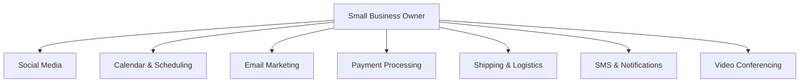

# OHC Tool Integration Research Report Q3

## Executive Summary
This report evaluates 7 key categories of tools for integration into OHC to solve real problems for non-technical small business owners, operating in both Cloud and Standalone environments.

## Competitive Analysis & Overview

| Category | Recommended Tool | Priority | Scope | Cloud | Standalone |
|---|---|---|---|---|---|
| Social Media | Meta Business Suite / Chatwoot | P1 | Medium | Yes | Yes |
| Calendar | Google Calendar / Cal.com | P0 | Small | Yes | Yes |
| Email Marketing | Mailchimp / Resend | P2 | Medium | Yes | Yes |
| Payments | Mercado Pago | P0 | Large | Yes | Yes |
| Shipping | Shippo | P1 | Medium | Yes | Yes |
| SMS | Twilio | P0 | Small | Yes | Yes |
| Video | Zoom | P2 | Small | Yes | Yes |

## Issue Briefs
*The full issue briefs have been saved to the docs/research/ directory:*
- `docs/research/[social_media]_unify_customer_messages.md`
- `docs/research/[calendar]_automatic_booking_page.md`
- `docs/research/[email]_simple_newsletter.md`
- `docs/research/[payments]_accept_local_payments.md`
- `docs/research/[shipping]_generate_shipping_labels.md`
- `docs/research/[sms]_reliable_text_reminders.md`
- `docs/research/[video]_auto_generate_meeting_links.md`
