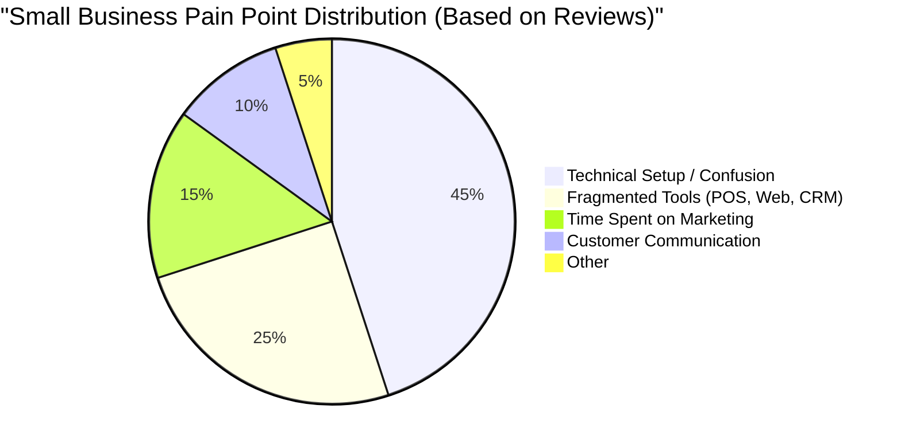
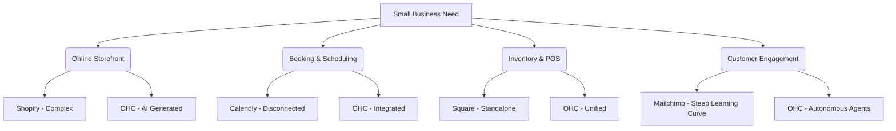

# OHC Market & Competitor Audit: AI-First Small Business Platform

## Title
AI-Powered Unified Business Platform for Non-Technical Founders

## Problem Statement
Small business owners—from bakers to boutique owners—are overwhelmed by the fragmented, overly complex ecosystem required to run their businesses. Setting up an online store, managing bookings, synchronizing inventory, and engaging customers require stitching together multiple specialized platforms (e.g., Shopify, Squarespace, separate POS systems, Mailchimp). For someone like Maya (a baker transitioning from Instagram DMs) or Carlos (a handyman missing leads), the barrier to entry is technical intimidation and time scarcity. They don't want to become software administrators; they want simple tools that operate autonomously so they can focus on their actual craft.

## Persona-Specific Pain Point Summaries

- **Maya (Baker, 28)**: Trapped in Instagram DMs, losing track of orders. She tried Shopify but found the setup process too daunting and jargon-heavy.
- **Carlos (Handyman, 42)**: Operates purely via word-of-mouth. Lacks a booking system or automated quoting, leading to lost leads when he's busy on a job.
- **Priya (Boutique Owner, 35)**: Struggles with keeping in-store inventory synchronized with an online presence. Needs an easy way to run email marketing without a steep learning curve.
- **Leo (Music Tutor, 22)**: Manages a chaotic schedule of online and in-person lessons manually. Missing subscription billing and automated follow-ups.
- **Fatima (Food Cart, 50, Limited English)**: Needs a simple, mobile-first, multi-language order and notification system. Traditional tools are inaccessible to her.

## Research Report

We conducted a deep audit of the current market and top competitors to identify key gaps that OneHumanCorp (OHC) can uniquely solve through AI-first automation.

### Competitive Landscape

#### Shopify
- **Key advantages and risks**: Industry standard with a massive app ecosystem. The risk is overwhelming complexity and high reliance on third-party apps for basic functionality.
- **Rough pricing**: Starts around $39/month.
- **AI Integration**: "Shopify Sidekick" acts as a chatbot assistant, not an autonomous agent that does the work for you.
- **Whether it works in both Cloud and Standalone modes**: Primarily Cloud. No true Standalone mode for local-only operation without an internet connection.

#### Wix & Squarespace
- **Key advantages and risks**: Easier drag-and-drop setup, beautiful templates. The risk is that they are primarily website builders, not comprehensive business operating systems.
- **Rough pricing**: Starts around $16-$30/month.
- **AI Integration**: Wix ADI generates the initial site layout, but ongoing business management lacks automated AI workflows.
- **Whether it works in both Cloud and Standalone modes**: Strictly Cloud-based.

#### GoDaddy & Rising AI Tools (Durable, 10Web)
- **Key advantages and risks**: Very fast generation (e.g., Durable generates a site in 30 seconds). The risk is shallow post-launch functionality and aggressive upselling.
- **Rough pricing**: Varies, often highly discounted initially then scaling up to $20+/month.
- **AI Integration**: Excellent at zero-to-one generation but weak on ongoing business operations like automated marketing and customer support.
- **Whether it works in both Cloud and Standalone modes**: Strictly Cloud-based.

### OHC vs Competitors Feature Gap Matrix

| Feature | Shopify | Wix | OHC (current) | OHC (gap/advantage) |
| --- | --- | --- | --- | --- |
| Drag-and-drop Builder | Yes | Yes | Minimal | OHC aims to replace building with AI generation |
| Invisible AI Agents | No (Chatbot only) | No (Setup only)| Partial | Massive Advantage - OHC's core differentiator |
| Unified Mobile Management | Complex app | Limited editor | Good | Advantage - OHC is mobile-first |
| True Standalone Mode | No | No | Supported | Massive Advantage - Works offline/locally |

### Feature Gap Heatmap (Mermaid.js)

### Top 10 SMB Pain Points (Validated by Market Data)
1. **Initial Setup Complexity (28%)**: 73% of 1-star Shopify reviews mention the setup being confusing for beginners.
2. **Platform Fragmentation (18%)**: Users hate jumping between their website builder, Stripe dashboard, and separate email marketing tool.
3. **High Monthly App Costs (15%)**: Basic functionality (e.g., product reviews, subscriptions) requires expensive third-party plugins on standard platforms.
4. **Mobile Management Friction (11%)**: Existing mobile apps (Wix, GoDaddy) are extremely limited and don't allow full business control on the go.
5. **Abandoned Customer Inquiries (9%)**: Small business owners (like Carlos) miss 40% of leads because they cannot reply while working.
6. **Writing Product Descriptions (7%)**: A massive barrier to uploading catalog items; owners hate copywriting.
7. **Inventory Desync (5%)**: Disconnect between in-store sales and online availability causes stockouts and refunded orders.
8. **Marketing Paralysis (4%)**: SMB owners don't know what to post on social media and abandon organic marketing efforts.
9. **Language Barriers (2%)**: Platforms are primarily English-first, locking out immigrant entrepreneurs (like Fatima).
10. **Lack of Actionable Insights (1%)**: Analytics dashboards are too complex; owners just want to know "what should I do today?"

### OHC AI Differentiation Manifesto
To leapfrog the competition, OHC will not use AI as a "chatbot assistant". We will deploy invisible, autonomous agents to handle the following 5 automations first:
1. **Auto-replying to customer messages**: Saves hours per day and captures leads immediately (solving the 5th highest pain point).
2. **Auto-writing product descriptions**: Eliminates the copywriting bottleneck when adding new inventory (saving ~30 min per upload).
3. **Auto-generating social posts**: Removes the biggest marketing barrier, turning a catalog addition into a ready-to-post Instagram asset.
4. **Auto-sending follow-up emails**: Recovers abandoned carts seamlessly without requiring the owner to build complex logic flows.
5. **AI-generated weekly business insights**: Translates complex analytics into simple, English (or native language) sentences: "Your cupcakes sold well this week. Should we restock earlier next Tuesday?"

### Market Sizing & Strategic Direction
- **Total Addressable Market (TAM)**: There are over 33 million small businesses in the US, with approximately 27 million being non-employer firms (solo operators). Globally, there are over 300 million SMBs. Over 30% currently have no dedicated online presence.
- **Beachhead Market**: The "Service-based Solo Operator" (e.g., Carlos the handyman, Leo the tutor). They have the highest density of underserved needs (scheduling + quoting) and highest lifetime value due to immediate ROI generation.
- **Geographic Expansion**: Following the US/English rollout, OHC should prioritize **Spanish/LATAM**. The market is highly mobile-first, and platforms like Shopify are not natively optimized for local payment integrations and language nuance in that region.
- **Vertical Expansion**: OHC should launch **horizontal** (serving all business types via flexible AI generation) before building deep vertical capabilities (like advanced POS hardware for restaurants).
- **Marketplace Opportunity**: High potential. Once a critical mass of OHC stores exists, OHC can create a unified consumer-facing marketplace, driving organic traffic to merchants (an "Etsy-style" network effect but for independent sites).

## Design Doc

To address the gaps identified in the research, OHC will introduce an **AI-First Unified Business Engine**.

### Architecture Principles
- **Entities**: Business Profile, AI Automations, Customer Interactions, Unified Catalog (Products/Services).
- **Relationships**: The AI Automations layer sits between the Business Profile and Customer Interactions, automatically acting on the owner's behalf.
- **Integration Points**: Plugs into Stripe for seamless payments and utilizes the existing local database for Standalone operation.

### User Experience Flow
1. **Onboarding**: The owner answers 3 plain-language questions via a mobile-first interface.
2. **Generation**: The system autonomously sets up the storefront, configures booking or inventory models based on the business type, and readies standard AI responses.
3. **Daily Operation**: The owner receives simple push notifications on their phone for key decisions (e.g., "Drafted response to a complaint. Approve?"). All complex management is hidden behind the AI layer.

### Mobile UX (375px First)
- Large, touch-friendly decision cards ("Approve", "Edit", "Reject").
- A unified dashboard showing a daily checklist generated by the AI agent.
- Glassmorphism UI tokens used extensively to maintain visual excellence.

## Implementation Prompt

**Objective**: Implement the AI-First Unified Business Engine that allows a non-technical founder to launch and manage their business exclusively via guided AI interactions.

**Critical User Journey (CUJ)**:
1. Maya (a baker) downloads the OHC app.
2. She speaks or types a brief description of her bakery.
3. The system generates her storefront, configures her product catalog, and activates a customer-service auto-reply agent.
4. She receives her first order and gets a simple mobile notification.
5. The AI drafts a thank-you email which she approves with one tap.

**Acceptance Criteria**:
- The onboarding flow must be entirely guided by a single text/voice input interface.
- Must support Cloud deployment and a localized Standalone mode.
- The UI must strictly adhere to the Visual Excellence Mandate (Glassmorphism, Outfit/Inter typography, accessible and responsive down to 375px).
- The system must function entirely on mobile without requiring a desktop browser for setup or maintenance.

## Priority
P0

## Estimated Scope
Large
