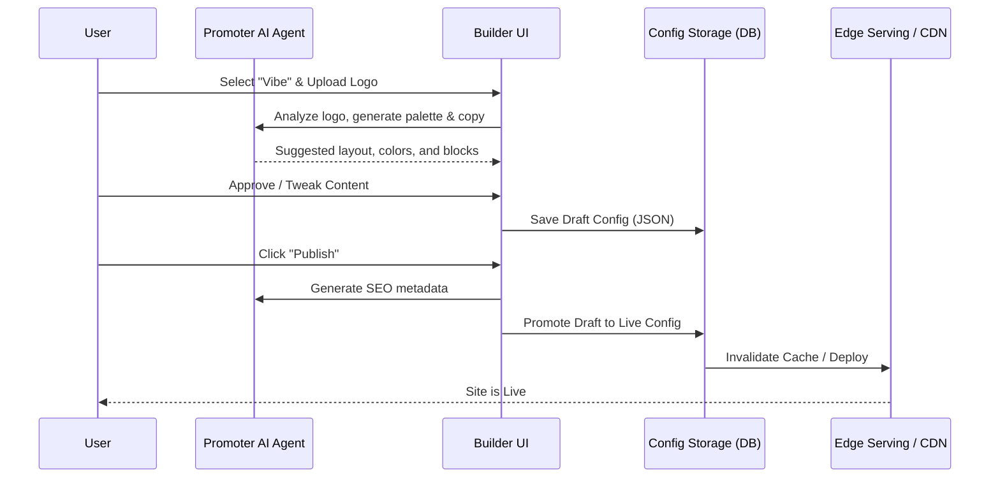

# OHC Website & Storefront Builder Architecture

## Problem Statement
Small business owners (like Maya the Baker or Carlos the Handyman) find existing website builders like Shopify or Wix overwhelming. They lack the time and technical expertise to configure templates, connect domains, or optimize for SEO. They need a system that builds a premium, mobile-first website for them instantly, with AI agents handling the complex configurations invisibly.

## Research Report
- **Goal:** Design a "Smart Block" drag-and-drop website builder that prioritizes a premium mobile experience and requires zero technical knowledge.
- **Competitive Analysis:**
  - **Shopify:** Powerful but requires significant configuration and often paid themes to look good. Complex for simple service businesses.
  - **Wix:** Too much freedom. Non-technical users often create "ugly" or non-responsive sites by dragging elements arbitrarily.
  - **Squarespace:** Good aesthetics, but the template structure can be rigid and confusing to customize without breaking the layout.
- **OHC Differentiation:** OHC removes the ability to make "ugly" sites by enforcing the Glassmorphism Premium Token library. Users don't drag pixels; they add functional "Smart Blocks" (e.g., Hero, Booking Calendar, Product Grid) that auto-arrange perfectly on any screen size. The AI "Promoter" agent handles all SEO and metadata invisibly.

## Design Doc

### 1. Overview
This design document defines the drag-and-drop website builder architecture for the OHC platform. OHC's builder prioritizes the "grandmother test", ensuring any non-technical user can build a beautiful, premium, mobile-first website in under 10 minutes, completely assisted by the Marketing & Advertising AI Agent ("The Promoter").

### 2. Goals & Non-Goals
#### 2.1 Goals
- Define the content block system (e.g., hero, product grid, calendar, text, etc.).
- Design the template customization experience, ensuring the "Premium Glassmorphism" aesthetic is maintained.
- Define the publishing flow (draft -> live) and SEO optimization integration.
- Outline the custom domain provisioning experience from a user's perspective.
- Detail the mobile UX flow.

#### 2.2 Non-Goals
- Prescribe specific JSONB representation schemas for the builder content.
- Detail CDN caching strategies or SSL certificate provisioning implementations (e.g., Let's Encrypt).
- Prescribe explicit backend routing rules for the published sites.

### 3. Detailed Design

#### 3.1 Content Block System
The builder relies on a constrained, highly-opinionated set of "Smart Blocks." Users do not push pixels; they add functional blocks that auto-arrange.
- **Hero Block**: Headline, subtitle, and primary CTA (e.g., "Book Now"). Auto-pulls the business's best photo.
- **Product/Service Grid**: Automatically syncs with the user's inventory. Users toggle which items to feature.
- **Booking Calendar**: Direct integration with the "Operations" department. Shows available slots without user configuration.
- **Testimonials Block**: Auto-populated from 5-star reviews captured by the "Customer Success" agent.
- **Contact/Lead Form**: Direct integration with the "Sales" agent inbox.
- **Text & Media**: Standard informational sections, styled automatically to the chosen template.

#### 3.2 Template & Aesthetic Customization
Users cannot make "ugly" websites. The system enforces the Premium Token library:
- **Themes**: Users pick a "Vibe" (e.g., Minimalist, Bold, Glassmorphism).
- **Colors**: The AI extracts a complementary color palette from the user's uploaded logo or photos. The user can tweak primary/secondary colors within accessible contrast boundaries.
- **Typography**: Locked to premium pairings (e.g., Outfit + Inter).
- **Constraints**: No custom CSS, no drag-and-drop pixel positioning. Blocks stack intelligently based on screen size (375px baseline).

#### 3.3 Publishing & AI SEO
The process of going live is a single button press.
- **Draft to Live**: "Publish" immediately pushes the site to the edge. There is no concept of complex staging environments for the user.
- **AI SEO Automation**:
  - The "Promoter" agent automatically writes meta titles and descriptions based on the business profile.
  - Automatically generates an XML sitemap.
  - Compresses and tags all images with alt-text via Vision AI.
  - Registers the site with Google Search Console via API (if connected).

#### 3.4 Custom Domain Provisioning
A seamless experience for non-technical users:
- **Search & Buy**: User types a desired name ("mayascakes.com") directly in the app.
- **1-Click Connect**: If bought through OHC, connection is instant. SSL is provisioned invisibly.
- **External Connect**: If the user owns a domain elsewhere, the AI provides plain-language instructions or offers to configure DNS records automatically if the user connects their registrar account (e.g., GoDaddy integration).

#### 3.5 Mobile UX Flow
Everything is designed for the 375px mobile screen.
- The builder is a vertical stack of "cards" representing the website sections.
- Tapping a card opens a modal to edit its content (e.g., text, photo toggle).
- "Preview Mode" toggles between the mobile view (default) and a scaled-down desktop preview.

#### 3.6 Architecture Diagram

## Implementation Prompt
"Implement the foundational 'Smart Block' system for the website builder. Create the Flutter UI components for Hero, Product Grid, and Calendar blocks, strictly adhering to the Glassmorphism premium design tokens. The blocks must be fully responsive, starting at 375px, and must not allow arbitrary pixel-level dragging. Ensure all components use Outfit/Inter typography and required backdrop-filter blur."

## Priority
P0

## Estimated Scope
Large
