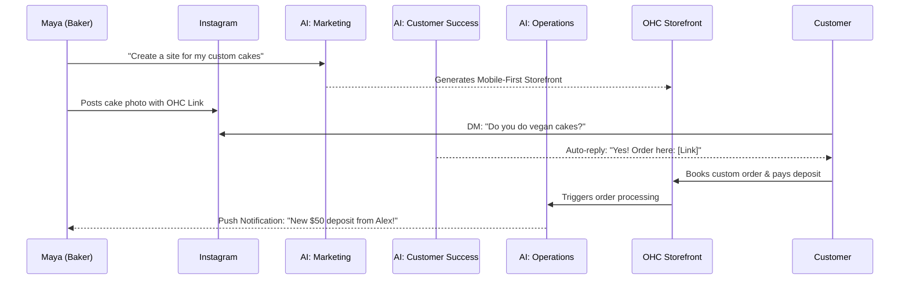
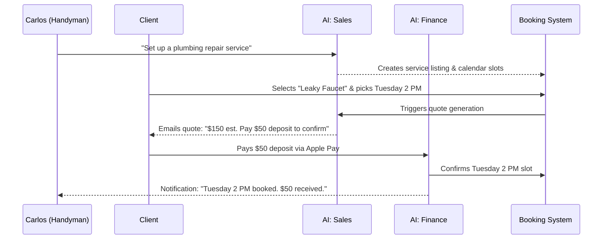
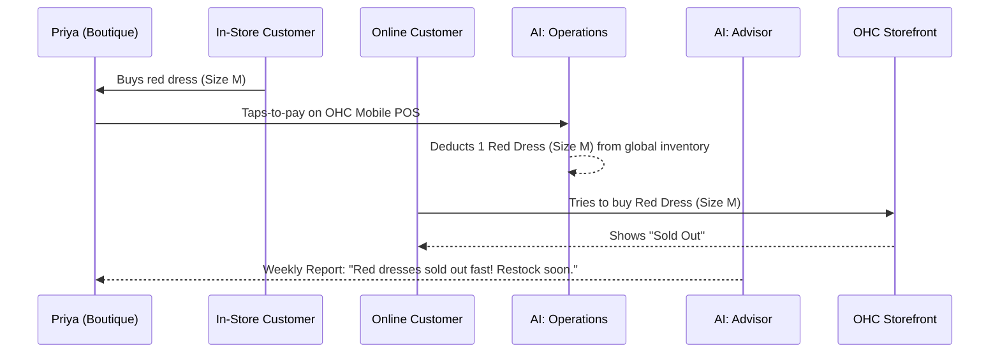
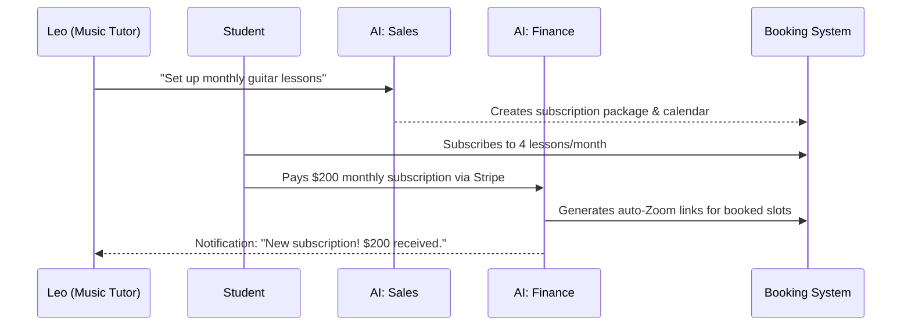
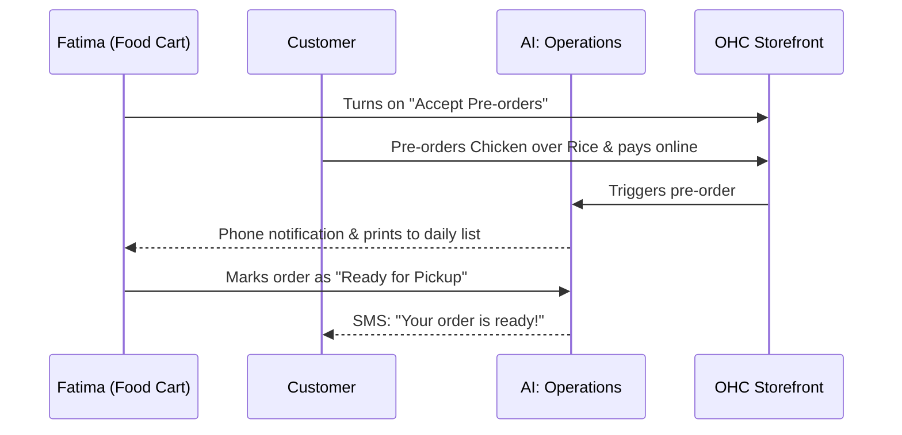

# OHC Business Journey Architecture

## 1. Overview
This design document maps the complete end-to-end user journey for the core personas using the OneHumanCorp (OHC) platform. It breaks down the critical phases of the user lifecycle—Acquisition, Onboarding, Activation, Retention, Revenue, and Referral—from the perspective of a non-technical small business owner. The architecture focuses on radical simplicity, ensuring that a user can go from an idea to a live business in under 10 minutes, largely driven by OHC's invisible AI agent departments.

## 2. Personas Analyzed
We evaluate the user journey against five real-world archetypes:
- **Maya (The Home Baker):** Relies on Instagram DMs, needs a deposit-based custom order system.
- **Carlos (The Handyman):** Needs service listings, quote generation, and booking calendar. Mobile-only (Android).
- **Priya (The Boutique Owner):** Needs online/offline inventory sync, POS tap-to-pay, and analytics.
- **Leo (The Music Tutor):** Needs calendar booking, auto-Zoom links, and subscriptions.
- **Fatima (The Food Cart Operator):** Needs bilingual (Arabic/English) pre-order system, printable daily orders, low-end device support.

## 3. Journey Phases & Friction Analysis

### 3.1 Acquisition
- **How they arrive:** Organic search (e.g., "how to start a bakery online without coding"), social media ads (Instagram/TikTok), or friend referrals.
- **Landing Page CTA:** "Launch your business in 10 minutes. AI does the rest. Start Free."
- **Friction Points:** Requiring credit card upfront, technical jargon ("DNS", "SSL", "Hosting").

### 3.2 Onboarding (The 10-Minute Path to Live)
- **Minimum Inputs:** Business Name, Type of Business (e.g., Service, Physical Product), Primary Goal (e.g., Take Bookings, Sell Items).
- **Deferred Inputs:** Logo upload (AI generates a placeholder), custom domain (start on OHC subdomain), full bank details (start accepting payments now, link bank to payout later).
- **AI Assist:** "The Promoter" agent asks 3 questions and generates a fully designed, mobile-first storefront instantly.

### 3.3 Activation (The "Aha!" Moment)
- **Goal:** First payment received or first booking confirmed.
- **Success Metrics (Day 1/Week 1):** User adds 1 product/service, shares their storefront link, and successfully processes a test transaction or real customer order.
- **Friction Points:** Complex catalog creation. *Solution:* Allow users to just type "I sell vegan chocolate cake for $40" and the AI structures the product variant and description.

### 3.4 Retention
- **Habit Loop:** Daily dashboard check.
- **Push Notifications:** "You have a new order from Sarah!" or "Your AI agent replied to 3 Instagram DMs last night."
- **Weekly Health Reports:** "The Advisor" sends a plain-language summary: "Tuesday was your busiest day. Consider a mid-week promotion."
- **Friction Points:** Overwhelming dashboards. *Solution:* Mobile-first, feed-style notifications rather than dense analytics tables.

### 3.5 Revenue (Monetization & Upgrades)
- **Trigger:** Upgrading from Free → Starter ($9/mo) or Pro ($29/mo).
- **Drivers:** Reaching the 10-product limit, needing a custom domain, or hitting the monthly AI action limit.
- **Presentation:** Contextual CTA. When Maya tries to add an 11th cake, she sees: "Your business is growing! Upgrade to Starter to add unlimited products and a custom domain."

### 3.6 Referral
- **Viral Loop:** Priya shares her storefront link. Her friends see a subtle "Powered by OHC: Start your business for free" badge at the bottom.
- **Incentives:** "Refer a friend, get a month of Pro free."

## 4. Sequence Diagrams (Mermaid.js)

### 4.1 Maya's Journey (Custom Cake Orders via Instagram)

### 4.2 Carlos's Journey (Handyman Quote to Booking)

### 4.3 Priya's Journey (In-Store & Online Sync)

### 4.4 Leo's Journey (Music Tutor Subscriptions)

### 4.5 Fatima's Journey (Food Cart Pre-orders)

## 5. Architectural Invariants for the Journey
1. **No-Code Absolute:** At no point in any sequence should a user see HTML, CSS, DNS records, or API keys.
2. **Mobile Keyboard Native:** All inputs must trigger the correct native mobile keyboard (e.g., number pad for pricing).
3. **Optimistic UI:** Actions like marking an order "shipped" must visually update instantly on mobile, with background retries if the network is flaky.
4. **AI as Interceptor:** AI agents must sit between the raw database state and the user interface, translating complex data (like daily transaction logs) into human-readable narratives (like weekly reports).
