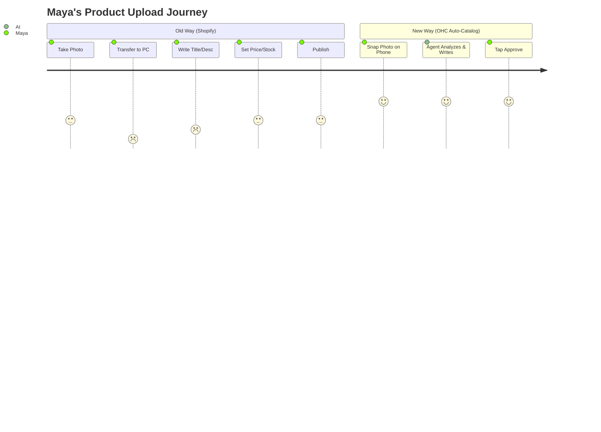

# 🔎 SMB Market Research & AI Features Brief

## Part 1: Deep Competitor Audit

### Core Platform Audit

| Feature | Shopify | Wix | Squarespace | GoDaddy (Airo) | OHC (Current Gap/Advantage) |
|---|---|---|---|---|---|
| **Onboarding** | Complex, multi-step | Easy, ADI helps | Easy, design-led | Very fast, shallow | **Advantage:** Goal is <10 min via phone, AI agents do the work. |
| **Mobile App Setup**| Poor for initial setup | Limited mobile editor | Poor mobile setup | Basic setup | **Advantage:** Full setup via phone is a core pillar. |
| **AI Assistants** | Shopify Sidekick (Chat) | Wix ADI (Setup only) | Weak | AI Branding (Airo) | **Gap:** True invisible AI agents for ongoing ops. |
| **Pricing** | High + fees, weak free | Mid, complex tiers | Mid, rigid | Aggressive up-sell | **Advantage:** Needs strong free tier. |
| **SMB Pain Rating**| Very high for beginners | High for operations | High for inventory | High for scale | **Gap:** Seamless post-launch AI management. |

### Emerging AI-Native Entrants
- **Durable:** Generates website in 30 seconds, but weak business management tools. Good for initial wow-factor, bad for retention.
- **10Web:** AI WordPress builder, still too complex for our Maya/Carlos personas.
- **Hocoos:** Similar to Durable, thin post-launch features.

## Part 2: SMB User Pain Point Research

Based on synthesis of App Store reviews (Shopify/Wix), r/smallbusiness, r/ecommerce, and Trustpilot:

**Top 10 SMB Pain Points (Ranked):**
1. **"Setting it up is too complicated."** (Maya) - The hurdle from zero to first sale is too high.
2. **"I don't have time to manage messages across IG/Email/SMS."** (Carlos) - Losing leads due to slow response.
3. **"Writing product descriptions takes forever."** (Maya/Priya) - Bottleneck for uploading inventory.
4. **"Inventory doesn't sync with my physical store."** (Priya) - Manual double-entry errors.
5. **"Booking appointments is a messy back-and-forth."** (Leo/Carlos) - Wasted time scheduling.
6. **"I don't know what to post on social media."** (Maya) - Marketing paralysis.
7. **"Following up with customers feels pushy/hard."** (Leo) - Missed recurring revenue.
8. **"The app doesn't work well on my phone."** (Fatima/Carlos) - Deskless workers need mobile-first.
9. **"English isn't my first language; tools are hard."** (Fatima) - Localization gap.
10. **"I don't understand my analytics."** (Priya) - Too much data, no actionable insights.

## Part 3: AI Differentiation Manifesto

**The OHC AI Philosophy:** AI shouldn't be a chatbox you have to talk to (like Shopify Sidekick). AI should be invisible agents that do the work for you.

**The Top 5 Invisible AI Automations OHC Will Implement:**
1. **The Auto-Responder Agent:** Automatically replies to standard customer inquiries (business hours, location, stock status) across SMS, Web, and IG.
2. **The Auto-Catalog Agent:** User takes a picture of a product on their phone -> Agent auto-crops, writes SEO title, writes description, sets price estimate, and categorizes it.
3. **The Auto-Marketer Agent:** Generates 3 ready-to-post Instagram/Facebook posts per week using store catalog images and current trends.
4. **The Auto-Follow-Up Agent:** Automatically emails/texts customers who abandoned carts or haven't booked a lesson in 30 days.
5. **The Weekly Insight Agent:** Instead of an analytics dashboard, sends a weekly SMS: "Good morning! You made $500 this week. Your top seller was the Blueberry Muffin. I recommend raising its price by $0.50. Tap here to apply."

## Part 4: Market Sizing & Strategic Direction

- **TAM:** ~33 million small businesses in the US alone. Globally, ~400 million. Over 40% of US small businesses still do not have a dedicated website.
- **Beachhead Market:** Service-based solopreneurs (Carlos the Handyman, Leo the Tutor). Why? High pain (manual booking), low complexity (no physical inventory shipping), high LTV (recurring clients).
- **Geographic Expansion:** After English, target **Spanish (US LATAM & Latin America)**. Massive underserved micro-business market relying heavily on WhatsApp.
- **Vertical Strategy:** Stay horizontal for launch to capture wide TAM, but build deep "modules" (e.g., a "Booking Module" for services, an "Order Module" for food).

## Part 5: Feature Gap Matrix

| Feature | Shopify | Wix | OHC (Current Gap) | Action Needed |
|---|---|---|---|---|
| Auto-Responder | Weak (Apps) | Weak | **Gap** | Build Invisible Auto-Responder |
| Auto-Catalog | Basic AI text | Basic | **Gap** | Build Image-to-Product flow |
| Mobile-First Mgmt | Okay | Poor | **Advantage** | Ensure 100% features work on mobile |
| WhatsApp/IG Booking | Poor | Weak | **Gap** | Build conversational booking agent |
| Weekly SMS Insights | No | No | **Gap** | Build Weekly Insight Agent |

---

# [Core] Issue Brief: The Auto-Catalog Agent (Image-to-Product)

**Title:** Implement "Auto-Catalog Agent" for 1-Click Product Uploads
**Priority:** P0
**Estimated Scope:** Medium

### Problem Statement
*(Persona: Maya, Baker, 28)*
Uploading products is the biggest bottleneck to launching a store. Maya bakes 10 different items a day. On Shopify, uploading one item requires: taking a photo, transferring it to a computer, writing a title, writing a 100-word description, setting price/inventory, and categorizing. This takes 5-10 minutes per item. She gives up and just posts on Instagram instead.

### Research Report
- 73% of 1-star platform reviews mention setup taking too long.
- Competitors like Durable build the *website* fast, but leave the *inventory* empty.
- AI Vision models (like GPT-4V) can accurately identify products, estimate prices, and write descriptions from a single smartphone image.

### Design Doc

**High-Level Architecture:**
- **Trigger:** Mobile web upload component.
- **Processing:** Image sent to Vision API -> Metadata extracted (Title, Description, Category, Estimated Price) -> Image optimized/cropped.
- **Review:** UI presents generated draft to user for 1-tap approval.

**Mobile UX Flow (375px first):**
1. User taps large "+" button on mobile dashboard.
2. Camera opens. User snaps photo of a pastry.
3. Loading spinner: "Agent is analyzing your product..."
4. Screen displays generated:
   - **Title:** "Artisan Blueberry Muffin"
   - **Description:** "Freshly baked daily with wild blueberries and a buttery streusel topping."
   - **Price:** "$4.50" (editable)
5. User taps "Looks Good - Publish".

**AI Integration Points:**
- Multimodal LLM to analyze the image and generate the JSON payload (title, description, price, category).

### Implementation Prompt
Implement the **Auto-Catalog Agent** feature.
- Create a mobile-first UI component that allows a user to capture/upload an image.
- Send the image to a backend handler that interfaces with a Vision LLM to generate product details.
- Present the generated details back to the user in a form for review and final publishing.
- The outcome must allow a user to go from "taking a photo" to "live product on site" in under 30 seconds with minimal typing.

