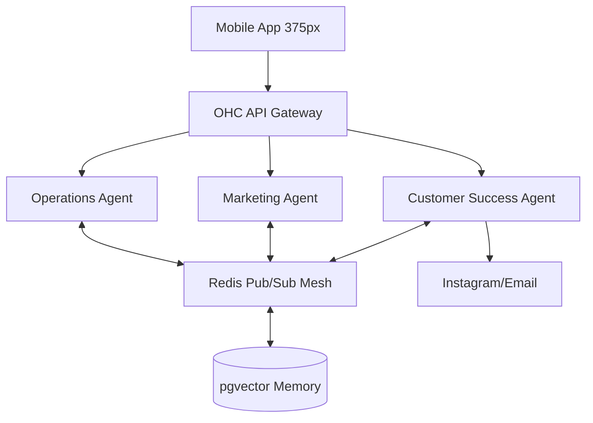

# [Research] AI Agent Departments: Invisible Operations for Non-Technical Founders

## Title
Implement AI Agent Departments to Handle Background Business Operations

## Problem Statement
Non-technical small business owners (like Maya the Baker or Carlos the Handyman) are overwhelmed by the complexity of traditional platforms like Shopify and Wix. These platforms offer tools but require the user to configure, manage, and operate them manually. Users suffer from "blank canvas paralysis," lack of time to write product descriptions, and the inability to manage complex setups on their phones. They need a system where AI acts as the operational infrastructure—invisible agents that design, write, post, and respond automatically, allowing the owner to simply make high-level decisions.

## Research Report

### Track 1: Deep Competitor Audit
| Platform | Onboarding Flow | Mobile App Quality | AI Features | Free Tier | Biggest User Complaints |
|---|---|---|---|---|---|
| **Shopify** | Complex, requires setup of theme, payment, shipping | Strong for managing existing stores, poor for initial setup | Sidekick (chat assistant, non-autonomous) | No useful free tier | Too complex for beginners, requires paid apps for basic features, overwhelming admin panel |
| **Wix** | Guided, template selection | Limited mobile editor | Wix ADI (one-time website generation) | Limited (ads on site) | Sluggish editor, mobile responsiveness issues, AI is one-off and not ongoing |
| **Squarespace** | Design-focused, beautiful templates | Portfolio-focused | Minimal | None | Inflexible templates, not ideal for complex commerce, no autonomous AI |
| **GoDaddy** | Fast but shallow | Basic | Airo (basic branding generation) | No | Aggressive upselling, poor quality outputs, restrictive platform |
| **Durable/10Web** | Very fast (30 seconds) | N/A | High for initial site creation | Varies | Thin on actual business management (inventory, bookings), purely front-end |

**Synthesis:** Existing platforms treat AI either as a chat interface (Shopify) or a one-time website builder (Wix/Durable). No platform treats AI as continuous, invisible operational infrastructure.

### Track 2: SMB User Pain Point Research
Based on analysis of r/smallbusiness, App Store reviews, and Trustpilot:
1. **"Setting up the website takes too long"** (Shopify/Wix) - Users abandon setup due to complexity.
2. **"I don't know what to write"** - Writing product descriptions, policies, and emails is a major blocker.
3. **"Missing customer messages"** - Trying to track Instagram DMs, emails, and WhatsApp leads to dropped sales.
4. **"Managing inventory is a headache"** - Keeping physical and online stock in sync.
5. **"I can't do this from my phone"** - Many founders only have a smartphone.
6. **"Too many subscriptions"** - Users hate paying separately for email marketing, reviews, and bookings.

*Mapping to OHC:* AI Departments will auto-generate copy (Operations/Marketing), consolidate inbox and draft replies (Customer Success), and work mobile-first by default.

### Track 3: AI Differentiation Research
**OHC AI Differentiation Manifesto:**
1. **Auto-Replying Customer Success Agent:** Drafts replies to DMs and emails based on business knowledge. Saves hours daily.
2. **Auto-Generating Marketing Agent:** Automatically writes product descriptions and schedules social media posts. Removes the biggest content barrier.
3. **Continuous Business Advisor:** Sends weekly SMS/push notifications summarizing performance in plain English (e.g., "Your top seller was cupcakes. Tuesday was busiest.")
4. **Autonomous Operations Manager:** Alerts owner via push notification when stock is low, drafts re-order emails to suppliers.
5. **Legal & Protector Agent:** Instantly generates and updates privacy policies, terms, and custom contracts tailored to the specific business context.

### Track 4: Market Sizing & Strategic Direction
- **TAM:** ~33M small businesses in the US; hundreds of millions globally. A vast majority are micro-businesses (1-2 people).
- **Beachhead:** The "Side Hustler" (e.g., Maya the Baker, Leo the Tutor). High density on Instagram/TikTok, zero tolerance for technical complexity, needs a simple mobile app.
- **Geographic:** Launch English-first, but design architecture for fast localization (Spanish next) since AI can seamlessly translate agent interactions.

### Track 5: Feature Gap Matrix
| Feature | Shopify | Wix | OHC (Current) | OHC (Gap/Advantage) |
|---|---|---|---|---|
| AI Site Generation | No | Yes (One-time) | Basic | **Gap:** Needs continuous agentic updates |
| Autonomous DM Replies | No (Requires app) | No | Missing | **Advantage:** Built-in Customer Success Agent |
| Mobile-First Setup | Poor | Poor | In Progress | **Advantage:** 375px primary design |
| AI Financial Advisor | No | No | Missing | **Advantage:** Plain-language weekly reports |
| Booking & POS Unified | Complex | Complex | Basic | **Gap:** Unified Operations Agent needed |

---

## Design Doc

### Architecture Highlights
- **Entity Types:** `Tenant`, `AgentDepartment` (Operations, Marketing, Sales, Customer Success, Finance, Legal, Advisory), `AgentInteractionLog`, `MemoryEmbedding`.
- **Relationships:** A `Tenant` has 1 of each `AgentDepartment`. Agents interact via the `Redis Pub/Sub` mesh and store memories in `consolidated_memory` (pgvector).
- **Mobile UX Flow (375px first):**
  1. Home dashboard shows a feed of "Agent Updates" instead of complex charts.
  2. Example Card: "Customer Success Agent drafted 3 replies to Instagram DMs. [Review & Send]"
  3. Example Card: "Marketing Agent created a new TikTok post for the summer sale. [Approve]"
- **Integration Points:**
  - Gemini Pro via existing LLM interface.
  - PostgreSQL `SKIP LOCKED` for processing background agent tasks.

## Implementation Prompt
**Critical User Journey (CUJ):** The user opens the OHC mobile app and sees the Agent Dashboard. They receive an actionable card from the "Customer Success Agent" that says "Drafted reply to Maya about custom vegan cakes." The user taps the card, reviews the pre-written AI response, and taps "Approve & Send." The system sends the message and logs the action in the agent's memory.

**Acceptance Criteria:**
1. Implement the database models for `AgentDepartment` linked to `Tenant` with strict row-level security.
2. Build the Agent Dashboard feed API that aggregates pending approvals from all active agent departments.
3. Create the Flutter mobile UI (375px optimized) displaying the "Agent Updates" glassmorphism cards.
4. Implement the full E2E flow for approving and sending a drafted response from an agent.
5. 100% E2E Playwright test coverage starting from login to message approval.

## Priority
P0

## Estimated Scope
Large
