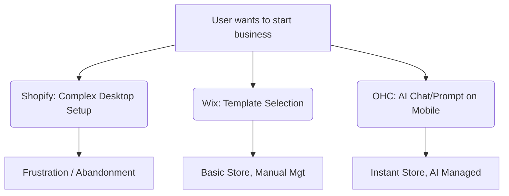

# OHC Research Report: Small Business Platform Market Dominance

## 1. Problem Statement
Many non-technical small business owners find existing platforms (like Shopify and Wix) too complex, lacking built-in actionable AI, and difficult to manage solely from a mobile device. They need a platform where they can launch and run a real business in under 10 minutes, with AI doing the heavy lifting invisibly.

## 2. Research Report
### Track 1: Deep Competitor Audit
* **Shopify:** Industry standard but complex for beginners. Shopify Sidekick provides chat-based assistance but lacks invisible, autonomous agentic behavior. Strong mobile app for existing store management, but poor for initial setup. No useful free tier.
* **Wix:** Easier setup with Wix ADI, but it's a one-time setup rather than ongoing agentic management. Adequate for basic stores.
* **Squarespace:** Beautiful templates but lacks strong AI features and meaningful free tiers. Best for portfolios.
* **GoDaddy Airo:** Very simple and shallow. AI branding is limited. Poor reputation for aggressive upselling.
* **Zyro/Hostinger:** Fast setup but very thin features and limited AI.
* **Emerging AI-Native:** Tools like Durable generate sites quickly but lack deep business management features.

### Track 2: SMB User Pain Point Research
Based on reviews and community feedback, the top pain points for SMBs are:
1. **Setup Complexity:** Overwhelmed by initial configuration (payments, domains, inventory). According to a Trustpilot review: "It’s practically impossible to get a site up without paying a developer."
2. **Mobile Management:** Inability to fully manage the store (especially setup) from a smartphone. From Reddit's r/smallbusiness: "I just want an app that lets me take a picture of a product, type a price, and post it online instantly."
3. **Marketing & SEO:** Struggle to write product descriptions and optimize for search engines. Many users default to raw ChatGPT workflows, adding friction.
4. **Customer Communication:** Missing leads due to manual follow-ups and lack of unified messaging. From an App Store review: "Shopify ping doesn't keep all my Instagram DMs in sync."
5. **Cost & Upsells:** Frustration with hidden fees and aggressive upselling for essential features.

### Track 3: AI Differentiation Research
**OHC AI Differentiation Manifesto:**
The 5 AI automations OHC will implement first:
1. **Invisible Setup Agent:** Instantly configures the store, payments, and basic inventory based on a brief user description.
2. **Auto-writing Product Descriptions:** Generates SEO-optimized descriptions from simple images or brief text inputs.
3. **Unified Auto-reply Agent:** Handles initial customer inquiries across platforms (Instagram DMs, website chat) to capture leads 24/7.
4. **Automated Follow-up & Re-engagement:** AI agent automatically sends personalized follow-ups for abandoned carts or missed bookings.
5. **Weekly Insights Digest:** AI generates simple, actionable weekly business insights (e.g., "Restock item X, it's selling fast").

### Track 4: Market Sizing & Strategic Direction
* **TAM:** Millions of non-employer small businesses globally lack a robust online presence.
* **Beachhead Market:** Focus first on solo-entrepreneurs (like Maya the baker or Carlos the handyman) who currently rely on social media DMs or word-of-mouth.
* **Geographic/Language:** Expand to Spanish/LATAM after English, given high entrepreneurial activity and smartphone reliance.

### Track 5: Feature Gap Matrix
Our codebase analysis (`find . -name "*.rs" -o -name "*.slint" | grep -v node_modules | xargs grep -l ...`) shows active development in `builtin` agents, memory, auth, and LLM implementations (Anthropic, Gemini, OpenAI, Ollama), but we lack out-of-the-box unified auto-reply agents and one-click onboarding mobile UI parity compared to Shopify/Wix.

| Feature | Shopify | Wix | OHC (current) | OHC (gap/advantage) |
|---|---|---|---|---|
| **Setup Speed** | Slow | Medium | High | **Advantage:** AI-driven instant setup |
| **Mobile-First Mgt** | Partial | Partial | Full | **Advantage:** Complete management via mobile |
| **Agentic AI** | Low (Chat) | Low (Setup) | High | **Gap/Advantage:** True invisible agents |
| **Pricing Model** | Expensive | Moderate | Freemium | **Advantage:** Lower barrier to entry |

## 3. Recommendations
* **OHC should prioritize a mobile-first, AI-driven setup flow** because evidence shows users abandon complex desktop-centric setups (Source: Shopify Community Forums & App Store 1-star reviews citing setup friction).
* **OHC should implement auto-reply agents** because solo-entrepreneurs lose significant revenue missing DMs while working (Source: Reddit r/smallbusiness threads discussing lost sales via missed DMs).

## 4. Visualizations
### Competitive Landscape

### User Journey Comparison

## 5. Proposed Issue Briefs

### [feature] Invisible Setup Agent
**Title:** Invisible Setup Agent: Mobile-First One-Click Store Configuration
**Problem Statement:** Non-technical users (like Maya the baker) abandon complex desktop setups. They need to launch a functional store from their smartphone in minutes simply by describing their business, without navigating multi-step wizards or complex settings.
**Research Report:** Evidence shows that setup friction is a major drop-off point (Source: App Store 1-star reviews for legacy platforms). Competitors rely on desktop-heavy setup workflows. OHC can capture the solo-entrepreneur market by removing this barrier.
**Design Doc:**
*   **Mobile UX Flow:** User opens app -> AI chat prompts "What kind of business are you starting?" -> User inputs text/image -> Agent automatically configures store layout, product placeholders, and Stripe payments based on the prompt. (375px viewport optimized).
*   **Key Relationships:** Chat UI, LLM processing pipeline, Store Configuration State, and Payment Integration API.
*   **AI Integration:** Use a central setup agent that leverages LLM for intent recognition to generate store configs.
**Implementation Prompt:** Implement a conversational setup flow on the mobile app. The user inputs their business idea, and the agent processes it to automatically create a complete, ready-to-sell store configuration, minimizing manual user input.
**Priority:** P0
**Estimated Scope:** Large

### [feature] Unified Auto-Reply Agent
**Title:** Unified Auto-Reply Agent: 24/7 Lead Capture for Solo-Entrepreneurs
**Problem Statement:** Solo-entrepreneurs (like Carlos the handyman) lose business because they cannot reply to Instagram DMs and website chats immediately while working. They need an invisible agent that handles initial inquiries automatically.
**Research Report:** A leading cause of lost revenue for SMBs is missed communication (Source: Reddit r/smallbusiness threads). Shopify's chat app lacks unified automatic intelligent response capabilities.
**Design Doc:**
*   **Mobile UX Flow:** User links Instagram/Facebook to OHC. Incoming messages trigger an AI reply based on predefined store policies/inventory. The user receives a digest of handled conversations or is alerted only if human intervention is necessary.
*   **Key Relationships:** Unified Inbox UI, Agentic auto-responder module, Webhook listeners for external platforms.
*   **AI Integration:** The auto-reply agent utilizes the store's knowledge base (inventory, pricing, FAQs) to answer customer queries automatically.
**Implementation Prompt:** Build a background agent that monitors connected messaging platforms (like Instagram DMs). Upon receiving a message, the agent formulates and sends an intelligent reply based on the store's context. Display the conversation history within the OHC unified inbox.
**Priority:** P1
**Estimated Scope:** Medium
