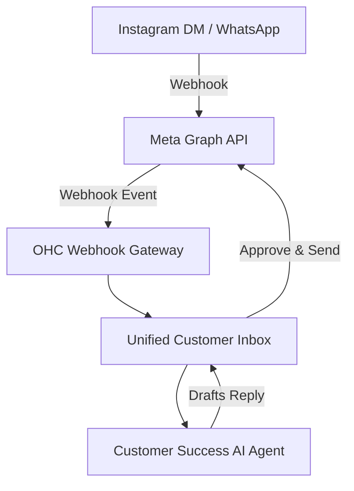
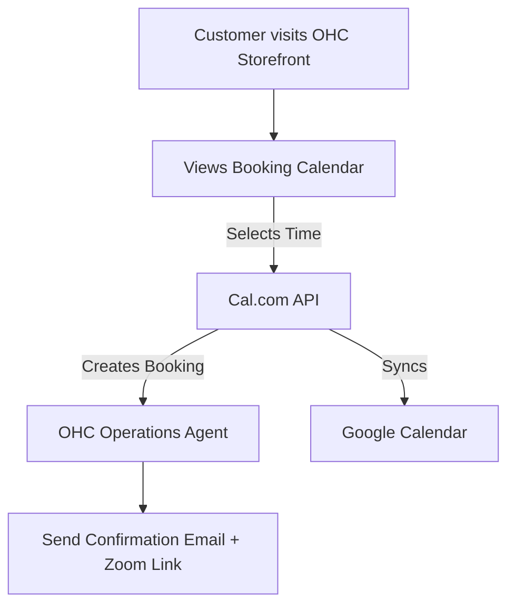
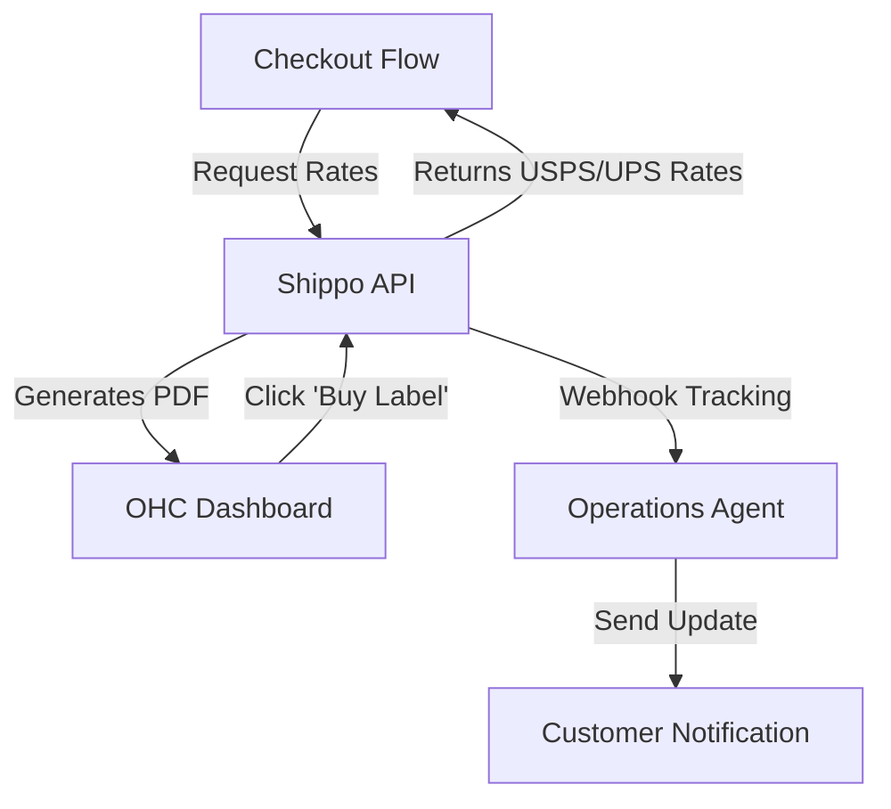
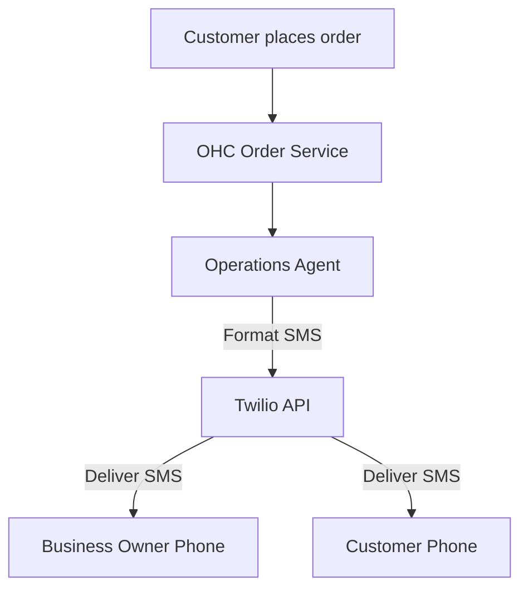

# 🔍 Scout: Tool Integration Research

## 1. Social Media Integration: Meta Graph API (Instagram/WhatsApp/Facebook)

**Problem Statement:**
Business owners like Maya the Baker receive orders and questions through Instagram DMs, Facebook comments, and WhatsApp. Managing these across three different apps is overwhelming, and she often misses messages, losing potential sales. She needs a single inbox where her AI Agent (The Ambassador) can read and draft replies to all these messages automatically.

**Research Report:**
*   **Tool:** Meta Graph API (Messenger, Instagram Messaging, WhatsApp Business)
*   **Ease of Use for Non-Technical Users:** The user simply clicks a "Connect to Instagram/Facebook" button (OAuth) to link their accounts. OHC handles all webhook configurations.
*   **Pricing:** Free for Instagram and Facebook messaging. WhatsApp Business API has per-conversation pricing (first 1000 service conversations are free per month), which easily fits into OHC's subscription plans.
*   **Integration Risks:** Meta's OAuth and app review process is notoriously strict and requires regular re-authentication.
*   **Cloud/Standalone:** Cloud-friendly (webhooks point to OHC). Standalone would require polling or a cloud relay.

**Design Doc:**

*   **Trigger:** Customer sends a message on IG/FB/WA.
*   **Action:** Webhook receives the message, routes it to the correct tenant's unified inbox. The Customer Success AI agent reads it and drafts a response.
*   **User sees:** A single inbox in the OHC app showing the message with an Instagram/WhatsApp icon next to it, and a suggested AI reply ready to send.

**Implementation Prompt:**
Implement the Meta Graph API webhook listener to receive incoming Instagram DMs and WhatsApp messages. When a message arrives, map it to the corresponding tenant based on the connected Facebook Page ID, and save the message in the unified inbox. Trigger the Customer Success Agent to draft a response. The business owner must see the message and the AI's draft in their OHC dashboard.

**Priority:** P0
**Estimated Scope:** Large

---

## 2. Calendar & Scheduling: Cal.com

**Problem Statement:**
Service providers like Leo the Music Tutor need a way for students to book open slots without emailing back and forth. They need automatic Zoom links generated and Google Calendar synced so they don't get double-booked.

**Research Report:**
*   **Tool:** Cal.com (Open Source Calendaring)
*   **Ease of Use for Non-Technical Users:** Leo just connects his Google Calendar via OAuth. OHC handles the creation of the booking page and event types behind the scenes.
*   **Pricing:** Platform API has usage-based pricing, but it's very reasonable. Alternatively, we could self-host the core engine.
*   **Integration Risks:** Syncing two-way with external calendars (Google/Outlook) is complex and prone to edge cases (timezones, daylight savings). Cal.com handles this well, but their API limits must be monitored.
*   **Cloud/Standalone:** Excellent for both. They have a managed Platform API and are open source for standalone potential.

**Design Doc:**

*   **Trigger:** Business owner sets up a "Service" product.
*   **Action:** OHC provisions a managed Cal.com event type via API. When a customer books, a webhook updates OHC.
*   **User sees:** A simple booking calendar on their public OHC site. When a customer books, the appointment appears in the OHC dashboard and their personal Google Calendar automatically.

**Implementation Prompt:**
Integrate the Cal.com Platform API to handle service bookings. When a user creates a new "Service" offering, automatically create a corresponding event type in Cal.com. Render a booking widget on the storefront. Listen for booking webhooks from Cal.com to notify the Operations Agent and generate Zoom/Meet links.

**Priority:** P0
**Estimated Scope:** Large

---

## 3. Shipping & Logistics: Shippo

**Problem Statement:**
Owners shipping physical goods, like Priya the Boutique Owner, struggle with calculating exact shipping costs at checkout and manually copying addresses to buy shipping labels from the post office.

**Research Report:**
*   **Tool:** Shippo API
*   **Ease of Use for Non-Technical Users:** Invisible. The user just enters their product weights. Shippo calculates the rates at checkout. To ship, they click "Buy Label" in OHC, and it charges their card on file and generates a printable PDF.
*   **Pricing:** Pay-as-you-go (approx $0.05 per label) + postage cost. OHC can pass this cost to the customer or absorb it.
*   **Integration Risks:** Real-time rate calculation adds latency to the checkout flow.
*   **Cloud/Standalone:** Cloud API only.

**Design Doc:**

*   **Trigger:** Customer enters address at checkout; Business owner clicks "Create Shipping Label".
*   **Action:** Call Shippo to get rates; Call Shippo to purchase label and get tracking number.
*   **User sees:** Accurate shipping options for buyers. A simple "Print Label" button on the order page for the seller.

**Implementation Prompt:**
Integrate Shippo API for real-time shipping rate calculation at checkout and label generation in the admin dashboard. Ensure tracking numbers from Shippo automatically update the order status and trigger the Customer Success Agent to email the buyer.

**Priority:** P1
**Estimated Scope:** Medium

---

## 4. SMS & Notifications: Twilio

**Problem Statement:**
Food cart operators like Fatima need instant, loud notifications on their phones when a pre-order arrives. They might not have reliable 4G for push notifications, and their customers prefer SMS updates for order readiness.

**Research Report:**
*   **Tool:** Twilio Programmable SMS
*   **Ease of Use for Non-Technical Users:** The user does nothing. OHC handles the sender ID and routing. Fatima simply receives an SMS: "New Order: 2x Chicken Over Rice. Pickup in 15m."
*   **Pricing:** ~$0.0079 per message. We must build a hard limit per tenant to prevent abuse/runaway costs.
*   **Integration Risks:** Global carrier compliance (A2P 10DLC registration in the US is complex and takes time for each tenant).
*   **Cloud/Standalone:** Cloud-first.

**Design Doc:**

*   **Trigger:** Urgent order created or order status changes to "Ready for Pickup".
*   **Action:** Dispatch SMS via Twilio.
*   **User sees:** Instant text messages on their basic mobile phone informing them of new orders.

**Implementation Prompt:**
Integrate Twilio to send SMS notifications to business owners for urgent events (like new food orders). Implement strict tenant-level rate limiting and cost metering to prevent abuse. Ensure the Operations Agent can use this tool to notify customers when their order is ready.

**Priority:** P1
**Estimated Scope:** Medium
