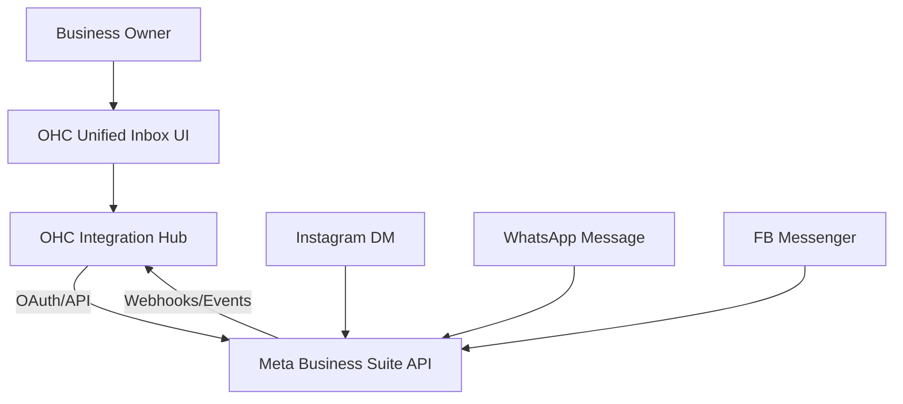
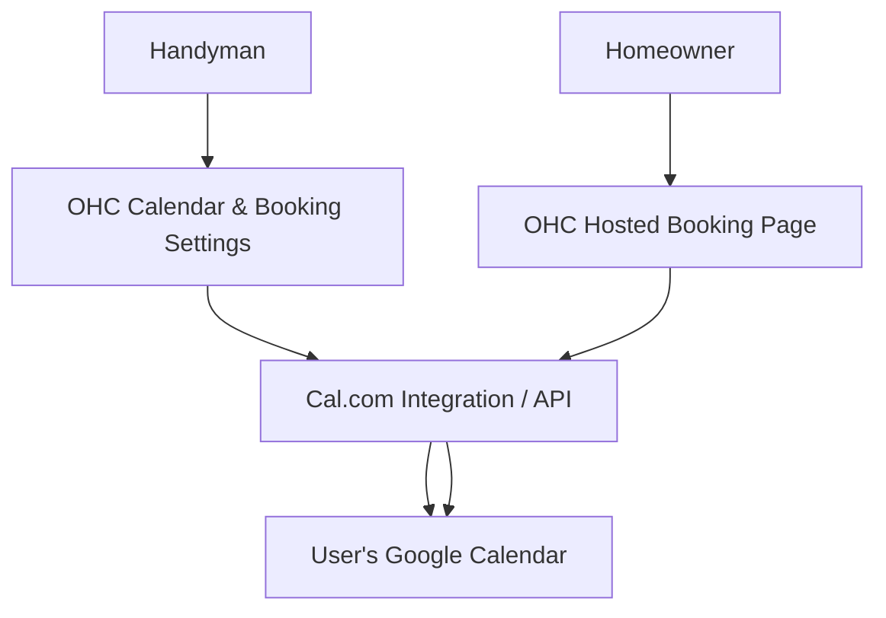
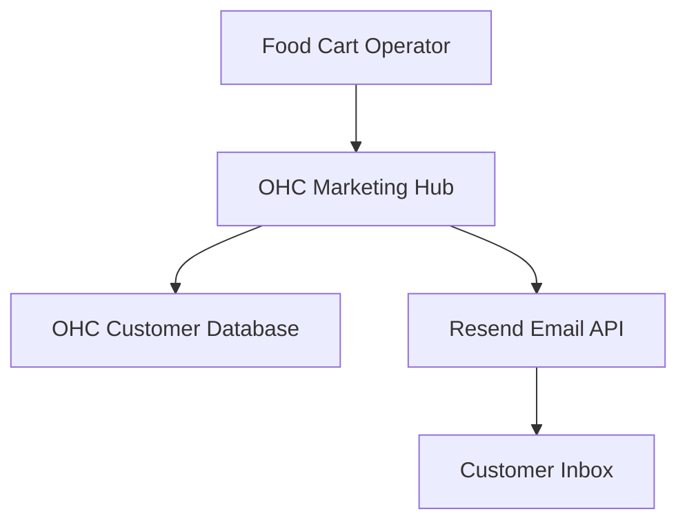
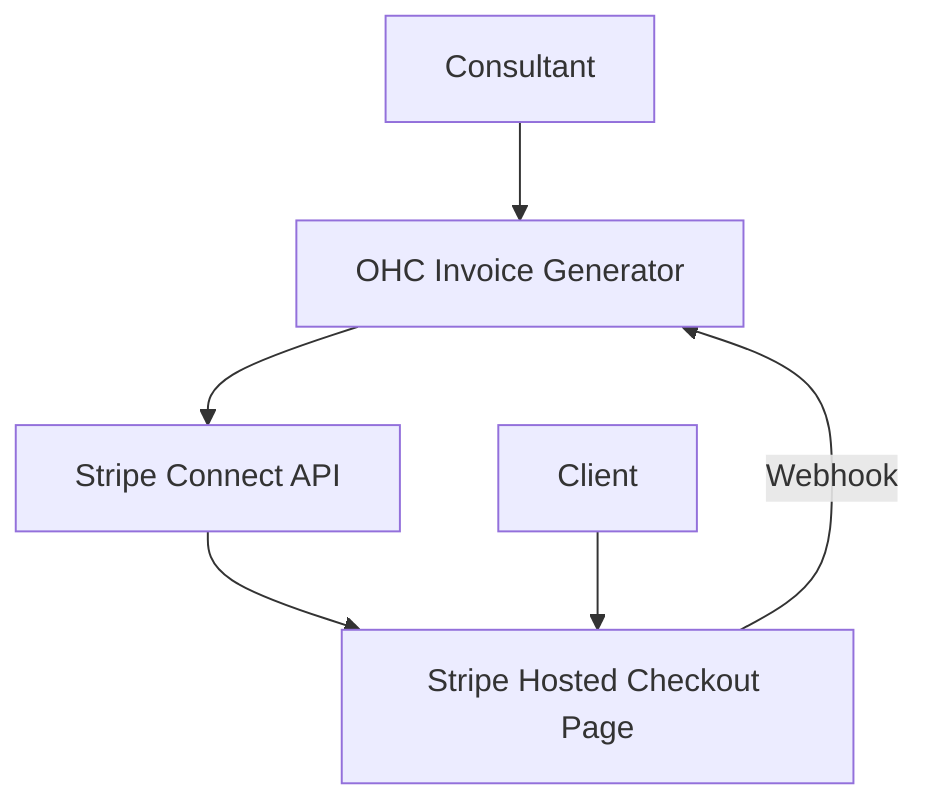
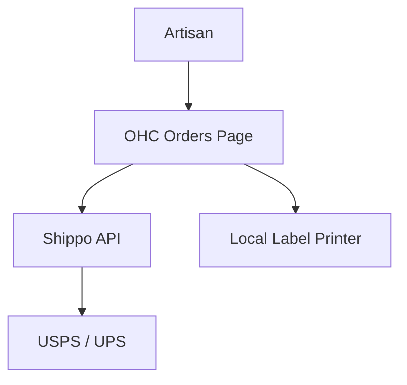
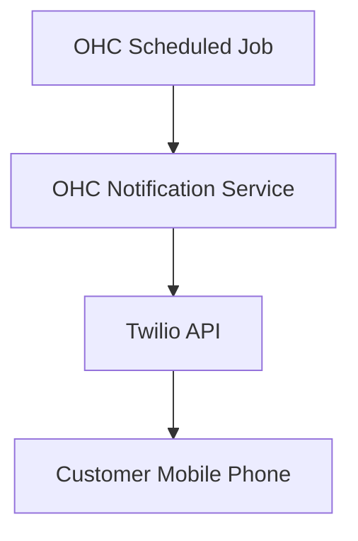
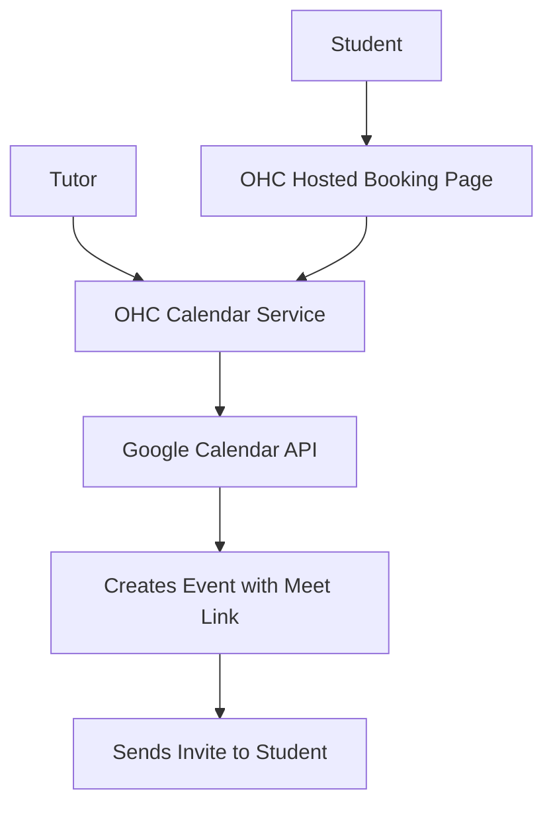

# One Human Corp - Tool Integration Research Q4

## Introduction

This report evaluates third-party tools for the 7 requested categories that solve real problems for small business owners in both Cloud and Standalone environments. Every evaluation applies the 'Business Owner Lens', focusing on the end-user experience without technical jargon.

The goal is to provide a "zero to live business in under 10 minutes" experience by evaluating how tools integrate with OHC (One Human Corp) to benefit small business personas such as a baker, handyman, or food cart operator.

---

## 1. Social Media Integration

### [Social Media Integration] Unified Social Inbox
**Problem Statement:** A bakery owner receives orders via Instagram DMs, Facebook comments, and WhatsApp. Currently, they miss orders because they have to manually check three different apps on their phone while baking. They need one place to view and reply to all customer messages.

**Research Report:**
*   **Tool Evaluated:** Meta Business Suite API (WhatsApp, IG, FB Messenger)
*   **Ease of Use:** High for users. Connecting requires a single Facebook login/OAuth flow.
*   **Pricing:** Free for basic messaging; WhatsApp Business API has volume-based pricing (first 1000 service conversations free).
*   **Reputation:** Industry standard, highly reliable webhook infrastructure.
*   **Compatibility:** Works seamlessly in Cloud (webhooks) and Standalone (polling/websockets via local relay or direct API access).

**Design Doc:**

*   **Mobile UX Flow:** User navigates to Settings -> Integrations -> "Connect Social Media". Taps "Connect Facebook/Instagram". Authenticates via a popup. Redirected back to OHC. New messages now appear in the standard OHC Inbox with an icon indicating the source network.

**Implementation Prompt:** Implement a unified inbox feature that allows the user to connect their Facebook, Instagram, and WhatsApp accounts via a single settings page. When a customer messages any of these platforms, the message should appear in the OHC unified inbox. The business owner must be able to reply directly from OHC, and the reply should be sent back to the original platform.

**Priority:** P0 (Critical for modern B2C)
**Estimated Scope:** Large

---

## 2. Calendar & Scheduling

### [Calendar & Scheduling] One-Click Customer Bookings
**Problem Statement:** A handyman spends hours texting clients back and forth to find a time to fix a sink. They need a simple link they can send to customers that shows when they are free, automatically syncs with their personal Google Calendar, and prevents double-booking.

**Research Report:**
*   **Tool Evaluated:** Cal.com API (Open Source Calendly alternative)
*   **Ease of Use:** Excellent. Cal.com allows deep white-label integration. Users just click "Connect Google Calendar".
*   **Pricing:** Free tier available; API/White-label pricing is reasonable for platforms.
*   **Reputation:** Highly regarded open-source project, developer-friendly.
*   **Compatibility:** Works in Cloud. For Standalone, OHC can use Cal.com's public API to manage local user slots or run a lightweight local Cal.com instance/logic.

**Design Doc:**

*   **Mobile UX Flow:** Settings -> "Set Up Bookings". User defines working hours (e.g., 9 AM - 5 PM). Taps "Connect Google Calendar" to block out busy times. User receives a custom link (e.g., `ohc.com/book/marios-repairs`) to share with clients via SMS/WhatsApp.

**Implementation Prompt:** Create a "Booking Link" feature. The user should be able to set their general working hours and connect their Google/Outlook calendar. The system must generate a public, mobile-friendly webpage where customers can select an available time slot. When a customer books, it must immediately appear on the user's connected calendar and send a notification to the user's OHC inbox.

**Priority:** P1
**Estimated Scope:** Medium

---

## 3. Email Marketing

### [Email Marketing] Smart Customer Announcements
**Problem Statement:** A food cart operator wants to tell all their past customers that they have a new location this weekend. They don't know what "Mailchimp" or a "Campaign" is. They just want to write a message and hit "Send to all past customers."

**Research Report:**
*   **Tool Evaluated:** Resend API
*   **Ease of Use:** Extremely simple API, fast delivery. Users don't need to learn a complex builder; OHC can provide 3 simple templates.
*   **Pricing:** Free up to 3,000 emails/month. Highly cost-effective for small businesses.
*   **Reputation:** Known for incredible developer experience and high deliverability rates.
*   **Compatibility:** Fully compatible with both Cloud and Standalone (as an external API call).

**Design Doc:**

*   **Mobile UX Flow:** User goes to "Marketing" tab -> "Send Announcement". Chooses an audience ("All Customers" or "Recent Customers"). Types a subject and a plain-text/image message. Previews the email. Taps "Send Now".

**Implementation Prompt:** Build an "Announcements" feature that ties into the existing customer database. The user should be able to draft a simple email, optionally attach a photo, and send it to all their registered contacts at once. The system must automatically handle "Unsubscribe" links at the bottom of the emails to maintain spam compliance without the user needing to configure it.

**Priority:** P2
**Estimated Scope:** Medium

---

## 4. Payment Processing

### [Payment Processing] Universal Invoice Payments
**Problem Statement:** A consultant needs to get paid. Some clients want to use credit cards, but others in LATAM want to use Mercado Pago, and some in Europe prefer SEPA. The consultant doesn't want to set up 5 different merchant accounts; they just want a button on their invoice that says "Pay Now" and handles local methods automatically.

**Research Report:**
*   **Tool Evaluated:** Stripe Connect (with local payment methods enabled: Ideal, Mercado Pago, etc.)
*   **Ease of Use:** Stripe Connect Standard allows the business owner to use their own Stripe account, while OHC acts as the platform.
*   **Pricing:** Standard Stripe fees (2.9% + 30c) plus local method variations. No upfront cost.
*   **Reputation:** The gold standard for global payment routing.
*   **Compatibility:** Works in Cloud. In Standalone, the desktop app can securely open checkout links in the browser or via embedded webviews.

**Design Doc:**

*   **Mobile UX Flow:** User creates an Invoice in OHC. Taps "Enable Online Payments". User is guided through a quick Stripe Connect onboarding (if not already done). The generated invoice PDF/link now includes a "Pay Online" button.

**Implementation Prompt:** Integrate online payments into the OHC invoicing system. The user should be able to connect a payment account and automatically add a "Pay Now" button to digital invoices. When the customer clicks the button, they should be presented with a secure checkout page supporting their local payment methods. Once paid, the invoice in OHC must automatically be marked as "Paid".

**Priority:** P0
**Estimated Scope:** Large

---

## 5. Shipping & Logistics

### [Shipping & Logistics] One-Tap Shipping Labels
**Problem Statement:** An artisan who sells handmade soaps online wastes an hour at the post office every day typing addresses and buying stamps. They need a way to automatically buy and print the cheapest shipping label the moment an order comes in.

**Research Report:**
*   **Tool Evaluated:** Shippo API
*   **Ease of Use:** Excellent. Aggregates USPS, UPS, FedEx, DHL. Returns the cheapest rate instantly.
*   **Pricing:** Free basic tier; pay 5 cents per label plus the actual postage cost.
*   **Reputation:** Highly reliable, widely used by e-commerce platforms.
*   **Compatibility:** Cloud and Standalone compatible. Standalone is particularly strong here as it can directly interface with local label printers (via local network or USB) without complex cloud printing drivers.

**Design Doc:**

*   **Mobile UX Flow:** User views an "Unfulfilled Order". System automatically calculates the box size based on items and suggests the cheapest USPS label. User taps "Buy Label for $4.50". The label is generated and a "Print" button appears to send it directly to their local printer.

**Implementation Prompt:** Create a fulfillment workflow for physical orders. For any order with a shipping address, the system should automatically fetch the cheapest shipping rate based on a default box size. The user must be able to click one button to purchase the label and immediately print it or download it as a PDF. The tracking number should be automatically emailed to the customer.

**Priority:** P1
**Estimated Scope:** Large

---

## 6. SMS & Notifications

### [SMS & Notifications] Reliable SMS Alerts
**Problem Statement:** A hair stylist (like Fatima) serves clients who do not check email often and prefer text messages. When a client books an appointment, they need an immediate text confirmation, and a reminder text 2 hours before the appointment, to reduce no-shows.

**Research Report:**
*   **Tool Evaluated:** Twilio Messaging API
*   **Ease of Use:** Developer-focused, but invisible to the end-user. OHC abstracts the complexity.
*   **Pricing:** ~$0.0079 per message. Extremely cheap for high-value appointment reminders.
*   **Reputation:** The industry leader for SMS delivery globally.
*   **Compatibility:** Cloud and Standalone compatible.

**Design Doc:**

*   **Mobile UX Flow:** Settings -> "Notifications". User toggles on "Send SMS Reminders to Clients". The system handles the rest invisibly.

**Implementation Prompt:** Implement automated SMS appointment reminders. When the user enables this feature, the system should automatically schedule an SMS to be sent to the customer's provided phone number 2 hours before any booked appointment. The message should include the business name, appointment time, and a link to cancel/reschedule.

**Priority:** P0 (Critical for local service businesses)
**Estimated Scope:** Medium

---

## 7. Video Conferencing

### [Video Conferencing] Auto-Generated Online Meeting Links
**Problem Statement:** A tutor offers online math lessons. Currently, every time someone books a session, the tutor has to manually open Zoom, create a meeting, copy the link, and email it to the student. They often forget, leading to panicked messages at the start time.

**Research Report:**
*   **Tool Evaluated:** Google Meet (via Google Calendar API) / Zoom API
*   **Ease of Use:** Google Meet is vastly superior for ease of use because it requires zero extra setup if the user has already connected their Google Calendar (see Category 2). Zoom requires a separate complex OAuth flow.
*   **Pricing:** Google Meet is free with a Google account.
*   **Reputation:** Universal adoption.
*   **Compatibility:** Cloud and Standalone compatible (tied to Calendar integration).

**Design Doc:**

*   **Mobile UX Flow:** When setting up their Booking Page (from Category 2), the user selects "Location: Online (Google Meet)". When a student books, the system automatically injects a Google Meet link into the calendar invite sent to both parties.

**Implementation Prompt:** Extend the Calendar & Scheduling feature to support "Online" locations. If the user selects "Online Video Call" as the location type for their services, the system must automatically generate a unique Google Meet link for every new booking and include this link prominently in the confirmation emails and calendar events sent to the customer.

**Priority:** P2
**Estimated Scope:** Small (if Calendar is already built)
