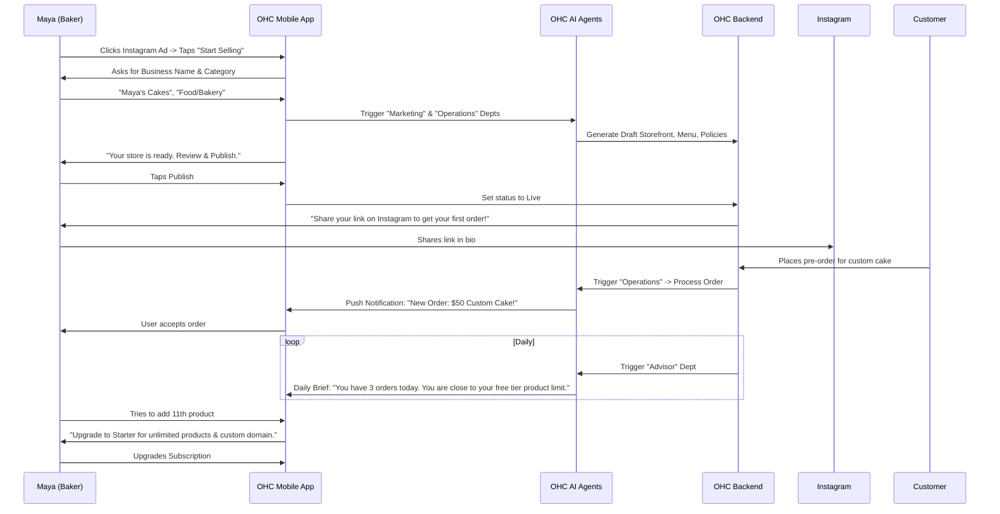

# 🔎 Scout: Tool Integration Research [Business Journey Architecture]

## Problem Statement
Small business owners often face high friction when launching and managing their businesses online. Non-technical users—such as bakers, handymen, boutique owners, music tutors, and food cart operators—find setting up storefronts, managing operations, and activating revenue streams overwhelming. The current process requires multiple distinct steps, understanding of technical concepts (e.g., domains, APIs), and piecing together disparate tools. This gap prevents users from achieving the platform's core promise: going from zero to a live business in under 10 minutes without manuals or code.

## Research Report
### Market Context
A comparison of the market shows that typical platforms focus heavily on configuration:
- **Shopify**: Excellent ecosystem but requires heavy configuration, theme selection, and manual setup of apps. Often takes days to launch a fully customized store.
- **Wix/Squarespace**: Template-driven and easier to start, but still requires manual design work and learning their specific UI paradigms. E-commerce features are bolted on.
- **GoDaddy**: Simplest entry, but lacks advanced CRM and business management features out of the box.

### OneHumanCorp (OHC) Opportunity
OHC can differentiate by leveraging AI agents to invisibly handle complexity. The onboarding process should be a conversation or a simple wizard, not a complex configuration dashboard. The platform needs a cohesive, end-to-end journey mapping that ensures every interaction, from acquisition to retention, feels premium and effortless.

### Findings
- **Acquisition**: Users need a clear, compelling CTA that speaks to their specific business type (e.g., "Start selling cakes today" instead of "Create a storefront").
- **Onboarding**: The flow must be progressive. Minimum inputs (Business Name, Type, Contact) first, with AI generating the rest (Storefront, Inventory, Policies) in the background.
- **Activation**: Success is defined by the first transaction or booking. The platform must guide users immediately to sharing their link or accepting an order.
- **Retention**: Proactive AI notifications (e.g., daily briefs, low inventory warnings, draft responses to DMs) keep users engaged without requiring them to actively manage the platform.
- **Revenue**: Upgrades should be contextual. For example, prompting an upgrade to 'Starter' only when a user hits a limit (e.g., trying to add the 11th product or customize their domain).
- **Referral**: Viral loops must be built into the customer experience (e.g., "Powered by OHC" on receipts or booking pages).

## Design Doc: Business Journey Architecture

### Key Design Decisions & Rationale
1. **Progressive Disclosure Onboarding**: Defer complex setup. Ask for the absolute minimum to get a functional storefront live. The AI "Manager" department handles the rest.
   - *Why*: Reduces cognitive load and ensures the "10-minute to live" promise.
2. **Contextual Upgrades (User-First Pricing)**: Never block a user with a hard error. Show soft limits with friendly, contextual upgrade prompts.
   - *Why*: Aligns with the business owner lens; users should upgrade because they are growing, not because they are penalized.
3. **AI-Driven Retention**: The "Advisor" AI proactively pushes insights and suggested actions via mobile notifications.
   - *Why*: Business owners are busy. They don't want to dig into analytics dashboards; they want actionable advice.
4. **Mobile-First UX**: The entire journey, especially onboarding and daily management, must be flawless on mobile (375px baseline).
   - *Why*: Personas like Carlos (Android only) and Maya (iPhone) run their businesses entirely from their phones.

### Architecture Diagrams

#### End-to-End Business Journey (Mermaid.js)

#### Mobile UX Flow (375px First)
1. **Welcome Screen**: Clean, Glassmorphism design. "What are you building today?" with large touch targets for business categories.
2. **Setup Wizard**: 3 steps max. Large text (Outfit), high contrast. Progress bar at the top.
3. **Dashboard (Live State)**:
   - Top: "Daily Brief" card (AI-generated summary).
   - Middle: Quick actions (Share Link, Add Product, View Orders).
   - Bottom: Recent activity feed.
4. **Action Context**: Tapping a notification opens a focused view (e.g., Order Details) with AI-suggested next steps (e.g., "Draft Reply: Thanks for the order!").

## Implementation Prompt
**For Implementer Agent:**
Implement the core onboarding state machine and the UI for the "Daily Brief" dashboard component.
- **CUJ (Critical User Journey)**: A new user downloads the app, completes a 3-step wizard (Name, Category, Goal), and lands on a dashboard displaying an AI-generated Daily Brief.
- **Acceptance Criteria**:
  1. Create a responsive Slint UI component for the onboarding wizard matching OHC premium tokens (Glassmorphism, 44x44px touch targets).
  2. Implement the state machine that transitions the user from 'New' -> 'Onboarding' -> 'Live'.
  3. Create a Slint UI component for the 'Daily Brief' card on the dashboard.
  4. Ensure 100% E2E test coverage using Playwright and visual regression testing via `screenshots/` at 375px.
  5. The UI must cleanly handle state without hard errors, applying the 'Progressive Disclosure' pattern.

**Priority**: P0
**Estimated Scope**: Medium
