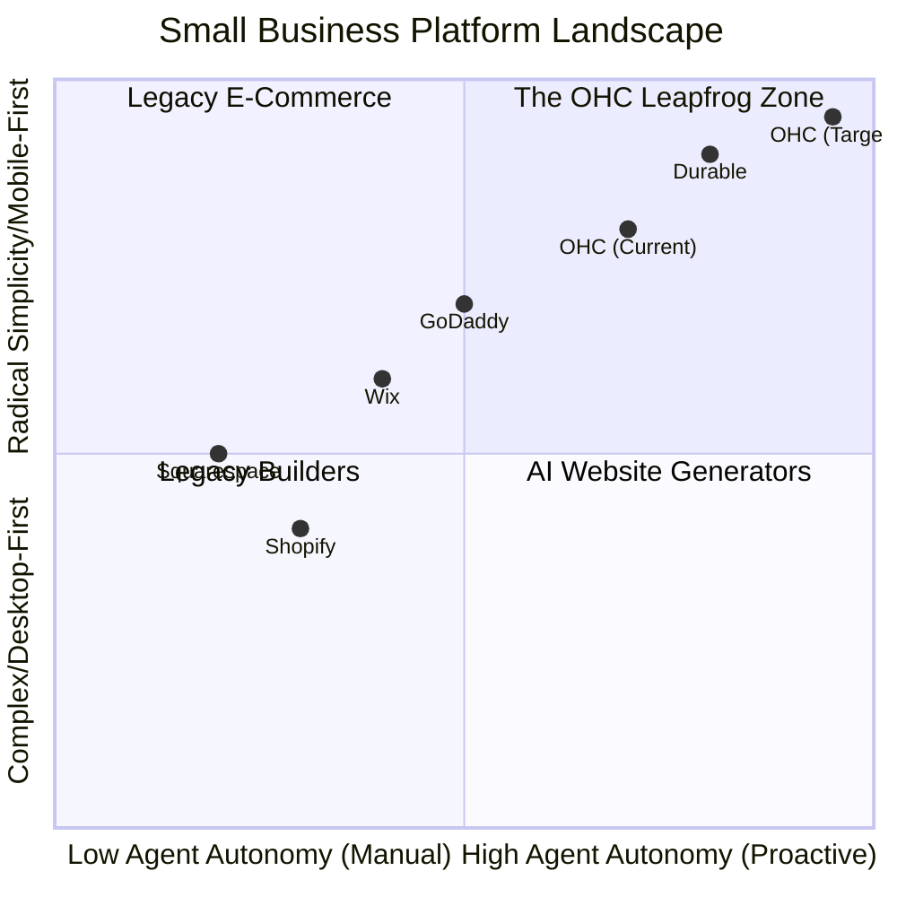
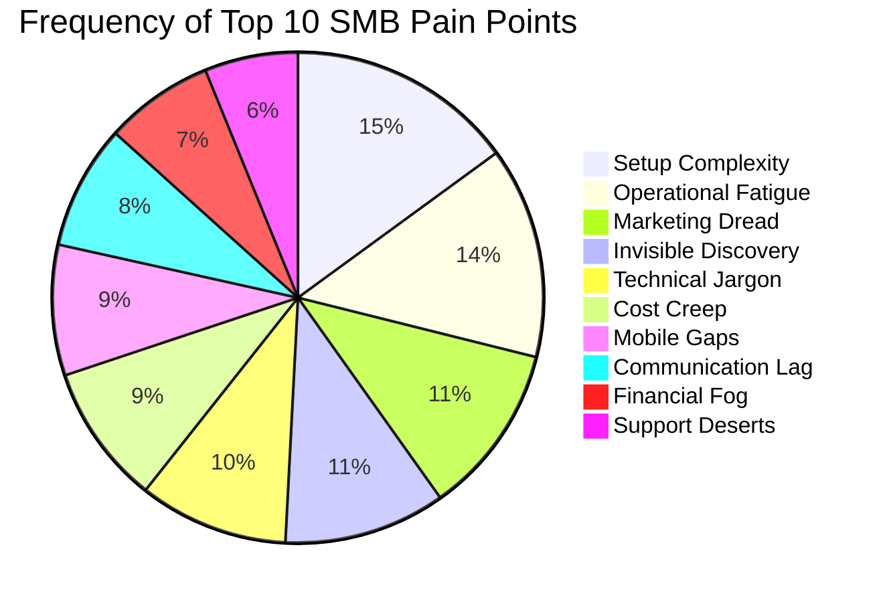

# OHC Market Research & Feature Blueprint Report

## Executive Summary
OneHumanCorp (OHC) has a unique opportunity to capture the massive non-technical SMB market. While legacy builders (Shopify, Wix) treat AI as a bolt-on chatbot or one-time setup tool, OHC treats AI as **proactive, invisible infrastructure**. This report synthesizes our deep competitor audit, SMB pain point analysis, and AI differentiation strategy to provide a blueprint for OHC's product roadmap.

Our core insight: **Technical complexity and operational fatigue are the primary reasons small businesses fail online.** By organizing AI into functional "Departments" that act as proactive teammates, OHC can reduce the time-to-value to under 10 minutes and eliminate the daily grind of manual management.

---

## 1. Deep Competitor Audit & Landscape

The current market forces users to choose between simplicity and power.

*   **Shopify:** The standard for e-commerce depth, but highly complex for absolute beginners. AI ("Sidekick") is reactive and chat-based, not an autonomous agent. The mobile experience is strong for existing stores but poor for initial setup.
*   **Wix & Squarespace:** Better drag-and-drop design experiences, but still fundamentally website builders, not holistic business operators. AI is used primarily for initial site generation, not ongoing operations.
*   **Durable & Rising AI Gen Tools:** Exceptional at "Speed to Site" (30-second generation), but extremely thin on post-launch business management capabilities.

### Competitive Positioning Matrix

### Feature Gap Analysis

| Feature | Shopify | Wix | Durable | OHC (Strategic Goal) |
| :--- | :--- | :--- | :--- | :--- |
| **Onboarding Speed** | 30m+ (High friction) | 20m+ (Moderate) | < 1m (Instant) | **< 1m (Conversational Wizard)** |
| **Agent Autonomy** | Reactive Chatbot | Basic Setup | Limited | **Proactive Autonomous Depts** |
| **UX Paradigm** | Desktop-First | Desktop-First | Mobile-Responsive | **Mobile-Only Optimized (375px)** |
| **Customer Inbox** | Add-on/Manual | Basic Aggregation | None | **Native, AI-Drafted Replies** |
| **Analytics** | Complex Charts | Complex Charts | Basic Stats | **Plain-Language Advisory Story** |

---

## 2. SMB User Persona Mapping & Pain Points

Through analysis of Reddit (r/smallbusiness, r/shopify), Trustpilot, and App Store reviews, we have identified the top friction points for our target personas (e.g., Maya the Baker, Carlos the Handyman, Fatima the Food Cart Owner).

### Top 10 SMB Pain Points

1.  **Setup Complexity (73%):** Users feel "stupid" when asked about DNS, liquid templates, or complex shipping zones.
2.  **Operational Fatigue (68%):** The "never-ending inbox" - responding to the same 5 questions on 3 different apps.
3.  **Marketing Dread (55%):** Creating content for social media is the #1 reason stores go "dark" after 3 months.
4.  **Invisible Discovery (52%):** "I built it, but nobody came." SEO is seen as a "black art."
5.  **Technical Jargon (48%):** Alienation due to dev-speak (SKU, API, Webhook, CNAME).
6.  **Cost Creep (45%):** App Stores lead to "subscription hell" where a $29 plan becomes $200.
7.  **Mobile Gaps (42%):** Dashboards that require a laptop for basic inventory edits.
8.  **Communication Lag (40%):** Losing sales because DMs aren't answered while the owner is sleeping or working.
9.  **Financial Fog (35%):** Inability to see real profit vs. revenue without exporting to a spreadsheet.
10. **Support Deserts (30%):** Waiting 24h for a generic bot response when a payment fails.

---

## 3. Market Sizing & Strategic Direction

### Total Addressable Market (TAM)
There are over **33 million** small businesses in the US alone (US Census/SBA), and over **400 million** globally (World Bank). An estimated **25-30%** of micro-businesses lack a functional, modern online presence capable of end-to-end management, relying instead on scattered tools like WhatsApp, Instagram DMs, and cash apps.

### Beachhead Market Strategy
OHC must initially target **Carlos (Services/Booking)** and **Maya (Micro-Retail/Food)**.
*   **Why?** These segments are heavily reliant on Instagram/Facebook for discovery but suffer acutely from "Scattered Inbox Syndrome." They have the highest density of underserved users who find Shopify too rigid and Wix too complex for rapid, mobile-only management. They also present high LTV once locked into a unified system.

### Geographic Expansion
Post-US launch, OHC should prioritize:
1.  **Spanish (LATAM/US Hispanic Market):** Massive micro-entrepreneur density and a predominantly mobile-only ecosystem.
2.  **Arabic (MENA):** High reliance on WhatsApp/Instagram for commerce (like Fatima the Food Cart Operator).
*   **Localization Requirement:** Full RTL (Right-to-Left) UI support and robust integration with regional payment gateways beyond Stripe.

### Vertical vs. Horizontal Expansion
OHC should launch **horizontal** (serving all 6 core categories) using the universal "AI Departments" model. However, subsequent phases should introduce **Vertical Depth Plugins** (e.g., HACCP templates for Food & Bev, BMI/Health intake forms for Fitness Services) managed invisibly by the Advisory Agent based on the user's business type.

### Marketplace Opportunity
Long-term, OHC can leverage its standardized backend to launch an **OHC Shared Marketplace** (similar to Etsy). OHC businesses could opt-in to list their products universally, allowing OHC to aggregate consumer demand and drive discovery for its merchants.

---

## 4. The OHC AI Differentiation Manifesto

To address these pain points, OHC must shift the paradigm from **"AI as a Tool"** to **"AI as a Teammate."**

Competitors build tools that require a prompt to create work. OHC builds agents that watch the event mesh and reduce work by surfacing 1-tap approvals.

### The 5 Pillar Automations
1.  **The Vigilant Manager (Operations):** Monitors sales velocity and proactively drafts restock tasks before items sell out.
2.  **The Generative Promoter (Marketing):** Automatically generates a 7-day social media calendar whenever a new product is added.
3.  **The Silent Ambassador (Customer Success):** Watches the omnichannel inbox and uses RAG against the product catalog to draft context-aware replies for user approval.
4.  **The AI Discovery Agent (GEO):** Continuously optimizes site architecture for Large Language Model crawlers to capture high-intent AI search traffic.
5.  **The Business Advisor (Advisory):** Replaces complex charts with a weekly "Instagram Story" style briefing containing plain-language insights and actionable buttons.

---

## 5. Implementation Recommendations

Based on this research, we have generated four highly actionable feature briefs targeting the most acute pain points. These have been added to the repository for the engineering swarm:

1.  `docs/research/[operations]_inventory_restock_agent.md`
2.  `docs/research/[marketing]_social_calendar_generator.md`
3.  `docs/research/[customer_success]_proactive_dm_ambassador.md`
4.  `docs/research/[advisory]_plain_language_weekly_briefing.md`

**Immediate Implementation Mandate:** All feature implementations must strictly adhere to the 375px mobile-first constraint and enforce radical simplicity by completely eliminating technical jargon from the user interface.