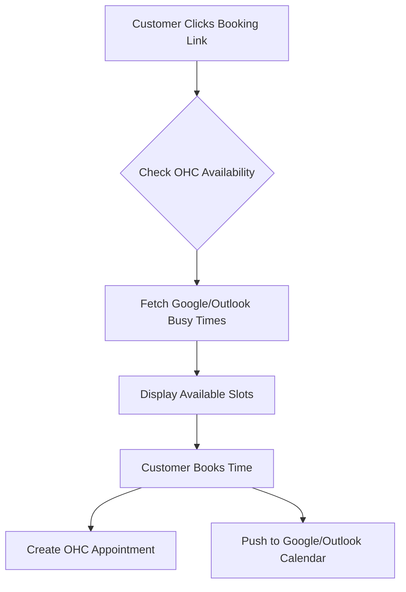
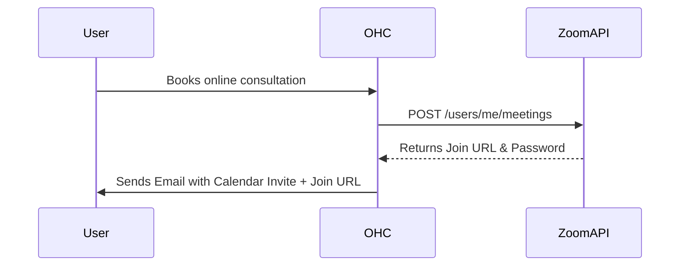

# OHC Tool Integration Research Report [Q4]

## Executive Summary
This report evaluates 7 key categories of third-party tool integrations for OneHumanCorp (OHC) targeting small business owners. The objective is to identify solutions that seamlessly blend into the OHC platform, ensuring minimal friction for non-technical users like Fatima (who has low English proficiency) or local shop owners. The evaluations assess suitability for both Cloud (multi-tenant) and Standalone (local, private) deployments.

## Persona Pain Points
| Persona | Business Type | Key Pain Points |
|---------|---------------|-----------------|
| **Fatima** | Local Bakery / Services | Language barrier, struggles with complex technical setups, relies heavily on SMS and direct messages (WhatsApp), needs simple scheduling. |
| **Carlos** | Independent Contractor | Managing appointments across multiple calendars, delayed payments, manual quoting and invoicing. |
| **Mei** | Boutique E-commerce | Tracking shipments manually, managing customer lists across different platforms, dealing with high shipping costs. |

---

## 1. Social Media Integration

### [Social Media] Unified Inbox Integration for WhatsApp & Instagram DMs

**Problem Statement:**
Small business owners like Fatima struggle to keep track of customer inquiries scattered across Instagram DMs, WhatsApp, and Facebook. They miss messages, leading to lost sales, and find it overwhelming to switch between apps continuously.

**Research Report:**
- **Market Context:** WhatsApp Business API and Instagram Graph API are the standards. Tools like Twilio or MessageBird aggregate these, but direct API integration via Meta is more cost-effective for a platform provider.
- **Ease of Use:** For the business owner, connecting accounts should be a simple OAuth flow ("Log in with Facebook").
- **Pricing:** Meta charges per conversation (WhatsApp) or is mostly free (Instagram DMs). Aggregators add a markup.
- **Reputation:** Meta APIs are robust but require business verification.
- **Deployment:**
  - **Cloud:** OAuth is straightforward. Webhooks can be received by the cloud server.
  - **Standalone:** Requires a cloud relay or OHC central proxy to route webhooks to local instances, or polling mechanisms if direct webhooks are blocked by NAT/Firewalls.

**Comparative Table (Aggregators vs Direct API):**

| Approach | Setup Complexity for OHC | Cost per Message | Reliability |
|----------|--------------------------|------------------|-------------|
| Direct Meta API | High | Low | High |
| Twilio / MessageBird | Low | Medium-High | High |

**Design Doc:**
- **Trigger:** User navigates to Settings > Channels and clicks "Connect WhatsApp/Instagram".
- **Action:** A wizard guides them through the Meta OAuth flow. Once connected, incoming messages populate a unified "Inbox" view in the OHC app.
- **User View:** A simple chat interface where they can reply to any customer, regardless of the source platform.

**Implementation Prompt:**
Create a unified inbox UI and the necessary backend integrations to connect Facebook/Instagram and WhatsApp accounts. The user should be able to authenticate their social accounts with a single click and view all incoming messages in one place. Replies from the OHC app should route back to the correct social platform.

**Priority:** P0
**Estimated Scope:** Large

---

## 2. Calendar & Scheduling

### [Scheduling] Google & Outlook Calendar Sync with Auto-Booking

**Problem Statement:**
Independent contractors like Carlos lose time going back and forth with clients to find a suitable meeting time. They also suffer from double-booking when they manually copy events from their personal Google Calendar to their business schedule.

**Research Report:**
- **Market Context:** Tools like Calendly and Cal.com dominate this space. Cal.com offers an open-source infrastructure (Standalone compatible) and a robust API.
- **Ease of Use:** Users just want to connect their Google/Outlook account and get a shareable link.
- **Pricing:** Cal.com has generous free tiers and enterprise API pricing. Direct Google/Microsoft API integration is free but requires maintaining sync logic.
- **Reputation:** Cal.com is highly regarded by developers and end-users for its simplicity.
- **Deployment:**
  - **Cloud:** Direct OAuth to Google/Microsoft APIs or via Cal.com API.
  - **Standalone:** Direct Google/Microsoft API integration is feasible with local OAuth redirects.

**Design Doc:**
- **Trigger:** User accesses the "Calendar" module and connects their external calendar.
- **Action:** System syncs busy/free times and generates a public booking page URL.
- **User View:** A customized booking page they can send to clients. The internal view shows a unified calendar without double bookings.

**Implementation Prompt:**
Implement a two-way calendar sync feature for Google Workspace and Microsoft Office 365. Provide a shareable booking link for the business owner that automatically calculates availability based on both their OHC schedule and connected external calendars.

**Priority:** P1
**Estimated Scope:** Medium

---

## 3. Email Marketing

### [Marketing] Simplified Customer Newsletter & Campaign Tool

**Problem Statement:**
Boutique owners like Mei want to notify their existing customers about a new product line or sale, but find tools like Mailchimp too complex, expensive, and bloated with enterprise features they don't understand.

**Research Report:**
- **Market Context:** Resend, SendGrid, and Mailgun provide developer APIs. Resend has excellent developer experience and high deliverability.
- **Ease of Use:** The owner should just select a group of customers and type a message, similar to writing a standard email.
- **Pricing:** Resend offers 3,000 free emails/month.
- **Reputation:** Resend is rapidly gaining market share due to its simplicity and reliable deliverability.
- **Deployment:**
  - **Cloud:** Easy integration with Resend API using OHC's verified domain or customer-verified domains.
  - **Standalone:** Users can provide their own SMTP credentials or use an OHC-provided relay service.

**Design Doc:**
- **Trigger:** User selects customers in the "Contacts" list and clicks "Send Campaign".
- **Action:** A simple WYSIWYG editor appears. On send, the system batches the emails through the email provider API.
- **User View:** A clean text editor (no complex drag-and-drop HTML builders) and a post-send dashboard showing open rates.

**Implementation Prompt:**
Build a lightweight email campaign tool integrated with the CRM. Users should be able to draft a text or simple image-based email, select a customer segment, and send the blast. Include basic analytics (sent, opened, bounced). Ensure SMTP configuration is available for Standalone mode.

**Priority:** P2
**Estimated Scope:** Medium

---

## 4. Payment Processing

### [Payments] Localized Payment Gateways (Mercado Pago, Razorpay)

**Problem Statement:**
Global users cannot rely solely on Stripe. In LATAM, Mercado Pago is essential. In India, Razorpay/Paytm is required. Without local payment options, businesses lose sales due to declined cards or lack of alternative payment methods (like PIX or UPI).

**Research Report:**
- **Market Context:** Mercado Pago dominates LATAM (Brazil, Argentina, Mexico). Razorpay is standard in India.
- **Ease of Use:** Business owners need a straightforward onboarding flow to connect their local bank accounts to these gateways.
- **Pricing:** Mercado Pago charges around 3-5% depending on settlement speed. Razorpay charges ~2%.
- **Reputation:** Both are trusted regional leaders.
- **Deployment:**
  - **Cloud:** Centralized webhook handling and API key management.
  - **Standalone:** Requires secure local storage of API keys and local webhook receivers (or polling).

**Comparative Table (Regional Gateways):**

| Gateway | Primary Region | Settlement Speed | Key Local Methods |
|---------|----------------|------------------|-------------------|
| Mercado Pago | LATAM | Instant to 14 days | PIX, Boleto |
| Razorpay | India | 2-3 days | UPI, RuPay |
| Stripe | US/EU/Global | 2-7 days | Credit Cards, ACH |

**Design Doc:**
- **Trigger:** User generates an invoice and selects available payment methods for their region.
- **Action:** Customer pays via a localized checkout page. OHC receives a webhook confirming payment and marks the invoice as paid.
- **User View:** The business owner sees money flowing into their local account and automated receipt generation.

**Implementation Prompt:**
Integrate regional payment gateways (starting with Mercado Pago for LATAM and Razorpay for India) as alternatives to Stripe. The checkout flow must dynamically present the correct local payment methods (e.g., PIX for Brazil) based on the business's location. Ensure webhooks are securely validated.

**Priority:** P0
**Estimated Scope:** Large

---

## 5. Shipping & Logistics

### [Logistics] Automated Shipping Label Generation & Tracking

**Problem Statement:**
E-commerce owners waste hours manually typing customer addresses into carrier websites (USPS, FedEx, local couriers) to buy labels. They also forget to send tracking numbers to customers, resulting in "Where is my order?" inquiries.

**Research Report:**
- **Market Context:** Shippo and EasyPost aggregate multiple carriers under a single API.
- **Ease of Use:** The user should just click "Fulfill Order" to get a printable PDF label.
- **Pricing:** Shippo offers a pay-as-you-go model (approx $0.05 per label + carrier fees).
- **Reputation:** Shippo is highly reliable for SMBs.
- **Deployment:**
  - **Cloud:** API calls to generate labels and register webhooks for tracking updates.
  - **Standalone:** Direct API integration using the user's own Shippo/EasyPost API key.

**Design Doc:**
- **Trigger:** User views an order in the "Orders" tab and clicks "Generate Label".
- **Action:** System fetches package dimensions, requests a label via Shippo API, and saves the PDF. A tracking link is auto-emailed to the customer.
- **User View:** A "Print Label" button appears on the order, and the order status automatically updates to "Shipped" then "Delivered".

**Implementation Prompt:**
Integrate a shipping aggregator API (e.g., Shippo) to allow business owners to purchase and print shipping labels directly from order detail pages. Automatically update the order status based on carrier tracking webhooks and notify the customer.

**Priority:** P1
**Estimated Scope:** Medium

---

## 6. SMS & Notifications

### [Communications] Automated SMS Reminders for Low-Tech Audiences

**Problem Statement:**
Many customers of local service businesses (like Fatima's bakery or a local clinic) do not use email or check it rarely. Appointment no-shows cost money, and SMS is the only reliable way to reach them.

**Research Report:**
- **Market Context:** Twilio and Vonage are industry standards. AWS SNS is an alternative but harder to configure.
- **Ease of Use:** The business owner shouldn't have to write SMS templates; they just enable "Send SMS reminders 24h before".
- **Pricing:** Twilio is ~ $0.0079 per message in the US, but international rates vary wildly.
- **Reputation:** Twilio is the gold standard for reliability.
- **Deployment:**
  - **Cloud:** Centralized Twilio account with subaccounts per tenant.
  - **Standalone:** User inputs their own Twilio credentials.

**Design Doc:**
- **Trigger:** An appointment is booked or an order is ready for pickup.
- **Action:** System queues an SMS job via Twilio API.
- **User View:** A toggle in settings: "Enable SMS Notifications (Costs apply)". The owner can see a log of sent SMS messages in the customer's profile.

**Implementation Prompt:**
Implement outbound SMS notifications using Twilio for critical events like appointment reminders and order pickups. Ensure the feature can be toggled on/off by the business owner and includes a mechanism for handling opt-outs (STOP replies). Must support bringing-your-own-key for Standalone mode.

**Priority:** P1
**Estimated Scope:** Small

---

## 7. Video Conferencing

### [Video] Auto-Generated Video Links for Remote Consultations

**Problem Statement:**
Consultants and tutors manually create Zoom links and copy-paste them into calendar invites, leading to mistakes, broken links, and frustrated clients waiting in the wrong virtual room.

**Research Report:**
- **Market Context:** Zoom API and Google Meet API. Jitsi is a strong open-source alternative for Standalone environments.
- **Ease of Use:** Video links should magically appear in the calendar invite when a "Remote Meeting" is booked.
- **Pricing:** Zoom requires a paid plan for API access beyond basics. Jitsi is free.
- **Reputation:** Zoom is universally recognized.
- **Deployment:**
  - **Cloud:** OAuth integration with Zoom/Google.
  - **Standalone:** Local Jitsi instance or direct API integration with personal OAuth tokens.

**Design Doc:**
- **Trigger:** A service is configured as "Online/Video Call". A customer books this service.
- **Action:** System calls Zoom/Meet API to generate a unique meeting room.
- **User View:** The business owner sees the "Join Meeting" button directly in their schedule view. They don't have to manage links.

**Implementation Prompt:**
Add video conferencing integration (Zoom and Google Meet) for service bookings. When a virtual service is booked, automatically generate a unique meeting link and embed it into both the business owner's schedule and the customer's confirmation email/calendar invite.

**Priority:** P2
**Estimated Scope:** Small
