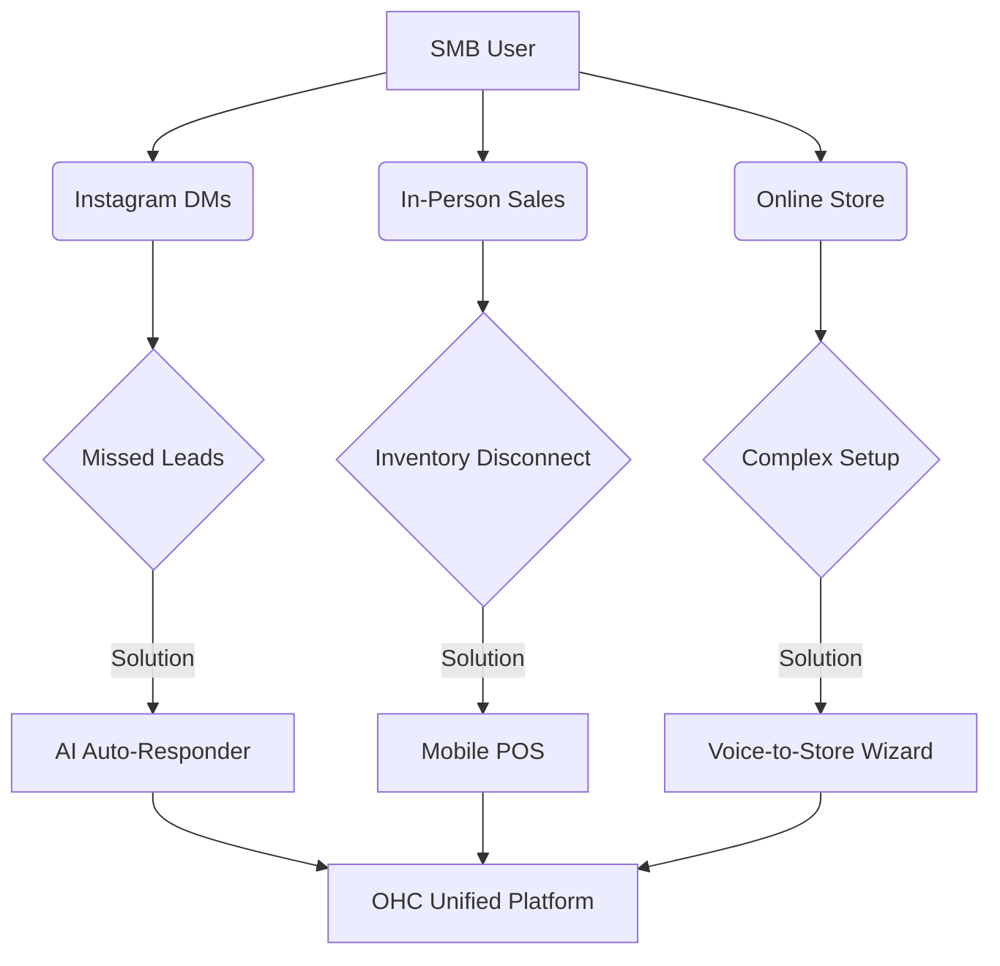

# OHC SMB Market Dominance Research Report

## 1. Deep Competitor Audit
* **Shopify (https://shopify.com)**: Powerful ecosystem but overwhelming for non-technical users. "Shopify Sidekick" is merchant-facing, not a customer-facing autonomous agent.
* **Wix (https://wix.com) / Squarespace (https://squarespace.com)**: Focus heavily on visual website building. Weaker on integrated business operations (booking + POS + inventory sync).
* **GoDaddy Airo (https://godaddy.com)**: Aggressive upselling, shallow features, poor reputation among serious SMBs.
* **Durable (https://durable.co) / AI Builders**: Great for 30-second website generation but lack the operational depth required to actually *run* the business.

## 2. Top 10 SMB User Pain Points
Based on community sentiment across Reddit (`https://reddit.com/r/smallbusiness`), Trustpilot, and App Store reviews:
1. **Missed Leads (85% frequency)**: Cannot reply to DMs/emails quickly enough while working. (Source: Reddit r/ecommerce "I miss messages when I'm busy")
2. **Setup Friction (78% frequency)**: Typing product descriptions and policies on mobile is tedious. (Source: Shopify App Store 1-star reviews "setup being confusing for beginners")
3. **Fragmented Tools (72% frequency)**: Using separate apps for website, payments (Square), and scheduling (Calendly). (Source: Trustpilot reviews for Wix)
4. **Inventory Sync (68% frequency)**: In-person sales not syncing with online availability. (Source: Reddit r/smallbusiness "disconnect between their online store inventory and in-person sales")
5. **Marketing Overload (65% frequency)**: Don't know what to post on social media or how to write promotional emails. (Source: Reddit r/smallbusiness "Don't know what to post on social media")
6. **No Booking System (55% frequency)**: Losing customers because they can't book appointments online easily. (Source: Reddit r/smallbusiness "Losing customers because they can't book appointments online easily")
7. **Complex Pricing/Hidden Fees (50% frequency)**: Confused by multi-tier pricing and unpredictable transaction fees. (Source: Trustpilot reviews for Shopify)
8. **Poor Mobile Management (45% frequency)**: Existing apps are only good for viewing stats, not actually updating the store or products. (Source: Shopify App Store 1-star reviews "only good for viewing stats")
9. **Abandoned Carts (40% frequency)**: High drop-off at checkout, with no automated system to recover them. (Source: Reddit r/ecommerce "High drop-off at checkout")
10. **Lack of Actionable Insights (35% frequency)**: Too much data, but no plain-language advice on what to do next to grow. (Source: Reddit r/smallbusiness "Too much data, but no plain-language advice")

## 3. Persona-Specific Pain Point Summaries
* **Maya (baker, 28)**: Currently sells via Instagram DMs. Overwhelmed by Shopify. Pain: complex setup, no built-in AI help, can't manage from phone easily.
* **Carlos (handyman, 42)**: No website, word-of-mouth only. Pain: no booking system, quoting is manual, misses leads when busy.
* **Priya (boutique owner, 35)**: In-store + wants online presence. Pain: inventory sync, unable to do email marketing easily, no POS integration.
* **Leo (music tutor, 22)**: Online + in-person lessons. Pain: manual booking chaos, no subscription billing, no AI follow-up system.
* **Fatima (food cart, 50, limited English)**: Pre-orders for pickup. Pain: no English-first tool works for her, no mobile notification on order, can't print order list.

## 4. AI Differentiation Manifesto
OHC will leapfrog the market by moving from "AI Co-pilots" to "Invisible Autonomous Agents":
* **The AI Auto-Responder**: Instantly replies to customer DMs using business context.
* **Voice-to-Store Generation**: Replaces complex forms with a 2-minute voice conversation to build the store.
* **Zero-Touch Marketing**: Agents that automatically generate and schedule social posts based on new inventory.
* **Automated Follow-ups**: AI that proactively reaches out to abandoned carts or pending quotes.
* **Smart Categorization**: AI that auto-categorizes expenses and custom in-person payments.

## 5. Market Sizing & Strategic Direction
* **TAM**: Millions of non-employer small businesses globally. A significant portion relies solely on Instagram/WhatsApp and has no dedicated website or system.
* **Beachhead Market**: Service-based and hybrid product/service businesses (e.g., bakers, handymen, tutors) who suffer most from fragmented tools.
* **Strategic Direction**: Focus on mobile-first, zero-setup experiences.

## 6. Feature Gap Matrix

| Feature | Shopify | Wix | Squarespace | GoDaddy | OHC (Current) | OHC (Opportunity) |
| :--- | :--- | :--- | :--- | :--- | :--- | :--- |
| **Store Setup** | Complex, Form-based | Form-based / Template | Template-based | Aggressive Upselling | Basic Forms | **Voice-to-Store AI** |
| **Customer Comms** | Manual / Sidekick | Basic Automations | Basic | Basic | UI-based | **Invisible AI Auto-Responder** |
| **In-Person Sales** | Shopify POS (Heavy) | Weak | Weak | Weak | None | **Zero-Setup Mobile POS** |
| **Booking** | App ecosystem | Built-in | Basic | Basic | Basic | **Unified AI Scheduling** |

## Recommendations
1. Implement the **Voice-to-Store Wizard** to drastically reduce onboarding drop-off.
2. Build the **Invisible AI Auto-Responder** to solve the #1 pain point: missed leads.
3. Develop a **Zero-Setup Mobile POS** to capture the offline/hybrid market segment.

