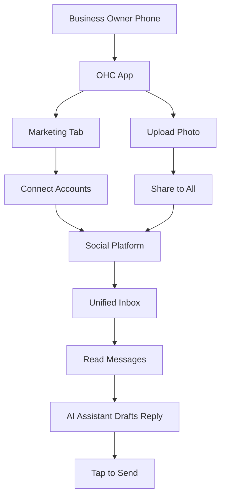
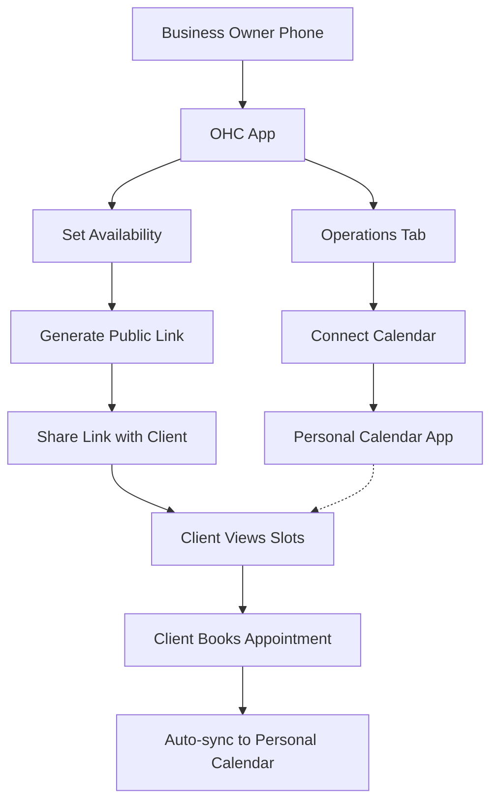
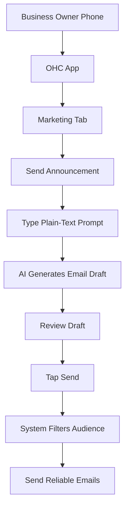
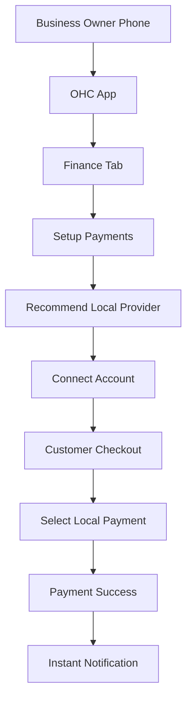
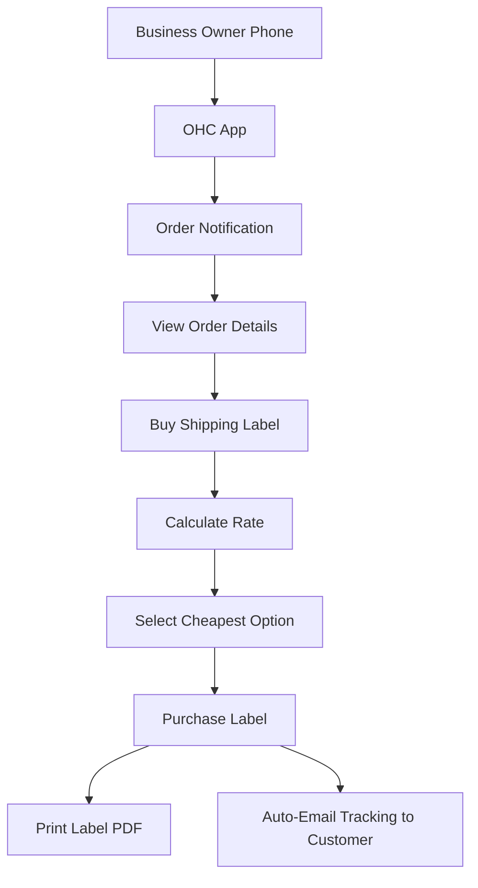
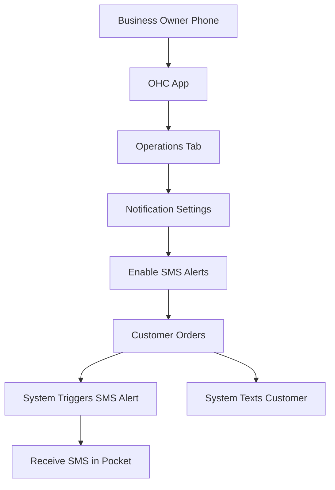
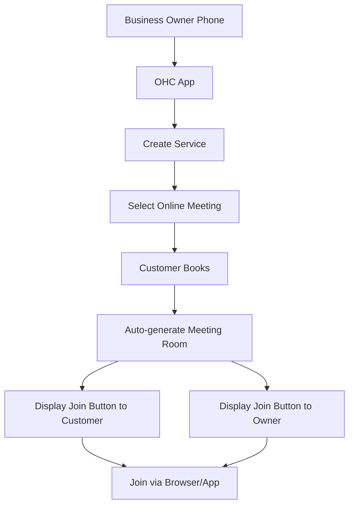

# Scout: Tool Integration Research Q2

This report details the evaluation of 7 integration tools across requested categories to expand OneHumanCorp's capabilities for small business owners.

## 1. Social Media Integration
**Title**: Integrate Ayrshare for Unified Social Media Inbox and Cross-Posting
**Problem Statement**: Maya the Baker and Carlos the Handyman spend too much time jumping between Instagram DMs, Facebook Comments, and TikTok. They want a single inbox and a way to post to multiple platforms at once without understanding technical integrations.
**Research Report**:
- Ayrshare provides a unified gateway for posting and retrieving messages across all major social networks (Instagram, Facebook, X, TikTok, LinkedIn).
- Competitor Wix has basic integrations, but Ayrshare makes it easy to support a wider array natively.
- Pricing: Free tier available, then scales per user.
- Fits OHC’s "The Promoter" agent to automate posts and "The Ambassador" to draft replies.
- Non-technical users benefit by never leaving the OHC interface.
- Works in Cloud mode well; Standalone mode might require personal Ayrshare API keys or direct OAuth.
**Design Doc**:
As a business owner, I want my life to be simpler. I don't want to log in to 5 different apps every morning.

**Mobile UX Flow**:
1. I open the OHC app and tap the "Marketing" tab at the bottom.
2. I tap a big friendly button that says "Connect Social Accounts".
3. A simple login window pops up where I sign into Instagram and Facebook.
4. Once connected, a new "Customer Inbox" appears. When someone messages me on Instagram, it shows up here. My virtual assistant (The Ambassador) suggests a polite reply, which I can send with one tap.
5. When I want to share a photo of my new cake design, I upload it once in the OHC app, tap "Share to all", and it posts to both Instagram and Facebook.

**Architecture**:

**Implementation Prompt**: Implement an integration where users can link Instagram and Facebook, allowing OHC AI agents to read incoming messages and draft replies in the unified inbox, and schedule out outbound picture posts.
**Priority**: P1
**Estimated Scope**: Large

## 2. Calendar & Scheduling
**Title**: Integrate Cal.com for Zero-Config Booking & Calendar Sync
**Problem Statement**: Leo the Music Tutor and Carlos the Handyman lose customers due to back-and-forth scheduling via text. They need a public booking link that syncs with their personal Google Calendar seamlessly.
**Research Report**:
- Cal.com is an open-source scheduling infrastructure. It handles timezone math, calendar conflict resolution, and booking pages out-of-the-box.
- It is highly embeddable and supports a self-hosted option, making it perfectly compatible with both Cloud (SaaS) and Standalone OHC modes.
- Free tier available for individuals; great for our free tier users.
- Alternative is building from scratch, which is error-prone.
**Design Doc**:
As a business owner, I hate the back-and-forth texting of "what time works for you?". I just want to send a link and wake up to new appointments.

**Mobile UX Flow**:
1. I open the OHC app and tap the "Operations" tab.
2. I see a section called "Calendar & Bookings" and tap "Connect My Calendar".
3. I log into my Google or Apple calendar.
4. My virtual assistant asks me, "What hours are you available for bookings?" I select 9 AM to 5 PM, Monday to Friday.
5. The app gives me a short link (like ohc.com/leo-bookings). I can text this to clients.
6. When a client taps the link, they see my available slots. If I add a doctor's appointment to my personal Google calendar, that slot magically disappears from my public booking page. No double-booking ever.

**Architecture**:

**Implementation Prompt**: Embed Cal.com's infrastructure so users can sync their personal calendars and provide a public booking widget on their storefront that prevents double-booking.
**Priority**: P0
**Estimated Scope**: Medium

## 3. Email Marketing
**Title**: Integrate Listmonk for Embedded, No-Jargon Email Campaigns
**Problem Statement**: Priya the Boutique Owner wants to email her past customers when new stock arrives but finds Mailchimp confusing and expensive. She just wants to say "send this to everyone who bought last month."
**Research Report**:
- Listmonk is an open-source, self-hosted newsletter and mailing list manager.
- It is lightweight (Go + PostgreSQL), aligning perfectly with the OHC backend stack.
- Zero extra SaaS costs for OHC Standalone users; minimal scaling costs for Cloud.
- Simplifies list management and supports template-based sending without complex drag-and-drop builders.
**Design Doc**:
As a business owner, sending an email newsletter sounds scary. I just want to tell my phone what I want to say, and have it handle the rest.

**Mobile UX Flow**:
1. I open the OHC app and go to the "Marketing" tab.
2. I tap "Send an Announcement".
3. Instead of a complicated builder, I just type a plain-text instruction: "Draft an email to everyone who bought shoes last month, telling them about our new summer dress collection. Make it sound exciting."
4. My virtual assistant generates a beautiful, branded email with pictures of my new dresses.
5. I tap "Review" to see how it looks on a phone screen.
6. It looks great, so I tap "Send". The system automatically figures out the list of "shoe buyers from last month" and sends the emails out reliably.

**Architecture**:

**Implementation Prompt**: Integrate Listmonk as the underlying email engine to allow users to trigger marketing emails to specific customer segments directly from the OHC dashboard.
**Priority**: P2
**Estimated Scope**: Medium

## 4. Payment Processing
**Title**: Expand Payments with Mercado Pago for LATAM Users
**Problem Statement**: Non-US users in Latin America cannot rely solely on Stripe due to high fees, lack of local currency support, and specific local payment methods (like Pix in Brazil or OXXO in Mexico).
**Research Report**:
- Mercado Pago is the dominant payment gateway in LATAM.
- Supports local payment methods which are critical for conversion (often >50% of transactions).
- API is well-documented. Settlement times are faster locally compared to cross-border Stripe.
- Works for both Cloud (via OHC platform account) and Standalone (user supplies API keys).
**Design Doc**:
As a business owner in Latin America, I need my customers to be able to pay with the methods they trust, like Pix or OXXO, directly on my phone.

**Mobile UX Flow**:
1. I open the OHC app and go to the "Finance" tab.
2. In the "Setup Payments" section, the app notices I am in Brazil and highlights "Mercado Pago" as the recommended option.
3. I tap "Connect Mercado Pago" and log into my existing account.
4. Now, when a customer checks out on my public link, they see "Pix" as a payment option.
5. They pay, and the money goes straight to my local account, and the OHC app instantly chimes with a "New Order Paid!" notification.

**Architecture**:

**Implementation Prompt**: Add Mercado Pago as a payment provider alternative to Stripe, allowing users in supported LATAM countries to accept local payment methods via the OHC checkout flow.
**Priority**: P1
**Estimated Scope**: Large

## 5. Shipping & Logistics
**Title**: Integrate EasyPost for Painless Shipping Labels & Tracking
**Problem Statement**: Priya the Boutique Owner hates manually copying addresses to USPS/FedEx to buy shipping labels. She wants one button to print a label and auto-email the tracking number.
**Research Report**:
- EasyPost provides a single, unified gateway for 100+ carriers (USPS, FedEx, UPS, DHL).
- Competitive pricing (free tier for low volume, pennies per label after).
- Abstracts away complex carrier-specific intricacies and handles tracking notifications.
- Great fit for OHC physical product merchants.
**Design Doc**:
As a business owner shipping physical goods, I hate copy-pasting addresses into a separate shipping website. It takes forever and I make mistakes.

**Mobile UX Flow**:
1. I get a notification on my phone: "New order from Sarah!". I open the order details in the OHC app.
2. At the bottom of Sarah's order, there is a big button that says "Buy Shipping Label".
3. I tap it. The app already knows the weight of the item (from my product catalog) and Sarah's address. It shows me the cheapest option (e.g., USPS for $4.50).
4. I tap "Purchase Label".
5. A PDF of the shipping label pops up on my phone, ready to print to my wireless printer.
6. The app automatically emails Sarah her tracking number. I don't have to type anything.

**Architecture**:

**Implementation Prompt**: Connect EasyPost to the order fulfillment flow so users can generate shipping labels and automatically send tracking updates to customers.
**Priority**: P1
**Estimated Scope**: Medium

## 6. SMS & Notifications
**Title**: Integrate Twilio for Global SMS Alerts & Customer Notifications
**Problem Statement**: Fatima the Food Cart Operator doesn't have a reliable internet connection at her cart and relies on SMS text messages to know when a pre-order arrives.
**Research Report**:
- Twilio is the industry standard for SMS and WhatsApp messaging globally.
- Reliable delivery, deep global coverage.
- Supports WhatsApp, which is critical for markets outside the US.
- Simple setup, integrates well with our systems.
- Costs per message, can be passed to the tenant or subsidized in premium tiers.
**Design Doc**:
As a food cart operator, I am too busy cooking to check an app, and my cell service is spotty anyway. I need to know the second an order comes in via a regular text message.

**Mobile UX Flow**:
1. I open the OHC app, go to "Operations", and tap "Notification Settings".
2. I toggle on "Send me a text message for new orders".
3. I enter my phone number to confirm.
4. Now, I put my phone in my pocket. When a customer orders a hot dog online, my phone buzzes with a standard SMS text: "New Order! 2 Hot Dogs, 1 Soda. Pickup in 15 mins for John."
5. If John prefers texts, my virtual assistant also texts John: "Your hot dogs are ready for pickup!"

**Architecture**:

**Implementation Prompt**: Add Twilio integration to dispatch SMS order notifications to the business owner and provide SMS-based order updates to end customers.
**Priority**: P0
**Estimated Scope**: Small

## 7. Video Conferencing
**Title**: Embed Jitsi Meet for Zero-Setup Online Lessons
**Problem Statement**: Leo the Music Tutor currently has to manually create Zoom links, email them to students, and deal with students losing the link. He needs an automated, branded video room.
**Research Report**:
- Jitsi Meet is a fully open-source, WebRTC-based video conferencing tool.
- Requires no account for the student. Works natively in the browser and mobile.
- OHC can host a Jitsi instance (for Cloud mode) or point to public servers (for Standalone), saving users from needing a paid Zoom subscription.
- Completely seamless integration with no technical setup required by the user.
**Design Doc**:
As a music tutor offering online lessons, I hate creating Zoom links and having students text me "what's the link again?" 5 minutes before the lesson.

**Mobile UX Flow**:
1. I create a new service in the OHC app called "1-hour Guitar Lesson".
2. Under "Location", I select the option "Online Meeting".
3. When a student books this lesson, the confirmation screen simply says "Join Meeting" with a big button.
4. They don't need to download an app or create an account. At the scheduled time, they tap the button and their camera turns on right in their phone browser.
5. I tap the same button from my OHC app schedule to join them. We just talk.

**Architecture**:

**Implementation Prompt**: Integrate auto-generated Jitsi Meet links for bookings designated as "Online", providing a seamless, no-login video conferencing experience for service-based businesses.
**Priority**: P2
**Estimated Scope**: Small