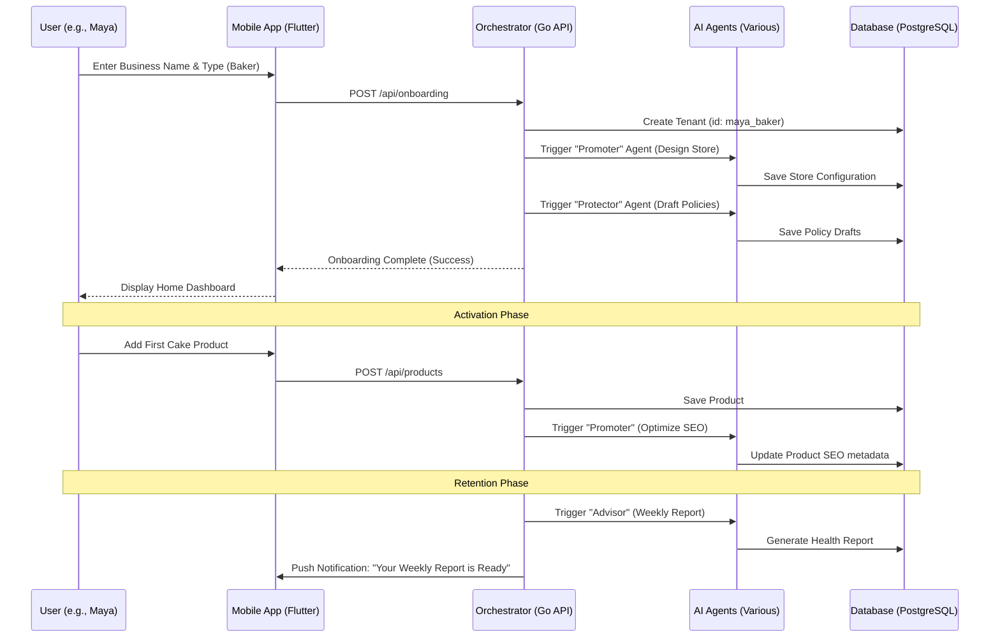
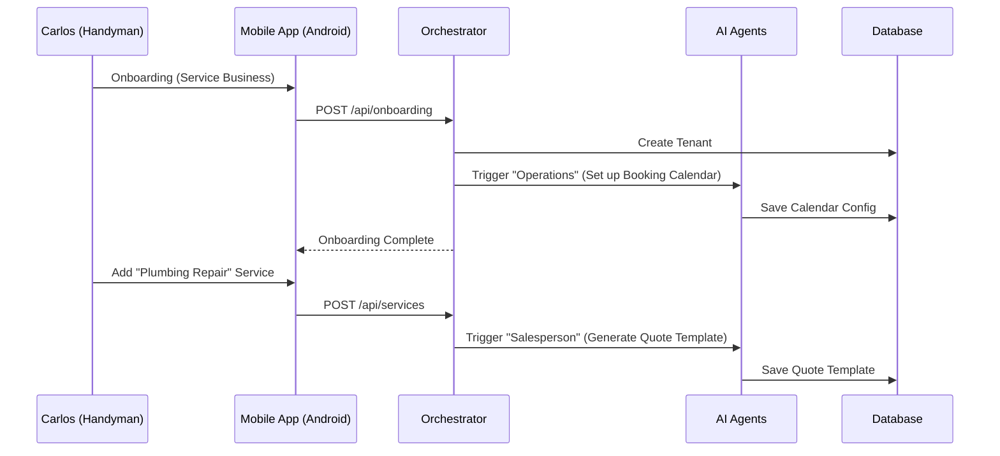
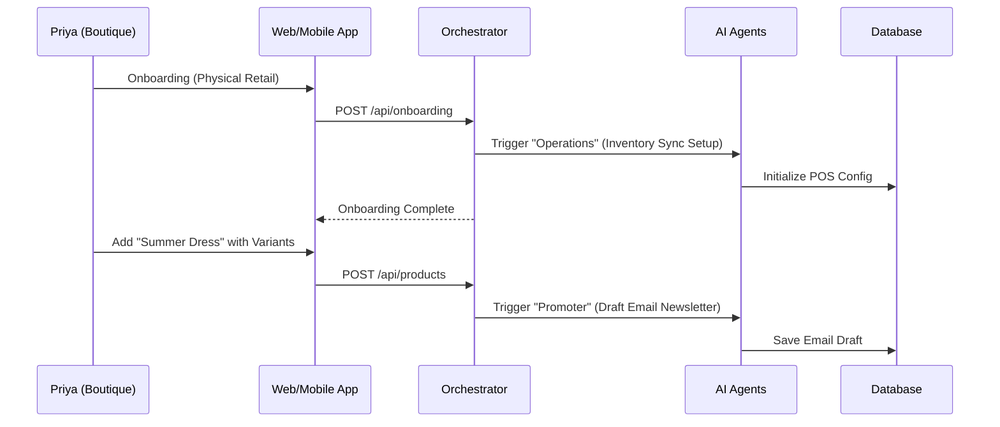
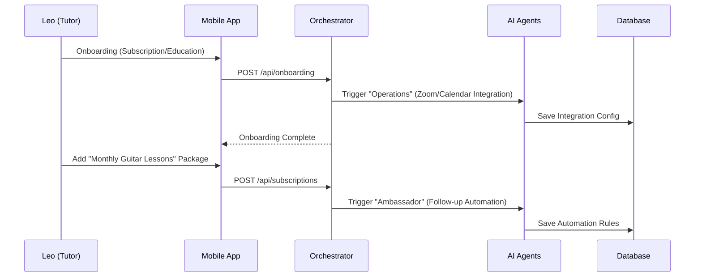
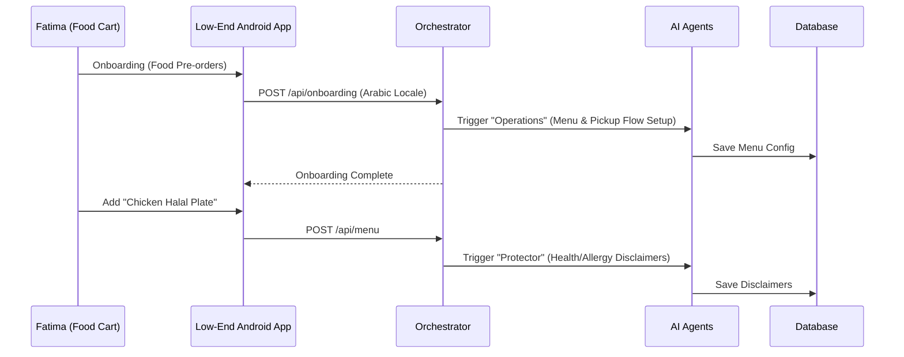

# Issue Brief: Business Journey Architecture

## Title
Business Journey Architecture

## Problem Statement
Small business owners, especially those without technical expertise (like Maya the Baker or Carlos the Handyman), often find the journey of launching and running an online business daunting. They need a seamless, guided path from initial discovery to successful operation. The current onboarding and user lifecycle flows across competitor platforms often assume a certain level of technical or business acumen, leading to high friction, abandonment, and frustration. We must define the end-to-end user journey for all personas to ensure OHC delivers on its promise of "zero → live business in under 10 minutes."

## Research Report
### Competitive Analysis
- **Shopify:** Very comprehensive, but the onboarding process is overwhelming for true beginners. It requires setting up multiple settings (shipping, taxes, domains) before feeling "live." Often takes 30-60+ minutes to establish a basic storefront.
- **Wix:** Easier initial setup with ADI (Wix AI), but the transition from AI-generated design to actual business management is disjointed. Users often struggle with modifying templates later.
- **Squarespace:** Excels at portfolio/creative onboarding but falls short for service businesses (like Carlos). The journey is heavily design-focused, sometimes ignoring the "business operations" aspect.
- **GoDaddy:** Fast, simple onboarding, but extremely limited in functionality. The journey plateaus quickly when the business needs to grow.

### OHC Opportunity
OHC can differentiate by providing a unified, context-aware journey tailored to the specific persona. If Maya signs up as a baker, the onboarding should immediately focus on what she needs (catalog, deposits) and defer less critical steps. The retention and revenue loops must be driven by proactive AI agents, minimizing the owner's cognitive load.

## Design Doc

### High-Level Architecture
- **Acquisition:** Driven by relatable, persona-specific CTAs (e.g., "Start selling custom cakes today"). Focus on social media link-in-bio discovery and word-of-mouth.
- **Onboarding:** A dynamic, step-by-step wizard. Inputs are minimized.
  - Phase 1 (Core): Business Name, Type (e.g., Service, Physical), Basic Contact.
  - Phase 2 (AI Generation): AI generates the initial storefront, inventory scaffolding, and basic policies.
  - Phase 3 (Deferred): Bank account connection, custom domain (prompted later when value is proven).
- **Activation:** The "Aha!" moment.
  - Day 1: Store is live and accessible via OHC subdomain. First product/service added.
  - Week 1: First customer interaction (message or order).
- **Retention:** AI-driven engagement. Push notifications for new activity. Weekly, plain-language business health reports.
- **Revenue:** Upsell triggers based on usage (e.g., "You've reached your free product limit. Upgrade for unlimited and a custom domain.").
- **Referral:** Built-in sharing tools (QR codes, shareable links).

### Mobile UX Flow (375px First)
1.  **Welcome Screen:** Simple, large typography. "What are you building today?"
2.  **Wizard (2-3 screens):** Short inputs. Use native keyboards. Clear progress indicators.
3.  **Loading Screen:** Glassmorphism spinner. "Our AI agents are designing your store..."
4.  **Dashboard (Home):** The control center. Agent activity feed prominently displayed.
5.  **Next Actions:** A persistent, dismissible card at the top suggesting the next step (e.g., "Add your first service").

### Sequence Diagram

## Implementation Prompt
Implement the End-to-End Business Journey backend flows and Mobile UI.
1. Create the backend API endpoints for the dynamic onboarding wizard, ensuring tenant creation and initial AI agent triggers are atomic.
2. Develop the Flutter mobile views for the onboarding wizard, the main dashboard, and the "Next Actions" suggestion system.
3. The UI must adhere strictly to the OHC Design System (Glassmorphism, Outfit/Inter typography, 375px baseline).
4. Ensure the onboarding process is robust and handles temporary network failures gracefully using optimistic UI updates and retry queues.

## Priority
P0

## Estimated Scope
Large

### Additional Persona Journeys

#### Carlos the Handyman (Service Persona)

#### Priya the Boutique Owner (Physical/In-Store Persona)

#### Leo the Music Tutor (Subscription Persona)

#### Fatima the Food Cart Operator (Food/Beverage Persona)

