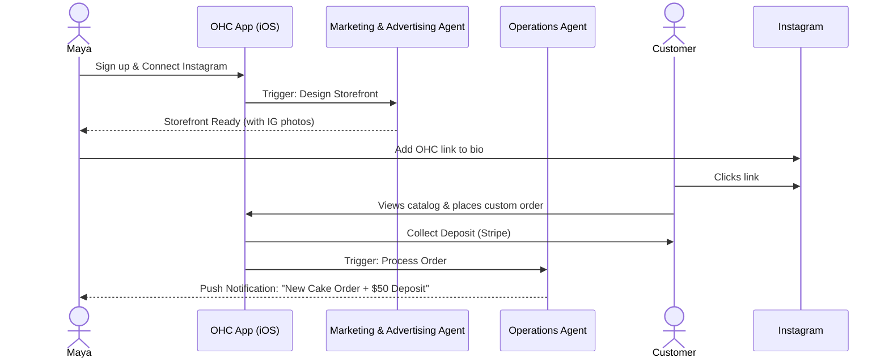
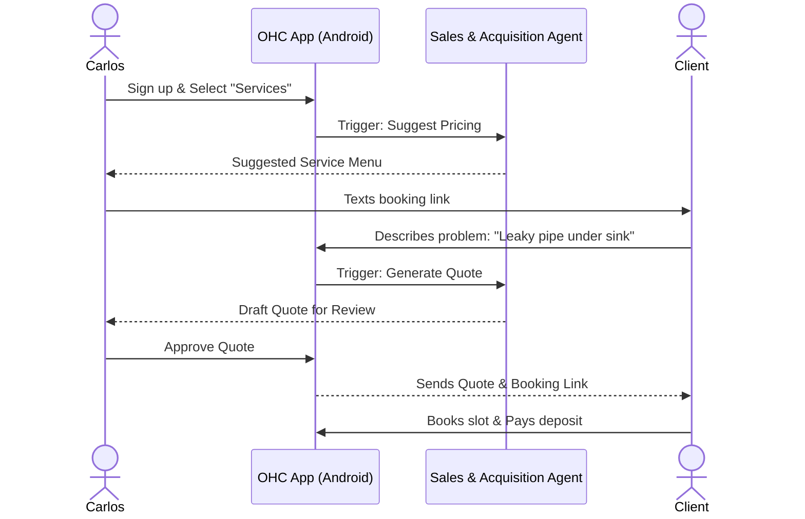
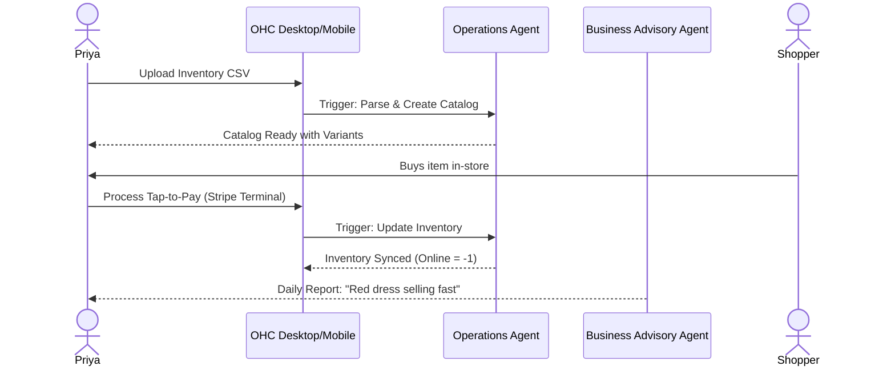
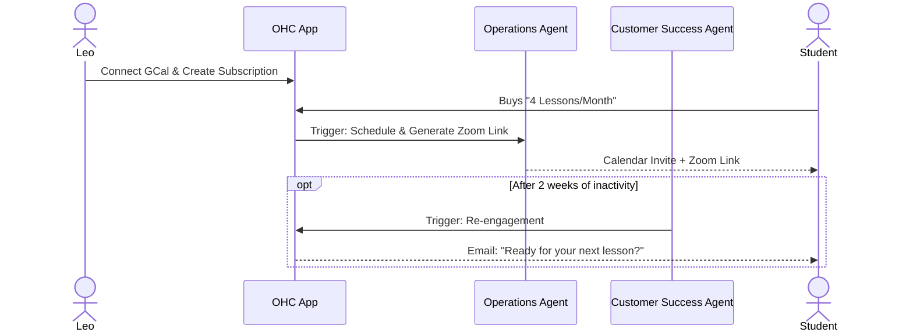
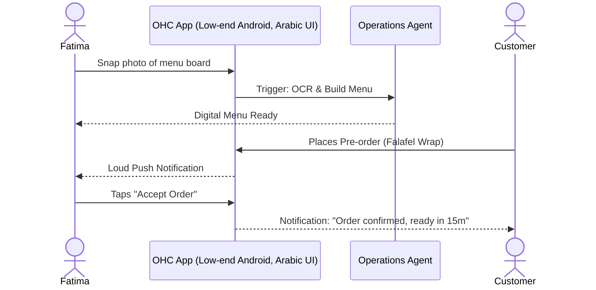

# Business Journey Architecture

## Overview
This design document maps the complete end-to-end user journey for each of the core OHC personas (Maya, Carlos, Priya, Leo, Fatima) from the perspective of a non-technical small business owner. It covers the full lifecycle from acquisition to referral, highlighting friction points and where AI Agent Departments step in to invisibly handle complexity.

## 1. Persona Journeys

### 1.1 Maya (The Home Baker)
**Profile:** 28, non-technical, sells custom cakes via Instagram DMs. Runs everything from iPhone.
**Needs:** Storefront with photo catalog, deposit-based custom orders, AI Instagram DM replies.

*   **Acquisition:** Discovers OHC via a TikTok ad showing "Turn your IG DMs into a real business in 5 minutes."
*   **Onboarding:** Downloads iOS app. Wizard asks for business name ("Maya's Bakes") and connects her Instagram account. The Marketing & Advertising agent auto-generates a storefront using her recent Instagram cake photos.
*   **Activation:** Maya receives her first custom cake order through the new storefront link in her bio, complete with a $50 deposit paid via Stripe.
*   **Retention:** Daily push notifications: "You have 3 new cake inquiries" and "Operations agent has scheduled your weekend deliveries."
*   **Revenue:** Upgrades to Starter tier when she hits the 10-product limit on the Free tier and wants to add a custom domain (mayasbakes.com).
*   **Referral:** Shares her "How I run my business" dashboard screenshot on Instagram Stories, featuring the OHC watermark.

*Friction Point:* Connecting Instagram might require OAuth steps that feel technical. Must use a 1-click seamless flow.

---

### 1.2 Carlos (The Freelance Handyman)
**Profile:** 42, non-technical, relies on word of mouth. Android phone only.
**Needs:** Service listings, booking calendar with deposits, customer inbox, AI quotes.

*   **Acquisition:** A friend (another contractor) texts him an invite link: "Use this so people stop calling you at 9 PM."
*   **Onboarding:** Downloads Android app. Selects "Services" template. Inputs "Plumbing" and "Painting". The Sales & Acquisition agent suggests standard pricing based on local averages.
*   **Activation:** A homeowner books a "General Repair" slot for Tuesday at 2 PM and pays a $25 booking fee.
*   **Retention:** Uses the unified customer inbox daily to review new AI-generated quotes before they are sent to clients.
*   **Revenue:** Remains on Free tier initially, but pays the 2% transaction fee on bookings. Later upgrades to Starter for SMS reminders to clients.
*   **Referral:** Gives his OHC referral code to his electrician subcontractor.

*Friction Point:* Generating quotes requires accurate problem descriptions. The app must guide the client to upload photos of the issue.

---

### 1.3 Priya (The Boutique Owner)
**Profile:** 35, semi-technical, sells in-store and online. Uses iPhone and MacBook.
**Needs:** Storefront + inventory sync, variants, in-person POS, mobile analytics.

*   **Acquisition:** Searching Google for "easy POS system with website" and clicks an OHC search ad.
*   **Onboarding:** Signs up on desktop. Uploads a CSV of her current inventory. The Operations agent maps the columns and creates the product catalog with size/color variants.
*   **Activation:** Connects a Stripe Terminal reader via the OHC app and processes her first in-store tap-to-pay transaction. Online inventory instantly decrements.
*   **Retention:** Checks the Business Advisory agent's daily mobile dashboard: "Today's Revenue: $450. The red summer dress is trending."
*   **Revenue:** Subscribes to Pro tier ($29/mo) immediately for unlimited products and advanced analytics.
*   **Referral:** Recommends OHC in a local Facebook group for small business owners.

*Friction Point:* Hardware pairing (Stripe Terminal) can be notoriously buggy. The UI must have robust, animated troubleshooting steps.

---

### 1.4 Leo (The Music Tutor)
**Profile:** 22, non-technical, teaches online and in-person. Needs link-in-bio for TikTok.
**Needs:** Lesson booking (Calendar sync), auto-Zoom links, subscription packages.

*   **Acquisition:** Sees another creator on TikTok using an `ohc.page/` link in their bio.
*   **Onboarding:** Signs up via mobile web. Connects Google Calendar. Selects "Subscriptions" and sets up a "4 Lessons/Month" package.
*   **Activation:** A student purchases the subscription package. The Operations agent automatically generates a Zoom link and sends calendar invites.
*   **Retention:** The Customer Success agent automatically follows up with students who haven't booked a lesson in 2 weeks: "Ready for your next jam session?"
*   **Revenue:** Upgrades to Starter tier to get a custom domain (`leoguitar.com`).
*   **Referral:** Promotes his OHC-powered setup in a YouTube tutorial on "How to teach music online."

*Friction Point:* OAuth for Google Calendar and Zoom can be intimidating. Must clearly explain *why* permissions are needed ("So we can put lessons on your calendar").

---

### 1.5 Fatima (The Food Cart Operator)
**Profile:** 50, non-technical, limited English. Low-end Android.
**Needs:** Photo menu, pre-orders, pickup notifications, Arabic/English support.

*   **Acquisition:** Her daughter sets it up for her after seeing a flyer in a community center.
*   **Onboarding:** Daughter uses the mobile app to snap photos of the menu board. The Operations agent extracts the items and prices (OCR) and builds the digital menu. UI is set to Arabic.
*   **Activation:** First pre-order arrives. Phone rings with a loud, distinct notification sound. Fatima taps a large "Accept" button.
*   **Retention:** Uses the daily printable order list feature to prep ingredients every morning.
*   **Revenue:** Free tier. The value to OHC is transaction volume (Stripe split).
*   **Referral:** Word of mouth to other food cart operators in the same plaza.

*Friction Point:* Connectivity on a food cart can be spotty. The app must aggressively cache offline and retry notifications until explicitly acknowledged.
