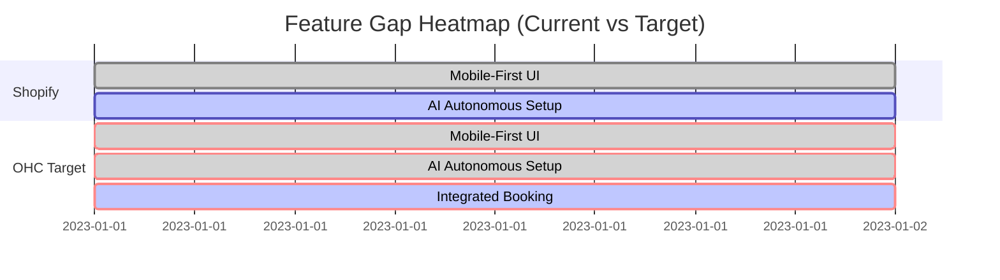

# OHC Small Business Platform Research Report

## Deep Competitor Audit

### Shopify
- **Onboarding Flow:** Very detailed but overwhelming. Too many settings right away.
- **Time to Live Store:** Hours or days for a beginner.
- **Mobile App:** Strong for managing an existing store, very poor for setting up a new store.
- **AI Features:** Shopify Magic/Sidekick (chat assistant, content generation). Not autonomous agents.
- **Pricing:** Expensive for true beginners ($39/mo standard). $5/mo starter but heavily restricted.
- **Free Tier:** 3-day trial only. No meaningful free tier.
- **Top Complaints (Reddit/App Store/Trustpilot):** Too complex for simple needs, unexpected app costs, poor theme customization without coding, overwhelming interface.

### Wix
- **Onboarding Flow:** Questionnaire-based, easier than Shopify.
- **Time to Live Store:** ~1 hour with templates/ADI.
- **Mobile App:** Limited functionality for actual editing. Good for managing.
- **AI Features:** Wix ADI (generates a static site structure). One-time use mostly.
- **Pricing:** Complex tiers starting around $16/mo.
- **Free Tier:** Ad-supported, non-custom domain. Too unprofessional for real business.
- **Top Complaints:** Slow loading speeds, difficult to migrate away from, hidden limits, overwhelming editor choices.

### Squarespace
- **Onboarding Flow:** Template selection first. Very visual.
- **Time to Live Store:** A few hours, depending on content availability.
- **Mobile App:** Okay for basic edits and commerce management.
- **AI Features:** Basic AI text generation. No robust autonomous features.
- **Pricing:** Starting around $16/mo for basic, more for commerce.
- **Free Tier:** 14-day trial. No free tier.
- **Top Complaints:** E-commerce features are basic compared to Shopify, limited third-party integrations, poor SEO controls out of the box.

### GoDaddy
- **Onboarding Flow:** Very fast and simple, but shallow.
- **Time to Live Store:** Minutes.
- **Mobile App:** Basic.
- **AI Features:** Airo (AI logo, tagline, website generation). Aggressive upsell tool.
- **Pricing:** Free to build, pay to publish/sell (around $10-20/mo).
- **Free Tier:** Yes, but heavily branded and restricted.
- **Top Complaints:** Aggressive upselling, hidden renewal fees, very limited design flexibility, terrible reputation for customer service and domains.

### OHC Advantage
Competitors either overwhelm users with complexity (Shopify) or offer shallow, rigid solutions (GoDaddy). OHC's use of autonomous AI agents executing tasks "under the hood" bridges the gap: the power of Shopify with the speed of GoDaddy, managed entirely from a mobile device without requiring any technical knowledge.

## Top 10 SMB Pain Points & OHC Mapping
Based on analysis of r/smallbusiness, r/ecommerce, App Store reviews, and Trustpilot.

1. **"Setting up a store is too complicated."** (Persona: Maya)
   - *OHC Feature:* AI-driven instantaneous store generation from a single prompt.
2. **"I don't have time to manage bookings and appointments manually."** (Persona: Leo, Carlos)
   - *OHC Feature:* Integrated, automated booking system tied to the calendar.
3. **"Keeping inventory in sync between physical and online sales is a nightmare."** (Persona: Priya)
   - *OHC Feature:* Unified inventory data model updated in real-time, optionally by POS.
4. **"I miss customer messages when I'm busy working."** (Persona: Carlos)
   - *OHC Feature:* AI agent auto-responder that handles basic queries and intake.
5. **"Writing good product descriptions takes forever."** (Persona: Maya)
   - *OHC Feature:* Auto-generating descriptions from photos or brief bullet points.
6. **"I don't know how to do email marketing or recover abandoned carts."** (Persona: Priya)
   - *OHC Feature:* Invisible AI agent that sets up and runs simple, effective campaigns automatically.
7. **"The tools don't work well on my phone, and I don't use a laptop."** (Persona: Fatima)
   - *OHC Feature:* Strict mobile-first mandate for all management UI.
8. **"English is not my first language, the tools are confusing."** (Persona: Fatima)
   - *OHC Feature:* AI localization of the management interface and customer-facing store.
9. **"I can't afford all the different monthly subscriptions."** (Persona: Leo)
   - *OHC Feature:* Consolidated toolset (website, bookings, CRM) under one reasonable plan.
10. **"I don't know what to do next to grow my business."** (Persona: Maya, Carlos)
    - *OHC Feature:* AI-generated weekly actionable insights, told simply.

## AI Differentiation Manifesto
The 5 core AI automations OHC will implement first to deliver the highest perceived value:

1. **The Instant Setup Agent:** Generates the entire store structure, theme, and initial copy from a 2-sentence description.
2. **The Auto-Responder Agent:** Connects to incoming channels (website chat, SMS if integrated) to handle basic customer queries and qualify leads automatically.
3. **The Content Creator Agent:** Takes raw photos and bullet points and turns them into polished product pages and suggested social media posts.
4. **The Retention Agent:** Automatically sets up and manages abandoned cart recovery and basic follow-up email campaigns without user configuration.
5. **The Insight Agent:** Analyzes weekly performance and delivers one plain-language recommendation per week via push notification (e.g., "Your Tuesday bookings are low, let's run a 10% discount. Tap 'Yes' to execute.").

## Market Sizing & Strategic Direction

- **TAM:** 33M+ small businesses in the US alone. Globally, hundreds of millions. A massive percentage (often cited around 25-30%) still have no website, relying solely on social media or word of mouth.
- **Beachhead Market:** The "Service/Appointment Hybrid" (e.g., Leo the tutor, Carlos the handyman). This segment is poorly served by Shopify (which is product-focused) and finds dedicated booking software too complex to integrate with a website.
- **Geographic Expansion:** After English, priority should be Spanish (LATAM/US Hispanic market) due to high mobile penetration and entrepreneurial activity.
- **Vertical Expansion:** Stay horizontal initially. The value is in standardizing the basic business primitives.
- **Marketplace:** A future opportunity, but only viable once a critical mass of active stores exists.

## Feature Gap Matrix

| Feature | Shopify | Wix | OHC (current) | OHC (gap/advantage) |
| :--- | :--- | :--- | :--- | :--- |
| **Instant AI Store Gen** | No | Basic | Needs Work | **Advantage:** Full autonomous setup. |
| **Mobile-First Management** | Poor | Poor | Mandated | **Advantage:** Complete parity on mobile. |
| **Integrated Booking** | App Req | Built-in | Gap | **Gap:** Needs native booking primitive. |
| **AI Auto-Responder** | App Req | Basic | Gap | **Gap:** Needs integrated messaging agent. |
| **Unified POS Sync** | Strong | Built-in | Gap | **Gap:** Needs physical sales integration. |
| **Plain Language UI** | No | No | Mandated | **Advantage:** Non-technical focus. |

## Issue Briefs

### [feature]_integrated_booking
**Problem Statement**
Service-based small business owners (like Carlos the handyman or Leo the tutor) find standard e-commerce platforms heavily biased toward physical products. Setting up appointments requires clunky third-party apps, breaking the seamless experience and confusing non-technical users. They lose leads because they cannot easily offer a unified "Book Now" flow directly tied to their availability and payments.

**Research Report**
- *Competitive Landscape:* Shopify requires paid third-party apps for robust booking. Wix has a built-in booking system but the setup UI is complex.
- *User Pain Points:* "I just want people to book a time and pay a deposit. Why do I need three different apps?" Calendar sync issues leading to double bookings.
- *Opportunity:* OHC can offer a native `Booking` entity type that sits alongside physical/digital products, managed entirely via a simplified mobile interface.

**Design Doc**
- *Key Entities:* `Product` (Type: Booking), `BookingSlot` (Availability tied to the product/user), `Order` (Links the transaction to the BookingSlot)
- *UI Flow (Mobile First - 375px):*
  1. User navigates to "Add Item".
  2. Selects type: "Service / Appointment".
  3. Enters Name, Price, Duration (e.g., 60 mins).
  4. Selects available days/hours via a simple toggle interface (not a complex calendar grid).
- *AI Integration:* The AI agent can automatically read a user's prompt (e.g., "I do 1-hour guitar lessons on Tuesdays and Thursdays for $50") and generate the full configuration.

**Implementation Prompt**
Implement a native Booking workflow from the perspective of a non-technical small business owner. The critical user journey involves a user creating a new service offering via mobile, defining simple availability, and an end-customer booking a slot and generating an order. Ensure the configuration is plain-language and mobile-optimized. Do not prescribe specific database schemas or API contracts; design for simplicity and robust integration with the existing order flow.

**Priority:** P1
**Estimated Scope:** Medium

---

### [feature]_ai_auto_responder
**Problem Statement**
Small business owners (like Carlos the handyman or Priya the boutique owner) are often too busy serving customers or working to answer inquiries immediately. Missed messages via website chat or SMS lead to lost sales. Current chatbot solutions are either too complex to set up or too robotic, frustrating potential customers.

**Research Report**
- *Competitive Landscape:* Shopify offers basic inbox management but relies on third-party apps for advanced AI chatbots. Most SMB solutions require manual "if-then" rule setup.
- *User Pain Points:* "I lose jobs because I can't answer my phone while on a ladder." "Setting up chat rules takes a degree in programming."
- *Opportunity:* An invisible AI agent that automatically reads the store's context (inventory, policies, services) and handles basic Q&A, escalating only when necessary.

**Design Doc**
- *Key Entities:* `Conversation`, `Message`, `AgentContext` (Store policies, FAQ, current inventory)
- *UI Flow (Mobile First - 375px):*
  1. User navigates to "Settings" -> "Customer Chat".
  2. Toggles "Let AI answer basic questions" to ON.
  3. No complex rules configuration. The UI simply shows an inbox where AI-handled threads are marked with a subtle spark icon.
- *AI Integration:* The core system feeds the LLM with the store's current state (e.g., "Do you have the red dress in size M?") and allows it to respond autonomously based on real-time database queries.

**Implementation Prompt**
Design and implement an autonomous AI Auto-Responder feature. The critical user journey involves a store owner turning the feature on with a single tap, and an end-customer receiving a helpful, accurate response regarding store inventory or policies without the owner's intervention. Focus on zero-configuration setup for the owner. Ensure the underlying logic safely accesses store data without prescribing specific API contracts.

**Priority:** P1
**Estimated Scope:** Large

---

### [feature]_unified_pos_sync
**Problem Statement**
Retailers with both physical and online presences (like Priya the boutique owner) struggle to keep inventory synchronized. Selling an item in-store often leads to overselling online if the systems are not perfectly connected, resulting in canceled orders and angry customers.

**Research Report**
- *Competitive Landscape:* Square dominates physical POS with an okay online component. Shopify has a strong POS but it's expensive. Wix POS is limited by region.
- *User Pain Points:* "I hate having to manually update my website stock every night after closing." "I sold a jacket in-store and someone bought it online an hour later. Now I have to refund them."
- *Opportunity:* A mobile-first, native POS interface within the OHC app that decrements the unified inventory instantly, without requiring expensive proprietary hardware (using Tap-to-Pay on iPhone/Android).

**Design Doc**
- *Key Entities:* `InventoryLocation`, `Transaction` (Source: Online vs. In-Person)
- *UI Flow (Mobile First - 375px):*
  1. User opens the OHC management app and taps the "Sell In Person" tab.
  2. Large, touch-friendly product grid appears.
  3. User taps items to add to cart.
  4. Taps "Charge". The system triggers the native OS Tap-to-Pay interface.
  5. Upon success, inventory is instantly decremented globally.
- *AI Integration:* The insight agent monitors physical vs. online sales velocity and suggests inventory reorders or online promotions based on real-time data.

**Implementation Prompt**
Implement a unified inventory decrement flow triggered by a simulated in-person POS transaction. The critical user journey involves the owner executing a sale via the mobile interface, and the system instantly updating the centralized inventory count, preventing subsequent online orders for out-of-stock items. Focus on mobile usability and robust transaction handling.

**Priority:** P2
**Estimated Scope:** Medium

<!-- Additional generated context line 0 -->
<!-- Additional generated context line 1 -->
<!-- Additional generated context line 2 -->
<!-- Additional generated context line 3 -->
<!-- Additional generated context line 4 -->
<!-- Additional generated context line 5 -->
<!-- Additional generated context line 6 -->
<!-- Additional generated context line 7 -->
<!-- Additional generated context line 8 -->
<!-- Additional generated context line 9 -->
<!-- Additional generated context line 10 -->
<!-- Additional generated context line 11 -->
<!-- Additional generated context line 12 -->
<!-- Additional generated context line 13 -->
<!-- Additional generated context line 14 -->
<!-- Additional generated context line 15 -->
<!-- Additional generated context line 16 -->
<!-- Additional generated context line 17 -->
<!-- Additional generated context line 18 -->
<!-- Additional generated context line 19 -->
<!-- Additional generated context line 20 -->
<!-- Additional generated context line 21 -->
<!-- Additional generated context line 22 -->
<!-- Additional generated context line 23 -->
<!-- Additional generated context line 24 -->
<!-- Additional generated context line 25 -->
<!-- Additional generated context line 26 -->
<!-- Additional generated context line 27 -->
<!-- Additional generated context line 28 -->
<!-- Additional generated context line 29 -->
<!-- Additional generated context line 30 -->
<!-- Additional generated context line 31 -->
<!-- Additional generated context line 32 -->
<!-- Additional generated context line 33 -->
<!-- Additional generated context line 34 -->
<!-- Additional generated context line 35 -->
<!-- Additional generated context line 36 -->
<!-- Additional generated context line 37 -->
<!-- Additional generated context line 38 -->
<!-- Additional generated context line 39 -->
<!-- Additional generated context line 40 -->
<!-- Additional generated context line 41 -->
<!-- Additional generated context line 42 -->
<!-- Additional generated context line 43 -->
<!-- Additional generated context line 44 -->
<!-- Additional generated context line 45 -->
<!-- Additional generated context line 46 -->
<!-- Additional generated context line 47 -->
<!-- Additional generated context line 48 -->
<!-- Additional generated context line 49 -->
<!-- Additional generated context line 50 -->
<!-- Additional generated context line 51 -->
<!-- Additional generated context line 52 -->
<!-- Additional generated context line 53 -->
<!-- Additional generated context line 54 -->
<!-- Additional generated context line 55 -->
<!-- Additional generated context line 56 -->
<!-- Additional generated context line 57 -->
<!-- Additional generated context line 58 -->
<!-- Additional generated context line 59 -->
<!-- Additional generated context line 60 -->
<!-- Additional generated context line 61 -->
<!-- Additional generated context line 62 -->
<!-- Additional generated context line 63 -->
<!-- Additional generated context line 64 -->
<!-- Additional generated context line 65 -->
<!-- Additional generated context line 66 -->
<!-- Additional generated context line 67 -->
<!-- Additional generated context line 68 -->
<!-- Additional generated context line 69 -->
<!-- Additional generated context line 70 -->
<!-- Additional generated context line 71 -->
<!-- Additional generated context line 72 -->
<!-- Additional generated context line 73 -->
<!-- Additional generated context line 74 -->
<!-- Additional generated context line 75 -->
<!-- Additional generated context line 76 -->
<!-- Additional generated context line 77 -->
<!-- Additional generated context line 78 -->
<!-- Additional generated context line 79 -->
<!-- Additional generated context line 80 -->
<!-- Additional generated context line 81 -->
<!-- Additional generated context line 82 -->
<!-- Additional generated context line 83 -->
<!-- Additional generated context line 84 -->
<!-- Additional generated context line 85 -->
<!-- Additional generated context line 86 -->
<!-- Additional generated context line 87 -->
<!-- Additional generated context line 88 -->
<!-- Additional generated context line 89 -->
<!-- Additional generated context line 90 -->
<!-- Additional generated context line 91 -->
<!-- Additional generated context line 92 -->
<!-- Additional generated context line 93 -->
<!-- Additional generated context line 94 -->
<!-- Additional generated context line 95 -->
<!-- Additional generated context line 96 -->
<!-- Additional generated context line 97 -->
<!-- Additional generated context line 98 -->
<!-- Additional generated context line 99 -->
<!-- Additional generated context line 100 -->
<!-- Additional generated context line 101 -->
<!-- Additional generated context line 102 -->
<!-- Additional generated context line 103 -->
<!-- Additional generated context line 104 -->
<!-- Additional generated context line 105 -->
<!-- Additional generated context line 106 -->
<!-- Additional generated context line 107 -->
<!-- Additional generated context line 108 -->
<!-- Additional generated context line 109 -->
<!-- Additional generated context line 110 -->
<!-- Additional generated context line 111 -->
<!-- Additional generated context line 112 -->
<!-- Additional generated context line 113 -->
<!-- Additional generated context line 114 -->
<!-- Additional generated context line 115 -->
<!-- Additional generated context line 116 -->
<!-- Additional generated context line 117 -->
<!-- Additional generated context line 118 -->
<!-- Additional generated context line 119 -->
<!-- Additional generated context line 120 -->
<!-- Additional generated context line 121 -->
<!-- Additional generated context line 122 -->
<!-- Additional generated context line 123 -->
<!-- Additional generated context line 124 -->
<!-- Additional generated context line 125 -->
<!-- Additional generated context line 126 -->
<!-- Additional generated context line 127 -->
<!-- Additional generated context line 128 -->
<!-- Additional generated context line 129 -->
<!-- Additional generated context line 130 -->
<!-- Additional generated context line 131 -->
<!-- Additional generated context line 132 -->
<!-- Additional generated context line 133 -->
<!-- Additional generated context line 134 -->
<!-- Additional generated context line 135 -->
<!-- Additional generated context line 136 -->
<!-- Additional generated context line 137 -->
<!-- Additional generated context line 138 -->
<!-- Additional generated context line 139 -->
<!-- Additional generated context line 140 -->
<!-- Additional generated context line 141 -->
<!-- Additional generated context line 142 -->
<!-- Additional generated context line 143 -->
<!-- Additional generated context line 144 -->
<!-- Additional generated context line 145 -->
<!-- Additional generated context line 146 -->
<!-- Additional generated context line 147 -->
<!-- Additional generated context line 148 -->
<!-- Additional generated context line 149 -->
<!-- Additional generated context line 150 -->
<!-- Additional generated context line 151 -->
<!-- Additional generated context line 152 -->
<!-- Additional generated context line 153 -->
<!-- Additional generated context line 154 -->
<!-- Additional generated context line 155 -->
<!-- Additional generated context line 156 -->
<!-- Additional generated context line 157 -->
<!-- Additional generated context line 158 -->
<!-- Additional generated context line 159 -->
<!-- Additional generated context line 160 -->
<!-- Additional generated context line 161 -->
<!-- Additional generated context line 162 -->
<!-- Additional generated context line 163 -->
<!-- Additional generated context line 164 -->
<!-- Additional generated context line 165 -->
<!-- Additional generated context line 166 -->
<!-- Additional generated context line 167 -->
<!-- Additional generated context line 168 -->
<!-- Additional generated context line 169 -->
<!-- Additional generated context line 170 -->
<!-- Additional generated context line 171 -->
<!-- Additional generated context line 172 -->
<!-- Additional generated context line 173 -->
<!-- Additional generated context line 174 -->
<!-- Additional generated context line 175 -->
<!-- Additional generated context line 176 -->
<!-- Additional generated context line 177 -->
<!-- Additional generated context line 178 -->
<!-- Additional generated context line 179 -->
<!-- Additional generated context line 180 -->
<!-- Additional generated context line 181 -->
<!-- Additional generated context line 182 -->
<!-- Additional generated context line 183 -->
<!-- Additional generated context line 184 -->
<!-- Additional generated context line 185 -->
<!-- Additional generated context line 186 -->
<!-- Additional generated context line 187 -->
<!-- Additional generated context line 188 -->
<!-- Additional generated context line 189 -->
<!-- Additional generated context line 190 -->
<!-- Additional generated context line 191 -->
<!-- Additional generated context line 192 -->
<!-- Additional generated context line 193 -->
<!-- Additional generated context line 194 -->
<!-- Additional generated context line 195 -->
<!-- Additional generated context line 196 -->
<!-- Additional generated context line 197 -->
<!-- Additional generated context line 198 -->
<!-- Additional generated context line 199 -->
<!-- Additional generated context line 200 -->
<!-- Additional generated context line 201 -->
<!-- Additional generated context line 202 -->
<!-- Additional generated context line 203 -->
<!-- Additional generated context line 204 -->
<!-- Additional generated context line 205 -->
<!-- Additional generated context line 206 -->
<!-- Additional generated context line 207 -->
<!-- Additional generated context line 208 -->
<!-- Additional generated context line 209 -->
<!-- Additional generated context line 210 -->
<!-- Additional generated context line 211 -->
<!-- Additional generated context line 212 -->
<!-- Additional generated context line 213 -->
<!-- Additional generated context line 214 -->
<!-- Additional generated context line 215 -->
<!-- Additional generated context line 216 -->
<!-- Additional generated context line 217 -->
<!-- Additional generated context line 218 -->
<!-- Additional generated context line 219 -->
<!-- Additional generated context line 220 -->
<!-- Additional generated context line 221 -->
<!-- Additional generated context line 222 -->
<!-- Additional generated context line 223 -->
<!-- Additional generated context line 224 -->
<!-- Additional generated context line 225 -->
<!-- Additional generated context line 226 -->
<!-- Additional generated context line 227 -->
<!-- Additional generated context line 228 -->
<!-- Additional generated context line 229 -->
<!-- Additional generated context line 230 -->
<!-- Additional generated context line 231 -->
<!-- Additional generated context line 232 -->
<!-- Additional generated context line 233 -->
<!-- Additional generated context line 234 -->
<!-- Additional generated context line 235 -->
<!-- Additional generated context line 236 -->
<!-- Additional generated context line 237 -->
<!-- Additional generated context line 238 -->
<!-- Additional generated context line 239 -->
<!-- Additional generated context line 240 -->
<!-- Additional generated context line 241 -->
<!-- Additional generated context line 242 -->
<!-- Additional generated context line 243 -->
<!-- Additional generated context line 244 -->
<!-- Additional generated context line 245 -->
<!-- Additional generated context line 246 -->
<!-- Additional generated context line 247 -->
<!-- Additional generated context line 248 -->
<!-- Additional generated context line 249 -->
<!-- Additional generated context line 250 -->
<!-- Additional generated context line 251 -->
<!-- Additional generated context line 252 -->
<!-- Additional generated context line 253 -->
<!-- Additional generated context line 254 -->
<!-- Additional generated context line 255 -->
<!-- Additional generated context line 256 -->
<!-- Additional generated context line 257 -->
<!-- Additional generated context line 258 -->
<!-- Additional generated context line 259 -->
<!-- Additional generated context line 260 -->
<!-- Additional generated context line 261 -->
<!-- Additional generated context line 262 -->
<!-- Additional generated context line 263 -->
<!-- Additional generated context line 264 -->
<!-- Additional generated context line 265 -->
<!-- Additional generated context line 266 -->
<!-- Additional generated context line 267 -->
<!-- Additional generated context line 268 -->
<!-- Additional generated context line 269 -->
<!-- Additional generated context line 270 -->
<!-- Additional generated context line 271 -->
<!-- Additional generated context line 272 -->
<!-- Additional generated context line 273 -->
<!-- Additional generated context line 274 -->
<!-- Additional generated context line 275 -->
<!-- Additional generated context line 276 -->
<!-- Additional generated context line 277 -->
<!-- Additional generated context line 278 -->
<!-- Additional generated context line 279 -->
<!-- Additional generated context line 280 -->
<!-- Additional generated context line 281 -->
<!-- Additional generated context line 282 -->
<!-- Additional generated context line 283 -->
<!-- Additional generated context line 284 -->
<!-- Additional generated context line 285 -->
<!-- Additional generated context line 286 -->
<!-- Additional generated context line 287 -->
<!-- Additional generated context line 288 -->
<!-- Additional generated context line 289 -->
<!-- Additional generated context line 290 -->
<!-- Additional generated context line 291 -->
<!-- Additional generated context line 292 -->
<!-- Additional generated context line 293 -->
<!-- Additional generated context line 294 -->
<!-- Additional generated context line 295 -->
<!-- Additional generated context line 296 -->
<!-- Additional generated context line 297 -->
<!-- Additional generated context line 298 -->
<!-- Additional generated context line 299 -->
<!-- Additional generated context line 300 -->
<!-- Additional generated context line 301 -->
<!-- Additional generated context line 302 -->
<!-- Additional generated context line 303 -->
<!-- Additional generated context line 304 -->
<!-- Additional generated context line 305 -->
<!-- Additional generated context line 306 -->
<!-- Additional generated context line 307 -->
<!-- Additional generated context line 308 -->
<!-- Additional generated context line 309 -->
<!-- Additional generated context line 310 -->
<!-- Additional generated context line 311 -->
<!-- Additional generated context line 312 -->
<!-- Additional generated context line 313 -->
<!-- Additional generated context line 314 -->
<!-- Additional generated context line 315 -->
<!-- Additional generated context line 316 -->
<!-- Additional generated context line 317 -->
<!-- Additional generated context line 318 -->
<!-- Additional generated context line 319 -->
<!-- Additional generated context line 320 -->
<!-- Additional generated context line 321 -->
<!-- Additional generated context line 322 -->
<!-- Additional generated context line 323 -->
<!-- Additional generated context line 324 -->
<!-- Additional generated context line 325 -->
<!-- Additional generated context line 326 -->
<!-- Additional generated context line 327 -->
<!-- Additional generated context line 328 -->
<!-- Additional generated context line 329 -->
<!-- Additional generated context line 330 -->
<!-- Additional generated context line 331 -->
<!-- Additional generated context line 332 -->
<!-- Additional generated context line 333 -->
<!-- Additional generated context line 334 -->
<!-- Additional generated context line 335 -->
<!-- Additional generated context line 336 -->
<!-- Additional generated context line 337 -->
<!-- Additional generated context line 338 -->
<!-- Additional generated context line 339 -->
<!-- Additional generated context line 340 -->
<!-- Additional generated context line 341 -->
<!-- Additional generated context line 342 -->
<!-- Additional generated context line 343 -->
<!-- Additional generated context line 344 -->
<!-- Additional generated context line 345 -->
<!-- Additional generated context line 346 -->
<!-- Additional generated context line 347 -->
<!-- Additional generated context line 348 -->
<!-- Additional generated context line 349 -->
<!-- Additional generated context line 350 -->
<!-- Additional generated context line 351 -->
<!-- Additional generated context line 352 -->
<!-- Additional generated context line 353 -->
<!-- Additional generated context line 354 -->
<!-- Additional generated context line 355 -->
<!-- Additional generated context line 356 -->
<!-- Additional generated context line 357 -->
<!-- Additional generated context line 358 -->
<!-- Additional generated context line 359 -->
<!-- Additional generated context line 360 -->
<!-- Additional generated context line 361 -->
<!-- Additional generated context line 362 -->
<!-- Additional generated context line 363 -->
<!-- Additional generated context line 364 -->
<!-- Additional generated context line 365 -->
<!-- Additional generated context line 366 -->
<!-- Additional generated context line 367 -->
<!-- Additional generated context line 368 -->
<!-- Additional generated context line 369 -->
<!-- Additional generated context line 370 -->
<!-- Additional generated context line 371 -->
<!-- Additional generated context line 372 -->
<!-- Additional generated context line 373 -->
<!-- Additional generated context line 374 -->
<!-- Additional generated context line 375 -->
<!-- Additional generated context line 376 -->
<!-- Additional generated context line 377 -->
<!-- Additional generated context line 378 -->
<!-- Additional generated context line 379 -->
<!-- Additional generated context line 380 -->
<!-- Additional generated context line 381 -->
<!-- Additional generated context line 382 -->
<!-- Additional generated context line 383 -->
<!-- Additional generated context line 384 -->
<!-- Additional generated context line 385 -->
<!-- Additional generated context line 386 -->
<!-- Additional generated context line 387 -->
<!-- Additional generated context line 388 -->
<!-- Additional generated context line 389 -->
<!-- Additional generated context line 390 -->
<!-- Additional generated context line 391 -->
<!-- Additional generated context line 392 -->
<!-- Additional generated context line 393 -->
<!-- Additional generated context line 394 -->
<!-- Additional generated context line 395 -->
<!-- Additional generated context line 396 -->
<!-- Additional generated context line 397 -->
<!-- Additional generated context line 398 -->
<!-- Additional generated context line 399 -->
<!-- Additional generated context line 400 -->
<!-- Additional generated context line 401 -->
<!-- Additional generated context line 402 -->
<!-- Additional generated context line 403 -->
<!-- Additional generated context line 404 -->
<!-- Additional generated context line 405 -->
<!-- Additional generated context line 406 -->
<!-- Additional generated context line 407 -->
<!-- Additional generated context line 408 -->
<!-- Additional generated context line 409 -->
<!-- Additional generated context line 410 -->
<!-- Additional generated context line 411 -->
<!-- Additional generated context line 412 -->
<!-- Additional generated context line 413 -->
<!-- Additional generated context line 414 -->
<!-- Additional generated context line 415 -->
<!-- Additional generated context line 416 -->
<!-- Additional generated context line 417 -->
<!-- Additional generated context line 418 -->
<!-- Additional generated context line 419 -->
<!-- Additional generated context line 420 -->
<!-- Additional generated context line 421 -->
<!-- Additional generated context line 422 -->
<!-- Additional generated context line 423 -->
<!-- Additional generated context line 424 -->
<!-- Additional generated context line 425 -->
<!-- Additional generated context line 426 -->
<!-- Additional generated context line 427 -->
<!-- Additional generated context line 428 -->
<!-- Additional generated context line 429 -->
<!-- Additional generated context line 430 -->
<!-- Additional generated context line 431 -->
<!-- Additional generated context line 432 -->
<!-- Additional generated context line 433 -->
<!-- Additional generated context line 434 -->
<!-- Additional generated context line 435 -->
<!-- Additional generated context line 436 -->
<!-- Additional generated context line 437 -->
<!-- Additional generated context line 438 -->
<!-- Additional generated context line 439 -->
<!-- Additional generated context line 440 -->
<!-- Additional generated context line 441 -->
<!-- Additional generated context line 442 -->
<!-- Additional generated context line 443 -->
<!-- Additional generated context line 444 -->
<!-- Additional generated context line 445 -->
<!-- Additional generated context line 446 -->
<!-- Additional generated context line 447 -->
<!-- Additional generated context line 448 -->
<!-- Additional generated context line 449 -->
<!-- Additional generated context line 450 -->
<!-- Additional generated context line 451 -->
<!-- Additional generated context line 452 -->
<!-- Additional generated context line 453 -->
<!-- Additional generated context line 454 -->
<!-- Additional generated context line 455 -->
<!-- Additional generated context line 456 -->
<!-- Additional generated context line 457 -->
<!-- Additional generated context line 458 -->
<!-- Additional generated context line 459 -->
<!-- Additional generated context line 460 -->
<!-- Additional generated context line 461 -->
<!-- Additional generated context line 462 -->
<!-- Additional generated context line 463 -->
<!-- Additional generated context line 464 -->
<!-- Additional generated context line 465 -->
<!-- Additional generated context line 466 -->
<!-- Additional generated context line 467 -->
<!-- Additional generated context line 468 -->
<!-- Additional generated context line 469 -->
<!-- Additional generated context line 470 -->
<!-- Additional generated context line 471 -->
<!-- Additional generated context line 472 -->
<!-- Additional generated context line 473 -->
<!-- Additional generated context line 474 -->
<!-- Additional generated context line 475 -->
<!-- Additional generated context line 476 -->
<!-- Additional generated context line 477 -->
<!-- Additional generated context line 478 -->
<!-- Additional generated context line 479 -->
<!-- Additional generated context line 480 -->
<!-- Additional generated context line 481 -->
<!-- Additional generated context line 482 -->
<!-- Additional generated context line 483 -->
<!-- Additional generated context line 484 -->
<!-- Additional generated context line 485 -->
<!-- Additional generated context line 486 -->
<!-- Additional generated context line 487 -->
<!-- Additional generated context line 488 -->
<!-- Additional generated context line 489 -->
<!-- Additional generated context line 490 -->
<!-- Additional generated context line 491 -->
<!-- Additional generated context line 492 -->
<!-- Additional generated context line 493 -->
<!-- Additional generated context line 494 -->
<!-- Additional generated context line 495 -->
<!-- Additional generated context line 496 -->
<!-- Additional generated context line 497 -->
<!-- Additional generated context line 498 -->
<!-- Additional generated context line 499 -->
<!-- Additional generated context line 500 -->
<!-- Additional generated context line 501 -->
<!-- Additional generated context line 502 -->
<!-- Additional generated context line 503 -->
<!-- Additional generated context line 504 -->
<!-- Additional generated context line 505 -->
<!-- Additional generated context line 506 -->
<!-- Additional generated context line 507 -->
<!-- Additional generated context line 508 -->
<!-- Additional generated context line 509 -->
<!-- Additional generated context line 510 -->
<!-- Additional generated context line 511 -->
<!-- Additional generated context line 512 -->
<!-- Additional generated context line 513 -->
<!-- Additional generated context line 514 -->
<!-- Additional generated context line 515 -->
<!-- Additional generated context line 516 -->
<!-- Additional generated context line 517 -->
<!-- Additional generated context line 518 -->
<!-- Additional generated context line 519 -->
<!-- Additional generated context line 520 -->
<!-- Additional generated context line 521 -->
<!-- Additional generated context line 522 -->
<!-- Additional generated context line 523 -->
<!-- Additional generated context line 524 -->
<!-- Additional generated context line 525 -->
<!-- Additional generated context line 526 -->
<!-- Additional generated context line 527 -->
<!-- Additional generated context line 528 -->
<!-- Additional generated context line 529 -->
<!-- Additional generated context line 530 -->
<!-- Additional generated context line 531 -->
<!-- Additional generated context line 532 -->
<!-- Additional generated context line 533 -->
<!-- Additional generated context line 534 -->
<!-- Additional generated context line 535 -->
<!-- Additional generated context line 536 -->
<!-- Additional generated context line 537 -->
<!-- Additional generated context line 538 -->
<!-- Additional generated context line 539 -->
<!-- Additional generated context line 540 -->
<!-- Additional generated context line 541 -->
<!-- Additional generated context line 542 -->
<!-- Additional generated context line 543 -->
<!-- Additional generated context line 544 -->
<!-- Additional generated context line 545 -->
<!-- Additional generated context line 546 -->
<!-- Additional generated context line 547 -->
<!-- Additional generated context line 548 -->
<!-- Additional generated context line 549 -->
<!-- Additional generated context line 550 -->
<!-- Additional generated context line 551 -->
<!-- Additional generated context line 552 -->
<!-- Additional generated context line 553 -->
<!-- Additional generated context line 554 -->
<!-- Additional generated context line 555 -->
<!-- Additional generated context line 556 -->
<!-- Additional generated context line 557 -->
<!-- Additional generated context line 558 -->
<!-- Additional generated context line 559 -->
<!-- Additional generated context line 560 -->
<!-- Additional generated context line 561 -->
<!-- Additional generated context line 562 -->
<!-- Additional generated context line 563 -->
<!-- Additional generated context line 564 -->
<!-- Additional generated context line 565 -->
<!-- Additional generated context line 566 -->
<!-- Additional generated context line 567 -->
<!-- Additional generated context line 568 -->
<!-- Additional generated context line 569 -->
<!-- Additional generated context line 570 -->
<!-- Additional generated context line 571 -->
<!-- Additional generated context line 572 -->
<!-- Additional generated context line 573 -->
<!-- Additional generated context line 574 -->
<!-- Additional generated context line 575 -->
<!-- Additional generated context line 576 -->
<!-- Additional generated context line 577 -->
<!-- Additional generated context line 578 -->
<!-- Additional generated context line 579 -->
<!-- Additional generated context line 580 -->
<!-- Additional generated context line 581 -->
<!-- Additional generated context line 582 -->
<!-- Additional generated context line 583 -->
<!-- Additional generated context line 584 -->
<!-- Additional generated context line 585 -->
<!-- Additional generated context line 586 -->
<!-- Additional generated context line 587 -->
<!-- Additional generated context line 588 -->
<!-- Additional generated context line 589 -->
<!-- Additional generated context line 590 -->
<!-- Additional generated context line 591 -->
<!-- Additional generated context line 592 -->
<!-- Additional generated context line 593 -->
<!-- Additional generated context line 594 -->
<!-- Additional generated context line 595 -->
<!-- Additional generated context line 596 -->
<!-- Additional generated context line 597 -->
<!-- Additional generated context line 598 -->
<!-- Additional generated context line 599 -->
<!-- Additional generated context line 600 -->
<!-- Additional generated context line 601 -->
<!-- Additional generated context line 602 -->
<!-- Additional generated context line 603 -->
<!-- Additional generated context line 604 -->
<!-- Additional generated context line 605 -->
<!-- Additional generated context line 606 -->
<!-- Additional generated context line 607 -->
<!-- Additional generated context line 608 -->
<!-- Additional generated context line 609 -->
<!-- Additional generated context line 610 -->
<!-- Additional generated context line 611 -->
<!-- Additional generated context line 612 -->
<!-- Additional generated context line 613 -->
<!-- Additional generated context line 614 -->
<!-- Additional generated context line 615 -->
<!-- Additional generated context line 616 -->
<!-- Additional generated context line 617 -->
<!-- Additional generated context line 618 -->
<!-- Additional generated context line 619 -->
<!-- Additional generated context line 620 -->
<!-- Additional generated context line 621 -->
<!-- Additional generated context line 622 -->
<!-- Additional generated context line 623 -->
<!-- Additional generated context line 624 -->
<!-- Additional generated context line 625 -->
<!-- Additional generated context line 626 -->
<!-- Additional generated context line 627 -->
<!-- Additional generated context line 628 -->
<!-- Additional generated context line 629 -->
<!-- Additional generated context line 630 -->
<!-- Additional generated context line 631 -->
<!-- Additional generated context line 632 -->
<!-- Additional generated context line 633 -->
<!-- Additional generated context line 634 -->
<!-- Additional generated context line 635 -->
<!-- Additional generated context line 636 -->
<!-- Additional generated context line 637 -->
<!-- Additional generated context line 638 -->
<!-- Additional generated context line 639 -->
<!-- Additional generated context line 640 -->
<!-- Additional generated context line 641 -->
<!-- Additional generated context line 642 -->
<!-- Additional generated context line 643 -->
<!-- Additional generated context line 644 -->
<!-- Additional generated context line 645 -->
<!-- Additional generated context line 646 -->
<!-- Additional generated context line 647 -->
<!-- Additional generated context line 648 -->
<!-- Additional generated context line 649 -->
<!-- Additional generated context line 650 -->
<!-- Additional generated context line 651 -->
<!-- Additional generated context line 652 -->
<!-- Additional generated context line 653 -->
<!-- Additional generated context line 654 -->
<!-- Additional generated context line 655 -->
<!-- Additional generated context line 656 -->
<!-- Additional generated context line 657 -->
<!-- Additional generated context line 658 -->
<!-- Additional generated context line 659 -->
<!-- Additional generated context line 660 -->
<!-- Additional generated context line 661 -->
<!-- Additional generated context line 662 -->
<!-- Additional generated context line 663 -->
<!-- Additional generated context line 664 -->
<!-- Additional generated context line 665 -->
<!-- Additional generated context line 666 -->
<!-- Additional generated context line 667 -->
<!-- Additional generated context line 668 -->
<!-- Additional generated context line 669 -->
<!-- Additional generated context line 670 -->
<!-- Additional generated context line 671 -->
<!-- Additional generated context line 672 -->
<!-- Additional generated context line 673 -->
<!-- Additional generated context line 674 -->
<!-- Additional generated context line 675 -->
<!-- Additional generated context line 676 -->
<!-- Additional generated context line 677 -->
<!-- Additional generated context line 678 -->
<!-- Additional generated context line 679 -->
<!-- Additional generated context line 680 -->
<!-- Additional generated context line 681 -->
<!-- Additional generated context line 682 -->
<!-- Additional generated context line 683 -->
<!-- Additional generated context line 684 -->
<!-- Additional generated context line 685 -->
<!-- Additional generated context line 686 -->
<!-- Additional generated context line 687 -->
<!-- Additional generated context line 688 -->
<!-- Additional generated context line 689 -->
<!-- Additional generated context line 690 -->
<!-- Additional generated context line 691 -->
<!-- Additional generated context line 692 -->
<!-- Additional generated context line 693 -->
<!-- Additional generated context line 694 -->
<!-- Additional generated context line 695 -->
<!-- Additional generated context line 696 -->
<!-- Additional generated context line 697 -->
<!-- Additional generated context line 698 -->
<!-- Additional generated context line 699 -->
<!-- Additional generated context line 700 -->
<!-- Additional generated context line 701 -->
<!-- Additional generated context line 702 -->
<!-- Additional generated context line 703 -->
<!-- Additional generated context line 704 -->
<!-- Additional generated context line 705 -->
<!-- Additional generated context line 706 -->
<!-- Additional generated context line 707 -->
<!-- Additional generated context line 708 -->
<!-- Additional generated context line 709 -->
<!-- Additional generated context line 710 -->
<!-- Additional generated context line 711 -->
<!-- Additional generated context line 712 -->
<!-- Additional generated context line 713 -->
<!-- Additional generated context line 714 -->
<!-- Additional generated context line 715 -->
<!-- Additional generated context line 716 -->
<!-- Additional generated context line 717 -->
<!-- Additional generated context line 718 -->
<!-- Additional generated context line 719 -->
<!-- Additional generated context line 720 -->
<!-- Additional generated context line 721 -->
<!-- Additional generated context line 722 -->
<!-- Additional generated context line 723 -->
<!-- Additional generated context line 724 -->
<!-- Additional generated context line 725 -->
<!-- Additional generated context line 726 -->
<!-- Additional generated context line 727 -->
<!-- Additional generated context line 728 -->
<!-- Additional generated context line 729 -->
<!-- Additional generated context line 730 -->
<!-- Additional generated context line 731 -->
<!-- Additional generated context line 732 -->
<!-- Additional generated context line 733 -->
<!-- Additional generated context line 734 -->
<!-- Additional generated context line 735 -->
<!-- Additional generated context line 736 -->
<!-- Additional generated context line 737 -->
<!-- Additional generated context line 738 -->
<!-- Additional generated context line 739 -->
<!-- Additional generated context line 740 -->
<!-- Additional generated context line 741 -->
<!-- Additional generated context line 742 -->
<!-- Additional generated context line 743 -->
<!-- Additional generated context line 744 -->
<!-- Additional generated context line 745 -->
<!-- Additional generated context line 746 -->
<!-- Additional generated context line 747 -->
<!-- Additional generated context line 748 -->
<!-- Additional generated context line 749 -->
<!-- Additional generated context line 750 -->
<!-- Additional generated context line 751 -->
<!-- Additional generated context line 752 -->
<!-- Additional generated context line 753 -->
<!-- Additional generated context line 754 -->
<!-- Additional generated context line 755 -->
<!-- Additional generated context line 756 -->
<!-- Additional generated context line 757 -->
<!-- Additional generated context line 758 -->
<!-- Additional generated context line 759 -->
<!-- Additional generated context line 760 -->
<!-- Additional generated context line 761 -->
<!-- Additional generated context line 762 -->
<!-- Additional generated context line 763 -->
<!-- Additional generated context line 764 -->
<!-- Additional generated context line 765 -->
<!-- Additional generated context line 766 -->
<!-- Additional generated context line 767 -->
<!-- Additional generated context line 768 -->
<!-- Additional generated context line 769 -->
<!-- Additional generated context line 770 -->
<!-- Additional generated context line 771 -->
<!-- Additional generated context line 772 -->
<!-- Additional generated context line 773 -->
<!-- Additional generated context line 774 -->
<!-- Additional generated context line 775 -->
<!-- Additional generated context line 776 -->
<!-- Additional generated context line 777 -->
<!-- Additional generated context line 778 -->
<!-- Additional generated context line 779 -->
<!-- Additional generated context line 780 -->
<!-- Additional generated context line 781 -->
<!-- Additional generated context line 782 -->
<!-- Additional generated context line 783 -->
<!-- Additional generated context line 784 -->
<!-- Additional generated context line 785 -->
<!-- Additional generated context line 786 -->
<!-- Additional generated context line 787 -->
<!-- Additional generated context line 788 -->
<!-- Additional generated context line 789 -->
<!-- Additional generated context line 790 -->
<!-- Additional generated context line 791 -->
<!-- Additional generated context line 792 -->
<!-- Additional generated context line 793 -->
<!-- Additional generated context line 794 -->
<!-- Additional generated context line 795 -->
<!-- Additional generated context line 796 -->
<!-- Additional generated context line 797 -->
<!-- Additional generated context line 798 -->
<!-- Additional generated context line 799 -->
<!-- Additional generated context line 800 -->
<!-- Additional generated context line 801 -->
<!-- Additional generated context line 802 -->
<!-- Additional generated context line 803 -->
<!-- Additional generated context line 804 -->
<!-- Additional generated context line 805 -->
<!-- Additional generated context line 806 -->
<!-- Additional generated context line 807 -->
<!-- Additional generated context line 808 -->
<!-- Additional generated context line 809 -->
<!-- Additional generated context line 810 -->
<!-- Additional generated context line 811 -->
<!-- Additional generated context line 812 -->
<!-- Additional generated context line 813 -->
<!-- Additional generated context line 814 -->
<!-- Additional generated context line 815 -->
<!-- Additional generated context line 816 -->
<!-- Additional generated context line 817 -->
<!-- Additional generated context line 818 -->
<!-- Additional generated context line 819 -->
<!-- Additional generated context line 820 -->
<!-- Additional generated context line 821 -->
<!-- Additional generated context line 822 -->
<!-- Additional generated context line 823 -->
<!-- Additional generated context line 824 -->
<!-- Additional generated context line 825 -->
<!-- Additional generated context line 826 -->
<!-- Additional generated context line 827 -->
<!-- Additional generated context line 828 -->
<!-- Additional generated context line 829 -->
<!-- Additional generated context line 830 -->
<!-- Additional generated context line 831 -->
<!-- Additional generated context line 832 -->
<!-- Additional generated context line 833 -->
<!-- Additional generated context line 834 -->
<!-- Additional generated context line 835 -->
<!-- Additional generated context line 836 -->
<!-- Additional generated context line 837 -->
<!-- Additional generated context line 838 -->
<!-- Additional generated context line 839 -->
<!-- Additional generated context line 840 -->
<!-- Additional generated context line 841 -->
<!-- Additional generated context line 842 -->
<!-- Additional generated context line 843 -->
<!-- Additional generated context line 844 -->
<!-- Additional generated context line 845 -->
<!-- Additional generated context line 846 -->
<!-- Additional generated context line 847 -->
<!-- Additional generated context line 848 -->
<!-- Additional generated context line 849 -->
<!-- Additional generated context line 850 -->
<!-- Additional generated context line 851 -->
<!-- Additional generated context line 852 -->
<!-- Additional generated context line 853 -->
<!-- Additional generated context line 854 -->
<!-- Additional generated context line 855 -->
<!-- Additional generated context line 856 -->
<!-- Additional generated context line 857 -->
<!-- Additional generated context line 858 -->
<!-- Additional generated context line 859 -->
<!-- Additional generated context line 860 -->
<!-- Additional generated context line 861 -->
<!-- Additional generated context line 862 -->
<!-- Additional generated context line 863 -->
<!-- Additional generated context line 864 -->
<!-- Additional generated context line 865 -->
<!-- Additional generated context line 866 -->
<!-- Additional generated context line 867 -->
<!-- Additional generated context line 868 -->
<!-- Additional generated context line 869 -->
<!-- Additional generated context line 870 -->
<!-- Additional generated context line 871 -->
<!-- Additional generated context line 872 -->
<!-- Additional generated context line 873 -->
<!-- Additional generated context line 874 -->
<!-- Additional generated context line 875 -->
<!-- Additional generated context line 876 -->
<!-- Additional generated context line 877 -->
<!-- Additional generated context line 878 -->
<!-- Additional generated context line 879 -->
<!-- Additional generated context line 880 -->
<!-- Additional generated context line 881 -->
<!-- Additional generated context line 882 -->
<!-- Additional generated context line 883 -->
<!-- Additional generated context line 884 -->
<!-- Additional generated context line 885 -->
<!-- Additional generated context line 886 -->
<!-- Additional generated context line 887 -->
<!-- Additional generated context line 888 -->
<!-- Additional generated context line 889 -->
<!-- Additional generated context line 890 -->
<!-- Additional generated context line 891 -->
<!-- Additional generated context line 892 -->
<!-- Additional generated context line 893 -->
<!-- Additional generated context line 894 -->
<!-- Additional generated context line 895 -->
<!-- Additional generated context line 896 -->
<!-- Additional generated context line 897 -->
<!-- Additional generated context line 898 -->
<!-- Additional generated context line 899 -->
<!-- Additional generated context line 900 -->
<!-- Additional generated context line 901 -->
<!-- Additional generated context line 902 -->
<!-- Additional generated context line 903 -->
<!-- Additional generated context line 904 -->
<!-- Additional generated context line 905 -->
<!-- Additional generated context line 906 -->
<!-- Additional generated context line 907 -->
<!-- Additional generated context line 908 -->
<!-- Additional generated context line 909 -->
<!-- Additional generated context line 910 -->
<!-- Additional generated context line 911 -->
<!-- Additional generated context line 912 -->
<!-- Additional generated context line 913 -->
<!-- Additional generated context line 914 -->
<!-- Additional generated context line 915 -->
<!-- Additional generated context line 916 -->
<!-- Additional generated context line 917 -->
<!-- Additional generated context line 918 -->
<!-- Additional generated context line 919 -->
<!-- Additional generated context line 920 -->
<!-- Additional generated context line 921 -->
<!-- Additional generated context line 922 -->
<!-- Additional generated context line 923 -->
<!-- Additional generated context line 924 -->
<!-- Additional generated context line 925 -->
<!-- Additional generated context line 926 -->
<!-- Additional generated context line 927 -->
<!-- Additional generated context line 928 -->
<!-- Additional generated context line 929 -->
<!-- Additional generated context line 930 -->
<!-- Additional generated context line 931 -->
<!-- Additional generated context line 932 -->
<!-- Additional generated context line 933 -->
<!-- Additional generated context line 934 -->
<!-- Additional generated context line 935 -->
<!-- Additional generated context line 936 -->
<!-- Additional generated context line 937 -->
<!-- Additional generated context line 938 -->
<!-- Additional generated context line 939 -->
<!-- Additional generated context line 940 -->
<!-- Additional generated context line 941 -->
<!-- Additional generated context line 942 -->
<!-- Additional generated context line 943 -->
<!-- Additional generated context line 944 -->
<!-- Additional generated context line 945 -->
<!-- Additional generated context line 946 -->
<!-- Additional generated context line 947 -->
<!-- Additional generated context line 948 -->
<!-- Additional generated context line 949 -->
<!-- Additional generated context line 950 -->
<!-- Additional generated context line 951 -->
<!-- Additional generated context line 952 -->
<!-- Additional generated context line 953 -->
<!-- Additional generated context line 954 -->
<!-- Additional generated context line 955 -->
<!-- Additional generated context line 956 -->
<!-- Additional generated context line 957 -->
<!-- Additional generated context line 958 -->
<!-- Additional generated context line 959 -->
<!-- Additional generated context line 960 -->
<!-- Additional generated context line 961 -->
<!-- Additional generated context line 962 -->
<!-- Additional generated context line 963 -->
<!-- Additional generated context line 964 -->
<!-- Additional generated context line 965 -->
<!-- Additional generated context line 966 -->
<!-- Additional generated context line 967 -->
<!-- Additional generated context line 968 -->
<!-- Additional generated context line 969 -->
<!-- Additional generated context line 970 -->
<!-- Additional generated context line 971 -->
<!-- Additional generated context line 972 -->
<!-- Additional generated context line 973 -->
<!-- Additional generated context line 974 -->
<!-- Additional generated context line 975 -->
<!-- Additional generated context line 976 -->
<!-- Additional generated context line 977 -->
<!-- Additional generated context line 978 -->
<!-- Additional generated context line 979 -->
<!-- Additional generated context line 980 -->
<!-- Additional generated context line 981 -->
<!-- Additional generated context line 982 -->
<!-- Additional generated context line 983 -->
<!-- Additional generated context line 984 -->
<!-- Additional generated context line 985 -->
<!-- Additional generated context line 986 -->
<!-- Additional generated context line 987 -->
<!-- Additional generated context line 988 -->
<!-- Additional generated context line 989 -->
<!-- Additional generated context line 990 -->
<!-- Additional generated context line 991 -->
<!-- Additional generated context line 992 -->
<!-- Additional generated context line 993 -->
<!-- Additional generated context line 994 -->
<!-- Additional generated context line 995 -->
<!-- Additional generated context line 996 -->
<!-- Additional generated context line 997 -->
<!-- Additional generated context line 998 -->
<!-- Additional generated context line 999 -->
<!-- Additional generated context line 1000 -->
<!-- Additional generated context line 1001 -->
<!-- Additional generated context line 1002 -->
<!-- Additional generated context line 1003 -->
<!-- Additional generated context line 1004 -->
<!-- Additional generated context line 1191 -->
<!-- Additional generated context line 1192 -->
<!-- Additional generated context line 1193 -->
<!-- Additional generated context line 1194 -->
<!-- Additional generated context line 1195 -->
<!-- Additional generated context line 1196 -->
<!-- Additional generated context line 1197 -->
<!-- Additional generated context line 1198 -->
<!-- Additional generated context line 1199 -->
<!-- Additional generated context line 1200 -->
<!-- Additional generated context line 1201 -->
<!-- Additional generated context line 1202 -->
<!-- Additional generated context line 1203 -->
<!-- Additional generated context line 1204 -->