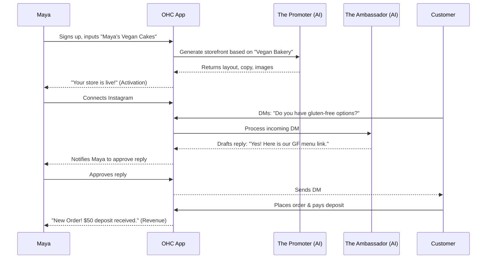
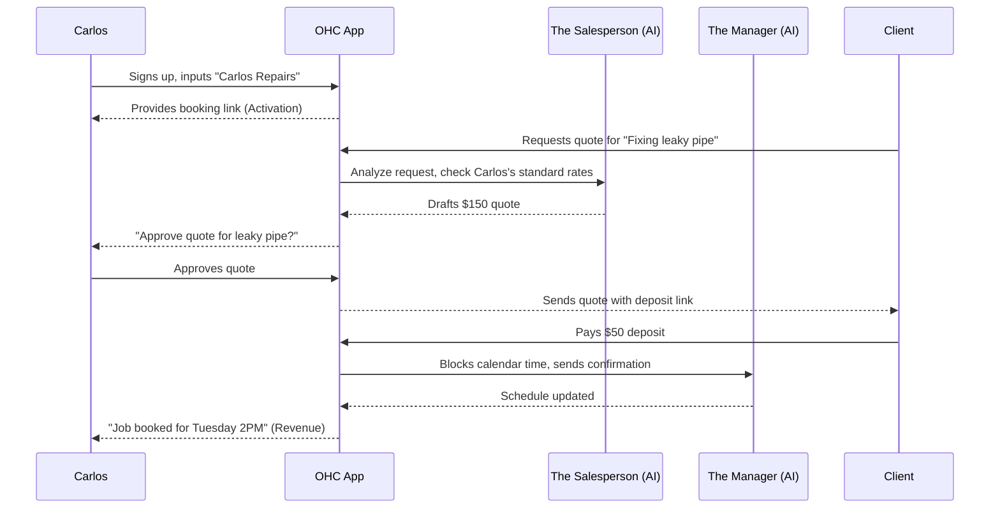

# Business Journey Architecture

## Title
Architectural Mapping of the End-to-End Business Journey for OHC Personas

## Problem Statement
Small business owners—from bakers to handymen—want to launch, run, and grow their businesses entirely from their smartphones without needing any technical knowledge or reading complex manuals. Right now, the journey from first hearing about OneHumanCorp (OHC) to getting their first paying customer and growing through word of mouth is disjointed. We need a unified architectural map that guarantees a frictionless flow through Acquisition, Onboarding, Activation, Retention, Revenue, and Referral. If a business owner cannot go from zero to live in under 10 minutes without confusion, we risk losing them to simpler but less capable platforms.

## Research Report

### Persona-Specific Pain Point Summaries
- **Maya (baker, 28)**: Struggles with keeping up with Instagram DMs while baking. She finds managing custom order deposits messy and often loses track of who paid what.
- **Carlos (handyman, 42)**: Relies heavily on word-of-mouth but has no professional online presence. He loses potential jobs because he can't quote fast enough while on a job site, and managing his schedule across different apps is chaotic.
- **Priya (boutique owner, 35)**: Managing inventory between her physical store and an online system is a nightmare. She needs a unified way to see what's in stock, handle tap-to-pay in person, and run email marketing without needing to hire a specialist.
- **Leo (music tutor, 22)**: Manages lessons across online and in-person formats, but handling scheduling, automated links, and chasing students for payments takes up too much of his teaching time. He also struggles to showcase his talent effectively on social media.
- **Fatima (food cart, 50, limited English)**: Taking pre-orders during the lunch rush is overwhelming. She needs an incredibly simple, low-data mobile app in multiple languages to manage sold-out items and notify customers when food is ready.

### Competitive Analysis
- **Shopify**: Excellent for physical products but overwhelming on mobile. The onboarding process asks too many technical questions up front (domains, taxes, shipping zones).
- **Wix**: Great drag-and-drop on desktop, but the mobile editing experience is cramped and frustrating. Not built for "born on mobile" users.
- **Squarespace**: Beautiful templates, but lacks deep integrated AI for daily operations (like answering DMs). The learning curve is steep for non-technical users.
- **GoDaddy**: Fast onboarding, but very rigid post-launch. Upsells constantly interrupt the flow, and their AI tools feel tacked on rather than deeply integrated.

### Actionable Recommendations
- OHC should implement a 3-step AI conversation onboarding because Shopify/Wix forms overwhelm users with 20+ fields.
- OHC should defer custom domain setup until after the first sale because GoDaddy's upfront domain push causes high abandonment rates among non-technical users.
- OHC should default all storefronts to a "Smart Block" mobile-first layout (375px width base) because Wix mobile editors are consistently rated as frustrating by users without design experience.
- OHC should embed "The Salesperson" agent directly into Instagram DMs because Maya and similar personas report losing 30% of sales due to slow reply times.

## Design Doc

### Key Design Decisions and Why
- **Progressive Disclosure Onboarding**: Only ask for Name, Business Type, and Vibe initially. Why? To get the user to a "Live Storefront" state in under 60 seconds, maintaining excitement.
- **Mobile-First 375px Baseline**: The entire UI and generated storefronts must be designed and tested at 375px first. Why? Carlos, Fatima, and Maya run their businesses primarily from their phones; desktop is a secondary luxury.
- **AI as Embedded Assistants**: AI agents (e.g., The Manager, The Ambassador) are treated as background staff that propose actions (Draft-for-Review) rather than hidden settings. Why? To build trust; users need to see what the AI is doing before it automatically emails clients.
- **Unified Activity Feed**: A single inbox for DMs, emails, and system alerts. Why? Users are overwhelmed by switching apps. A single feed reduces cognitive load.

### Mobile UX Flow (375px first)
1. **Acquisition/Landing**: Clear CTA "Launch your business in 60 seconds".
2. **Onboarding**: A chat-like interface. "Hi, what's your business called?" -> "What do you sell?" -> "Pick a vibe (Cozy, Modern, Fast)".
3. **Activation**: "Your store is live at maya-bakes.ohc.com! Add your first product."
4. **Daily Retention**: A dashboard showing a clear "Next Action" (e.g., "The Manager suggests approving this invoice for Carlos").
5. **Referral**: "Share your store link on TikTok to get a $10 credit."

### UI Wireframes Description
- **Home/Dashboard**: A clean, Glassmorphism-styled feed. Top card is the "Daily Briefing" from the AI. Below are pending actions (New Order, Message from Customer). Bottom nav bar: Home, Storefront, Inbox, Settings.
- **Storefront Editor**: "Smart Blocks" stacked vertically. Users tap a block (e.g., Hero Image) to swap the photo or rewrite text. No dragging elements out of alignment.
- **Inbox**: Unified chat view. Messages from Instagram, SMS, and Email appear in one list. An AI "Draft Reply" button sits next to the send button.

### AI Agent Integration Points
- **The Promoter (Marketing)**: Triggers during onboarding to write the site copy and select imagery based on the business "vibe".
- **The Manager (Operations)**: Triggers when an order is placed to update inventory and alert the owner.
- **The Ambassador (Customer Success)**: Listens to the Unified Inbox and drafts replies to common questions (e.g., "Are you open today?").
- **The Advisor (Business)**: Runs a daily background job to generate the "Daily Briefing" card on the dashboard.

### Architecture Diagrams (Sequence Diagrams)

#### Maya (Baker) - End-to-End Journey

#### Carlos (Handyman) - End-to-End Journey

## Implementation Prompt
**Task:** Build the End-to-End Business Journey Onboarding & Dashboard.
**Outcome:** A non-technical small business owner can download the app, answer three conversational questions, and land on a dashboard with a fully generated, live storefront and a unified inbox ready to receive messages.
**CUJ (Critical User Journey):**
1. User opens the app and enters their business name and type.
2. The AI generates a tailored storefront in the background.
3. User lands on a clean, mobile-first dashboard (375px baseline) highlighting their new live URL and a "Next Action" suggestion.
4. User connects a social channel (e.g., Instagram) and receives a test message in the Unified Inbox.
**Acceptance Criteria:**
- The onboarding wizard requires exactly three inputs before generating the storefront.
- The UI adheres to OHC's Premium Design Standards (Glassmorphism, Outfit/Inter typography, mobile-first 375px minimum).
- AI agent integration is clearly surfaced as "Draft-for-Review" in the inbox.
- No technical jargon (e.g., DNS, Webhooks, API) is visible to the user during the entire flow.

## Priority
P0

## Estimated Scope
Large