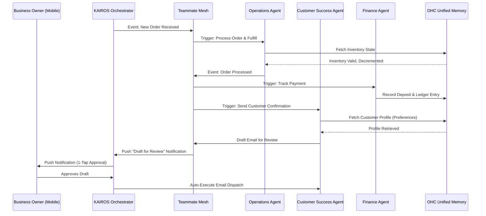

# Title
AI Agent Department Architecture: Invisible Department Orchestration

## Problem Statement
Small business owners—like Maya the Baker or Carlos the Handyman—lack the budget, time, and technical expertise to manage the multiple "departments" required to run a real business (Operations, Marketing, Sales, Customer Success, Finance, Legal, and Advisory). They need AI agents that operate invisibly in the background, handling complex business logic autonomously. The platform requires a cohesive architecture where these specialized AI agents coordinate seamlessly, mirroring how a real business operates, without requiring the user to configure complex workflows or integrations.

## Research Report
### Context and Competitive Analysis
Current platforms (e.g., Shopify, Wix, Squarespace) rely on fragmented third-party app ecosystems or complex workflow builders (like Zapier). Small business owners do not think in terms of "webhooks" or "API triggers"; they think in terms of functional departments:
- **Operations ("The Manager")**: Processing orders, tracking inventory, fulfillment.
- **Marketing & Advertising ("The Promoter")**: Generating websites, social media content, SEO.
- **Sales & Acquisition ("The Salesperson")**: Follow-ups, generating quotes.
- **Customer Success ("The Ambassador")**: Replying to DMs, review requests.
- **Finance & Payments ("The Accountant")**: Tax summaries, payment processing.
- **Legal & Compliance ("The Protector")**: Terms, GDPR.
- **Business Advisory ("The Advisor")**: Weekly health reports.

The gap is a unified orchestration layer where the Operations agent can automatically hand off tasks to the Customer Success agent (e.g., an order is shipped -> send a thank-you note) with zero manual configuration.

## Design Doc
### Key Design Decisions
- **Departmental Boundaries**: Agents are strictly scoped to functional areas to prevent context window overflow and hallucination, improving reliability.
- **1-Tap Approval Workflow**: High-risk, external-facing actions (e.g., sending an email or social media post) are always drafted for review. Low-risk, internal actions (e.g., tagging an order) are auto-executed. This builds trust without overwhelming the user.
- **Unified Event Mesh**: Departments coordinate via the Teammate Mesh, allowing decentralized event processing.
- **Shared Memory Layer**: All agents access a unified `pgvector` memory store to maintain long-term context across the business.

### Architecture Diagram (Mermaid.js)

### UI Wireframes / Screen Flow Description (375px first)
1. **The Daily Brief (Dashboard)**: The main view on mobile. Shows a feed of active agents and pending drafts requiring attention. Clean, Glassmorphism aesthetic with large touch targets.
2. **1-Tap Approval Card**: A prominent card showing: "The Ambassador drafted a reply to Maya's customer: 'Your cake will be ready at 3 PM.'" Two large buttons: `Approve` or `Edit`.
3. **Agent Settings**: Jargon-free toggles. "Let The Promoter post to Instagram automatically?" (Toggle On/Off).

### Mobile UX Flow
- **Event**: A new quote request comes in from Carlos's plumbing site.
- **Push Notification**: "The Salesperson drafted a $150 quote for a leaky pipe."
- **Action**: User taps the notification, opening a 375px optimized summary view.
- **Resolution**: User taps `Approve` (≥ 44x44px touch target). The UI updates optimistically with a success shimmer, and the background agent dispatches the quote.

### AI Agent Integration Points
- **On Schedule**: Triggered via cron (e.g., Weekly health report every Monday morning).
- **On Event**: Hooked into the KAIROS Orchestrator's Teammate Mesh for cross-department handoffs (e.g., order -> fulfillment -> support).
- **On Demand**: Invoked manually via chat or specific UI prompts by the user.

## Implementation Prompt
**To Implementer Agent:**
Implement the "Draft-for-Review" approval workflow engine within the KAIROS Orchestrator to support the AI Agent Department Architecture. Create the unified API layer that allows any agent (e.g., Customer Success or Marketing) to submit high-risk actions into a "Pending Approval" queue. Develop the mobile-first (375px) UI components that display these pending drafts to the user via a clean, jargon-free Activity Feed. The UI must include optimistic updates for the 1-Tap `Approve` and `Reject` actions, falling back gracefully on network errors. Do not prescribe specific database schemas or LLM inference engines; focus on the state machine transitions (Draft -> Approved/Rejected -> Executed), the cross-agent event routing, and a robust E2E test suite covering the full CUJ of an agent drafting a message and the owner approving it. Ensure all UI elements use OHC premium design tokens and adhere strictly to the "Grandmother Test".

## Priority
P0

## Estimated Scope
Large