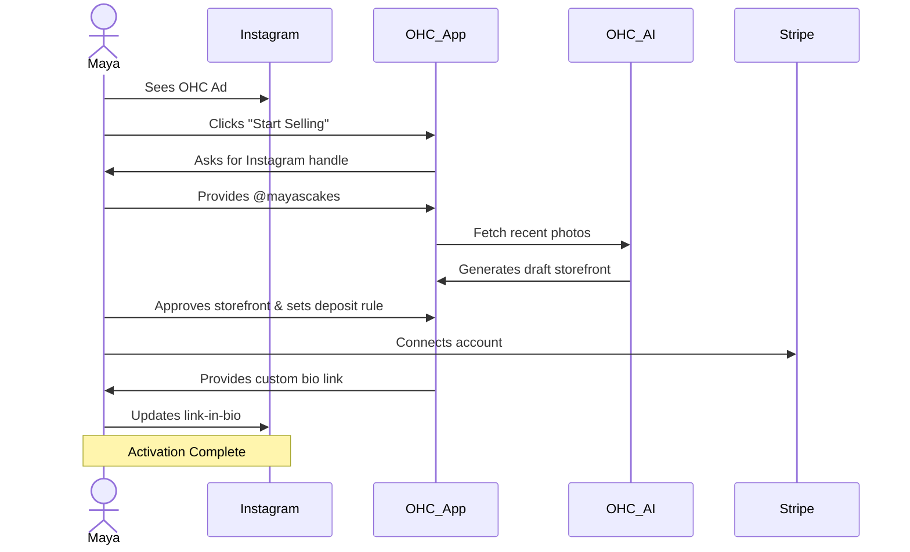
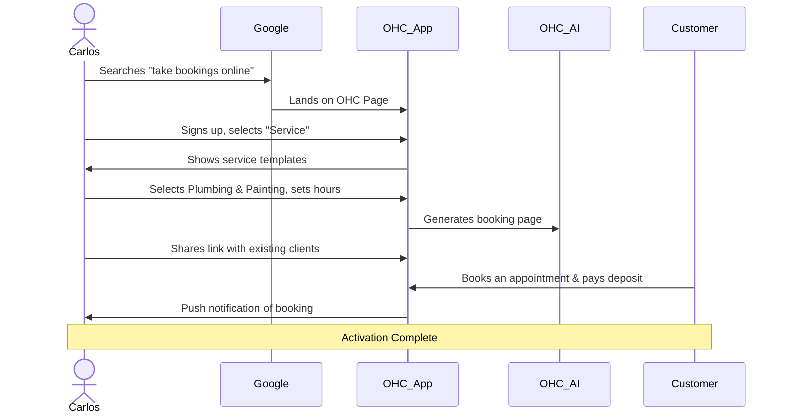
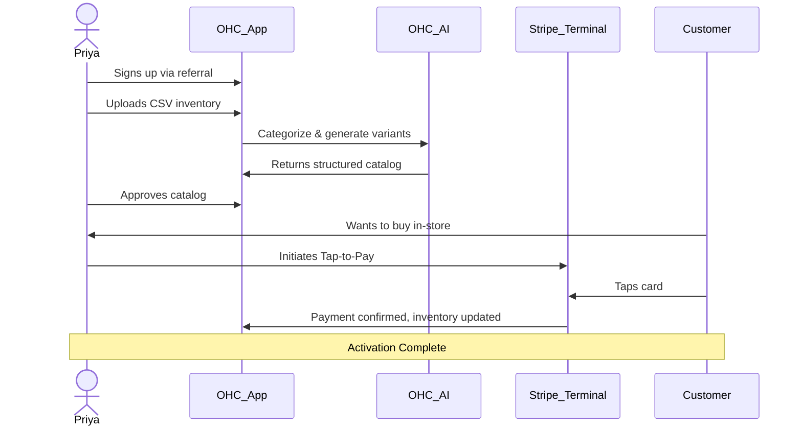
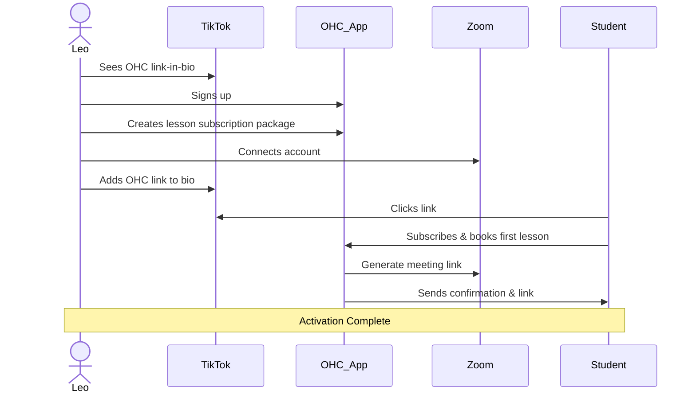
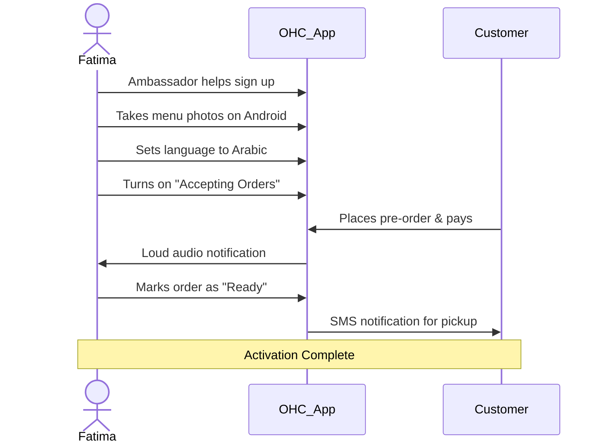

# Business Journey Architecture

## Overview
This document outlines the complete end-to-end user journey for the core OHC personas. Our goal is to ensure a non-technical user can go from zero to a live business in under 10 minutes, with AI handling the complexity.

## Personas & Journeys

### 1. Maya (The Home Baker)
**Acquisition:** Discovers OHC through a targeted Instagram ad highlighting "Turn your DMs into a real business in 5 minutes." CTA: "Start Selling."
**Onboarding:** Enters her Instagram handle; OHC AI automatically pulls her latest cake photos to build a draft catalog. She sets a deposit percentage.
**Activation:** Connects Stripe and publishes her storefront link to her Instagram Bio.
**Retention:** Receives daily push notifications when new deposits are paid. AI drafts replies to her DMs.
**Revenue:** Upgrades from Free to Starter tier when she exceeds 10 cake catalog items and wants a custom domain.
**Referral:** Shares her beautiful custom storefront, and other bakers see the "Powered by OHC" badge.

**Friction Points:** Stripe KYC onboarding can be intimidating. We need to streamline the payment setup process with plain-language explanations.

### 2. Carlos (The Freelance Handyman)
**Acquisition:** Organic search for "how to take bookings online without a website." Lands on an OHC landing page for service professionals.
**Onboarding:** Selects "Service Business." Chooses standard templates for Plumbing, Painting, and General Repairs. Sets availability hours.
**Activation:** Receives his first booking with a pre-paid deposit.
**Retention:** Uses the OHC mobile app daily to check his schedule and customer addresses.
**Revenue:** Upgrades to Pro when he needs the AI agent to send quotes based on customer problem descriptions.
**Referral:** Word of mouth to other tradespeople at the supply store.

**Friction Points:** Complex calendar syncs (Google Calendar/Outlook). OHC must handle bidirectional sync invisibly so he doesn't double-book.

### 3. Priya (The Boutique Owner)
**Acquisition:** Referred by another small business owner.
**Onboarding:** Needs to sync in-store inventory. Scans barcodes or uploads a CSV. OHC AI categorizes items into variants (Size, Color).
**Activation:** Makes her first in-person sale using OHC Tap-to-Pay on her iPhone.
**Retention:** Checks daily analytics dashboard on her mobile app to see revenue vs. yesterday.
**Revenue:** Subscribes to Pro tier to unlock unlimited products and full POS features.
**Referral:** Promotes her online store to in-store customers via QR codes.

**Friction Points:** CSV mapping is typically technical. The AI must be extremely robust at parsing messy inventory spreadsheets without manual mapping.

### 4. Leo (The Music Tutor)
**Acquisition:** Sees an influencer on TikTok using an OHC link-in-bio.
**Onboarding:** Sets up subscription packages for guitar lessons. Connects Zoom for auto-link generation.
**Activation:** A student purchases a monthly 4-lesson package.
**Retention:** OHC AI automatically follows up with inactive students.
**Revenue:** Upgrades to Starter for a custom domain.
**Referral:** Students share his portfolio page.

**Friction Points:** Subscription billing rules (cancellations, prorations) are confusing. OHC must abstract this into simple "Monthly Packages."

### 5. Fatima (The Food Cart Operator)
**Acquisition:** Local OHC community ambassador signs her up.
**Onboarding:** Takes photos of her menu items with her low-end Android phone. Selects Arabic language.
**Activation:** Receives her first pre-order pickup notification with loud audio alert.
**Retention:** Prints the daily order list from the app.
**Revenue:** Stays on Free or Starter tier. Value is driven by transaction volume (Stripe Connect).
**Referral:** Other food cart owners see her using the app.

**Friction Points:** Slow data connections and low-end devices. The app must have aggressive caching and optimistic UI updates to function reliably.

## Conclusion
By designing for these specific, non-technical journeys, OHC ensures that the complex technical details (databases, payment gateways, calendar APIs) remain completely invisible to the user.
