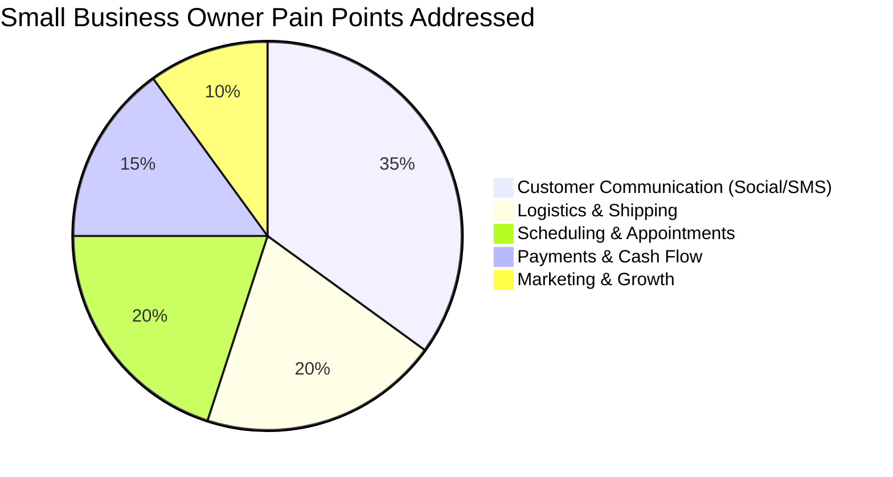
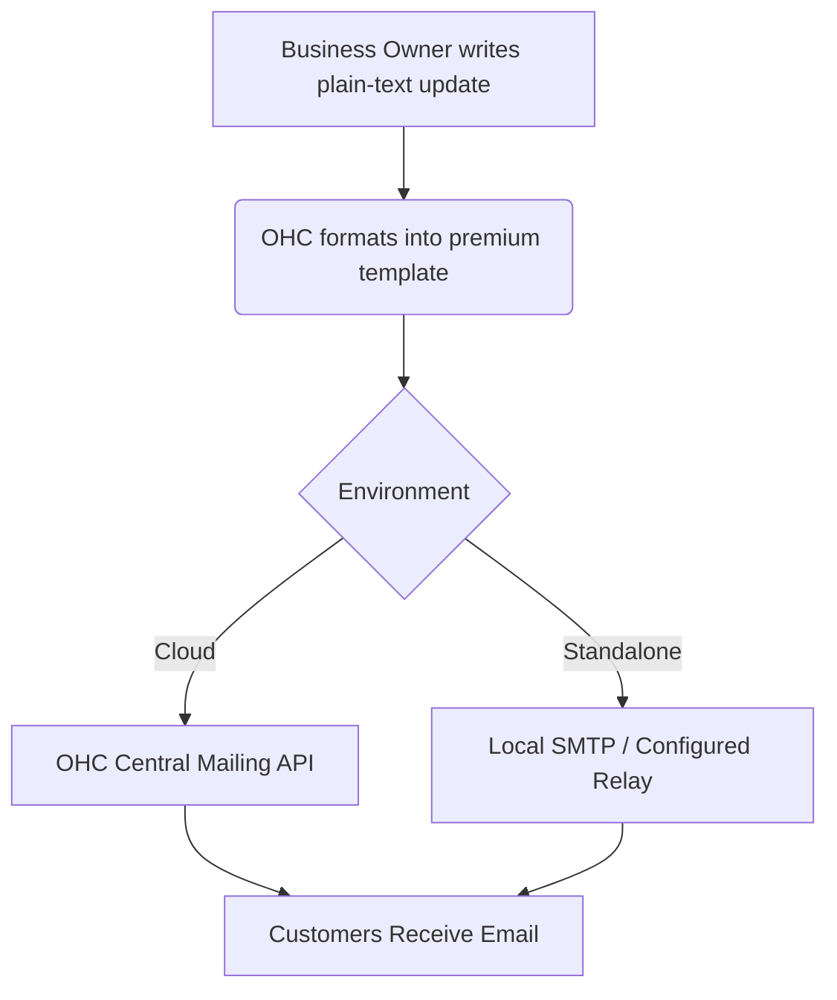
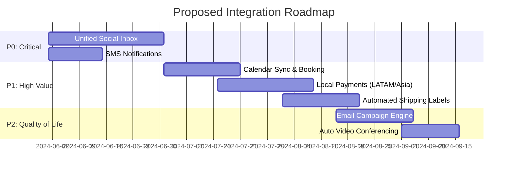

# Tool Integration Research Report

## Executive Summary

This report evaluates key integrations to expand OneHumanCorp's (OHC) capabilities, enabling small business owners to launch, run, and grow their businesses efficiently. The research covers seven critical tool categories.

The focus is on how non-technical small business owners (like "Fatima", who relies on SMS, or local shop owners) interact with these tools, their ease of use, and compatibility across both Cloud (scaled) and Standalone (local, private) OHC environments.

---

---

## 1. Social Media Integration

### [Social Media] Unified Inbox Integration

**Title**: Implement Unified Social Media Inbox for Cross-Platform Messaging

**Problem Statement**:
Small business owners lose track of customer inquiries scattered across Instagram DMs, Facebook comments, WhatsApp, and TikTok. A non-technical owner misses out on sales because they cannot keep up with checking 4-5 different apps constantly. They need one simple, unified inbox where all customer messages appear automatically.

**Research Report**:
- **Persona Context**: Sarah, a local bakery owner, receives cake orders via WhatsApp and Instagram DMs. Keeping track manually leads to missed orders.
- **Findings**: Tools like Meta Business Suite offer integration, but are complex. We need an invisible integration pulling messages via Graph API and WhatsApp Business API directly into OHC.
- **Ease of Use**: High priority. Connecting accounts should be a 1-click OAuth flow.
- **Pricing Estimates**: Many social APIs are free for basic usage; WhatsApp charges per conversation (~$0.01 - $0.08 depending on region).
- **Reputation**: Official APIs (Meta Graph API, TikTok for Business) are highly reliable but strictly rate-limited.
- **Cloud vs Standalone**:
  - *Cloud*: Centralized webhook endpoints handle incoming messages efficiently.
  - *Standalone*: Requires local polling or configuring a tunnel for webhooks, which can be challenging but is solvable via OHC's sync daemons.

**Comparative Analysis**:
| Feature | Meta Graph API (FB/IG) | WhatsApp Business API | TikTok API |
|---------|------------------------|-----------------------|------------|
| **Reach** | Very High | Very High (Global) | High (Gen Z) |
| **Complexity**| Medium | High (requires approval) | Low |
| **Cost** | Free | Per-conversation fee | Free |

**Design Doc**:
When a business owner clicks "Connect Social Media" in their OHC dashboard, they are guided through a standard OAuth login flow. Once connected, OHC will automatically retrieve incoming messages and comments. These will appear in a single "Customer Messages" view in the OHC app. When the owner replies in OHC, the message is routed back to the correct platform seamlessly.

**Implementation Prompt**:
Create a unified "Customer Messages" inbox interface and backend wiring. The user should be able to authenticate their social accounts with one click. Messages from connected platforms should appear in real-time or near real-time. Replies sent from the OHC inbox must be delivered to the customer on their original platform. Ensure the UI clearly indicates which platform a message originated from. Acceptance criteria include successful 1-click connection, receiving a test message, and successfully replying.

**Priority**: P0
**Estimated Scope**: Large

---

## 2. Calendar & Scheduling

### [Scheduling] Seamless Calendar Sync and Auto-Booking

**Title**: Enable 1-Click Calendar Sync and Automated Booking Links

**Problem Statement**:
Service-based business owners (like plumbers, tutors, or consultants) spend hours going back-and-forth over text or email to find a meeting time. They need a simple, auto-generated booking page that perfectly syncs with their existing Google Calendar or Outlook, without them having to configure complex scheduling rules.

**Research Report**:
- **Persona Context**: Marcus, a freelance consultant, uses Google Calendar. He needs clients to book available slots without double-booking him.
- **Findings**: Integrating directly with Google Calendar API and Microsoft Graph API allows us to read free/busy times. We can bypass expensive third-party tools like Calendly by building a native, simple booking layer.
- **Ease of Use**: The user simply clicks "Connect Google Calendar". OHC generates a permanent "Book Me" link they can share.
- **Pricing Estimates**: Free (standard API usage limits apply; we handle the scheduling logic internally).
- **Reputation**: Google and Microsoft APIs are industry standards and highly stable.
- **Cloud vs Standalone**: Works seamlessly in both. Standalone will require OAuth tokens to be stored securely locally.

**Design Doc**:
The business owner sees a "Scheduling" tab. They click to authorize their Google or Outlook account. OHC immediately reads their free/busy status and generates a public booking page URL. When a customer visits this URL, they see available slots. When booked, the event is pushed directly to the owner's connected calendar.

**Implementation Prompt**:
Develop a calendar connection flow and a simple, public-facing booking page for businesses. The system must accurately reflect the owner's availability based on their connected external calendar and allow customers to book a time slot. Once booked, the event should be added to the owner's calendar automatically. Acceptance criteria include zero double-bookings during tests and an effortless connection experience for the owner.

**Priority**: P1
**Estimated Scope**: Medium

---

## 3. Email Marketing

### [Marketing] Simplified Customer Newsletter Engine

**Title**: Build an Integrated, Easy-to-Use Customer Email Campaign Manager

**Problem Statement**:
Small businesses collect customer emails but rarely use them because tools like Mailchimp are overwhelming, expensive, and require learning a new interface. Business owners need a simple way to send a professional-looking update or promotion to their customer list directly from OHC.

**Research Report**:
- **Persona Context**: A local cafe owner wants to announce a new seasonal drink to all past customers.
- **Findings**: Instead of forcing users to export/import CSVs to third-party tools, OHC can integrate with transactional email providers (SendGrid, Postmark, AWS SES) under the hood to send campaigns directly.
- **Ease of Use**: The owner types a message, selects "All Customers", and clicks send. OHC handles the formatting and delivery invisibly.
- **Pricing Estimates**: AWS SES is very cheap ($0.10 per 1,000 emails). SendGrid offers easy integration but gets expensive at scale.
- **Reputation**: Postmark has the best deliverability; SES is the most cost-effective.
- **Cloud vs Standalone**:
  - *Cloud*: OHC manages a central sending reputation.
  - *Standalone*: Requires the owner to plug in their own SMTP credentials or use a relayed OHC service.

**Design Doc**:
In the "Customers" tab, add a "Send Announcement" button. The owner gets a simple text editor. They write their message and attach a photo. Behind the scenes, OHC wraps this in a beautiful, responsive email template using the premium UI tokens. OHC handles sending to the customer list and automatically appends legally required unsubscribe links.

**Implementation Prompt**:
Create a straightforward email campaign feature where business owners can send updates to their customer list. Focus on a zero-jargon interface. The system must automatically wrap the user's content in a pre-designed, premium HTML template and handle bulk sending via our designated email provider. Acceptance criteria include successful delivery of a test campaign, functional unsubscribe links, and mobile-responsive email output.

**Priority**: P2
**Estimated Scope**: Medium

---

## 4. Payment Processing

### [Payments] Alternative Local Payment Providers

**Title**: Integrate Alternative Local Payment Gateways (Mercado Pago, Paytm, Alipay)

**Problem Statement**:
While Stripe is great, many business owners operate in regions where Stripe is unavailable or where local customers prefer specific regional wallets. A shop in LATAM needs to accept Mercado Pago, otherwise they lose sales at checkout.

**Research Report**:
- **Persona Context**: Diego, running a store in Argentina, needs to accept local payment methods that his customers actually use.
- **Findings**: Supporting alternative payment methods is critical for global reach. Mercado Pago dominates LATAM, Paytm in India, and Alipay/WeChat Pay in China.
- **Ease of Use**: The owner flips a toggle for "Accept Mercado Pago" and provides their merchant ID.
- **Pricing Estimates**: Payment processors typically charge 2-3% + fixed fee per transaction. OHC charges no additional markup.
- **Reputation**: These are trusted, massive regional networks.
- **Cloud vs Standalone**: Works in both. Webhook verification for payment success is straightforward in Cloud, requires polling or tunnels in Standalone.

**Comparative Analysis**:
| Region | Primary Provider | Ease of Integration | Settlement Speed |
|--------|------------------|---------------------|------------------|
| LATAM | Mercado Pago | Medium | 1-3 days |
| India | Paytm / UPI | High (UPI) | Instant (UPI) |
| China | Alipay | Medium | 1-2 days |

**Design Doc**:
Under "Settings > Payments", add regional providers alongside Stripe. When enabled, these providers appear as checkout options on the business's OHC-generated storefront or invoice links. The integration will handle redirecting the customer to the regional payment flow and securely verifying the payment success upon return.

**Implementation Prompt**:
Expand the payment settings to include configuration for Mercado Pago, Paytm, and Alipay. Modify the checkout and invoice payment flows to display these options dynamically based on the owner's configuration. Ensure the payment verification loop securely marks OHC orders as "Paid" without requiring manual intervention from the owner. Acceptance criteria include a successful end-to-end test transaction using a sandbox environment for one of the regional providers.

**Priority**: P1
**Estimated Scope**: Large

---

## 5. Shipping & Logistics

### [Logistics] Automated Shipping Rate Calculation and Labels

**Title**: Integrate Real-Time Shipping Rates and 1-Click Label Printing

**Problem Statement**:
E-commerce business owners waste significant time manually weighing packages and standing in line at the post office to buy labels. They need the system to automatically calculate shipping costs for the customer at checkout and provide a 1-click way to print a prepaid shipping label from home.

**Research Report**:
- **Persona Context**: Emma makes hand-crafted candles. She needs to know exactly how much to charge for shipping to different states and wants to print USPS labels from her desk.
- **Findings**: APIs like EasyPost or Shippo aggregate carriers (USPS, FedEx, UPS, DHL) into a single integration.
- **Ease of Use**: Very high. OHC abstracts the complexity. The user just sees a "Print Label" button on an order.
- **Pricing Estimates**: EasyPost charges ~$0.01 to $0.05 per label; the postage cost is passed to the business (often at a discount).
- **Reputation**: EasyPost is highly reliable with excellent developer documentation.
- **Cloud vs Standalone**: Works seamlessly in both, as it is an outbound API call to generate the PDF label.

**Design Doc**:
During checkout, the customer's address is sent to the shipping API to display accurate shipping costs. When the business owner views a paid order in OHC, there is a prominent "Buy & Print Shipping Label" button. Clicking this securely purchases the postage using the owner's configured billing, and opens a printable PDF of the label. The tracking number is automatically emailed to the customer.

**Implementation Prompt**:
Integrate a shipping API (e.g., EasyPost) to handle real-time rate calculation at checkout and label generation in the order management dashboard. The business owner should not need to configure complex carrier settings—just their ship-from address. Implement the flow to generate a PDF label and automatically notify the customer with tracking details. Acceptance criteria include accurate checkout rates based on destination and successful generation of a test label.

**Priority**: P1
**Estimated Scope**: Medium

---

## 6. SMS & Notifications

### [Communications] Reliable SMS Notifications for Low-Tech Personas

**Title**: Implement Global SMS Notifications for Critical Business Alerts

**Problem Statement**:
Not all business owners constantly check a dashboard or email. Users like Fatima (low English proficiency, mobile-first) rely entirely on text messages. If a new order or booking comes in, they need a simple SMS alert, otherwise the business stops.

**Research Report**:
- **Persona Context**: Fatima runs a home-based tailoring service. She doesn't use email. She needs a text message when a client books a fitting.
- **Findings**: Twilio and MessageBird provide global SMS delivery. For OHC, we must ensure high reliability and clear, localized, jargon-free messages.
- **Ease of Use**: Completely invisible to the user. They just enter their mobile phone number during onboarding.
- **Pricing Estimates**: Twilio SMS varies globally (e.g., ~$0.0079 in US, up to $0.05+ internationally). Token budgets and rate limits must be enforced to prevent abuse.
- **Reputation**: Twilio is the gold standard for reliability.
- **Cloud vs Standalone**:
  - *Cloud*: OHC centralized Twilio account handles dispatch.
  - *Standalone*: Requires the user to provide a Twilio API key, or relies on OHC Cloud relay services.

**Design Doc**:
In the business settings, the owner can verify their phone number and check a box: "Send me a text when I get a new order or booking." When the event occurs, OHC formats a short, plain-language text (e.g., "New order from John! $45.00. Check OHC app.") and dispatches it via the SMS provider.

**Implementation Prompt**:
Add an SMS notification system triggered by critical business events (new order, new booking). The interface should allow owners to opt-in easily by verifying their phone number. Ensure the backend enforces strict rate-limiting (max SMS per hour) to prevent runaway costs. The messages must be brief and strictly jargon-free. Acceptance criteria include successful delivery of an SMS upon a test order creation and functional opt-out handling.

**Priority**: P0
**Estimated Scope**: Small

---

## 7. Video Conferencing

### [Operations] Auto-Generated Video Links for Services

**Title**: Auto-Generate Video Meeting Links for Online Consultations

**Problem Statement**:
Business owners offering online services (tutors, therapists, consultants) struggle with manually creating Zoom links and emailing them to clients before every meeting. They need a system that automatically generates a unique video link when a service is booked and sends it to both parties.

**Research Report**:
- **Persona Context**: David offers online guitar lessons. He wants the customer to book a slot and immediately receive a link to the video call without his intervention.
- **Findings**: Zoom API is standard but complex. Google Meet integration is seamless if we are already doing Google Calendar sync. Alternatively, integrating an open-source WebRTC solution (like Jitsi) directly into OHC could provide a frictionless, no-install experience.
- **Ease of Use**: If using Google Meet/Zoom, it requires OAuth. If using an embedded Jitsi room, zero setup is required.
- **Pricing Estimates**: Jitsi is free/open-source. Zoom/Google depend on the user's existing subscription.
- **Reputation**: Google Meet is highly trusted and requires no installation for users on Chrome.
- **Cloud vs Standalone**: Works in both; Standalone can easily spin up local links or use standard cloud video providers.

**Design Doc**:
When an owner creates a "Service" to sell, they can toggle "This is an online meeting." If checked, whenever a customer books this service, OHC automatically generates a unique video link (via Google Meet integration or a managed Jitsi instance). This link is embedded in the calendar invite and the customer's confirmation receipt.

**Implementation Prompt**:
Integrate automated video link generation into the service booking flow. When an online service is booked, the system must create a unique meeting room URL and automatically distribute it via the booking confirmation and calendar event. Prioritize a solution that requires minimal to zero configuration from the business owner. Acceptance criteria include a successful booking flow that yields a functional, unique video link sent to the test customer.

**Priority**: P2
**Estimated Scope**: Medium

---

## Actionable Recommendations

1. **Prioritize P0 Issues First**: The Unified Social Inbox and SMS Notifications solve the most immediate, painful gaps for our core personas (Sarah and Fatima). These represent critical pathways for revenue generation and operations.
2. **Abstract Complexity**: For integrations like Shipping and Email Marketing, aggressively hide the provider details. The business owner should never see the words "SMTP," "API Key," or "Carrier Routing."
3. **Standalone Mode Consistency**: Ensure that wherever an external API is used, the Standalone mode has a graceful fallback or clear instructions on how the owner can configure their local environment (e.g., supplying their own Twilio credentials if offline relaying is not possible).

