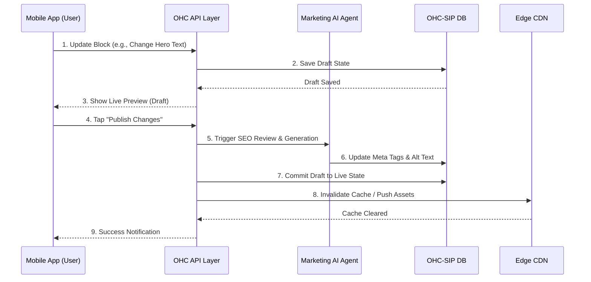
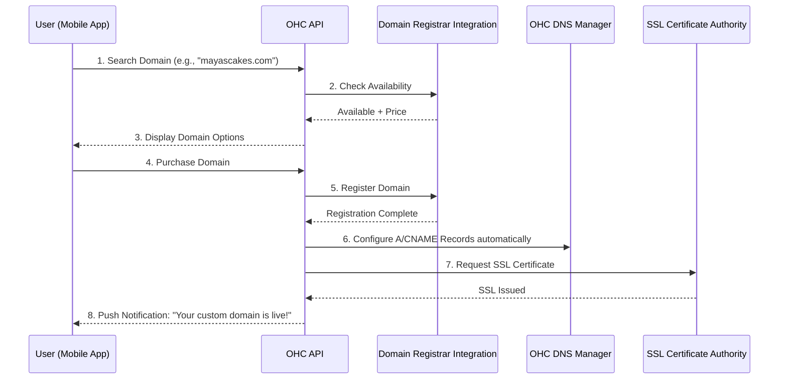

# OHC Website & Storefront Builder Architecture

## 1. Overview
The OHC Website & Storefront Builder is the core engine that enables non-technical users to launch their digital presence in under 10 minutes. This architecture defines the user-facing building blocks, template system, publishing flow, and automated management of SEO and custom domains. The design strictly prioritizes a mobile-first (375px baseline) management experience, ensuring that every persona—from Maya the baker on her iPhone to Fatima operating her food cart on a low-end Android—can effortlessly create and manage their site.

## 2. Core Personas & Needs
Every design decision addresses these specific users:
- **Maya (Baker, iPhone-only):** Needs a beautiful photo catalog of cakes, deposit-based custom order forms, and Instagram integration.
- **Carlos (Handyman, Android-only):** Needs a simple, clean service listing with pricing, a booking calendar for time slots, and a customer intake form for quote generation.
- **Priya (Boutique Owner, iPhone & Desktop):** Requires an online storefront synchronized with her physical inventory, product variants (size/color), and a newsletter signup block.
- **Leo (Music Tutor):** Needs a professional profile/portfolio, subscription-based lesson packages, and a mobile-optimized "link-in-bio" layout for TikTok.
- **Fatima (Food Cart, Low-end Android):** Requires a photo-heavy menu with easy "sold out" toggles, pre-order pickup forms, and multilingual (Arabic/English) support.

## 3. Website Builder Components

### 3.1 Content Blocks
The builder uses a finite, highly curated set of content blocks. There is no raw HTML or unstructured rich text editing; everything is structured to guarantee aesthetic excellence (Glassmorphism, 20px blur, Outfit/Inter typography).

- **Hero Block:** The main landing section with a high-quality background image/video, headline, subheadline, and a primary Call to Action (CTA) button (e.g., "Order Now", "Book a Service").
- **Product Grid Block:** Dynamically synced with the user's inventory. Supports image lazy-loading, variant selection, and "sold out" badges. Includes a quick "Add to Cart" or "Pre-order" button.
- **Service & Booking Block:** Displays a list of services with descriptions and prices, integrated directly with the OHC calendar for time slot selection and deposit collection.
- **Text & Image (Story) Block:** A split layout for telling the business story, perfect for portfolio pieces or "About Us" sections.
- **Testimonial Block:** A carousel or grid of customer reviews. The AI Customer Success agent can automatically populate this with 5-star reviews.
- **Contact & Inquiry Form Block:** A simple form (Name, Email, Message) that feeds directly into the AI Sales & Acquisition agent's inbox.
- **Link-in-Bio Block:** A specialized, vertical list of large, tappable buttons optimized specifically for social media profiles (TikTok, Instagram).
- **Footer Block:** Automatically generated navigation, social media links, and Legal & Compliance agent-generated policies (Terms of Service, Privacy Policy).

### 3.2 Template System
Templates in OHC are not rigid themes; they are intelligent starting points optimized for specific business types.
- **The "Vibe" System:** Users select a "vibe" (e.g., Elegant, Playful, Minimalist, Professional) rather than a complex theme. This applies a cohesive set of design tokens (colors, fonts, corner radiuses, button styles) across all blocks.
- **AI-Assisted Generation:** Upon onboarding, the Marketing & Advertising agent generates the initial site layout based on the user's business type and a few simple questions.
- **Responsive by Default:** All blocks are guaranteed to look perfect on a 375px mobile screen and gracefully expand for desktop viewings.

## 4. Mobile-First UX Flow (375px Baseline)

The entire website management experience is designed for one-handed operation on a mobile device.

1. **Dashboard Home:** The user taps the "Website" tab.
2. **Preview Mode:** A live, interactive preview of their site is displayed in the center.
3. **Edit Action:** Tapping any block (e.g., the Hero image) opens a bottom sheet modal.
4. **Bottom Sheet Editing:** The modal provides simple inputs (e.g., "Change Image", "Edit Title"). For images, the native camera roll picker is used.
5. **Add New Block:** Tapping a floating "+" button between existing blocks opens a menu of available block types.
6. **Publish:** A prominent "Publish Changes" button at the top right commits the updates.

## 5. Publishing, SEO, and Domains

### 5.1 Publishing Flow
The publishing process handles the transition from "Draft" to "Live" without exposing any technical details (like deploying, building, or caching) to the user.
- **Draft State:** Changes made in the mobile app are saved to a draft state automatically. The user sees the live preview instantly.
- **1-Tap Publish:** When the user taps "Publish", the orchestrator triggers the deployment process.
- **Optimistic UI:** The app immediately shows a "Success! Your site is live" message, while the actual global CDN propagation happens in the background.

### 5.2 Automated SEO
SEO is entirely invisible and managed by the AI Marketing & Advertising agent.
- **Meta Tags:** Titles, descriptions, and Open Graph images are automatically generated based on the content of the blocks.
- **Sitemaps & Robots.txt:** Automatically generated and submitted to major search engines.
- **Image Optimization:** All uploaded images are automatically compressed to WebP and served with correct `alt` text (AI-generated if omitted by the user).
- **Continuous Improvement:** The Advisory agent periodically suggests content tweaks based on search performance.

### 5.3 Custom Domains & SSL Provisioning
Connecting a custom domain is the biggest friction point for non-technical users. OHC reduces this to the simplest possible flow.
- **Default OHC Subdomain:** Every business gets an immediate, secure `[business-name].onehumancorp.io` domain upon registration.
- **Domain Purchase (In-App):** Users on Starter/Pro tiers can search and purchase a custom domain directly within the OHC mobile app. The underlying DNS configuration is handled completely by OHC.
- **Bring Your Own Domain (BYOD):** If a user owns a domain elsewhere, the app provides simple, step-by-step copy/paste DNS records (A/CNAME). The app actively polls DNS propagation and sends a push notification when the connection is successful.
- **Zero-Touch SSL:** SSL certificates are provisioned and renewed automatically for all domains (OHC subdomains and custom domains) without any user intervention.

## 6. Architecture Diagrams

### 6.1 End-to-End Website Publishing Flow

### 6.2 Custom Domain Provisioning Flow

