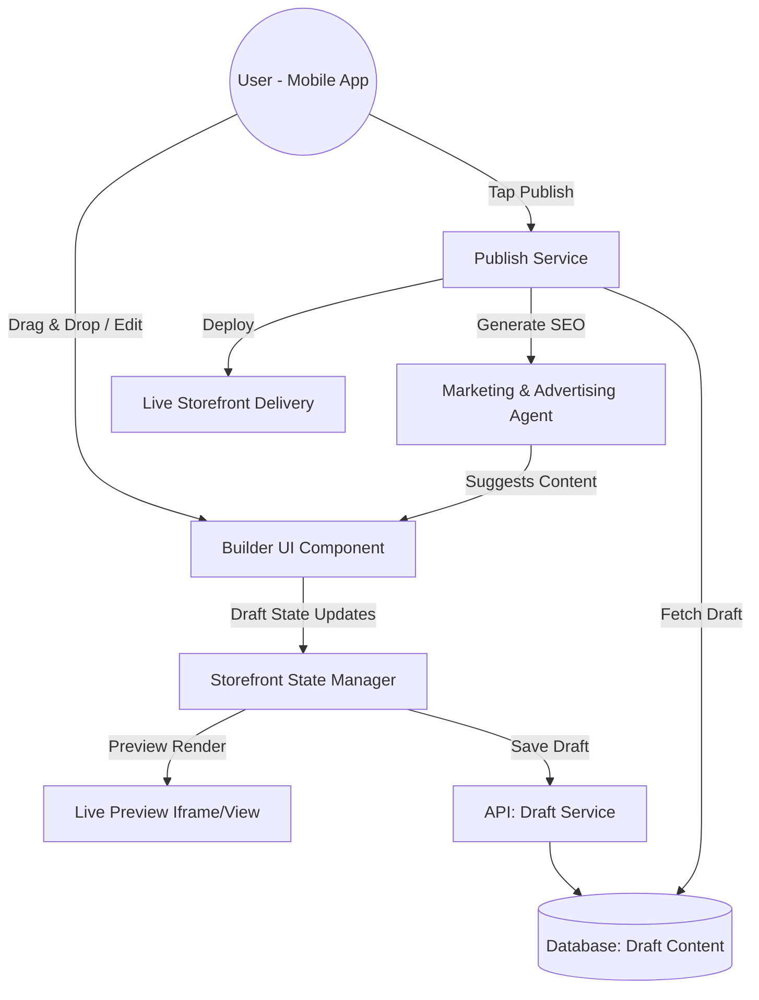

# [architecture] Website & Storefront Builder

## Title
Website & Storefront Builder Architecture: Mobile-First, Drag-and-Drop Creation

## Problem Statement
Small business owners (like Maya the Baker or Priya the Boutique Owner) need a professional, reliable online presence to sell products and services. However, they lack technical expertise and are often overwhelmed by complex website builders. They need a system that allows them to instantly generate a high-converting storefront from a mobile device, customize it intuitively without code, and seamlessly integrate SEO and custom domains, all while remaining completely functional offline and highly performant.

## Research Report
### Context and Personas
- **Maya (Home Baker)**: Needs a beautiful catalog with large images, simple text blocks for her story, and an integrated booking/order form.
- **Priya (Boutique Owner)**: Needs a dynamic product grid that automatically syncs with her inventory, highlighting variants like size and color.
- **Carlos (Handyman)**: Needs clear service listings, a trusted review/testimonial block, and a prominent contact form/booking calendar.

### Competitive Analysis
- **Shopify / Wix / Squarespace**: Offer powerful drag-and-drop builders but are fundamentally designed for desktop editing. Their mobile apps are often stripped-down companions rather than primary authoring tools. They also require significant manual SEO configuration.
- **OHC Advantage**: OHC's builder is strictly mobile-first (375px base), utilizing AI to instantly generate a complete, working draft from minimal inputs. Drag-and-drop on mobile relies on intuitive block reordering rather than pixel-perfect free-form placement, which reduces cognitive load and ensures responsive design by default.

## Design Doc
### Key Design Decisions
- **Block-Based Architecture**: The storefront is composed of standardized, high-level functional blocks (e.g., Hero, Product Grid, Text, Testimonials, Booking Calendar, Contact Form). Users cannot break the layout by placing elements arbitrarily; they arrange pre-designed, premium blocks.
- **Mobile-First Editing**: The primary editing interface is optimized for touch. Reordering blocks uses large touch targets (drag handles), and editing content is done via native mobile keyboards in full-screen overlays.
- **AI-Driven Templates**: Instead of choosing from a vast library of blank templates, the Marketing & Advertising Agent generates a custom template tailored to the user's business type, pre-filled with relevant blocks and AI-generated copy.
- **Seamless Publishing (Draft -> Live)**: Changes are saved automatically as drafts. Publishing is a distinct action that triggers static asset generation and cache invalidation.
- **Automated SEO**: SEO metadata (title, description, structured data) is automatically generated and updated by the Marketing Agent based on the storefront's content and products.
- **Zero-Config Domains**: Provisioning custom domains and securing them (SSL) is handled entirely by the platform as a 1-tap operation upon tier upgrade.

### UI Wireframes & Screen Flow (375px Mobile)
1. **Builder Home**: Displays a live preview of the current draft. A floating action button (FAB) allows adding new blocks.
2. **Block Picker**: A bottom sheet presenting available blocks grouped by category (Content, Products, Booking).
3. **Edit Block Mode**: Tapping a block opens a full-screen editor overlay. For a text block, this is a simple text area. For a product grid, it's a multi-select list of active products.
4. **Publish Flow**: A sticky "Publish" banner appears when unpublished changes exist. Tapping it shows a brief summary and confirms the update.

### Mobile UX Flow
- **Adding a Block**: User taps FAB -> Selects "Testimonials" -> AI instantly populates 3 draft testimonials based on past orders -> User taps "Publish".
- **Reordering**: User long-presses a block -> Drag-and-drop interface activates -> User drags "Product Grid" above "Hero" -> Drops -> Layout instantly updates.

### Architecture Diagram (Mermaid.js)

### AI Agent Integration Points
- **Marketing & Advertising Agent**:
    - **Initial Generation**: Creates the starting layout and copy based on onboarding data.
    - **SEO Generation**: Automatically creates and updates meta tags and structured data whenever content changes.
    - **Content Suggestions**: Proposes new blocks (e.g., "Add a testimonial block from your recent 5-star review").

## Implementation Prompt
**To Implementer Agent:**
Implement the mobile-first Website & Storefront Builder UI and the supporting backend draft management. The UI must be a touch-optimized block-based editor supporting standard components (Hero, Product Grid, Text, Testimonials, Booking Calendar, Contact Form). Ensure the editing experience is strictly bounded by 375px width constraints and uses large touch targets for drag-and-drop operations. Integrate the Marketing & Advertising Agent to provide initial template generation and automated SEO metadata generation upon publishing. Implement a clear separation between 'Draft' and 'Live' states, with a seamless publishing action. Adhere to OHC Glassmorphism design standards. Do not focus on the specific CDN or SSL issuance details, assume the deployment layer exists. Provide Playwright tests verifying a user can add a block, edit its content, and publish the site.

## Priority
P0

## Estimated Scope
Large