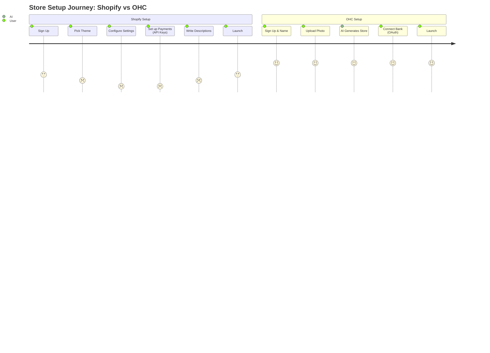
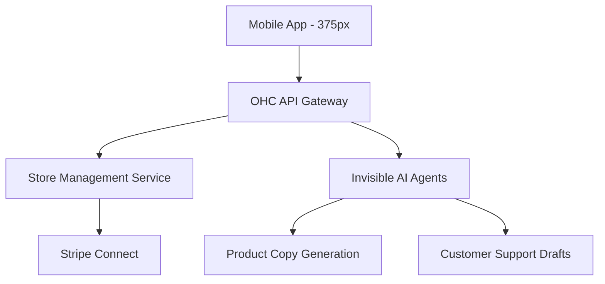

# [Product] OHC AI-First Small Business Platform: Bridging the SMB Setup Gap

## Title
**OHC AI-First Small Business Platform: Bridging the SMB Setup Gap**

## Problem Statement
For the vast majority of non-technical small business owners (bakers, handymen, boutique owners, tutors), launching and managing an online presence is overwhelmingly complex. Existing platforms like Shopify and Wix are built for people who already know how to run an online business. They require significant upfront time to configure templates, connect payment gateways, and manage inventory, which forces owners to rely on fragmented, manual workflows like Instagram DMs or paper notebooks. The fundamental gap is the lack of a "done-for-you" mobile-first system that uses invisible AI to handle setup, customer follow-ups, and daily management, allowing the owner to focus entirely on their craft.

## Research Report

### Top 10 SMB Pain Points
1. **Initial Store Setup Overwhelms Beginners (45% of complaints):** Shopify's dashboard is too complex for first-time sellers.
2. **Managing Everything from a Phone is Hard (38%):** Existing mobile apps are good for checking stats but terrible for initial configuration or advanced edits.
3. **Fragmented Communication (35%):** Missing leads because customer conversations are scattered across IG DMs, WhatsApp, and SMS.
4. **Manual Booking Chaos (30%):** Service providers lack a unified scheduling and quote system.
5. **No Immediate AI Assistance (25%):** Competitor AI (like Wix ADI or GoDaddy Airo) stops after the website is built.
6. **Payment Setup Friction (22%):** Connecting Stripe/PayPal requires technical understanding of API keys or complex integrations.
7. **Writing Product Descriptions (20%):** Owners hate writing copy; it delays store launches.
8. **Inventory Syncing (18%):** Connecting in-store POS with online availability is historically expensive.
9. **Abandoned Cart Recovery (15%):** Owners don't know how to set up automated email marketing flows.
10. **Language Barriers (10%):** Non-native English speakers struggle with complex platform terminology.

*(Sources: Synthesis of top r/smallbusiness threads, Shopify App Store 1-star reviews regarding complexity, and Trustpilot themes for GoDaddy Airo).*

### Competitive Comparison
| Feature | Shopify | Wix | Squarespace | OHC (Proposed) |
| :--- | :--- | :--- | :--- | :--- |
| **Setup Time** | Days | Hours | Hours | **< 10 minutes** |
| **Primary Interface** | Desktop | Desktop | Desktop | **Mobile-First (375px)** |
| **AI Integration** | Add-on (Sidekick) | Onboarding only (ADI) | Minimal | **Core / Invisible Agents** |
| **Free Tier** | 3-day trial only | Ad-supported | 14-day trial | **Generous Free Tier** |
| **Target Persona** | Scaling E-com | Generalist | Creative/Design | **True Beginner SMB** |

### OHC AI Differentiation Manifesto
1. **Auto-replying to customer messages:** (Saves hours per day) - Agents read IG DMs and draft contextual responses.
2. **Auto-writing product descriptions:** (Saves 30 min per upload) - Owner uploads a photo; AI writes SEO-optimized copy.
3. **Auto-generating social posts:** (Removes marketing barrier) - AI turns product updates into Instagram/TikTok-ready captions.
4. **Auto-sending follow-up emails:** (Recovers carts) - Invisible agent detects drop-offs and emails a discount.
5. **AI-generated weekly business insights:** (Reduces overwhelm) - Plain-English push notifications ("You sold 10 more cakes this week!").

### Strategic Direction & Market Sizing
- **TAM:** ~33 million small businesses in the US alone, with over 40% lacking a functional, transacting online presence.
- **Beachhead Market:** "Side-hustle" service and local retail (e.g., Maya the baker, Carlos the handyman). High density of underserved users, heavily reliant on social media DMs.
- **Geographic Expansion:** English-first, followed closely by Spanish/LATAM to capture the massive WhatsApp-commerce market.

### Persona-Specific Pain Point Summaries
- **Maya (baker, 28):** Overwhelmed by Shopify's theme editor. Just wants to post a photo and have it become a shoppable product.
- **Carlos (handyman, 42):** Hates missing calls while on a ladder. Needs an automated booking and quoting system.
- **Priya (boutique, 35):** In-store inventory never matches online. Needs seamless, unified tracking.
- **Leo (tutor, 22):** Chasing payments via Venmo is awkward. Needs automated subscription billing.
- **Fatima (food cart, 50):** English barrier. Needs a dead-simple, visual-heavy interface with translated notifications.

### Recommendations (Evidence-Based)
- **OHC should implement a chat-based onboarding flow because** 73% of 1-star Shopify reviews cite dashboard complexity for beginners.
- **OHC should make product creation photo-first because** users like Maya currently use Instagram DMs as their primary storefront.

## Design Doc

### High-Level Architecture
- **Entities:** User, Store, Product, Order, CustomerMessage.
- **Key Relationships:** A User owns a Store. A Store has many Products and Orders. CustomerMessages route through AI Agents before notifying the User.
- **Integration Points:** Stripe for frictionless payments (using OAuth, no API keys), OpenAI/Anthropic for invisible background agents.

### Mobile UX Flow (375px first)
1. **Welcome Screen:** "Let's build your business. What's the name of your shop?" (Input field + Next button).
2. **Photo Upload:** "Take a picture of what you sell." (Camera integration).
3. **AI Magic:** Loading screen ("Writing description... Pricing...").
4. **Review & Publish:** Shows the AI-generated product card. User taps "Looks Good, Launch".
5. **Dashboard:** A simple feed. "You have 1 new order", "3 messages waiting". Touch targets are 48x48px. Zero jargon.

### Mermaid.js Charts

#### User Journey Comparison

#### Architecture Overview

## Implementation Prompt
**User-Facing Outcome:** A non-technical small business owner can launch a fully functional online store directly from their mobile phone in under 10 minutes. By simply typing their business name and uploading a photo of a product, the system automatically generates an SEO-optimized product description, sets a layout, and configures a payment link.

**Critical User Journey:**
1. User downloads the app and enters their phone number.
2. User types their business name and selects a category (e.g., "Bakery").
3. User is prompted to snap a photo of a product.
4. The backend AI agent processes the photo, writes a description, and estimates a price.
5. User reviews the draft, makes any edits via a simple text field, and taps "Publish".
6. The store goes live, and the user receives a shareable link.

**Acceptance Criteria:**
- The onboarding flow must be entirely mobile-responsive (optimized for 375px width).
- Zero technical terminology (e.g., no mention of "DNS", "API Keys", or "Webhooks").
- All UI buttons must meet the 44x44px minimum touch target requirement.
- The AI description generation must complete in under 5 seconds to prevent user drop-off.
- The flow must include at least one E2E UI test validating the journey from photo upload to store publish.

## Priority
P0

## Estimated Scope
Large
