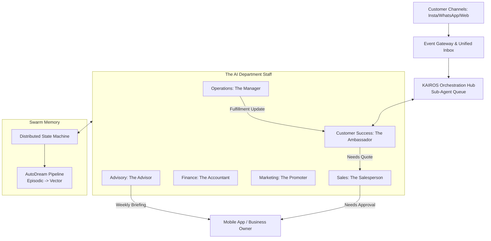

# AI Agent Department Architecture

## Problem Statement

Small business owners—whether they're baking custom cakes, running a handyman service, or selling boutique clothing—are overwhelmed by the sheer volume of "back-office" tasks required to keep their business alive.

From Maya, a baker who misses out on orders because she can't reply to Instagram DMs at 2 AM, to Carlos, a handyman who loses track of follow-up quotes while on a job site, the administrative burden is a constant source of friction and lost revenue. They don't have the budget to hire a full team (a manager, an accountant, a promoter, a salesperson), and they certainly don't have the time to learn complex software or stitch together multiple tools. They need an invisible, reliable staff that works 24/7, handles the complexity seamlessly, and communicates in plain language. They want to focus on their craft, not on being a full-time administrator.

## Research Report

### The State of SMB Operations
Our research into the daily operations of typical OHC personas (Maya the Baker, Carlos the Handyman, Priya the Boutique Owner) reveals that 60-70% of a solo entrepreneur's time is spent on non-core activities:
- **Lead Capture & Follow-up**: Responding to inquiries across fragmented channels (Instagram, WhatsApp, Email).
- **Scheduling & Quotes**: Back-and-forth negotiation on availability and pricing.
- **Fulfillment & Operations**: Updating inventory, managing order status, and sending shipping/pickup notifications.
- **Finance**: Tracking payments, generating receipts, and calculating simple revenue metrics.

### Competitive Gap Analysis
Traditional platforms (Shopify, Wix, Squarespace) provide the *tools* for these tasks but expect the owner to operate them.
- **Shopify**: Excellent for pure e-commerce but requires significant setup and manual management. The "AI" features are mostly bolt-on text generators.
- **Wix/Squarespace**: General-purpose builders that lack deep, autonomous operational workflows.
- **Claude/Replit Agents**: Built for developers. A baker cannot use a code-first agent to manage their business.

### The Opportunity: The Invisible AI Staff
OHC's unfair advantage is moving from *software-as-a-tool* to *software-as-a-service*. By organizing AI agents into familiar, human-like "Departments" (e.g., "The Manager", "The Promoter"), we map complex multi-agent orchestration directly onto the mental model of a small business owner.

## Design Doc

### 1. The Department Model
The AI Agent workforce is structured into familiar departments. Each department encapsulates a specific domain of responsibility, maintaining its own context while collaborating with others via the KAIROS engine's distributed state machine.

- **Operations ("The Manager")**: Handles fulfillment, inventory, and order lifecycle.
- **Customer Success ("The Ambassador")**: Manages inbox, multi-channel replies, and post-sale follow-ups.
- **Sales & Acquisition ("The Salesperson")**: Generates quotes, qualifies leads, and suggests upsells.
- **Finance & Payments ("The Accountant")**: Tracks payments, refunds, and financial reporting.
- **Marketing & Advertising ("The Promoter")**: Drives engagement, creates social posts, and optimizes the storefront.
- **Business Advisory ("The Advisor")**: Provides the weekly briefing, actionable insights, and proactive suggestions.

### 2. Architecture Diagram

### 3. Mobile UX Flow (375px First)
1. **The Daily Briefing**: Upon opening the app, the owner sees a clean, Glassmorphism-styled card from "The Advisor": *"Good morning! You have 3 new Instagram inquiries and 1 custom cake quote waiting for approval."*
2. **One-Tap Approvals**: The owner taps the quote. They see a plain-language summary prepared by "The Salesperson", a proposed price, and a "Send Quote" button.
3. **Autonomous Activity Feed**: Below the briefing, an ambient feed shows what the staff is doing in the background: *"The Ambassador replied to 4 FAQs on WhatsApp,"* *"The Manager updated inventory for Vegan Cupcakes."*
4. **Intervention**: The owner can tap any background activity to view the transcript or take over the conversation seamlessly.

### 4. AI Agent Integration Points
- **Trigger Mechanisms**:
  - *Event-Driven*: Webhooks from social channels (Instagram DMs, WhatsApp).
  - *Schedule-Driven*: Weekly financial roll-ups, daily inventory checks.
  - *On-Demand*: The owner explicitly asks "The Promoter" to create a Black Friday campaign.
- **Inter-Department Coordination**: Handled via the KAIROS Sub-Agent Queue. For example, when a customer accepts a quote via Instagram, "The Ambassador" receives the intent, routes a billing request to "The Accountant" to generate a payment link, and sends the link back to the customer.
- **Budgeting & Throttling**: Actions are debited against the tenant's monthly AI action allowance (enforced per tier: 100 for Free, 1000 for Starter, Unlimited for Pro).
- **Approval Spectrum**: Operations can be configured as *Auto-Execute* (replying to simple FAQs) or *Draft-for-Review* (custom pricing quotes, refunds).

### 5. Key Design Decisions
- **Mental Model over Technical Accuracy**: We explicitly hide terms like "LLM", "Vector Database", and "RAG". The owner interacts with "Departments" and "Staff Members".
- **Conservative Execution by Default**: High-risk actions (spending money, changing prices, sending contracts) default to *Draft-for-Review* until the owner explicitly trusts the agent to *Auto-Execute*.
- **Mobile-First Interventions**: The UI must allow the owner to intervene in an agent's workflow with a single tap, taking over a chat or modifying a draft quote without navigating complex menus.

## Implementation Prompt

**Objective:** Implement the core routing and UI representation for the AI Agent Departments.

**User Journey (CUJ):**
1. A small business owner opens the OHC mobile app.
2. They navigate to the "My Staff" section.
3. They see a visual representation of their active AI departments (e.g., The Manager, The Ambassador).
4. They tap on "The Ambassador" to view its recent autonomous actions (e.g., "Replied to 3 Instagram DMs").
5. They toggle a setting on "The Ambassador" to require approval for quotes over $100.

**Acceptance Criteria:**
- The KAIROS engine must route incoming customer intents to the correct department based on plain-language categorization (e.g., a question about business hours goes to Customer Success; a request for a custom job goes to Sales).
- The mobile UI (375px width optimized) must render the "My Staff" dashboard using premium OHC design tokens (Outfit for headings, Inter for body, Glassmorphism elements for department cards).
- The system must respect the "Draft-for-Review" vs. "Auto-Execute" threshold, holding KAIROS tasks in a pending state and surfacing them in the owner's Daily Briefing feed if intervention is required.
- The implementation must cleanly handle multi-tenant isolation, ensuring agents only access memory and state belonging to the current business owner.

## Priority
**P0 (Critical)** - This architecture defines the core value proposition of the OHC Hybrid Agentic OS.

## Estimated Scope
**Large** - Touches orchestration routing, tenant isolation, and mobile UI rendering.
