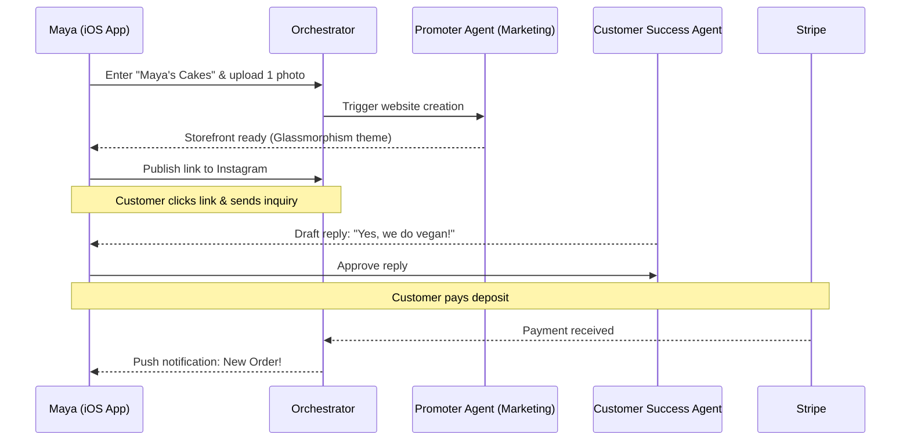
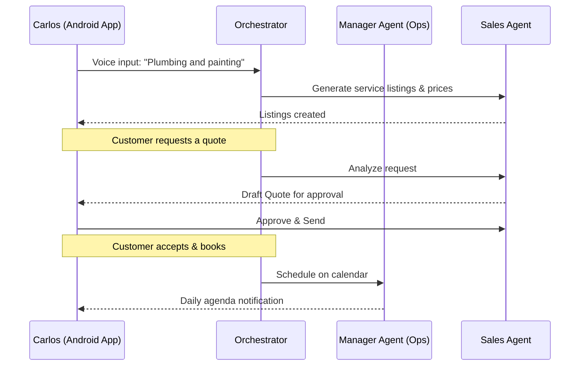
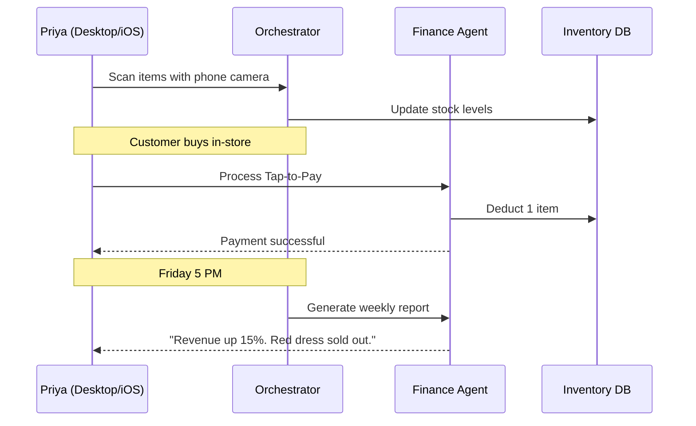
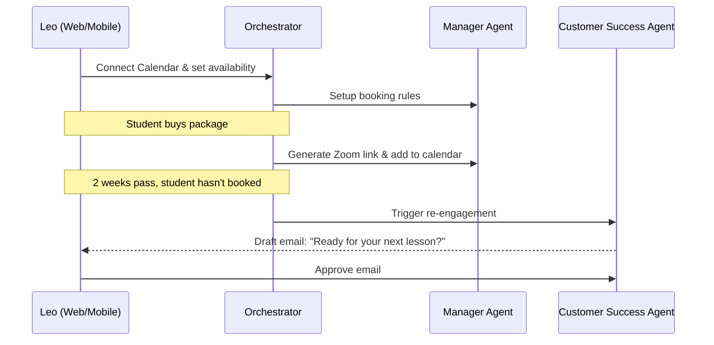
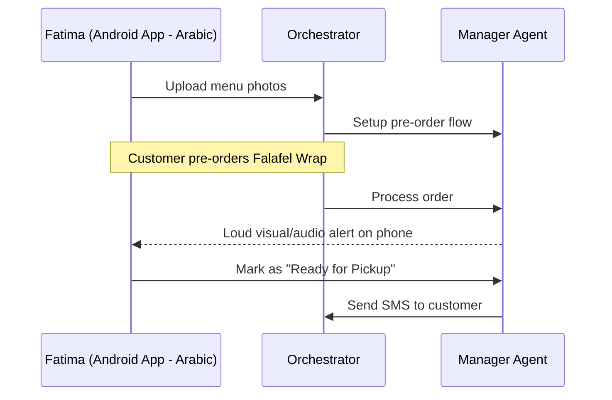

# OHC Business Journey Architecture

## Title
Business Journey Architecture 🗺️

## Problem Statement
A critical requirement for OHC is that any non-technical small business owner can go from zero to a live business in under 10 minutes. Without a holistic understanding of the user journey, individual features may work perfectly in isolation but create friction when combined. We must systematically document the end-to-end flow for every core persona to ensure smooth onboarding, high activation rates, and long-term retention.

## Research Report
- **Goal**: Define the complete end-to-end user journey for each of the core OHC personas (Maya, Carlos, Priya, Leo, Fatima).
- **Competitor Analysis**:
  - Shopify/Wix focus heavily on the "Store Setup" phase but leave marketing and customer success to third-party apps, which increases cognitive load.
  - OHC's differentiation is that AI Agents handle the setup and operational complexity automatically.
- **Key Friction Points Identified**:
  - Overwhelming initial configuration (e.g., setting up shipping zones, tax rates).
  - Writing product descriptions and copy.
  - Designing a visually appealing storefront without design skills.
  - Managing multiple inboxes (Instagram DMs, email, website chat).

## Design Doc

### 1. The Maya Persona Journey (The Home Baker)
- **Acquisition**: Sees a TikTok ad showing how a baker set up a store in 5 minutes from their phone.
- **Onboarding**: Downloads the OHC iOS app. Enters business name: "Maya's Cakes". Takes a photo of one cake. AI auto-generates the product title, description, and price suggestion. The "Promoter" agent generates a minimal Glassmorphism storefront.
- **Activation**: Shares the OHC link on her Instagram bio. Receives her first custom order inquiry.
- **Retention**: Receives push notifications for new orders. The "Ambassador" agent drafts replies to DMs.
- **Revenue**: Upgrades to the "Starter" plan to get a custom domain (`mayascakes.com`) once she hits 10 orders/month.
- **Referral**: Mentions OHC in a "day in the life of a baker" Reel.

### 2. The Carlos Persona Journey (The Freelance Handyman)
- **Acquisition**: Recommended by another contractor.
- **Onboarding**: Android app. Speaks into the mic: "I fix plumbing and do painting". AI creates service listings.
- **Activation**: Customer books a time slot and pays a deposit.
- **Retention**: Daily digest of upcoming jobs from the "Manager" agent.
- **Revenue**: Needs automated quoting, so upgrades to Starter.

### 3. The Priya Persona Journey (The Boutique Owner)
- **Acquisition**: Searches Google for "sync in-store and online inventory".
- **Onboarding**: Desktop + iOS. Imports basic CSV or takes photos.
- **Activation**: First in-person Tap-to-Pay transaction via OHC app.
- **Retention**: Weekly financial health report from "Accountant" agent.
- **Revenue**: Subscribes to Pro for advanced inventory tracking.

### 4. The Leo Persona Journey (The Music Tutor)
- **Acquisition**: Wants a link-in-bio that handles payments, tired of Venmo + Calendly.
- **Onboarding**: Connects Google Calendar. AI sets up subscription tiers.
- **Activation**: First student buys a 4-lesson package.
- **Retention**: "Ambassador" agent follows up with students who missed a lesson.

### 5. The Fatima Persona Journey (The Food Cart Operator)
- **Acquisition**: Needs to reduce lines at her cart. Local community group suggestion.
- **Onboarding**: Low-end Android. Simple photo menu. Arabic UI.
- **Activation**: Receives a loud notification for a pre-order.
- **Retention**: Printable daily order summary.

## Implementation Prompt
1. Review the defined journeys.
2. Ensure that the E2E testing framework covers these specific Critical User Journeys (CUJs).
3. Update the Orchestrator routing to ensure the specific agents mentioned (Promoter, Manager, Sales, Finance, Ambassador) are triggered at the correct stages of these flows.

## Priority
P0

## Estimated Scope
Large
