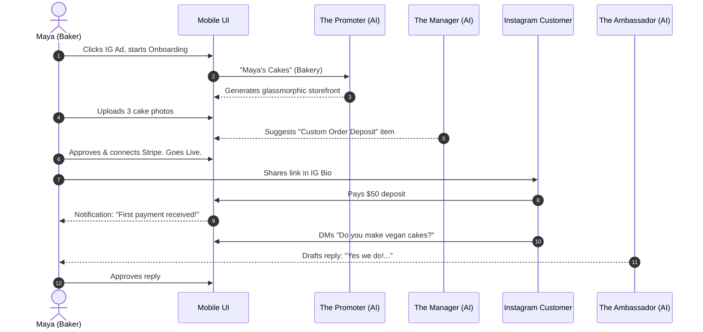
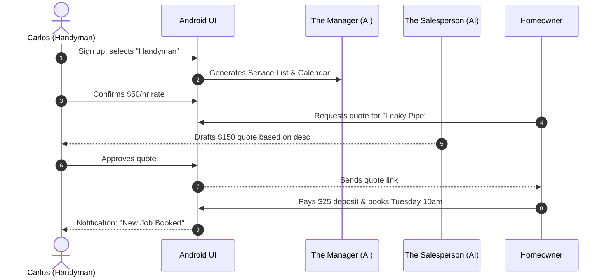
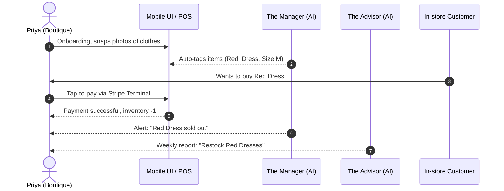
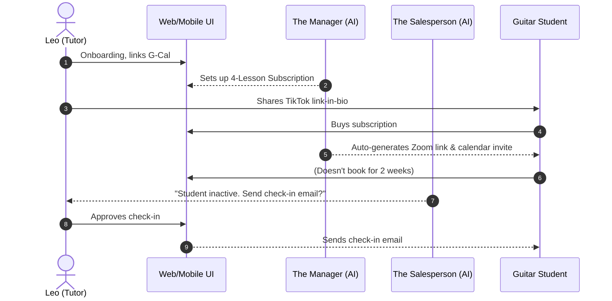
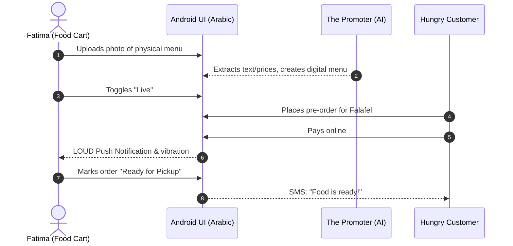

# [Business Journey] OHC End-to-End Business Journey Architecture

## Title
OHC End-to-End Business Journey Architecture

## Problem Statement
Small business owners (especially non-technical ones) experience a fragmented and intimidating setup process when using traditional platforms like Shopify or Wix. The journey from "having an idea" to "managing daily operations" is fraught with friction—requiring domain knowledge in web design, SEO, payment gateways, and marketing. If the user journey isn't radically simple, mobile-first, and heavily assisted by AI, users will abandon the setup flow before reaching activation, or they will fail to retain engagement after the initial novelty wears off. We need a unified architectural map of the end-to-end user journey to align engineering implementation with actual user needs.

## Research Report
### Competitive Analysis
- **Shopify:** Complex onboarding (30-60 min). Focuses heavily on e-commerce catalog setup upfront. Requires desktop for efficient store design. The "first sale" moment is delayed.
- **Wix:** Overwhelming template choices (20-40 min). The drag-and-drop editor is not genuinely mobile-first and can break easily on small screens. AI generation is an add-on, not the core orchestrator.
- **Squarespace:** Desktop-first design process. Portfolio-heavy but e-commerce integration is clunky for service-based businesses.
- **OHC Opportunity:** Reduce time-to-value to < 10 minutes by offloading all setup (design, inventory seed, copy) to AI agents. Native mobile-first design ensures 100% of the journey (Acquisition → Referral) happens seamlessly on a 375px screen without horizontal scrolling.

### Key Findings
1. **Time-to-Value is the primary driver of activation.** If users don't see a live, beautiful storefront within 10 minutes, they churn.
2. **Push notifications drive retention.** For non-technical users, checking an app proactively is rare; reactive management via push notifications (e.g., "New Order", "Agent replied to customer") builds the habit.
3. **Friction Points:** Choosing a template, writing product descriptions, configuring Stripe deposits, and setting up calendars. All these must be completely bypassed or heavily pre-filled by AI.

## Design Doc

### Journey Phases Definition
- **Acquisition:** How the persona discovers OHC and the CTA they click.
- **Onboarding:** The 10-minute wizard to go live. Minimum inputs needed.
- **Activation:** The "Aha!" moment (first product added, first payment).
- **Retention:** Daily triggers to return to the app (notifications, AI summaries).
- **Revenue:** The trigger to upgrade to a paid tier.
- **Referral:** The mechanism to invite others.

### Persona 1: Maya (The Home Baker)
- **Acquisition:** Clicks an Instagram Ad ("Turn your DMs into a real business"). Lands on a mobile page with CTA: "Build your bakery in 3 minutes."
- **Onboarding:** Enters business name ("Maya's Cakes"), selects "Bakery". AI Agent (Marketing) auto-generates a glassmorphic catalog template. Maya uploads 3 photos from her camera roll. AI Agent (Operations) suggests a default "Custom Cake Deposit" product. Maya connects Stripe. Store is Live.
- **Activation:** Receives her first $50 deposit via a custom link she put in her Instagram Bio.
- **Retention:** Push notification: "You have 1 new DM. The Ambassador agent drafted a reply: 'Yes, we do vegan cakes!' Review and send?"
- **Revenue:** Maya wants a custom domain (`mayascakes.com`) to look more professional. Clicks "Upgrade to Starter ($9/mo)".
- **Referral:** Adds a "Powered by OHC" link in her checkout flow, giving a $10 credit to other bakers.

### Persona 2: Carlos (The Freelance Handyman)
- **Acquisition:** Word of mouth from a contractor friend. CTA: "Get booked online today."
- **Onboarding:** Selects "Handyman Services". AI Agent (Marketing) builds a clean service listing. AI Agent (Operations) sets up a basic booking calendar (9am-5pm). Carlos adds his hourly rate.
- **Activation:** A customer books a "Plumbing Fix" slot for Tuesday at 10am and pays a $25 deposit.
- **Retention:** Daily SMS/Push: "You have 2 jobs today. Click to see map routing."
- **Revenue:** Carlos hits the 100-action limit for AI quote generation. Upgrades to Starter tier.
- **Referral:** Auto-sends review requests after jobs. Reviews contain a subtle OHC branding link.

### Persona 3: Priya (The Boutique Owner)
- **Acquisition:** Searches "free POS for small boutique" on Google.
- **Onboarding:** Imports basic inventory from an old spreadsheet or snaps photos of racks (AI extracts items).
- **Activation:** First in-person Tap-to-Pay transaction using OHC app (Stripe Terminal).
- **Retention:** The Advisor agent sends weekly reports: "Tuesday was slow, but Red Dresses sold out. Restock soon."
- **Revenue:** Upgrades to Pro to unlock unlimited AI agent actions (she uses The Promoter heavily for email newsletters).
- **Referral:** Mentions OHC in a boutique owners Facebook group, sharing her dashboard screenshot.

### Persona 4: Leo (The Music Tutor)
- **Acquisition:** Sees another creator's OHC link-in-bio on TikTok.
- **Onboarding:** Connects Google Calendar. Agent (Operations) sets up Zoom integration and creates "4-Lesson Package".
- **Activation:** First student buys the subscription package.
- **Retention:** Agent (Sales) alerts Leo: "3 students haven't booked a lesson in 2 weeks. Send a follow-up?"
- **Revenue:** Needs to remove OHC branding from his portfolio to look like a premium agency. Upgrades to Pro.
- **Referral:** Adds "Start teaching online" badge to his link-in-bio.

### Persona 5: Fatima (The Food Cart Operator)
- **Acquisition:** Local community flyer / WhatsApp group recommendation.
- **Onboarding:** Sets language to Arabic. Snaps a photo of her printed menu. Agent (Marketing) digitizes the menu with prices.
- **Activation:** First pre-order placed via the web link. Her phone rings with a loud custom notification.
- **Retention:** Simple daily printable checklist of orders.
- **Revenue:** High volume of orders means she exceeds the free tier limits. Upgrades to Starter.
- **Referral:** Customers ask how to do pre-orders; she shares an invite link.

### Key Design Decisions and Why
- **Progressive Disclosure:** Ask only for Name and Category. Defer Stripe connection until the user wants to accept real money (allows them to play with the UI first).
- **AI as Co-pilot, not Autopilot initially:** AI drafts the website, quotes, and emails, but *always* requires explicit user approval during the first 7 days to build trust.
- **Mobile-First Realities:** No horizontal scrolling tables. Dashboards must use large summary cards. Notifications are the primary interface for engagement.

### AI Agent Integration Points
- **The Promoter:** Triggered during onboarding to generate the site, and actively monitoring social feeds.
- **The Manager:** Triggered upon order creation, booking confirmation, or inventory deduction.
- **The Ambassador:** Triggered by incoming DMs/emails or order state changes (e.g., "Ready for pickup").
- **The Salesperson:** Runs CRON jobs scanning for abandoned checkouts or inactive customers.
- **The Advisor:** Runs weekly map-reduce jobs over tenant metrics to generate the Monday morning report.

## Implementation Prompt
**For Implementer Agent:**
Implement the core onboarding workflow and telemetry tracking for the Business Journey.
1. Create a simplified mobile-first (375px) onboarding UI flow in Flutter that captures Business Name and Category, bypassing complex configuration.
2. Hook up the backend API to trigger "The Promoter" AI agent to generate a basic site template asynchronously.
3. Instrument every step of the journey (Acquisition, Onboarding, Activation) using OpenTelemetry metrics with `tenant_id` context to track the < 10 minute completion goal.
4. Add E2E Playwright tests simulating a user (Maya) going from signup to "Store Live" screen on a mobile viewport.

## Priority
P0

## Estimated Scope
Large
