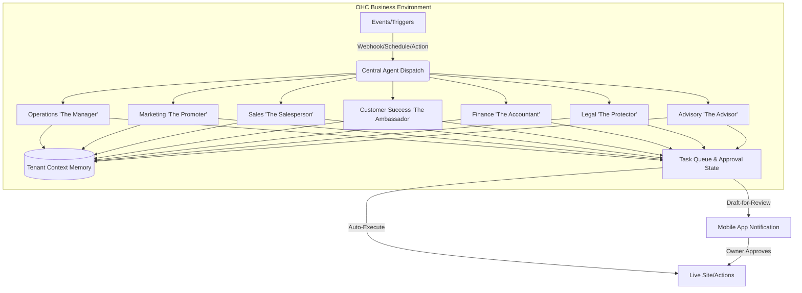

# AI Agent Department Architecture

## Problem Statement
Small business owners (bakers, handymen, tutors, etc.) are overwhelmed by the complexity of managing different aspects of their business. They do not want to learn new tools, switch between multiple apps, or figure out how to configure complex workflows for marketing, sales, customer success, finance, and legal compliance. They need an invisible, zero-configuration system that acts as a fully-staffed back office, handling tasks natively just like a team of specialized human employees would, allowing them to focus strictly on their craft.

## Research Report
- **Competitive Analysis**:
  - Shopify/Wix/Squarespace: Often rely on 3rd party plugins for advanced operations like marketing automation or legal compliance. This requires configuration, separate billing, and complex mental overhead.
  - OHC Advantage: By introducing "Departments", OHC provides a mental model that a non-technical owner intuitively understands (e.g., "The Manager", "The Accountant"). It creates a cohesive, single-platform experience out-of-the-box.
- **Key Findings**:
  - Users think in business outcomes, not software categories. (e.g., "I need more sales", not "I need an SEO plugin").
  - Auto-execution is desired for low-risk tasks (e.g., confirming orders), while draft-for-review is necessary for high-risk tasks (e.g., sending custom quotes, legal disclaimers).
  - Tenants require strict resource isolation and predictable budgeting to avoid surprise AI costs.

## Design Doc

### Architecture Diagram (Mermaid.js)

### UI Wireframes & Mobile UX Flow (375px)
1. **Home/Inbox Tab:** Owner receives a notification card (Glassmorphism styling, outfit/inter typography): "The Ambassador drafted a reply to Maya's order inquiry. [Review & Send]".
2. **Review Screen:** Displays the customer's message context, the AI's drafted response, and action buttons: "Approve & Send", "Edit", "Discard". Entrance animations ≤ 300ms using `cubic-bezier(0.4, 0, 0.2, 1)`.
3. **Department Dashboard (The Office):** A grid of department cards showing recent activity. Clicking "The Promoter" shows upcoming social posts scheduled or suggested.
4. **Settings:** Toggle per department between "Auto-pilot" and "Draft only". Sticky 'Advanced mode' toggle for raw API settings hidden by default.

### AI Agent Integration Points
- **Triggers:**
  - Synchronous: User asks "The Advisor" for weekly trends.
  - Asynchronous: Incoming email, new order, abandoned cart.
  - Scheduled: Weekly report generation, seasonal marketing pushes.
- **Coordination:** A central orchestrator routes events to the appropriate department. If an order comes in, "The Manager" handles inventory while "The Accountant" logs the payment.
- **Memory/Context:** Agents share a multi-tenant isolated context (business history, brand tone, past customer interactions) to ensure consistency. Use SPIFFE/SPIRE for identity to maintain zero-secrets architecture.
- **Usage Limits:** Enforce AI usage budget per tier at the dispatch layer.

### Key Design Decisions
- **Familiar Mental Model:** Naming agents after human roles (e.g., "The Promoter") reduces friction.
- **Approval Spectrum:** Explicitly supporting "Draft-for-Review" builds trust before the owner enables full auto-pilot.
- **Cross-Department Collaboration:** The orchestrator pattern prevents agents from acting in silos or stepping on each other's toes.
- **Budgeting Enforcement:** AI usage is tracked at the department dispatch level per tenant to ensure tiered limits are respected without surprise overages.
- **Resilience:** AI requests must have 60s timeouts, 3 retries, fail-safes against malformed responses, and idempotent operations per OHC ML-Resilience rules.

## Implementation Prompt
Implement the core foundational orchestrator and the "Operations (The Manager)" department. The system should correctly route a "New Order" event to The Manager, which will draft a fulfillment plan and generate a notification for the business owner to review via the mobile app. The solution must handle multi-tenant context securely using session-derived tenant IDs and gracefully degrade to a 'paused' state if the LLM provider fails. Do not prescribe specific database schemas, RPC frameworks, or web frameworks; ensure the CUJ (from event trigger to mobile review state) is fully testable and respects the architectural boundaries outlined. Provide 100% test coverage for the routing, multi-tenant isolation, and state transitions.

## Priority
P0

## Estimated Scope
Large
