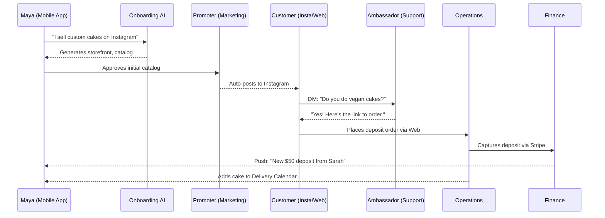
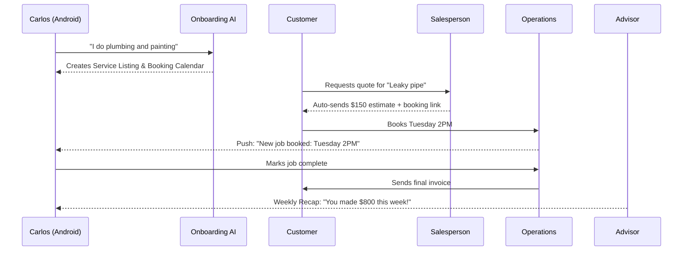
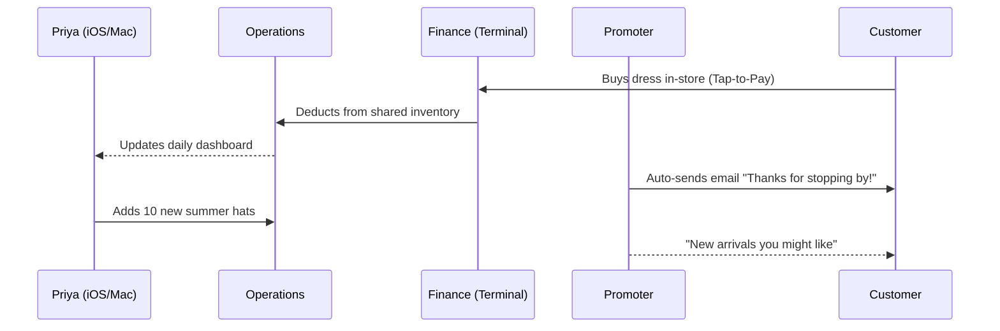
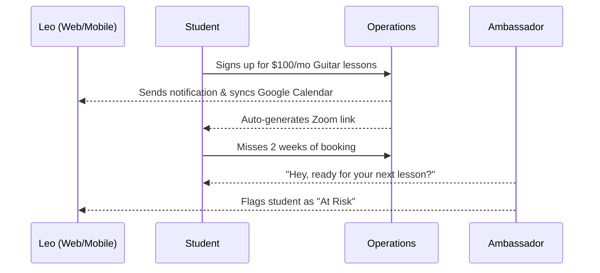
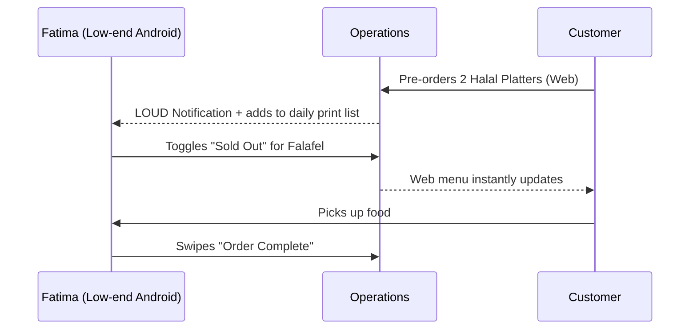

# [architecture] Business Journey End-to-End Orchestration

## Title
Implement Universal Business Journey Orchestration Engine for 10-Minute Launch

## Problem Statement
Small business owners—whether a home baker, a freelance handyman, or a food cart operator—face overwhelming friction when launching a digital presence. They must stitch together disparate tools for storefronts, scheduling, payments, and marketing. Current platforms (Shopify, Wix, Squarespace) assume a baseline level of technical competence, desktop usage, and significant time investment (30-60 minutes just to get started). Our users are non-technical, operate entirely from their phones, and need their business live in under 10 minutes. Without a cohesive, AI-orchestrated journey from acquisition to referral, they abandon the process or fail to capture the full value of the OHC platform.

## Research Report
**Market Landscape & Competitive Gaps:**
- **Shopify:** Takes 30-60 minutes to set up. Requires desktop for initial heavy lifting. Extremely complex for non-product businesses (e.g., services, food carts).
- **Wix / Squarespace:** Focused on visual web design, not business operations. Too overwhelming for users who just want a working storefront and booking system.
- **GoDaddy:** Simplistic but rigid. Lacks integrated business operations and intelligent automated marketing.
- **OHC Opportunity:** We are the only platform offering true 10-minute setup via conversational, AI-driven onboarding. By deeply integrating AI agents into the core journey, OHC acts as an invisible co-founder rather than just a website builder.

**Friction Points Identified in Non-Technical SMBs:**
1. **The "Blank Canvas" Problem:** Users freeze when asked to build a site.
2. **Setup Fatigue:** Asking for bank details, inventory, and design choices upfront leads to high drop-off.
3. **Ghost Town Effect:** After launching, users don't know how to drive traffic or when to follow up with leads.
4. **App Fragmentation:** Managing Instagram DMs, calendar bookings, and Stripe payments separately leads to missed opportunities.

## Design Doc

### Key Design Decisions & Rationale
1. **Deferred Configuration:** Minimum viable onboarding. Get the business live with 1-3 core items first; push complex setup (like tax configuration or full inventory sync) to post-activation via AI proactive prompts.
2. **AI-First Orchestration:** Instead of a static dashboard, the "Departments" proactively manage the journey. Operations handles the order, Marketing handles the promo, Advisory handles the retention.
3. **Mobile-Native Modals:** The entire flow must exist within a 375px mobile envelope. All form inputs utilize native OS keyboards.
4. **Optimistic States:** Immediate feedback on UI actions (e.g., "Store live!" immediately after name confirmation) with background job completion.

### Mobile UX Flow (375px First)
1. **Splash & Conversational Onboarding:** "What's the name of your business?" -> "What do you sell?" -> "Let's pick a style."
2. **The 10-Minute Dashboard:** Single primary Call-To-Action (CTA) tile ("Add your first product") instead of a complex menu.
3. **The "Pulse" Feed:** Replaces static analytics with conversational updates: "Operations: You got 2 new cake orders!", "Advisory: Tuesdays are busy, want to run a promo?"
4. **Bottom Navigation:** [ Home (Pulse) | Storefront | Customers | AI Team | Settings ]

### AI Agent Integration Points
- **Onboarding:** "The Promoter" drafts the initial website copy and layout based on a 3-question prompt.
- **Activation:** "The Salesperson" generates a personalized shareable link for TikTok/Instagram.
- **Retention:** "The Ambassador" auto-drafts check-in messages for inactive clients.
- **Revenue:** "The Advisor" analyzes usage and prompts the Free -> Starter upgrade when order volume indicates success.

### Architecture Diagrams (Mermaid.js)

#### 1. Maya (The Home Baker) - Product & DM Flow

#### 2. Carlos (The Handyman) - Service Booking Flow

#### 3. Priya (The Boutique) - Omnichannel Flow

#### 4. Leo (Music Tutor) - Subscription Flow

#### 5. Fatima (Food Cart) - Pre-order Quick Flow

## Implementation Prompt
**Context:**
Implement the core UI shell and underlying data orchestration for the "10-Minute Launch" Business Journey.

**User-Facing Outcome:**
A non-technical user downloads the app, goes through a 3-step conversational wizard, and lands on a mobile-first dashboard ("The Pulse") where their storefront is immediately live. They can tap to share their link, and AI agents immediately begin offering operational suggestions.

**Critical User Journeys (CUJs):**
1. **Onboarding:** User opens app -> inputs name/category -> minimal AI generation -> lands on Dashboard.
2. **Activation:** User receives first interaction (mocked AI notification) -> taps to view.
3. **Navigation:** User can seamlessly switch between the Pulse feed, Storefront editor, and Customer list, all within a 375px responsive mobile envelope.

**Acceptance Criteria:**
- The onboarding wizard completes entirely via native mobile form inputs (no complex desktop configurations).
- The generated storefront is immediately accessible via a simulated route.
- The Dashboard UI passes the "Grandmother Test" (no technical jargon, clear CTA).
- E2E tests must start from the login screen, step through the entire wizard, verify the landing state on the dashboard, and assert the UI correctly displays the generated business data.
- AI integration points must be stubbed or use mock models for deterministic E2E testing.
- UI components must strictly adhere to OHC Premium Design Tokens (Glassmorphism, 20px blur, Outfit/Inter typography).

## Priority
P0 (Critical)

## Estimated Scope
Large