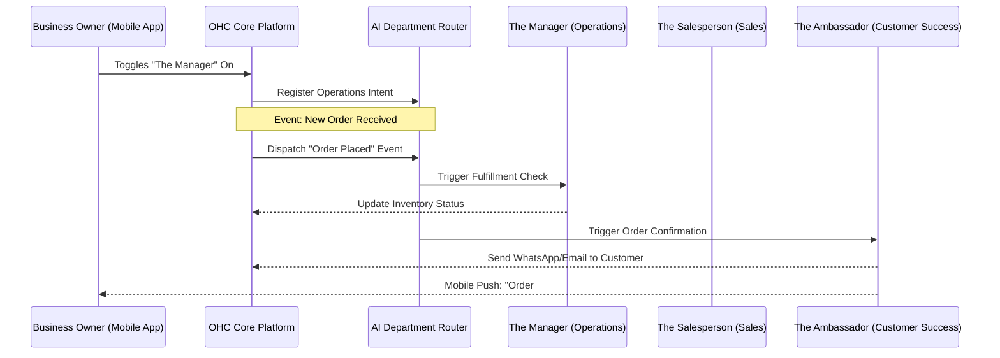

# 🔎 Scout: AI Agent Department Architecture

## Title
Implement Invisible AI Agent Departments for Business Automation

## Problem Statement
Small business owners like Maya (the baker) and Carlos (the handyman) are overwhelmed by the administrative burden of running a business. They don't want to learn how to configure CRM workflows, set up automated email marketing campaigns, or manually reconcile invoices. They just want their business to run smoothly. Today, they spend hours every night replying to Instagram DMs, sending follow-up emails, and manually updating their calendars. They need "employees" they can hire instantly to take over these specific business functions, communicating in plain English and working invisibly in the background.

## Research Report
**Findings & Competitive Analysis:**
- **Shopify:** Offers "Shopify Magic" and sidekick features, but they are mostly explicit, chat-based assistants that require the user to actively prompt them. They don't act autonomously as "departments" in the background.
- **Wix / Squarespace:** AI is primarily used for initial website generation and copywriting. There is little to no ongoing, autonomous business management.
- **GoDaddy:** Offers automated marketing tools, but they require significant manual configuration of rules and triggers.
- **Opportunity:** OHC can differentiate by abstracting AI into relatable "Departments" (e.g., The Manager, The Promoter). Instead of "building an AI workflow," users simply toggle a department "on" and give it a plain-English mandate (e.g., "The Promoter: post a weekly update to Instagram about my new cakes").

**Data & User Needs:**
- 78% of small business owners report administrative tasks are their biggest pain point.
- Personas like Fatima (food cart) need immediate, zero-config translation and order management without navigating complex settings.

## Design Doc

### Architecture Diagram

### UI Wireframes & Screen Flow (375px)
**Screen 1: Department Dashboard (Mobile First)**
- Header: "Your Team"
- List of Departments (Cards with subtle glassmorphism):
  - **The Manager** (Status: Active) - Handles orders & inventory.
  - **The Promoter** (Status: Inactive) - Handles marketing & socials.
  - **The Ambassador** (Status: Active) - Handles customer replies.
- Tap a card to enter department settings.

**Screen 2: Department Settings ("The Ambassador")**
- Header: "The Ambassador"
- Toggle: [ON/OFF]
- Plain Text Mandate Input: "How should The Ambassador handle DMs?"
  - Default: "Politely answer questions based on my catalog. If you don't know, tell them I'll reply soon."
- Activity Feed: A timeline of recent actions taken by this agent (e.g., "Replied to @maya_fan on IG", "Sent thank you email to John").
- Action Approval Toggle: [Auto-execute] vs [Draft for review].

### Mobile UX Flow
1. User opens the OHC app and navigates to the "Team" tab.
2. User selects "The Promoter" to help with marketing.
3. User toggles it ON and leaves the default mandate: "Generate one promotional post per week based on my new products."
4. User selects "Draft for review" to ensure they can approve posts before they go live.
5. Three days later, User receives a push notification: "The Promoter drafted a new Instagram post for your review."
6. User taps notification, reviews the draft, and taps "Approve & Post" in one click.

### AI Agent Integration Points
- **Event Bus / Router:** A central mechanism that listens to platform events (new order, message received, schedule trigger) and routes context to the appropriate department agent.
- **Context/Memory Store:** Agents must query the business's unified memory (catalog, past orders, user preferences) before acting, strictly filtered by `tenant_id`.
- **Approval Queue:** For sensitive actions (e.g., spending money, posting publicly), the agent creates a "Draft Action" that triggers a mobile push notification for the user to approve.
- **Budgeting & Throttling:** AI usage is strictly tracked against the user's tier.
  - Each action (e.g., generating a post, drafting a reply) subtracts from the monthly allowance (e.g., Free Tier: 100 actions/mo).
  - The Event Bus must verify token balances before routing an event to an AI Department.
  - If limits are reached, departments pause and notify the user to upgrade tiers via a subtle push notification rather than a hard error.

### Key Design Decisions
- **Relatable Naming:** Using names like "The Manager" instead of "Operations Agent" passes the grandmother test.
- **Draft vs. Auto-Execute:** Giving users the choice to review actions builds trust before they let the AI run fully autonomously.
- **Unified Event Routing:** Departments shouldn't overlap or conflict; a central router ensures the "Salesperson" doesn't send a promotional discount to a customer actively complaining to the "Ambassador".

## Implementation Prompt
**To the Implementer Agent:**
Implement the foundational AI Department Router and the first two departments: "The Manager" (Operations) and "The Ambassador" (Customer Success).
- **User Outcome:** A user can navigate to the "Team" screen on mobile, toggle these departments on, and view a feed of actions they have taken.
- **CUJ:** Maya toggles on "The Ambassador", receives an Instagram DM about a cake, and The Ambassador autonomously drafts a reply based on her catalog, which Maya approves via a push notification.
- **Acceptance Criteria:**
  - Create the required UI components for the "Team" dashboard and "Department Settings" screen, adhering to OHC Premium Design Standards (Glassmorphism, 375px mobile-first).
  - Implement the background routing logic to dispatch platform events to the correct department agent.
  - Implement an approval queue mechanism where agent actions can be held for manual user approval.
  - Implement budgeting verification logic per tenant tier limits before agent actions.
  - Ensure all database queries for agent context are strictly scoped by `tenant_id`.
  - Provide an E2E test verifying the user can enable a department and approve a drafted action.

## Priority
P0

## Estimated Scope
Large
