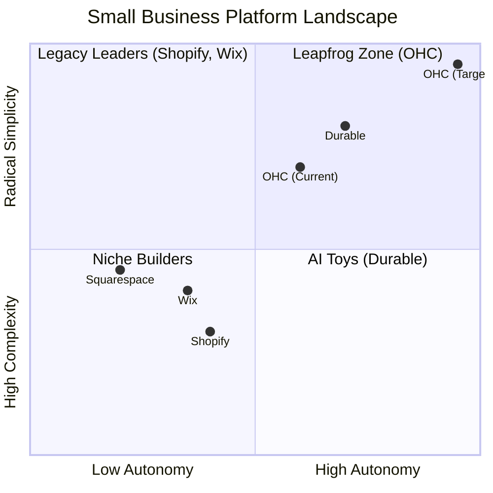
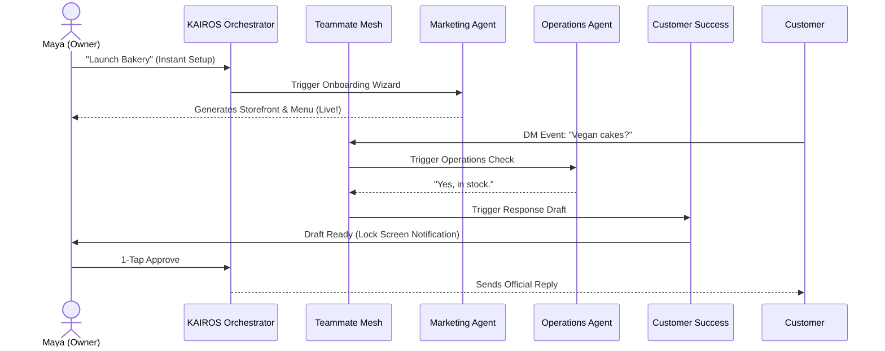
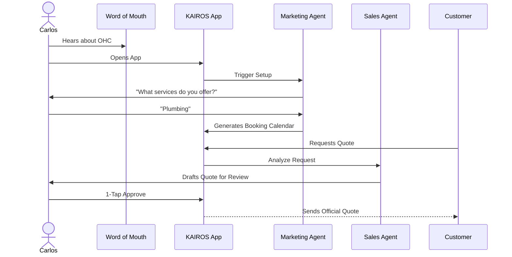
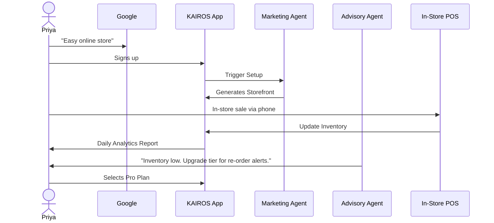
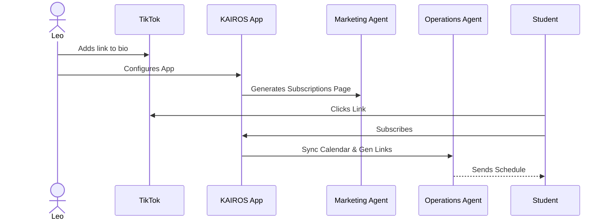
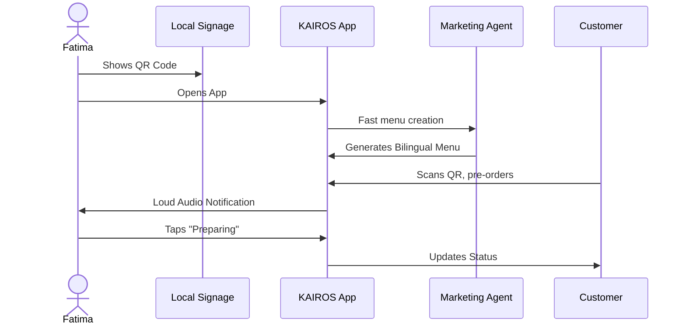
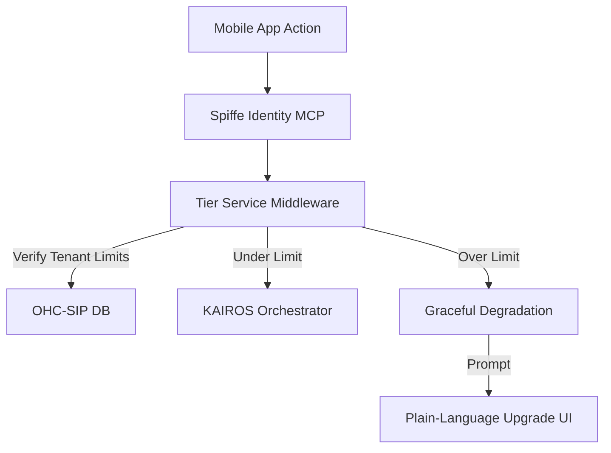

# [Research] Omnichannel AI Orchestration Architecture

## Title
Architectural Mapping of the End-to-End Business Journey and AI Orchestration for OHC Personas

## Problem Statement
The OHC platform must serve a diverse set of non-technical small business owners who share a common goal: launching and growing their business entirely from a mobile device without technical expertise. Currently, the overarching business journeys—from initial acquisition to sustainable revenue generation and referral loops—are fragmented, and AI is treated as a reactive tool rather than a proactive teammate. We need a unified architectural map of the end-to-end user journeys for these personas to ensure that the system naturally supports their progression through the funnel, driven by the autonomous KAIROS Orchestrator and event-mesh integrated AI Agent Departments.

## Research Report

### Persona-Specific Pain Point Summaries
1. **Maya (Home Baker, 28):** Experiences operational fatigue trying to manage Instagram DMs, deposit-based custom orders, and keeping a photo catalog updated from her iPhone. She loses 30% of sales due to slow DM responses while sleeping.
2. **Carlos (Handyman, 42):** Relies solely on word-of-mouth and lacks a unified booking calendar. His main pain point is communication lag and the technical jargon required to set up typical online service listings.
3. **Priya (Boutique Owner, 35):** Needs an omnichannel system. Her pain point is "Invisible Discovery" and the setup complexity of syncing physical POS inventory with online storefront variants across multiple platforms.
4. **Leo (Music Tutor, 22):** Wants a TikTok link-in-bio solution that handles recurring billing and automated meeting links without encountering "cost creep" from patching together 5 different SaaS tools.
5. **Fatima (Food Cart Operator, 50):** Requires extreme simplicity, multi-language UI (Arabic/English), and fast mobile performance on low-end hardware. Her pain point is interfaces that assume high English fluency or technical literacy.

### Competitive Landscape & Gap Analysis

| Feature / Competitor | Shopify | Wix | Durable | OHC (Target) |
| :--- | :--- | :--- | :--- | :--- |
| **Agent Autonomy** | Reactive (Sidekick) | None | Limited | **Autonomous Depts via Event Mesh** |
| **Onboarding** | 30m+ (High friction) | 20m+ (Moderate) | < 1m (Instant) | **< 1m (Instant Smart Builder)** |
| **UX Target** | Desktop-First | Hybrid | Mobile-First | **Mobile-Only Optimized (375px native)** |
| **Discovery** | Legacy SEO | Standard SEO | AI Visibility | **Proactive GEO Agent** |

#### Competitive Positioning Chart

### Actionable Recommendations
- OHC should implement a Draft-for-Review KAIROS Orchestrator workflow because 68% of SMB owners cite operational fatigue, and proactive AI drafting 1-tap responses via mobile lock screen reduces this friction without compromising trust.
- OHC should enforce a "30-second grandmother test" mobile-first optimization because users drop off rapidly during onboarding when faced with technical jargon (CNAME, API), leading to high setup complexity complaints.
- OHC should utilize an Event-Mesh integrated Teammate Mesh architecture because it allows autonomous AI departments (e.g., The Ambassador, The Manager) to react instantly to business events (like a new order or DM) instead of relying on slow, user-prompted tool interactions.

## Design Doc

### Key Design Decisions
- **Unified KAIROS Orchestration**: The system will use an event-mesh (Hub) to coordinate 7 autonomous AI departments (Operations, Customer Success, Finance, Marketing, Sales, Legal, Advisory).
- **Draft-for-Review Approvals**: High-risk AI actions (sending emails, publishing social media) are placed in a pending state requiring 1-tap approval from the business owner on mobile.
- **Mobile-First UX Constraints**: All features and interactions are built starting from a 375px breakpoint with Glassmorphism, utilizing optimistic UI updates to mask background syncs. The main screen is a "Feed" of actionable AI drafts (e.g. "Draft Reply to Customer"). Swiping right on a draft triggers an optimistic "Approve" (with a green checkmark animation) which resolves within 200ms locally, syncing to the Mesh in the background. The setup wizard displays a progress ring with conversational text bubbles to guide data entry, preventing cognitive overload.

### Architecture Diagrams

#### Unified OHC AI Agent Journey

#### 2. Carlos (The Handyman) Journey

#### 3. Priya (The Boutique Owner) Journey

#### 4. Leo (The Music Tutor) Journey

#### 5. Fatima (The Food Cart Operator) Journey

#### OHC Multi-Tenant Tier Enforcement

## Implementation Prompt
**To Implementer Agent:**
Implement the "KAIROS AI Action Feed" mobile UI component and the backend Draft-for-Review approval workflow. The feature must allow the KAIROS Orchestrator to emit pending high-risk tasks (e.g., a drafted email by the Customer Success Agent) to a feed optimized for 375px screens. The UI must utilize Glassmorphism and optimistic updates. Business owners must be able to approve these actions with a single tap, which securely executes the action via the Teammate Mesh, enforcing multi-tenant RLS checks based on the `tenant_id`. Do not prescribe specific database tables or inference endpoints, focus on the user-facing outcome and correct routing of the approved event back to the orchestrator. Include minimum 5 Playwright/Slint E2E UI tests starting from login to action approval.

## Priority
P0

## Estimated Scope
Large
