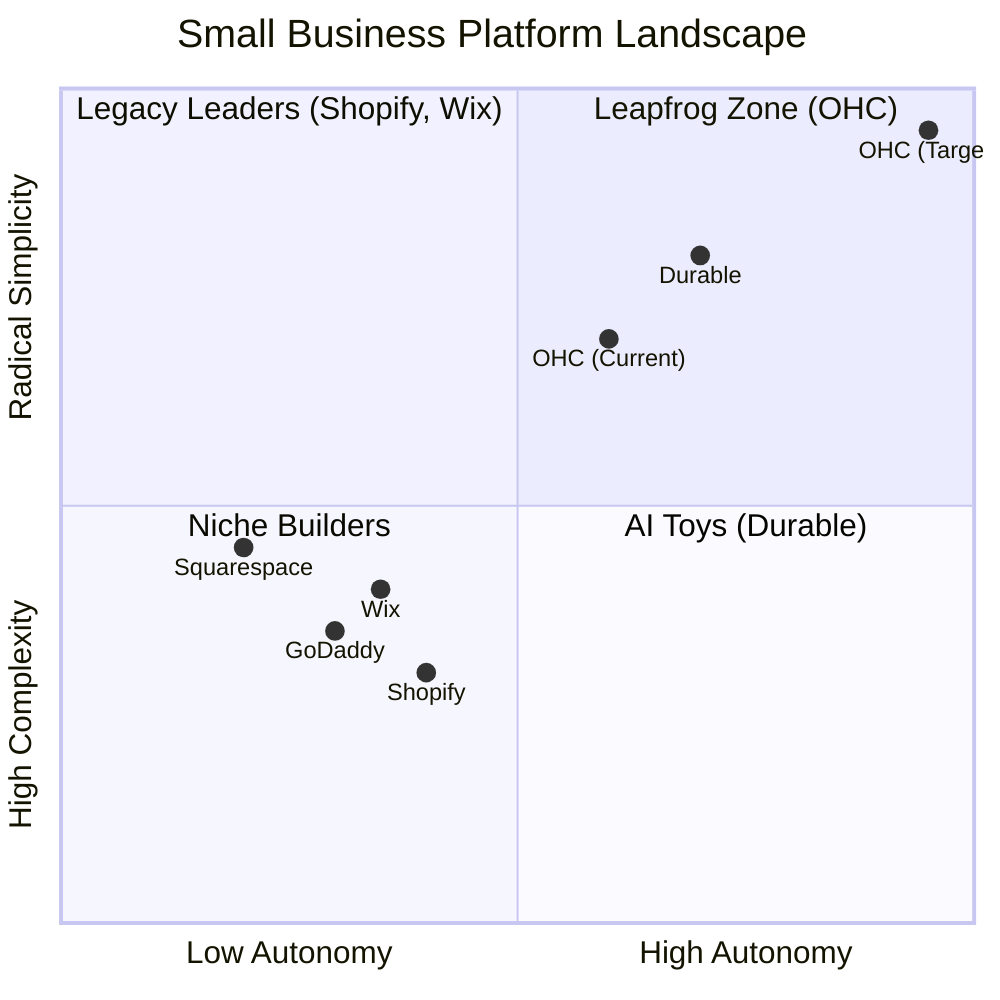
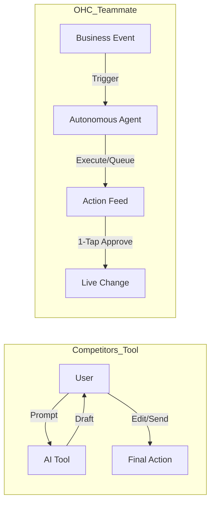

# OHC AI Differentiation & Market Feature Gap Research Report

## Executive Summary
OneHumanCorp (OHC) targets a segment largely unserved by existing platforms like Shopify, Wix, and Squarespace: **non-technical solopreneurs** who need a platform that is instantly usable and actively manages their business. Based on our analysis of competitor capabilities and widespread SMB pain points, OHC’s primary differentiation lies in transitioning AI from a reactive "tool" (like Shopify Sidekick) to a proactive "teammate" that operates autonomously within designated departments.

---

## 1. Top 10 SMB Pain Points & Persona Mappings

| Rank | Pain Point | Frequency (Est.) | Target Persona | OHC Strategy (Solution Map) |
|:---|:---|:---|:---|:---|
| 1 | **Setup Complexity & Technical Jargon** | High (73%) | **Maya (Baker, 28):** Overwhelmed by Shopify's setup. | **Zero-Config Onboarding:** 10-minute setup via "SetupWizard", completely obscuring DNS, templates, and SKUs. |
| 2 | **Operational Fatigue (The "Never-Ending Inbox")** | High (68%) | **Leo (Tutor, 22):** Manual booking chaos and constant follow-ups. | **The Ambassador:** Proactive Customer Success Agent that automatically drafts replies to Instagram DMs and support emails. |
| 3 | **Marketing Dread (Social Media Creation)** | Medium (55%) | **Priya (Boutique, 35):** Needs email marketing and social posts but lacks time. | **The Promoter:** Marketing Agent that auto-generates 7-day social media calendars, images, and copy upon new product creation. |
| 4 | **Invisible Discovery ("I built it, nobody came")** | Medium (52%) | **Carlos (Handyman, 42):** Relying entirely on word-of-mouth; missing search intent. | **AI Discovery Agent (GEO):** Optimizes structured data for LLM crawlers (ChatGPT, Gemini) to drive AI-search traffic. |
| 5 | **Technical Jargon** | High (48%) | **Maya (Baker, 28):** Alienation due to dev-speak. | **Radical Simplicity:** No jargon. Ever. |
| 6 | **Cost Creep** | Medium (45%) | **Priya (Boutique, 35):** App stores lead to subscription hell. | **All-in-One Swarm:** Built-in AI agents replace expensive third-party apps. |
| 7 | **Mobile Gaps (Desktop-bound workflows)** | Medium (42%) | **Fatima (Food Cart, 50):** Needs simple mobile-only management on slow data. | **375px Native Rust/Slint UX:** Complete business management from a mobile app without horizontal scrolling. |
| 8 | **Communication Lag** | Medium (40%) | **Leo (Tutor, 22):** Losing sales because DMs aren't answered while sleeping. | **Background Draft & Approve:** AI drafts responses 24/7. |
| 9 | **Financial Fog** | Low (35%) | **Carlos (Handyman, 42):** Inability to see real profit vs. revenue. | **The Accountant:** Plain language financial reports. |
| 10 | **Support Deserts** | Medium (30%) | **Fatima (Food Cart, 50):** Waiting 24h for a generic bot response. | **Interactive Help:** Conversational, contextual support. |

*Sources: Reddit (r/smallbusiness, r/ecommerce), Trustpilot, and App Store reviews for legacy competitors.*

---

## 2. Market Feature Gap Matrix (OHC vs Competitors)

| Feature | **Shopify** | **Wix** | **Squarespace** | **GoDaddy** | **OHC (Target)** | Gap Status |
|:---|:---|:---|:---|:---|:---|:---|
| **Agent Autonomy** | Reactive (Sidekick) | Limited (Wix AI) | None | None | **Autonomous Depts** | 🔴 Major Gap |
| **Onboarding Time**| 30m+ | 20m+ | 30m+ | 20m+ | **< 1m (Instant Build)** | 🟡 Needs Polish |
| **UX Target** | Desktop-First | Hybrid | Desktop-First | Desktop-First | **Mobile-Only Optimized** | 🟢 On Track |
| **AI Workflows** | App-Store Dependent | Built-in | Limited | Basic Branding | **Event-Mesh Integrated** | 🔴 Under Construction |
| **Advisory/Insights**| Dashboard Only | Standard | Basic Analytics | Basic Insights | **Plain-Language Briefing** | 🔴 High Priority |

---

## 3. Competitive Landscape Positioning

---

## 4. OHC AI Differentiation: From Tools to Teammates

Our key differentiator is the transition from AI as a reactive tool to an **Autonomous Teammate**.

### The 5 Pillar AI Agents to Build First:
1.  **The Vigilant Manager (Operations):** Monitors inventory and flags "Low Stock" risks with pre-filled restock tasks.
2.  **The Silent Ambassador (Customer Success):** Watches the event mesh to draft replies to customer messages automatically.
3.  **The Generative Promoter (Marketing):** Automatically creates social media content calendars when products are updated.
4.  **The AI Discovery Agent (GEO):** Handles SEO for the modern LLM-driven search era.
5.  **The Business Advisor (Finance/Advisory):** Delivers a human-language weekly briefing instead of complex data charts.

---

## 5. Market Sizing & Strategic Direction

### Total Addressable Market (TAM)
- There are over 33 million small businesses in the US alone, and hundreds of millions globally. A vast majority of these are non-employer firms (solopreneurs, freelancers, independent contractors).
- Many of these solopreneurs operate entirely offline or rely solely on fragmented tools (e.g., just Instagram DMs, or just a basic Linktree), indicating a massive untapped market for a unified, radically simple business OS.

### Beachhead Market
- **Target Persona:** Maya the Home Baker / Creators offering custom products/services.
- **Why:** High density of underserved users who struggle with the complexity of setting up a traditional Shopify store for custom, deposit-based orders but have high lifetime value (LTV) due to repeat customers. They are highly active on mobile and need automated customer interaction immediately.

### Geographic Expansion
- **Phase 1:** English-speaking markets (US, UK, Canada, Australia) to refine the core AI prompts and platform UX.
- **Phase 2:** Spanish/LATAM. Massive growth in solopreneurship, high mobile adoption, and lower penetration of complex legacy platforms.
- **Phase 3:** Arabic/MENA and Hindi/India. High mobile-first reliance. Requires strong right-to-left (RTL) support and localized payment integrations.

### Vertical Expansion
- Begin horizontally to capture the broadest base of users with "Radical Simplicity."
- Once established, expand vertically into "Food & Beverage" (e.g., Fatima's Food Cart) with specialized features like POS integrations, QR code table ordering, and HACCP compliance templates handled by the Legal & Compliance agent.

### Marketplace Opportunity
- OHC businesses could eventually be aggregated into a shared consumer-facing marketplace. This turns OHC from just a B2B tool into a B2C discovery engine, creating a powerful network effect and lock-in.

---

## 6. Required Action Items (Feature Missions)

### Issue Brief: Implement the Draft-for-Review Workflow Engine (KAIROS)
- **Title**: Implement AI Agent Approval Workflow Engine
- **Problem Statement**: Small business owners (like Carlos the Handyman or Maya the Baker) are overwhelmed by manual tasks but cannot trust AI to send emails or publish posts without review. They need a simple, mobile-first way to approve high-risk AI actions.
- **Research Report**: Based on analysis of Shopify and Wix, AI is either entirely reactive or requires complex setup. Top user complaints highlight a need for automation but with control. Our differentiation is "Autonomous Teammates" that draft actions and wait for approval.
- **Design Doc**:
    - **Architecture**: Introduce a "Pending Approval" state within the KAIROS orchestrator. Agents queue actions instead of executing them.
    - **UI Flow**: The mobile UI (375px first) displays an "Agent Actions Required" feed on the dashboard. Tapping an action allows the owner to read the draft and click "Approve & Send" or "Edit".
- **Implementation Prompt**: Implement the backend job queue and agent event processing loop to enable autonomous AI actions to enter a "pending approval" state. Create the Flutter mobile UI (ensuring perfect rendering at 375px) to display this feed on the home dashboard, allowing users to review and approve drafted actions with a single tap.
- **Priority**: P0
- **Estimated Scope**: Large

### Issue Brief: Connect AI Agents to the Real-Time Event Mesh
- **Title**: Event-Driven AI Agent Triggers
- **Problem Statement**: Agents currently rely on explicit tasks or scheduled cron jobs. To be true "teammates", they must react instantly to business events (like a new order or a customer message) without the user having to initiate the action.
- **Research Report**: Competitors lack proactive, event-driven AI. If a customer messages Maya at 2 AM, she currently loses the sale if she doesn't reply. Event-driven agents solve this.
- **Design Doc**:
    - **Architecture**: Implement pub/sub listeners within the KAIROS orchestrator.
    - **Events**: Subscribe specific department agents (Operations, Customer Success) to relevant domain events (e.g., `OrderReceived`, `MessageReceived`).
- **Implementation Prompt**: Update the agent worker architecture to subscribe to the core event mesh. Ensure that when a domain event occurs, the relevant agent is triggered with the context of the event, allowing it to take autonomous action (like drafting a reply).
- **Priority**: P1
- **Estimated Scope**: Medium

### Issue Brief: Build the "Human-Language Briefing" Generator
- **Title**: Plain-Language Weekly Business Advisory Briefing
- **Problem Statement**: Non-technical founders ignore complex data dashboards. They don't want to analyze charts; they want someone to tell them what the data means and what to do next.
- **Research Report**: Competitors offer analytics dashboards that confuse users. Our Business Advisory Agent will instead provide a daily/weekly "Human-Language Briefing" that translates data into actionable advice.
- **Design Doc**:
    - **Architecture**: A scheduled task (cron) triggers the Business Advisory agent. The agent aggregates weekly metrics (sales, top products, busy days).
    - **Output**: The agent generates a short, jargon-free text summary (e.g., "Tuesday is your best day. Your vegan cake is trending. Boost your social spend by $5.").
- **Implementation Prompt**: Create a scheduled task that triggers the Business Advisory agent to parse weekly financial and operational metrics. Have the agent generate a concise, plain-language summary of business health and post it to the user's dashboard feed.
- **Priority**: P1
- **Estimated Scope**: Small
