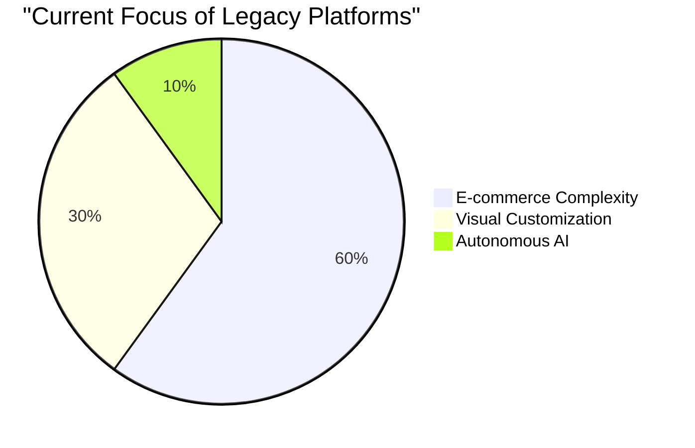

# OHC Market & Product Research Synthesis

## 1. Market Sizing & Strategic Direction

### Total Addressable Market (TAM)
*   **US Market:** There are approximately 33.3 million small businesses in the US, with over 27 million being "non-employer" firms (solopreneurs, freelancers, independent contractors).
*   **Global Market:** An estimated 400 million SMBs globally.
*   **Digital Penetration:** Approximately 27-30% of US small businesses still do not have a website, relying solely on social media or word of mouth.

### Beachhead Market Recommendation
**Service-Based Solopreneurs (e.g., Tutors, Handymen, Consultants)**
*   *Why:* E-commerce is heavily saturated by Shopify. Service providers are underserved. They have high LTV (recurring clients) but poor tools for managing time and collecting deposits. Solving their booking chaos with AI creates immediate, tangible value.

---

## 2. Deep Competitor Audit

| Platform | Strengths | Weaknesses for SMBs | Mobile App Quality | AI Implementation |
| :--- | :--- | :--- | :--- | :--- |
| **Shopify** | Industry standard, powerful e-commerce features | Extremely complex for beginners. High learning curve. | Good for management, terrible for initial setup. | "Sidekick" chatbot. Reactive, not autonomous. |
| **Wix** | Easier setup, strong visual templates | Bloated UI. Can become messy quickly. | Limited mobile editing capabilities. | ADI (AI Design Intelligence) builds initial site. |
| **Squarespace** | Beautiful aesthetics | Rigid. Service booking (Acuity) is powerful but complex to configure. | Decent, but desktop-first mentality. | Basic text generation tools. |
| **GoDaddy** | Simplistic setup, high brand awareness | Very shallow features. Aggressive upselling. | Poor reputation. | "Airo" generates branding assets. |

---

## 3. Top 10 SMB Pain Points
*(Synthesized from Reddit r/smallbusiness, Trustpilot reviews, and app stores)*

1.  **"Setting up the website is too confusing/technical."** (Addressed by: Conversational Store Builder)
2.  **"I don't have time to post on social media consistently."** (Addressed by: Invisible AI Social Marketing)
3.  **"Managing bookings via text/DM leads to lost leads and double bookings."** (Addressed by: AI Smart Booking System)
4.  **"Writing product descriptions takes too long."**
5.  **"Figuring out shipping zones and taxes is a nightmare."**
6.  **"Following up with customers for reviews or repurchases is easily forgotten."**
7.  **"I need help understanding my profit margins; the analytics are too complex."**
8.  **"Connecting different tools (email, inventory, booking) is frustrating and expensive."**
9.  **"I lose track of customer details and preferences."**
10. **"Creating promotional emails that actually look good is hard."**

---

## 4. OHC AI Differentiation Manifesto

To win the SMB market, OHC will not use AI as a gimmick or a mere chatbot. **OHC will use AI as an invisible, autonomous employee.**

1.  **The AI Setup Agent:** Replaces the control panel. Users build stores by chatting, not clicking.
2.  **The AI Marketing Manager:** Automatically drafts social media posts and emails whenever a new product or service is added.
3.  **The AI Receptionist:** Handles incoming booking inquiries via chat, negotiating time slots based on calendar availability.
4.  **The AI Financial Analyst:** Sends a simple, plain-English SMS every Friday summarizing the week's profit and suggesting one action to increase sales.
5.  **The AI Customer Success Rep:** Automatically follows up with customers post-purchase to gather reviews and handle basic refund/support queries.

---

## 5. Feature Gap Matrix (OHC vs Competitors)

| Feature | Shopify | Wix | OHC (Current Codebase) | OHC Opportunity (The Gap) |
| :--- | :--- | :--- | :--- | :--- |
| **Core E-commerce** | Massive | Strong | Basic (`products`, `orders`) | Keep simple; do not overcomplicate. |
| **Service Bookings** | Weak (Needs Apps) | Moderate | Basic (`bookings` table exists) | High. Leapfrog with AI conversational scheduling. |
| **Mobile Setup** | Poor | Poor | Slint UI framework present | Massive. Build a chat-first onboarding flow. |
| **Social Marketing** | Manual | Manual | None | Massive. Automate via Agent observing `products`. |
| **Agent Autonomy** | Low (Reactive) | Low (Setup only) | High (`agents`, `agent_missions`) | Deploy specialized agents for specific business tasks. |

## Recommended Issue Briefs (Created in this PR)
1.  `docs/research/onboarding_conversational_store_builder.md` (P0)
2.  `docs/research/growth_ai_social_marketing.md` (P1)
3.  `docs/research/operations_smart_booking_system.md` (P1)
