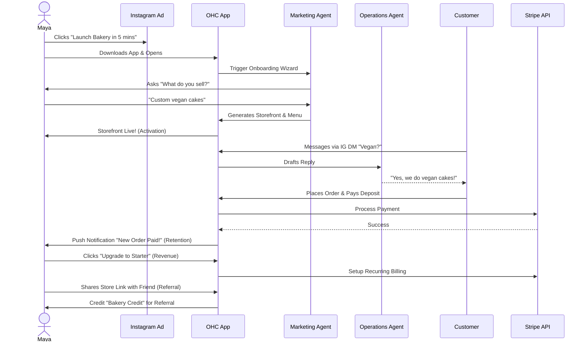
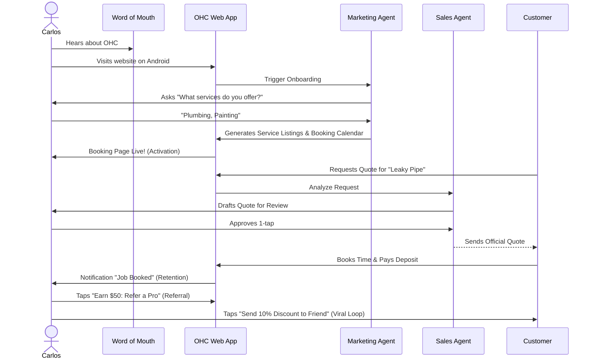
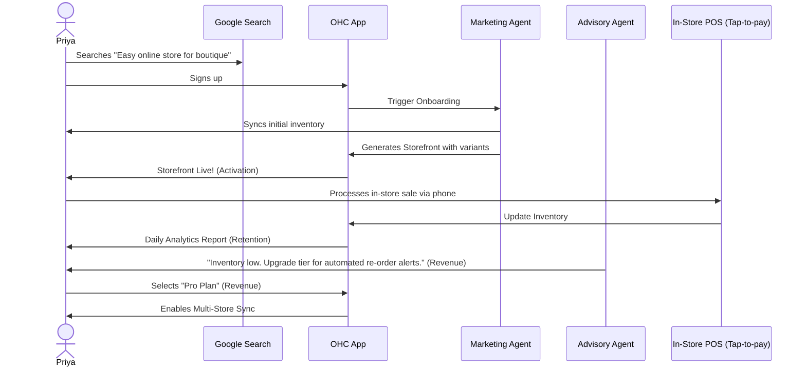
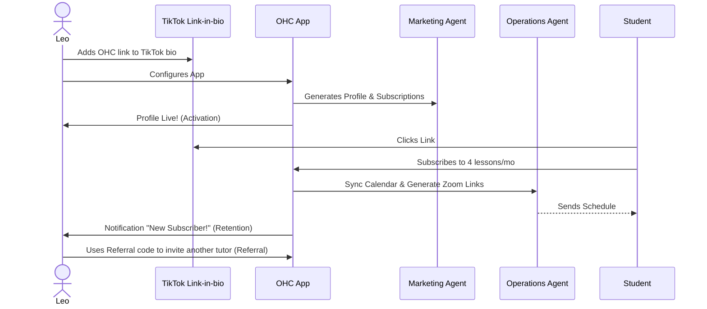
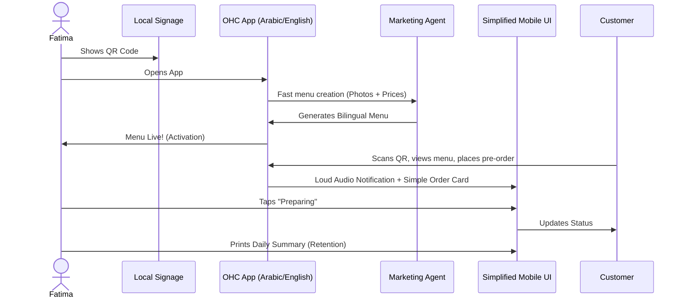

# Architecture Brief: Business Journey Architecture

## Title
End-to-End Business Journey Architecture for OHC Personas

## Problem Statement
The OneHumanCorp (OHC) platform aims to empower a diverse range of non-technical small business owners—from bakers to handymen, boutique owners, music tutors, and food cart operators—to launch and grow their businesses entirely from their mobile phones in under 10 minutes. A critical challenge is orchestrating the end-to-end journey (Acquisition, Onboarding, Activation, Retention, Revenue, Referral) in a unified way, preventing user drop-off. Complex technical jargon, overwhelming initial configuration (e.g., custom domains, advanced shipping), and fragmented toolsets act as severe friction points. We must architect a seamless flow where AI agents handle the complexity invisibly, enabling the user to reach the "Aha!" moment—activation—with minimal friction, ensuring long-term retention and revenue growth.

## Research Report

### Persona Mapping & Journey Focus

The platform serves distinct personas with specific needs, yet the underlying journey framework must accommodate them all seamlessly.

| Persona | Business Type | Key Friction Point | Activation Moment | Core AI Department Dependency |
|---|---|---|---|---|
| **Maya** (Baker, 28) | Physical Products (Custom Orders) | Payment gateway setup & managing IG DMs | First custom order + deposit received | Marketing (Onboarding), Ops (Orders), Customer Success (IG DMs) |
| **Carlos** (Handyman, 42) | Services & Bookings | Calendar sync & quoting complex jobs | First booked time slot + deposit | Sales (Quotes), Ops (Calendar) |
| **Priya** (Boutique, 35) | Physical Products (Omnichannel) | Inventory sync between online & in-store POS | Storefront live with synced variants | Ops (Inventory), Advisor (Analytics) |
| **Leo** (Music Tutor, 22) | Subscriptions & Bookings | Setting up recurring payments & meeting links | First monthly subscription created | Sales (Subscriptions), Ops (Zoom Links) |
| **Fatima** (Food Cart, 50) | Food & Beverage | Language barriers & complex menu entry | Bilingual menu live & scannable via QR | Marketing (Bilingual Menu), Ops (Pre-orders) |

### Evidence-Based Recommendations
1.  **Zero-Jargon Onboarding:** Avoid technical terms (DNS, DNS SEC, Webhooks). Rely on simple questions ("What do you sell?") processed by the Marketing Agent to generate the initial setup.
2.  **Progressive Disclosure:** Implement a "Simple mode" by default, deferring advanced settings (e.g., custom domains, complex shipping rules) until after activation (e.g., via Advisor Agent nudges).
3.  **Unified Inbox & Task List:** Consolidate all external interactions (IG DMs, booking requests, order updates) into a single, mobile-friendly interface for the business owner to review and 1-tap approve.

## Design Doc

### Key Design Decisions
-   **AI-Driven Onboarding Engine:** The Marketing & Advertising Agent acts as the primary wizard, generating the storefront layout, copy, and initial inventory from minimal user input (e.g., a few text prompts or photos).
-   **Mobile-First Constraint:** The entire journey, particularly onboarding and the dashboard (unified inbox/approvals), is designed strictly for the 375px mobile breakpoint. Desktop is treated as additive.
-   **Asynchronous Complexity:** Long-running tasks (e.g., setting up Stripe, generating SEO meta tags, parsing initial inventory from photos) are handled asynchronously by the KAIROS Orchestrator, keeping the UI responsive and optimistic.

### Architecture Diagrams (Mermaid.js)

#### 1. Maya (The Home Baker) Journey

#### 2. Carlos (The Handyman) Journey

#### 3. Priya (The Boutique Owner) Journey

#### 4. Leo (The Music Tutor) Journey

#### 5. Fatima (The Food Cart Operator) Journey

### UI Wireframes & Mobile UX Flow
-   **Onboarding Wizard (375px):** A step-by-step full-screen flow utilizing large typography (Outfit) and subtle entrance animations (cubic-bezier easing). The user answers 2-3 questions. Native mobile keyboards are strictly enforced (e.g., number pad for pricing).
-   **The Dashboard (The Manager):** A Glassmorphism interface acting as a unified task list. "Pending Actions" (Drafts needing approval) are prominently displayed at the top.
-   **Advanced Settings Toggle:** A sticky `is_advanced` toggle on the dashboard hides complex configurations until explicitly requested.

### AI Integration Points
-   **Acquisition/Onboarding:** Marketing Agent generates the initial website and content.
-   **Activation/Retention:** Operations and Customer Success Agents handle fulfillment and communication, notifying the user of completed actions or requiring 1-tap approvals for sensitive tasks.
-   **Revenue:** Business Advisory Agent monitors usage metrics and suggests tier upgrades at optimal moments (e.g., reaching product limits or seeing high traffic).

## Implementation Prompt
**To Implementer Agent:**
Implement the end-to-end onboarding wizard and unified dashboard targeting the 375px mobile breakpoint.
1.  Develop the `OnboardingWizard` React Native/Slint component that captures minimal business context and communicates with the KAIROS Orchestrator to generate the initial storefront state. Use progressive disclosure; do not ask for custom domains or complex shipping.
2.  Develop the `UnifiedDashboard` component that displays the user's active business metrics and a queue of "Pending Actions" requiring 1-tap approval.
3.  Ensure all UI elements adhere to the Visual Excellence Mandate (Glassmorphism styling, Outfit/Inter fonts, appropriate entrance/exit animations).
4.  Do not prescribe the backend routing, specific SQL DDL, or the exact KAIROS event schema; focus purely on the mobile-first UX flows, state management, and the user-facing outcome of going from Acquisition to Activation seamlessly. Write E2E Playwright/Slint tests verifying the complete onboarding flow.

## Priority
P0

## Estimated Scope
Large
