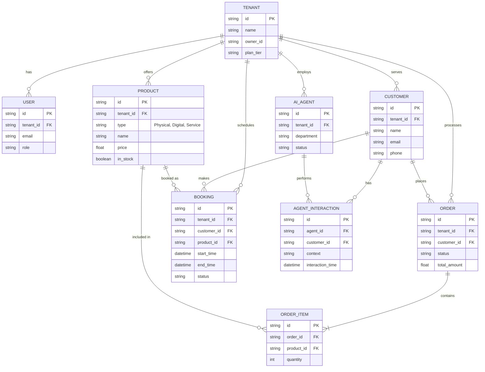

# [Data Model Architecture] Evolve Core OHC Entity Relationships for Mobile-First Multi-Tenancy

## Problem Statement
As a small business owner, whether I'm Maya selling custom cakes or Carlos offering handyman services, I need my products, customers, bookings, and agents to seamlessly talk to each other without me connecting dots. Right now, data silos prevent my AI agents from truly understanding my full business picture, making it feel like I have multiple disconnected apps instead of one unified business brain.

## Research Report
When analyzing competitors like Shopify, Wix, and Squarespace, their data models are heavily siloed into "apps" or "plugins". For example, in Shopify, a booking app has its own customer database separate from the main store customers, leading to fragmented insights. OHC needs a fundamentally unified data model where a Customer is a global entity per tenant, and any Order, Booking, or AI Interaction is tied to that central Customer. This allows AI agents to leverage a fully connected graph of the business's operations. Our research indicates that strict row-level multi-tenancy (using `organization_id` or `tenant_id`) is essential for data isolation, security, and per-tenant cost metering.

## Design Doc

### Entity-Relationship Diagram

### Key Invariants
1. **Strict Multi-Tenancy**: Every operational table MUST have a `tenant_id` (or `organization_id`) column. All database queries must enforce this filter. Row-Level Security (RLS) is enabled in PostgreSQL to guarantee that a business owner can only ever see their own tenant's data.
2. **Customer Centrality**: A `CUSTOMER` is unique per tenant. All commerce activity (`ORDER`, `BOOKING`) and conversational activity (`AGENT_INTERACTION`) strictly reference this central customer.
3. **Product Polymorphism**: The `PRODUCT` entity handles physical items, digital goods, and service bookings, differentiated by a product type. This simplifies the cart and checkout flows.
4. **Agent Confinement**: `AI_AGENT` instances are scoped to a specific tenant and department. Agents cannot access or mutate cross-tenant data.

### Migration Strategy
1. **Phase 1: Add Tenant IDs**: Ensure all new and existing tables have a non-nullable `tenant_id` column. Backfill default tenant IDs for legacy single-tenant data if necessary.
2. **Phase 2: RLS Enforcement**: Enable Postgres Row-Level Security on all operational tables and update the Go application's database provider to set the tenant context in the connection session.
3. **Phase 3: Schema Consolidation**: Migrate disparate plugin-specific schemas (e.g., separate booking customers vs. store customers) into the unified core tables (`CUSTOMER`, `ORDER`, `BOOKING`).
4. **Phase 4: Deprecate Legacy Tables**: Drop old un-scoped tables after verifying that the new unified model supports all required read/write paths without regressions.

## Implementation Prompt
Implement the unified Data Model Architecture for OHC. Update the Go struct models in `src/server/db/models/` to reflect the unified `Tenant`, `User`, `Customer`, `Product`, `Order`, `Booking`, and `AIAgent` entities. Ensure every struct includes `TenantID` (`organization_id`) for multi-tenancy. Enable PostgreSQL RLS (Row-Level Security) policies in the database migrations for these tables. Update all repository interfaces to mandate the passing of the tenant ID in every CRUD operation. Ensure all unit tests use the `auth.ClaimsContextKeyForTest` mock claims to inject the correct tenant context. Do not write the SQL DDL directly in this task; rely on the ORM/Migration tools and review the exact schema mappings carefully.

## Priority
P0

## Estimated Scope
Large
